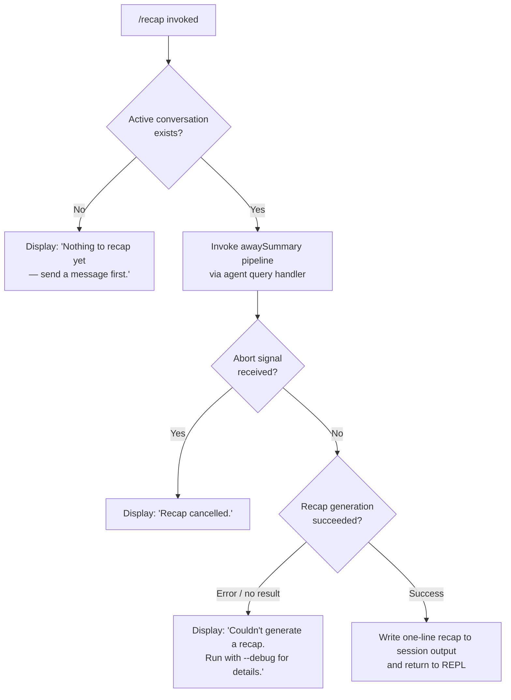

# `/recap`

> Analysis basis: CC v2.1.152 bundle.js (AST extraction + Claude interpretation)
> Minimum version: v2.1.152

---

## Overview

`/recap` generates a concise one-line summary of the current session on demand. The command validates that a conversation is already in progress, then dispatches a background away-summary request through the agent query pipeline, writing the result to the session and displaying it to the user. If no conversation has started, or if the summary generation fails, a contextual error message is displayed immediately without invoking the model.

---

## Registration

| Field | Value |
|---|---|
| type | `local` |
| name | `recap` |
| description | `Generate a one-line session recap now` |
| load_inline | `true` |
| load_ident | `xf5` |
| supportsNonInteractive | `false` |
| thinClientDispatch | `post-text` |
| loc_byte | `12632497` |
| loc_byte_end | `12632713` |
| loc_line | `10831` |
| arbor_handler.name | `xf5` |
| arbor_handler.fqn | `claude-2.1.152::xf5` |
| arbor_handler.kind | `AsyncFunction` |
| arbor_handler.resolution_path | `load_ident` |
| arbor_handler.n_hits | `0` |

Analysis basis: CC v2.1.152 bundle.js:+12632497

---

## Input Branching

The command has four distinct branches based on session state and recap outcome.



Analysis basis: CC v2.1.152 bundle.js:+12632247, +12632339, +12632397

---

## Behavioral Spec

### Handler Entry — `recapCommandHandler` (`xf5`)

The top-level handler is an `AsyncFunction` resolved via the `load_ident` path (inline `Promise.resolve({call: xf5})` shape).

```
async function recapCommandHandler(context):
    result = await awaySummaryDispatcher(context)
    return result
```

Analysis basis: CC v2.1.152 bundle.js:+12632105

---

### Away-Summary Dispatch — `awaySummaryDispatcher` (`hL8`)

This is the primary orchestration function for the recap. It performs the following steps:

```
async function awaySummaryDispatcher(context):
    cachedParams = getCacheSafeParams(context)  // U6H

    if cachedParams is null or empty:
        log("[awaySummary] no CacheSafeParams saved, skipping")
        return "no-turn"                         // early exit, no model call

    abortController = new AbortController()

    // Register abort listener on context signal
    context.signal.addEventListener("abort", () => abortController.abort())

    // Begin agent query turn
    turnResult = await agentQueryTurn(context, cachedParams, abortController.signal)  // T0

    // Attach PTY / pipe output handler
    outputHandler = createOutputHandler()    // T8
    recap = await outputHandler.collect(turnResult)

    // Find matching command registration for recap display
    commandEntry = findCommandEntry(context)  // q.find

    // Flatten recap messages into display form
    displayLines = flatMapRecapMessages(recap)  // Mw9

    return displayLines
```

Analysis basis: CC v2.1.152 bundle.js:+5349645, +5349664, +5349666, +5349724, +5349761, +5349792, +5349839, +5349859, +5350201, +5350290

**Guard literal**: `"[awaySummary] no CacheSafeParams saved, skipping"` — logged at debug level when the session has no stored parameters, causing the handler to return `"no-turn"` without making a model call (bundle.js:+5349666).

---

### Session-State Check — `conversationStateChecker` (`N`)

Before dispatching to the model, the implementation checks whether an active conversation exists:

```
function conversationStateChecker(sessionState):
    if sessionState has no recorded turns:
        return EMPTY_SESSION_SENTINEL

    modelName = sessionState.model.toUpperCase()
    formattedPath = formatSessionPath(sessionState)   // j4
    trimmedText  = formattedPath.trim()

    writeSessionOutput(trimmedText)   // VxH
    persistRecapEntry(trimmedText)    // DyK
    registerHook(trimmedText)         // tq via DyK

    return trimmedText
```

Key string constants surfaced in this path:
- `"debug"` — log level used when tracing state decisions (bundle.js:+203069)
- `"Nothing to recap yet — send a message first."` — shown when no turns exist (bundle.js:+12632247)

Analysis basis: CC v2.1.152 bundle.js:+203093, +203111, +203133, +203151, +203195, +203215, +203218, +203234, +203240, +203254

---

### Session-Path Formatter — `sessionPathFormatter` (`j4`)

Constructs a displayable session path for the recap summary line:

```
function sessionPathFormatter(sessionState):
    rawPath = buildRawPath(sessionState)   // Y$A — uses qyK.map
    cleaned = rawPath.replace(REDACTED_PATTERN, "[REDACTED]")
    lastIndex = cleaned.lastIndexOf(separator)
    sliced = cleaned.slice(0, lastIndex)
    tail = sliced.at(-1)
    return tail
```

- The `[REDACTED]` substitution string is a literal in the bundle (bundle.js:+195194), used to scrub sensitive path components before display.
- Path tail is extracted via `A.lastIndexOf` + `A.slice` (bundle.js:+195278, +195304).

Analysis basis: CC v2.1.152 bundle.js:+195115, +195142, +195252, +195278, +195304

---

### Recap Persistence — `recapPersister` (`DyK`)

Handles durable write-back of the generated recap entry to the session file:

```
async function recapPersister(text, context):
    dir = path.dirname(sessionFilePath)              // cWH.dirname

    // Debounced buffered writer
    debouncedWriter(text)                            // obH — uses clearTimeout / setTimeout / setImmediate

    // Obtain file-name for this recap slot
    recapFileName = buildRecapFileName(dir, context) // cqH — joins path components via cWH.join

    // File rotation: rename .txt → versioned backup if needed
    stat = await statFile(recapFileName)             // W$A — uses Yk.stat, Yk.rename, Yk.unlink
    if stat exists and file endsWith ".txt":
        rotate backup (slice suffix + rename, keeping ≤4 versions)

    byteSize = Buffer.byteLength(text)
    // Append and trigger rotation check
    await appendAndRotate(dir, recapFileName, text)  // YyK — uses Yk.mkdir, Yk.appendFile

    // Register cleanup hook
    registerCleanupHook(context)                     // tq → CMA.register
```

Notable constants:
- File extension: `".txt"` (bundle.js:+202039)
- Maximum backup versions kept: `4` (bundle.js:+202061)
- `"EISDIR"` error code handled during stat (bundle.js:+173700)

Analysis basis: CC v2.1.152 bundle.js:+202581, +202606, +202614, +202644, +202659, +202734, +202751, +202783, +202789, +202822, +202839, +202848, +202944

---

### Agent Query Turn — `agentQueryTurnRunner` (`T0`)

Executes the actual model invocation for the recap. This is the shared agent-query infrastructure reused by `/recap` in "away summary" mode:

```
async function agentQueryTurnRunner(context, params, signal):
    startTime = Date.now()
    sessionId = crypto.randomUUID()                     // SG1.randomUUID
    randomSeed = generateRandomId()                     // Ry → uV9.randomBytes (8 bytes, hex)

    appState = context.getAppState()                    // I28 → H.getAppState

    // Load conversation history
    history = loadHistory(appState)                     // C4H → Ex, _.load, H.dump

    // Resolve model and tool configuration
    modelConfig = resolveModelConfig(appState)          // I28 path, "avoid_prompts" flag checked

    // Set appState to "running" mode                   // H.setAppState
    // Assign new session UUID                          // SG1.randomUUID

    // Identify the thread type: "main"                 // literal bundle.js:+10663880
    threadType = "main"

    // Resolve message history window                   // W.at
    // Generate random bytes for request signing        // Ry

    // Run core agent loop
    agentLoop = await runAgentLoop(context, params, signal)   // Su → wFL

    // Push result to output queue                      // D.push
    // Dispatch PTY messages                            // D7H

    // Handle forked agent if needed                    // vFL
    return agentLoop
```

Key string literals in this path:
- `"repl_main_thread"` — thread label (bundle.js:+10622186)
- `"sdk"` — model invocation mode (bundle.js:+10622211)
- `"avoid_prompts"` — flag that suppresses prompt injection during recap (bundle.js:+10661598)

Analysis basis: CC v2.1.152 bundle.js:+10663568, +10663691, +10663880, +10663905, +10663931, +10663955, +10663975, +10664045, +10664106, +10664286, +10664376, +10664405, +10664426, +10664531, +10664543, +10664887

---

### Away-Summary Sub-Mode — `awaySummarySubMode` (`Su` → `wFL`)

The core agent loop that `/recap` uses is the same `wFL` function used by all query types, but configured in "away_summary" mode:

```
async function coreAgentLoop(context, params, signal):
    // Phase 1: Setup
    initializeStreamRequest()          // "stream_request_start"
    entryPoint = "query_fn_entry"
    queryLabel = "query_started"

    // Tool permission: DENY tool use during recap
    // "Away summary cannot use tools"   // literal bundle.js:+5349972
    // toolPermission = "deny"           // literal bundle.js:+5349957

    // Phase 2: Autocompact check
    if context needs autocompact:
        runAutocompact()               // "query_autocompact_start" → "query_autocompact_end"

    // Phase 3: Query setup
    setupQuery()                       // "query_setup_start" → "query_setup_end"

    // Phase 4: API streaming loop
    // "query_api_loop_start"
    // "query_api_streaming_start"
    streamResponse = await callModel(params)   // D.callModel

    // Phase 5: Process response
    processStreamEvents()              // "stream_event", "message_delta"

    // Phase 6: Tool execution (skipped — tools denied for recap)

    // Phase 7: Completion
    // "query_api_streaming_end"
    // setAppState to completed result

    return recapText
```

The away-summary sub-mode is identified by the literal `"away_summary"` (bundle.js:+5350040). The `"other"` result variant is also possible (bundle.js:+5350025). Outcomes `"aborted"` (bundle.js:+5350184) and `"api-error"` (bundle.js:+5350273) map to the error messages surfaced to the user.

Analysis basis: CC v2.1.152 bundle.js:+10621067, +10622505, +10622532, +10622564, +10626556, +10627552, +10628199, +10637610, +5349957, +5349972, +5350025, +5350040, +5350184, +5350273, +5350334

---

### Output Collector / PTY Handler — `outputCollector` (`T8`)

Routes streamed model output to the terminal:

```
function outputCollector(stream):
    sessionId = fv.randomUUID()
    collector = createCollector(sessionId)    // J
    buffer = []

    for chunk in stream:
        buffer.push(chunk)

    concatenated = Buffer.concat(buffer)
    return parseCollected(concatenated)
```

Analysis basis: CC v2.1.152 bundle.js:+10428796, +10428800, +10428833

---

### Message Flattener — `recapMessageFlattener` (`Mw9`)

Flattens nested recap message arrays into a flat displayable list:

```
function recapMessageFlattener(messages):
    return messages.flatMap(msg => extractLines(msg))
```

Analysis basis: CC v2.1.152 bundle.js:+5350290, +5350500

---

## User-Facing Messages

| Condition | Message |
|---|---|
| No conversation turns yet | `"Nothing to recap yet — send a message first."` (bundle.js:+12632247) |
| User aborted during generation | `"Recap cancelled."` (bundle.js:+12632339) |
| Generation failed | `"Couldn't generate a recap. Run with --debug for details."` (bundle.js:+12632397) |

---

## State & Side Effects

| Item | Detail |
|---|---|
| Telemetry (query pipeline) | `tengu_auto_compact_rapid_refill_breaker`, `tengu_auto_compact_succeeded`, `tengu_ptl_surfaced_to_user`, `tengu_refusal_fallback_sticky`, `tengu_refusal_fallback_triggered`, `tengu_orphaned_messages_tombstoned`, `tengu_model_fallback_triggered`, `tengu_query_error`, `tengu_model_response_keyword_detected`, `tengu_malformed_tool_use_response`, `tengu_stop_hook_block_count`, `tengu_streaming_tool_execution_used`, `tengu_streaming_tool_execution_not_used`, `tengu_loop_dynamic_wakeup_ends_turn`, `tengu_post_autocompact_turn`, `tengu_query_before_attachments`, `tengu_query_after_attachments`, `tengu_mcp_tools_refreshed_mid_turn`, `tengu_forked_agent_default_turns_exceeded`, `tengu_fork_agent_query` |
| Telemetry (background/infra) | `tengu_feature_ok`, `tengu_feature_bad`, `tengu_bg_spare_enable`, `tengu_bg_low_mem_mb`, `tengu_bg_spare_spawn`, `tengu_bg_dispatch_sigkill_escalate`, `tengu_bg_dispatch_low_mem`, `tengu_bg_spare_claim`, `tengu_bg_spare_claim_fail`, `tengu_bg_proto_mismatch`, `tengu_bg_dispatch_stale_drop`, `tengu_bg_attach_legacy_autorespawn`, `tengu_bg_attach`, `tengu_bg_attach_stall_gave_up`, `tengu_bg_attach_stall_respawn`, `tengu_bg_attach_kick` |
| Tool use during recap | Blocked — `"deny"` permission, message: `"Away summary cannot use tools"` |
| Abort signal | Registered via `context.signal.addEventListener("abort", ...)` — cancels in-flight model call |
| File I/O | Recap text appended to session file; backup rotation keeps ≤4 `.txt` versions |
| Hook registration | Cleanup hook registered via `CMA.register` (`tq`) after persist |
| appState changes | `setAppState` called before model invocation (set to running) and after completion (set to result state) — via `H.setAppState` / `Z.setAppState` |
| Non-interactive | `supportsNonInteractive: false` — command is unavailable in non-interactive (pipe/CI) mode |
| Thin client dispatch | `thinClientDispatch: "post-text"` — in thin-client mode, result is posted as text |
| Sound | <!-- TODO: not found in depth-2 traversal; needs --depth 4 --> |

---

## Version History

| Version | Change |
|---|---|
| v2.1.152 | Initial analysis |

---

## Common Mistakes

1. **Running `/recap` before any conversation turn**: The command immediately returns `"Nothing to recap yet — send a message first."` — it requires at least one completed message exchange to have `CacheSafeParams` stored.
2. **Expecting tool use in the recap**: The away-summary mode explicitly denies all tool permissions. Any expectation that `/recap` will invoke shell commands, read files, or call MCP tools is incorrect.
3. **Using in non-interactive mode**: `supportsNonInteractive: false` means this command cannot be used in piped or CI invocations — it will be unavailable in those contexts.
4. **Interrupting and expecting a partial recap**: Aborting mid-generation surfaces `"Recap cancelled."` with no partial output written to the session.
5. **Assuming immediate output**: The command dispatches a real model API call (streaming). On slow networks or under rate limits, it may take several seconds before the one-liner appears.

---

## Appendix — Identifier Mapping

> For bundle debugging only. Identifiers change across versions.

| Identifier | Role |
|---|---|
| `xf5` | Top-level recap command handler (AsyncFunction, entry point via load_ident) |
| `hL8` | Away-summary dispatcher — orchestrates the full recap flow |
| `U6H` | CacheSafeParams retriever — checks for stored session parameters |
| `N` | Conversation state checker — validates turns exist before model call |
| `OyK` | Sub-state resolver for conversation state checking |
| `xMA` | Inner helper for OyK state resolution |
| `H` | General context/session object (multiple roles throughout call graph) |
| `CH` | JSON serializer — used for session state encoding |
| `_` | Generic iterable / collection helper |
| `j4` | Session path formatter — builds displayable path with [REDACTED] scrubbing |
| `Y$A` | Raw path builder — uses qyK.map to assemble path components |
| `q` | File-system helper / collection with unlinkSync |
| `A` | String / path object with toLowerCase, lastIndexOf, slice |
| `VxH` | Session output writer — routes text to terminal display |
| `e3A` | Inner writer helper — calls H.write |
| `DyK` | Recap persister — manages durable file write-back and rotation |
| `obH` | Debounced buffered writer — uses clearTimeout / setTimeout / setImmediate |
| `cqH` | Recap file-name builder — joins path components |
| `Q6` | Auxiliary helper called by recapPersister |
| `Q96` | File-locking or integrity helper (calls L8) |
| `G$A` | Path joiner helper — wraps cWH.join + y6 |
| `W$A` | File stat and rotation handler — Yk.stat, Yk.rename, Yk.unlink |
| `YyK` | Append-and-rotate handler — Yk.mkdir, Yk.appendFile |
| `tq` | Hook registrar — registers cleanup via CMA.register |
| `T0` | Agent query turn runner — main model invocation orchestrator |
| `I28` | Session initializer — sets up history, model config, appState |
| `Ty` | Agent lifecycle manager — handles abort, $G7 / OG7 bindings |
| `C4H` | Conversation history loader — Ex, _.load, H.dump |
| `jYH` | Auxiliary setup helper within I28 |
| `i49` | Auxiliary setup helper within I28 |
| `M` | Connection/channel manager — A.close, q.close |
| `sG8` | State serializer called from I28 |
| `Ry` | Random-bytes generator — uV9.randomBytes (8 bytes, hex encoding) |
| `W` | Message history window accessor — uses _L |
| `_L` | Inner history list helper |
| `v_H` | Tool-list resolver — branches into I4 and mhH |
| `I4` | Tool registry accessor — calls tq |
| `mhH` | Tool filter — filters by "ant" prefix, uses FI8 / aI8 / zz5 |
| `Su` | Agent-loop entry coordinator — dispatches to wFL and S58 |
| `wFL` | Core agent loop — streaming, autocompact, tool execution, error handling |
| `S58` | Subagent exit / cache-cleanup handler — gx.get, EZ9, gx.delete, EV_.delete |
| `SH` | Turn state recorder — calls c |
| `mH` | Message recorder — calls c |
| `fV6` | Tool-use-summary filter — checks MpL.has |
| `a_H` | Auxiliary post-turn helper called from T0 |
| `pT8` | Post-turn state updater called from T0 |
| `m21` | Tool-summary dispatcher — calls fV6 |
| `D` | Output queue / process manager — push, dispose, map |
| `E6` | Output event emitter — hO6, SO6, oe, MzH.has, P68, kO6.add, TQ.has/get, x6 |
| `$` | Disposable resource — Sn1, dispose |
| `jI8` | Platform-specific initializer (macOS) — calls a6 and E6 |
| `Q4A` | Daemon background spare process spawner — Bun.spawn, Date.now, M.kill |
| `c` | Core state-machine / event-emitter primitive |
| `Tz` | Auxiliary cleanup helper called from D |
| `L8` | File-locking or log-rotation helper |
| `hH` | Error reporter — n_, uH, V1, UtK, YmH.push, Cn.logError |
| `D7H` | PTY message dispatcher — XJ, Fg7, H.filter, L.has, H.push |
| `XJ` | PTY message type resolver called from D7H |
| `Fg7` | PTY entry finder — H.find |
| `L` | Pending-operation tracker — q.add, M.finally, q.delete |
| `vFL` | Forked-agent query handler — fires tengu_fork_agent_query |
| `T8` | Output collector / PTY handler — fv.randomUUID, J collector |
| `X` | Stream buffer — Buffer.concat, J.indexOf, w.off, ZM, w.setTimeout, Hx5 |
| `J` | Raw byte collector / indexed list — w |
| `w` | Process pool / session manager — A.get, R.kill, mH, SH, jI8, E6, D, _F.spawn |
| `ZM` | Stream end handler — H.end, CH |
| `Hx5` | PTY protocol handler — full message dispatch, resize, snapshot, lease, reply |
| `GH` | String coercer wrapper — calls String() |
| `Mw9` | Recap message flattener — H.flatMap to extract display lines |

---

Note: index built via Arbor fallback; some signals (telemetry, literals) may be missing — see arbor-fallback.js.