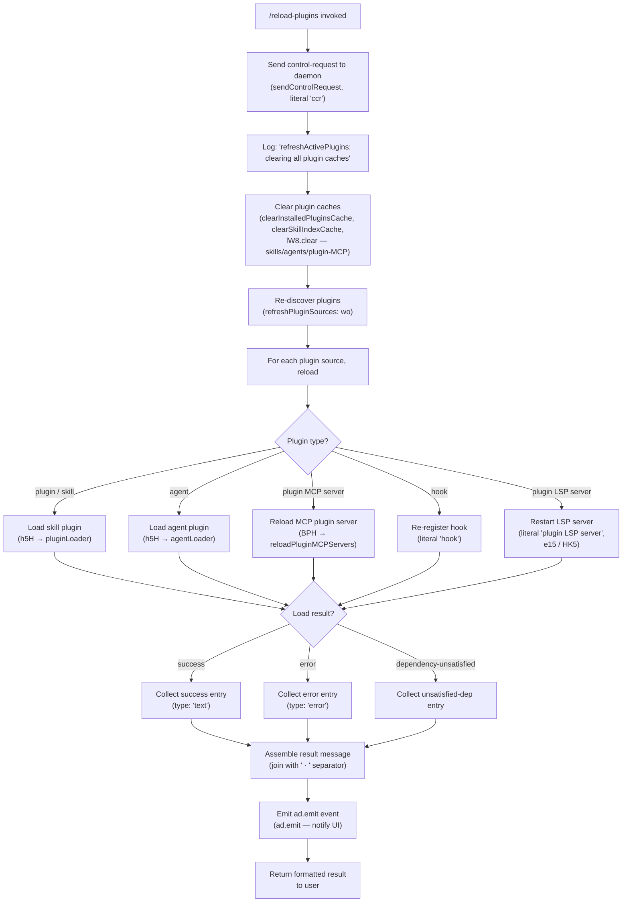

# `/reload-plugins`

> Analysis basis: CC v2.1.152 bundle.js (AST extraction + Claude interpretation)
> Minimum version: v2.1.152

---

## Overview

`/reload-plugins` activates pending plugin changes in the current Claude Code session without requiring a full restart. It sends a `control-request` to the CLI daemon, clears all plugin-related caches (skills, agents, plugin MCP servers, LSP servers), then re-discovers and re-loads every configured plugin, reporting per-plugin reload status back to the user.

---

## Registration

| Field | Value |
|---|---|
| type | `local` |
| name | `reload-plugins` |
| description | `Activate pending plugin changes in the current session` |
| supportsNonInteractive | `false` |
| thinClientDispatch | `control-request` |
| module_id | `rQ1` |
| load_inline | `true` |
| loc_byte | `12263723` |
| loc_byte_end | `12263942` |
| loc_line | `10263` |
| arbor_handler.name | `_K5` |
| arbor_handler.fqn | `claude-2.1.152::_K5` |
| arbor_handler.kind | `AsyncFunction` |
| arbor_handler.resolution_path | `module_id` |
| arbor_handler.n_hits | `0` |

Analysis basis: CC v2.1.152 bundle.js:+12263723

---

## Input Branching

The command takes no user-provided arguments. However, its internal execution branches across four major reload phases and several per-plugin outcome paths (≥ 3 distinct branches), so a Mermaid flowchart is used.



---

## Behavioral Spec

### Handler Entry Point (`_K5`)

`_K5` is an `AsyncFunction` resolved via the `module_id` path (`rQ1`). It is the sole top-level handler for `/reload-plugins`.

Analysis basis: CC v2.1.152 bundle.js:+12262745

```
async function reloadPluginsHandler(context):

    # Phase 1 — signal the daemon
    sendControlRequest("ccr")                      # literal "ccr" at +12262763
                                                   # thinClientDispatch = "control-request"

    # Phase 2 — clear all plugin caches
    log("refreshActivePlugins: clearing all plugin caches")  # +12260631
    clearInstalledPluginsCache()                   # Rz1 → N, "Cleared installed plugins cache" +9766019
    clearSkillIndexCache()                         # ox → H.clearSkillIndexCache +12822074
    skillsCache.clear()                            # zo → lW8.clear +9709216

    # Phase 3 — refresh plugin sources (re-discover)
    pluginSources = refreshPluginSources()         # wo +12260935
    # wo reads .mcp.json (+6553731), .mcpb (+5141523/.dxt +5141544),
    # .lsp.json (+8121915) files from disk, parsing each with JSON.parse (B6)

    # Phase 4 — reload each plugin
    results = await Promise.all(                   # +12260738
        pluginSources.map(source => reloadOnePlugin(source))
    )

    # Phase 5 — assemble per-plugin status strings
    statusLines = buildStatusReport(results)       # BPH sub-calls: e15, HK5, K.map
    # Each line is one of: "plugin", "skill", "agent",
    #   "plugin MCP server", "hook", "plugin LSP server"
    # Literals: +12262877, +12262908, +12262936, +12262968, +12263402, +12263461

    # Phase 6 — join and emit
    message = statusLines.join(" · ")             # literal " · " +12262995
    ad.emit(message)                               # +12261718

    return formatResult(message)                   # type: "text" +12263125
```

### Cache-Clearing Sub-System (`clearInstalledPluginsCache` via `Rz1`)

Analysis basis: CC v2.1.152 bundle.js:+12260683

```
function clearInstalledPluginsCache():
    log("Cleared installed plugins cache")         # +9766019
    N()                                            # shared logger / state-reset utility
```

### Skill-Index Cache Clear (`ox`)

Analysis basis: CC v2.1.152 bundle.js:+12822074

```
async function clearSkillIndex(context):
    await Promise.resolve()
    pr_()                                          # internal promise resolver
    context.clearSkillIndexCache()                 # clears in-memory skill index
```

### Plugin Source Discovery (`refreshPluginSources`, `wo`)

Analysis basis: CC v2.1.152 bundle.js:+6553180

```
async function refreshPluginSources(projectRoot):
    sources = []

    # Read .mcp.json from project root
    mcpJson = readFile(join(projectRoot, ".mcp.json"), "utf-8")   # +6553731, +6554431
    if mcpJson:
        parsed = JSON.parse(mcpJson)               # B6 +183827
        sources.push(...extractMcpEntries(parsed)) # QV_

    # Discover .mcpb / .dxt plugin archives
    for each file matching [".mcpb", ".dxt"]:      # +5141523, +5141544
        if isValidPluginArchive(file):
            sources.push(readMcpbPlugin(file))     # _J6

    # Read .lsp.json for LSP plugins
    lspJson = readFile(join(pluginRoot, ".lsp.json"), "utf-8")     # +8121915
    if lspJson:
        parsed = JSON.parse(lspJson)               # B6
        sources.push(...extractLspEntries(parsed)) # akH / ozL

    log("warn", ...)                               # on any parse failures
    return sources
```

### Plugin Reload Orchestrator (`reloadPluginMCPServers`, `BPH`)

Analysis basis: CC v2.1.152 bundle.js:+12260629

```
async function reloadPluginMCPServers(sources, context):
    # Log the cache-clear
    log("refreshActivePlugins: clearing all plugin caches")

    # Re-run full plugin installation pipeline
    pluginStates = await Promise.all(sources.map(s => installOrUpdatePlugin(s)))
    # installOrUpdatePlugin internally calls:
    #   j3  — plugin definition loader (iIL, rZ, OV_)
    #   pR  — plugin resolver (ox, tW8, zz1, ChH)
    #   zo  — skills cache clear (lW8.clear)
    #   wo  — source refresh
    #   akH — LSP config reader
    #   $J6 — full plugin install engine

    # Build status per plugin
    pluginStatusMap = {}
    for each plugin in pluginStates:
        key = plugin.name + " · " + plugin.type
        pluginStatusMap[key] = deriveStatus(plugin)
        # status literals: "plugin", "skill", "agent",
        #   "plugin MCP server", "hook", "plugin LSP server"

    # Compute deltas (added / updated / error)
    added   = filterNewPlugins(pluginStatusMap)    # e15
    updated = filterUpdatedPlugins(pluginStatusMap) # HK5
    errors  = filterErrors(pluginStatusMap)

    # Pad and align the summary table
    paddedLines = added.concat(updated)
                       .map(line => line.padEnd(40)) # literal 40 +15408364

    # Emit notification event
    ad.emit({type: "reload-complete", payload: pluginStatusMap})   # +12261718

    return {added, updated, errors}
```

### Full Plugin Installer (`$J6`)

The deepest sub-system reached during the reload. Called recursively for each plugin source.

Analysis basis: CC v2.1.152 bundle.js:+5163745

```
async function installPlugin(pluginSpec, context):

    # 1. Validate scope
    if pluginSpec.scope === "managed":             # +4916150
        throw Error("Cannot install plugins to managed scope")  # +4916172

    # 2. Resolve source type
    switch pluginSpec.sourceType:
        case "file" | "directory":  resolveLocalSource(pluginSpec)   # p49 +4918564
        case "github":              resolveGithubSource(pluginSpec)   # rE7 → PDH
        case "git":                 resolveGitSource(pluginSpec)      # rE7 → C49
        case "url":                 resolveUrlSource(pluginSpec)      # F78
        case "npm":                 resolveNpmSource(pluginSpec)      # F78
        case "settings":            resolveSettingsSource(pluginSpec) # ow6

    # 3. Check policy
    if policyBlocks(pluginSpec):
        recordStatus("blocked-by-policy")          # +5163780
        return {status: "blocked"}

    # 4. Check marketplace policy
    if marketplaceBlocked(pluginSpec):
        recordStatus("marketplace-blocked-by-policy")  # +5163872
        return {status: "blocked"}

    # 5. Load plugin manifest
    manifest = loadManifest(pluginSpec.root)       # iZ / aF_ → readFileSync
    # Looks for "manifest.json" (+5147559) in plugin directory

    # 6. Validate semver dependencies
    semverResult = validateDependencies(manifest)  # N48, zj6
    if semverResult.status === "dependency-unsatisfied":  # +11444045
        recordStatus("dependency-unsatisfied")
        return {status: "dependency-unsatisfied"}

    # 7. Install / extract archive if needed
    if isArchive(pluginSpec):                      # .mcpb / .dxt
        extractArchive(pluginSpec)                 # WnH
        # "Extracting MCPB archive..." +5148744

    # 8. Install npm dependencies (if npm source)
    if hasNpmDeps(manifest):
        installNpmDeps(pluginSpec.dir)             # fJ6
        # Skips yarn/pnpm lockfiles +4961603

    # 9. Register hooks, LSP, MCP endpoints
    registerHooks(manifest.hooks)                  # tq → CMA.register +58661
    registerLspServer(manifest.lsp)                # ZT_
    registerMcpServer(manifest.mcp)                # P.set, Q.set

    # 10. Emit telemetry
    emitPluginInstalled(manifest)                  # L4 → A.emit "plugin_installed" +5169504

    return {status: "ok", plugin: manifest}
```

### Status Report Builder (`buildStatusReport`, `e15` / `HK5`)

Analysis basis: CC v2.1.152 bundle.js:+12262108

```
function buildStatusReport(results):
    successLines = results
        .filter(r => !r.error && !r.unsatisfied)   # e15 / HK5: H.filter
        .map(r => formatLine(r))                   # _.map / A.filter

    errorLines = results
        .filter(r => r.status === "error")
        .map(r => "error: " + r.message)           # literal "error" +12263050

    return successLines.concat(errorLines)
```

---

## State & Side Effects

| Item | Detail |
|---|---|
| Telemetry | No `tengu_*` events fire directly inside `_K5` or `BPH` at depth ≤ 2. Downstream daemon/voice/bg-session functions reachable in the graph carry: `tengu_feature_ok` (+964519), `tengu_feature_sad` (+964654), `tengu_feature_bad` (+964577), `tengu_daemon_yield` (+15401311), `tengu_daemon_control` (+15418464), `tengu_bg_dispatch_sigkill_escalate` (+15382331), `tengu_bg_dispatch_low_mem` (+15382910), `tengu_bg_spare_enable` (+15383605), `tengu_bg_spare_claim` (+15383726), `tengu_bg_spare_claim_fail` (+15383989) |
| Daemon control request | Fires `sendControlRequest("ccr")` to the thin-client daemon via `thinClientDispatch: "control-request"` before any cache work |
| Cache invalidation | Clears: installed-plugin cache (`Rz1 → N`), skill-index cache (`ox → clearSkillIndexCache`), skills/agents LRU cache (`zo → lW8.clear`) |
| File I/O | Reads `.mcp.json`, `.mcpb`, `.dxt`, `.lsp.json`, `manifest.json`, `marketplace.json`, `known_marketplaces.json`, `settings.json`, `settings.local.json` from disk |
| Hook registration | Re-registers all plugin hooks via `CMA.register` (`tq` at +58661) |
| LSP server restart | Rebuilds LSP server registry (`ZT_`, `iZ`); may call `Yk.rename` / `Yk.unlink` on temp files |
| MCP server restart | Updates MCP server map via `P.set` / `Q.set`; closes stale connections (`M.close`, `q.close`, `d0K.unlinkSync`) |
| Event emission | `ad.emit` fires a reload-complete notification to the UI layer (+12261718) |
| appState changes | Plugin state maps (`P`, `Q`, `O`, `W`, `j`, `y`, `g`, `l`) are mutated to reflect newly loaded plugins |
| Sound | None detected |
| Non-interactive support | `supportsNonInteractive: false` — command must be run in an interactive session |

---

## Version History

| Version | Change |
|---|---|
| v2.1.152 | Initial analysis |

---

## Common Mistakes

1. **Running in non-interactive mode**: `/reload-plugins` has `supportsNonInteractive: false`. Invoking it from a script or pipe will be rejected before any cache clearing occurs.
2. **Expecting immediate MCP tool availability**: After the command completes, newly registered MCP servers still need to complete their own startup handshake. Tools may not appear until the next message exchange.
3. **Using yarn or pnpm lockfiles in plugins**: The installer explicitly skips yarn/pnpm lockfiles ("Skipped: yarn/pnpm lockfiles are not supported — use bun or npm", +4961603). A plugin whose `package.json` is managed by yarn/pnpm will silently skip dependency installation.
4. **Reloading managed-scope plugins**: Any plugin installed in the `"managed"` scope raises an error ("Cannot install plugins to managed scope", +4916172) and is excluded from the reload cycle.
5. **Assuming a full session restart**: `/reload-plugins` only refreshes plugin state in the current live session. Settings changes that affect the Claude binary's own startup (e.g., `ANTHROPIC_API_KEY`) still require a full restart.
6. **Stale `.mcpb` / `.dxt` archives**: The command re-extracts archives on each reload. If the archive file on disk is corrupted or partially written, the reload will log an error ("No manifest.json found in MCPB file", +5148855) and skip that plugin without affecting others.

---

## Appendix — Identifier Mapping

> For bundle debugging only. Identifiers change across versions.

| Identifier | Role |
|---|---|
| `_K5` | Main async handler for `/reload-plugins` (arbor_handler) |
| `z$` | Control-request dispatcher (sendControlRequest wrapper) |
| `NWH` | Underlying transport for control requests |
| `Tl` | Pre-reload preparation helper |
| `k8` | Shared utility called by Tl and O |
| `BPH` | Plugin MCP server reload orchestrator (reloadPluginMCPServers) |
| `N` | Shared logger / state-reset utility |
| `OyK` | Plugin state observer |
| `xMA` | Plugin state sub-helper (calls zNK, YNK) |
| `CH` | JSON serializer helper (JSON.stringify wrapper) |
| `j4` | Log-line formatter with redaction |
| `Y$A` | qyK mapper for log formatting |
| `VxH` | Write-to-stream helper |
| `e3A` | H.write wrapper |
| `DyK` | Conversation/log writer (disk append pipeline) |
| `obH` | Debounced log-flush scheduler |
| `cqH` | Log-chunk writer |
| `Q6` | Path utility (likely `path.join` or similar) |
| `Q96` | Log rotation helper |
| `G$A` | Log directory path builder |
| `W$A` | Log file rotation (rename/unlink .txt files) |
| `YyK` | Log file appender (mkdir + appendFile) |
| `tq` | Hook-registration dispatcher (→ CMA.register) |
| `Rz1` | Installed-plugins cache clearer |
| `j3` | Plugin definition loader |
| `iIL` | Inner plugin loader (rZ, tW8, t78, T58, OV_, hH, …) |
| `rZ` | Plugin resolution step (→ N, QS6, Wz, jMA) |
| `OV_` | Plugin root extractor / filter |
| `hH` | Plugin capability loader (n_, uH, V1, UtK) |
| `pR` | Plugin resolver (ox, tW8, zz1, ChH) |
| `ox` | Skill-index cache clearer (→ clearSkillIndexCache) |
| `zo` | Skills LRU cache clearer (lW8.clear) |
| `wo` | Plugin source refresh / re-discovery engine |
| `K48` | Plugin root path builder |
| `WU` | File-extension checker (.mcpb / .dxt) |
| `Dg` | Plugin directory scanner |
| `QV_` | .mcp.json reader and parser |
| `j8` | Error-code classifier (ENOENT/ENOTDIR/EISDIR) |
| `B6` | JSON.parse wrapper |
| `dZ9` | Plugin archive download/extract orchestrator |
| `_J6` | Full .mcpb plugin installer (manifest, hash, extract) |
| `GH` | String coercion utility |
| `akH` | LSP config reader (.lsp.json) |
| `ozL` | LSP plugin entry parser |
| `rzL` | LSP path resolver (relative/absolute) |
| `Sn1` | Session status helper |
| `Ki` | Session ID builder |
| `A1` | AsyncLocalStorage store accessor |
| `KI6` | daemon.status.json path builder |
| `e15` | Success-entry filter for status report |
| `iQ1` | Plugin set membership check |
| `HK5` | Updated-entry filter for status report |
| `h5H` | Plugin loader engine (skills/agents/hooks/LSP) |
| `Qd` | Plugin configuration resolver |
| `XM` | known_marketplaces.json reader |
| `q08` | Marketplace config path builder |
| `BvH` | Plugin entry enumerator |
| `x8` | Plugin type dispatcher |
| `BB6` | Plugin type handler (MMA, mi8, fMA) |
| `Tg` | Full plugin installer (z_, pq6, jx8, bq6, …) |
| `nZ` | Scope validation guard (throws on managed) |
| `QA` | Plugin scope / type checker |
| `rP` | Policy-check engine |
| `ow6` | Policy settings plugin handler |
| `f48` | Policy settings loader (→ x8) |
| `p49` | File/directory source resolver |
| `U49` | Local source validator |
| `rE7` | GitHub/git source resolver |
| `T6H` | Git-type plugin type dispatcher |
| `F49` | Combined local + git policy checker |
| `m49` | Semver constraint helper (Zz) |
| `r4H` | Marketplace plugin reader (.claude-plugin/marketplace.json) |
| `iZ6` | Marketplace entry path resolver |
| `rF_` | Marketplace JSON schema validator |
| `L8` | Shared error-code constant (ENOENT/ENOTDIR/EISDIR lookup) |
| `KT` | Plugin manifest + marketplace combined loader |
| `yT_` | Manifest-first loader fallback |
| `moL` | Plugin set membership test (q.has) |
| `$J6` | Full plugin install pipeline |
| `AT` | Plugin type normaliser |
| `d78` | Scope+policy combined checker |
| `g76` | Local-source path prefix guard (./) |
| `b6` | Settings scope context accessor (KU6) |
| `KU6` | AsyncLocalStorage settings-scope getter |
| `iZ` | Plugin config file loader (aF_, d76, Q76, sF_) |
| `aF_` | Plugin config readFileSync wrapper |
| `sF_` | Plugin config entry iterator |
| `j` | MCP process registry (kill on reload) |
| `y` | MCP process instance (write/close) |
| `P` | MCP server connection map (set/get/has) |
| `IR8` | MCP connection initialiser |
| `n_` | Error/String normaliser |
| `Nx` | Plugin name validator |
| `NR` | Plugin name rule checker |
| `N48` | Semver validity checker (Cd.valid/coerce/satisfies) |
| `W` | Plugin registry set (add/has) |
| `_L` | Plugin registry backing store |
| `b79` | Dependency resolution walker |
| `f` | Plugin state store (lhH, dPK, L) |
| `l_` | Settings loader (flagSettings, userSettings, projectSettings, localSettings) |
| `zO` | Settings initialiser (m3H, Tg) |
| `mi8` | Settings merge helper (mNA, m3H, Gg, bNA, bn) |
| `OP` | Settings observer (xn) |
| `pn8` | Settings timestamp tracker (tU6.set) |
| `DGH` | Settings delta applier (UB6, Tg) |
| `z76` | Atomic file writer (lstat/symlink/rename/fchmod) |
| `Wz` | Cache invalidation helper (FS6.clear, eC8.clear) |
| `lU6` | Gitignore-tracking file writer |
| `Ob` | .claude settings path builder (KN.join) |
| `SH` | Feature telemetry OK reporter (tengu_feature_ok) |
| `H8` | Feature telemetry bad reporter (tengu_feature_bad) |
| `mH` | Feature telemetry sad reporter (tengu_feature_sad) |
| `sm` | Settings load orchestrator (Lk, Z9, pi8, Tg, gS6) |
| `MJ6` | Plugin root path guard (bx.resolve/startsWith) |
| `g` | Plugin filter + gH membership (B, $) |
| `B` | MCP prefix filter (F6.filter, gH.has) |
| `Q` | MCP server file store (zv6 readFile, XN1 unlink) |
| `zv6` | MCP server file reader |
| `XN1` | MCP server file unlinker |
| `qH` | Notification push queue (s, DH, Z, I) |
| `s` | Notification dispatcher (f, addNotification, Fz, L) |
| `DH` | Notification enqueue helper |
| `I` | Conversation message assembler |
| `l` | Token/rate-limit filter (e.filter) |
| `e` | Voice / audio session manager |
| `zj6` | Semver range validator |
| `J0_` | Semver range error builder |
| `B78` | Plugin archive integrity checker (oO9 → kDH) |
| `oO9` | MCPB archive reader |
| `F78` | URL/npm/git source fetcher |
| `Rh7` | Remote source pre-checker |
| `Z8` | CLI subprocess spawner (T_, b6) |
| `z` | Daemon write stream |
| `w` | Background session manager (spawn/kill/mem) |
| `fJ6` | npm package installer |
| `WnH` | Plugin archive extractor (plugin.json, r4.rm, GnH) |
| `l78` | Plugin type resolver (T76) |
| `Mz9` | Archive metadata reader |
| `S6H` | Plugin ID / hash generator (sha256, +5154084) |
| `HI` | Plugin directory index (o78, X0) |
| `X` | Socket/stream reader (Buffer.concat, ETOOLARGE) |
| `h48` | npm install runner (d79.readdir, package.json check) |
| `GU` | Git URL helper |
| `eDH` | Plugin directory expander |
| `Q78` | Plugin cleanup helper (mh7, g78, qT.rm) |
| `ZT_` | Plugin registry updater (iZ, findIndex, L.push, sZ6) |
| `h` | Away-summary scheduler (yQ, I, V, M$K) |
| `yQ` | Away-summary state machine |
| `V` | Away-summary context accessor |
| `M$K` | Away-summary message builder |
| `fH` | Fatal-error exit handler (process.exit) |
| `r` | Permission / allow-list checker (w, d) |
| `d` | Allow-list rule evaluator (rk8) |
| `C` | Conversation controller |
| `R` | Response writer (WGK, Tz, z.write) |
| `t` | Voice silence-timeout handler |
| `G` | MCP connection lifecycle (iE6, IR8) |
| `ph7` | Dependency graph walker (Nx, QA, AT, d78, KT) |
| `Vy` | Plugin name case-normaliser |
| `f3` | String utility (uH) |
| `uH` | String coercion (String) |
| `L4` | OTEL metric emitter (plugin_installed event) |
| `rb8` | OTEL exporter initialiser |
| `mvH` | OTEL span builder (Sp, y6, T48, efH, …) |
| `lq6` | OTEL attribute list builder |
| `E6H` | Dependency list formatter (QA, q.join/slice, k8) |