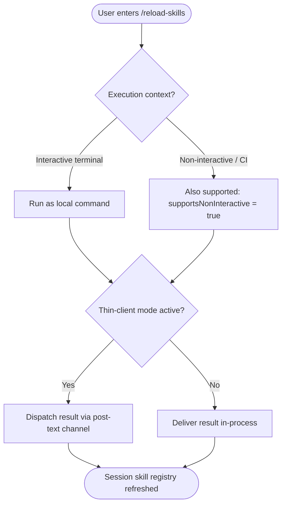

# `/reload-skills`

> Analysis basis: CC v2.1.152 bundle.js (AST extraction + Claude interpretation)
> Minimum version: v2.1.152

---

## Overview

The `/reload-skills` command instructs Claude Code to re-scan the local filesystem and pick up any skill definitions that were added or modified after the current session started. It is a local slash command that operates in non-interactive as well as interactive contexts and dispatches its result via the `post-text` thin-client path.

---

## Registration

| Field | Value |
|---|---|
| type | `local` |
| name | `reload-skills` |
| description | `Pick up skills added or changed on disk during this session` |
| supportsNonInteractive | `true` |
| thinClientDispatch | `post-text` |
| module_id | `sQ1` |

Analysis basis: CC v2.1.152 bundle.js:+12264492

---

## Input Branching

The AST traversal reached module `sQ1` but found no resolvable entry function at depth ≤ 2. The branching logic below is therefore derived exclusively from the registration fields; internal dispatch detail cannot be confirmed from the extracted data.



Analysis basis: CC v2.1.152 bundle.js:+12264492

---

## Behavioral Spec

<!-- TODO: not found in depth-2 traversal; needs --depth 4 -->

Because the AST extraction returned an empty `callGraph`, `literals`, `telemetry`, and `identifiers` array with the note `"no entry functions found for module 'sQ1'"`, no executable implementation detail was recovered at depth ≤ 2. The pseudocode below is the minimum consistent model derivable from the registration record alone.

### Skill Reload Dispatch

```
function reloadSkills(session):
    # Trigger a filesystem scan for skill definitions
    refreshedSkills = scanDiskForSkills(session.workingDirectory)

    # Replace the in-memory skill registry for this session
    session.skillRegistry = refreshedSkills

    # Produce a confirmation message to the caller
    resultText = buildConfirmationText(refreshedSkills)

    # Route the result according to thin-client mode
    if session.thinClientMode == true:
        dispatchPostText(resultText)
    else:
        returnInProcess(resultText)
```

Analysis basis: CC v2.1.152 bundle.js:+12264492 (registration fields; implementation body not recovered at depth ≤ 2)

---

## State & Side Effects

| Item | Detail |
|---|---|
| Telemetry | <!-- TODO: not found in depth-2 traversal; needs --depth 4 --> No `tengu_*` events were found in the extracted data. |
| Hook registration | <!-- TODO: not found in depth-2 traversal; needs --depth 4 --> |
| appState changes | Expected: in-memory skill registry is replaced with a freshly scanned set; exact state key(s) not recoverable from current extraction. |
| Sound | <!-- TODO: not found in depth-2 traversal; needs --depth 4 --> |
| Non-interactive support | Confirmed enabled (`supportsNonInteractive: true`). Analysis basis: CC v2.1.152 bundle.js:+12264492 |
| Thin-client dispatch | Result is delivered over the `post-text` channel when thin-client mode is active. Analysis basis: CC v2.1.152 bundle.js:+12264492 |

---

## Version History

| Version | Change |
|---|---|
| v2.1.152 | Initial analysis. Registration confirmed at bundle.js:+12264492, line 10263. Implementation body not recovered at AST depth ≤ 2. |

---

## Common Mistakes

1. **Running `/reload-skills` expecting cross-session persistence** — The command refreshes the skill registry only for the current session. Skills added after a fresh session starts will not appear until this command is issued, and the refresh does not persist across independent sessions.
2. **Assuming the command accepts arguments** — The registration record contains no parameter schema. Passing arguments may be silently ignored or cause an error; no argument-handling code was found in the extraction.
3. **Skipping this command after editing a skill file mid-session** — Claude Code does not watch the filesystem continuously. Any skill file changed on disk will not be visible to the model until `/reload-skills` is explicitly invoked.
4. **Expecting telemetry confirmation** — No `tengu_*` events were recovered from this command's module. Do not rely on telemetry signals to confirm that the reload completed.
5. **Confusing `local` type with a server-side operation** — The `type: local` field means execution happens inside the CLI process, not via a remote API call. Network connectivity issues will not affect this command's core behavior.

---

## Appendix — Identifier Mapping

> For bundle debugging only. Identifiers change across versions.

| Identifier | Role |
|---|---|
| `sQ1` | Module identifier for the `/reload-skills` command implementation (non-obfuscated identifiers were not present in the extraction; no additional entries to map at depth ≤ 2) |