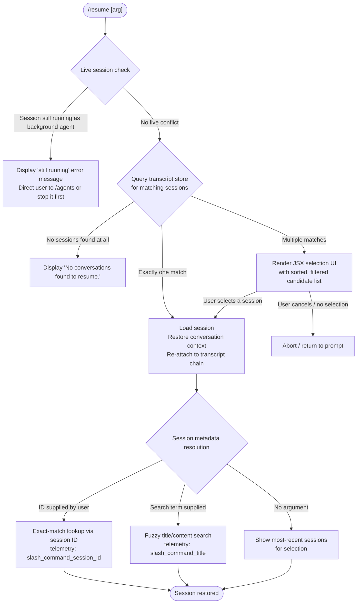

# `/resume`

> Analysis basis: CC v2.1.152 bundle.js (AST extraction + Claude interpretation)
> Minimum version: v2.1.152

---

## Overview

`/resume` (aliased as `/continue`) allows the user to re-open a previous conversation by supplying either a session ID or a free-text search term. The command queries the live-session registry and the on-disk transcript store, resolves the best matching conversation, and re-attaches the CLI to that session's context — rendering a JSX selection UI when multiple candidates are found.

---

## Registration

| Field | Value |
|---|---|
| type | `local-jsx` |
| name | `resume` |
| description | Resume a previous conversation |
| aliases | `["continue"]` |
| argumentHint | `[conversation id or search term]` |
| module_id | `Wm1` |
| load_inline | `true` |
| loc_byte | `11885451` |
| loc_byte_end | `11885648` |
| loc_line | `9734` |
| arbor_handler.name | `Y_5` |
| arbor_handler.fqn | `claude-2.1.152::Y_5` |
| arbor_handler.kind | `AsyncFunction` |
| arbor_handler.resolution_path | `module_id` |
| arbor_handler.n_hits | `0` |

Analysis basis: CC v2.1.152 bundle.js:+11885451

---

## Input Branching

Five or more distinct resolution paths exist in the handler, so a Mermaid flowchart is used.



Analysis basis: CC v2.1.152 bundle.js:+11884043 (live-session guard), +11884488 (no-results literal), +11884749 (session-ID telemetry key), +11884973 (title telemetry key)

---

## Behavioral Spec

### 1. Entry Point — Handler (`Y_5`)

The primary async handler is resolved via `module_id` → `Wm1` → `Y_5`.

```
async function resumeCommandHandler(commandContext):
    sessionList = await listAllLiveSessions()          // RLH → A.listAllLiveSessions
    currentArg  = commandContext.argument              // free text or UUID

    // Guard: background agent still running
    for each session in sessionList:
        if session matches currentArg AND session.status == "interactive":
            display("That session is still running as a background agent. "
                    "Open `claude agents` to attach to it, or stop it there first to resume here.")
            return

    // Discover on-disk transcripts
    transcriptCandidates = await discoverTranscripts(commandContext)  // LRH

    if transcriptCandidates is empty:
        display("No conversations found to resume.")
        return

    if len(transcriptCandidates) == 1:
        target = transcriptCandidates[0]
    else:
        target = await renderSelectionUI(transcriptCandidates)        // JSX picker
        if target is null:
            return   // user cancelled

    await loadAndAttachSession(target, commandContext)                // LRH + Kl + iG6
```

Analysis basis: CC v2.1.152 bundle.js:+11884043 (live-session guard), +11884053 (background-agent error string), +11884274 (error display call `hH`), +11884488 (no-results string), +11884339 (`Xw.createElement` JSX render)

---

### 2. Live-Session Detection (`RLH`)

```
async function listAllLiveSessions():
    await Promise.resolve()                   // yields to event loop
    sessions = sessionRegistry.listAllLiveSessions()
    filter sessions where type == "interactive"
    return sessions
```

Analysis basis: CC v2.1.152 bundle.js:+8754579 (`Promise.resolve`), +8754609 (`_tH`), +8754631 (`A.listAllLiveSessions`), +8754722 (literal `"interactive"`)

---

### 3. Transcript Discovery and Search (`LRH`)

`LRH` orchestrates on-disk transcript lookup. It:

1. Records `Date.now()` as a reference timestamp.
2. Runs `git worktree list --porcelain` to discover active worktrees; emits `tengu_worktree_detection` telemetry.
3. Splits the argument on whitespace; for each token beginning with a known prefix (e.g., `"worktree "`, length 9), strips the prefix and normalises via NFC.
4. Calls `sessionFileReader` (`bt1`) to enumerate projects directories, reading JSONL transcript files with a 1 MiB buffer cap.
5. Applies filters: prefix match (`H.startsWith`), then locale-aware sort (`$.localeCompare`) to rank candidates.
6. Returns the sorted candidate array.

```
async function discoverAndRankTranscripts(arg, timestamp):
    worktrees  = runGit(["worktree", "list", "--porcelain"])
    emit("tengu_worktree_detection")

    tokens = arg.split(whitespace)
    for each token:
        if token.startsWith("worktree "):
            token = token.slice(9).normalize("NFC")

    rawSessions = await readProjectTranscripts()        // bt1 → sd → projects dir
    candidates  = rawSessions.filter(s => matchesArg(s, tokens))
    candidates.sort((a, b) => a.localeCompare(b))
    return candidates
```

Key literals:
- Git arguments: `"worktree"`, `"list"`, `"--porcelain"` (bundle.js:+11881064, +11881071)
- Prefix strip offset: `9` characters (bundle.js:+11881303)
- Unicode normalisation form: `"NFC"` (bundle.js:+11881316)
- Session-not-found sentinel: `"sessionNotFound"` (bundle.js:+11881697)
- Multiple-matches sentinel: `"multipleMatches"` (bundle.js:+11881768)

Analysis basis: CC v2.1.152 bundle.js:+11881009 (`Date.now`), +11881044 (`T_`), +11881047 (`i_`), +11881153 (worktree telemetry), +11881234 (`A.split`)

---

### 4. Transcript File Reader (`bt1`)

`bt1` recursively enumerates the `projects` sub-directory of the CC data directory.

```
async function readProjectTranscripts(projectsDir):
    entries = await readdir(projectsDir)
    results = []

    for each entry in entries:
        fullPath = join(projectsDir, entry)
        if entry.isDirectory():
            subEntries = await readdir(fullPath)   // z8A recursive read
            // parse each JSONL file; buffer cap: 1,048,576 bytes
            for each file in subEntries:
                messages = parseTranscript(file, bufferCap=1048576)
                results.push(...messages)

    // Deduplicate, timestamp-sort, flatten
    return flatten(results).sort(byTimestamp)
```

Buffer cap: 1,048,576 bytes (bundle.js:+12871327).
Padding width constant for display: `40` characters (bundle.js:+15408364).

Analysis basis: CC v2.1.152 bundle.js:+12881056 (`_k6`), +12881191 (`bt1`), +12882030 (`d4.readdir`), +6487280 (`SwH.join`), +6487294 (literal `"projects"`)

---

### 5. Session Metadata Resolution (`Kl`)

`Kl` computes the display metadata for each candidate session. It reads per-session JSONL keys and maps them to display fields:

| Metadata key (literal) | Purpose | loc_byte |
|---|---|---|
| `"summary"` | Conversation summary text | +12874682 |
| `"last-prompt"` | Text of the last user prompt | +12874749 |
| `"custom-title"` | User-assigned title | +12874845 |
| `"ai-title"` | AI-generated title | +12874923 |
| `"tag"` | Session tag | +12874993 |
| `"agent-name"` | Agent name | +12875054 |
| `"agent-color"` | Agent colour | +12875128 |
| `"agent-setting"` | Agent setting | +12875204 |
| `"mode"` | Session mode | +12875284 |
| `"permission-mode"` | Permission mode | +12875347 |
| `"worktree-state"` | Worktree state | +12875505 |
| `"bridge-session"` | Bridge session flag | +12875720 |
| `"fork-context-ref"` | Fork context reference | +12876180 |

```
function resolveSessionMetadata(sessionRecord):
    meta = {}
    for each key in SESSION_METADATA_KEYS:
        meta[key] = sessionRecord.getKey(key)
    return meta
```

Analysis basis: CC v2.1.152 bundle.js:+12868798 (`Kl` calls `LRH`, `bt1`, `uRH`), +12868858 (`H.toLowerCase`), +12869031 (`Qf`)

---

### 6. JSX Selection UI (`Jm1` / `Xw.createElement`)

When multiple candidates are found, a React/JSX component is rendered inline. The component:

1. Displays the sorted list of sessions using bold formatting (`P6.bold`, bundle.js:+11881732).
2. Accepts keyboard selection to confirm a choice.
3. On confirmation, resolves the selected session and proceeds to attachment.
4. On cancellation (e.g., Ctrl-C), returns `null` so the handler aborts cleanly.

```
function renderSessionPicker(candidates):
    return createElement(SessionPickerComponent, {
        sessions: candidates,
        onSelect: (session) => resolveWith(session),
        onCancel: () => resolveWith(null)
    })
```

Analysis basis: CC v2.1.152 bundle.js:+11884339 (`Xw.createElement`), +11884365 (`Date.now` for render timestamp), +11885023 (`Jm1`), +11881732 (`P6.bold`)

---

### 7. Session State Loading (`iG6` / `Ct1` / `w_H`)

`iG6` initialises the full daemon/session state object for the resumed conversation. It:

1. Invokes `Ct1` which calls `w_H` (the session-state factory) and merges any persisted state via `Object.assign`.
2. Reads all metadata keys listed in §5 from the on-disk store.
3. Iterates transcript chain (parent→child UUID links) to reconstruct conversation history.
4. Emits `slash_command_session_id` or `slash_command_title` depending on how the session was matched.

```
async function loadSessionState(sessionId, context):
    baseState  = sessionStateFactory()             // w_H
    persisted  = await readSessionRecord(sessionId)
    merged     = Object.assign(baseState, persisted)
    chain      = await buildTranscriptChain(merged) // bLH → rO5 → lO5
    emit(matchedById ? "slash_command_session_id" : "slash_command_title",
         { sessionId })
    return { state: merged, chain }
```

Analysis basis: CC v2.1.152 bundle.js:+12879263 (`iG6`→`Ct1`), +12878526 (`w_H`), +12878540 (`Object.assign`), +11884749 (`slash_command_session_id`), +11884973 (`slash_command_title`)

---

### 8. Error Display Helper (`hH`)

`hH` formats and renders error or status strings to the terminal. It uses `n_` (error normalisation), `uH` (string coercion), `V1`/`mGA` (message formatting), and `UtK` (message queue management).

```
function displayError(message):
    normalized = normalizeError(message)     // n_
    formatted  = formatMessage(normalized)   // V1 → mGA → uH
    enqueueMessage(formatted)                // UtK → tp6.shift / tp6.push
    logToErrorStream(formatted)              // Cn.logError
```

Analysis basis: CC v2.1.152 bundle.js:+969613 (`hH`→`n_`), +969626 (`uH`), +969872 (`V1`), +969955 (`UtK`), +970013 (`Cn.logError`), +969988 (literal `"error"`)

---

## State & Side Effects

| Item | Detail |
|---|---|
| Telemetry | `tengu_worktree_detection` (bundle.js:+11881153) — fired on every worktree enumeration |
| Telemetry | `tengu_transcript_phantom_parent` (bundle.js:+12873522) — fired when a parent UUID in a transcript chain cannot be resolved |
| Telemetry | `tengu_transcript_parent_cycle` (bundle.js:+12877085) — fired when a cycle is detected in the parent-UUID chain |
| Telemetry | `tengu_chain_parent_cycle` (bundle.js:+12855033) — fired at chain-build level on cycle |
| Telemetry | `tengu_chain_timestamp_fallback` (bundle.js:+12855182) — fired when timestamp ordering must fall back |
| Telemetry | `tengu_chain_parallel_tr_recovered` (bundle.js:+12857048) — fired when parallel transcript branches are merged |
| Telemetry | `tengu_relink_walk_broken` (bundle.js:+12854543) — fired when a relink walk finds a broken link |
| appState changes | Session state is merged into the active app state via `Object.assign`; all metadata keys (summary, last-prompt, custom-title, …) are populated |
| Hook registration | No standalone hook registration observed in depth-2 traversal |
| Sound | None observed |
| Background-agent guard | If the target session is still running interactively, the command exits with an inline error message and does **not** modify state |
| Literal: no-results message | `"No conversations found to resume."` (bundle.js:+11884488) |
| Literal: background-agent conflict message | `"That session is still running as a background agent…"` (bundle.js:+11884053) |
| Literal: session-id telemetry key | `"slash_command_session_id"` (bundle.js:+11884749) |
| Literal: title telemetry key | `"slash_command_title"` (bundle.js:+11884973) |

---

## Version History

| Version | Change |
|---|---|
| v2.1.152 | Initial analysis |

---

## Common Mistakes

1. **Passing a partial title that matches multiple sessions** — the command renders an interactive picker rather than resuming immediately. If the terminal does not support JSX rendering, the picker may not display correctly.
2. **Trying to resume a session that is still running as a background agent** — the command will print the background-agent conflict message and abort. Use `/agents` to attach or stop the agent first.
3. **Supplying a UUID that does not exist on disk** — the transcript reader returns an empty list and the command displays "No conversations found to resume." No partial match is attempted.
4. **Assuming `/continue` behaves differently from `/resume`** — they are identical aliases registered at the same `loc_byte` block (bundle.js:+11885451–+11885648).
5. **Expecting instant attachment on large project directories** — `bt1` reads all JSONL transcripts recursively under the `projects` folder with a 1 MiB per-file buffer cap; large histories may cause a noticeable delay.

---

## Appendix — Identifier Mapping

> For bundle debugging only. Identifiers change across versions.

| Identifier | Role |
|---|---|
| `Y_5` | Primary async handler for `/resume` (arbor_handler) |
| `Pm1` | Module filter / pre-handler bootstrap |
| `Qf` | Session argument normaliser / formatter |
| `RLH` | Live-session registry query function |
| `LRH` | Transcript discovery and ranking function |
| `T_` | Child-process / subprocess launcher (used in session attachment) |
| `a0H` | Subprocess lifecycle manager |
| `hH` | Error/message display helper |
| `n_` | Error normalisation utility |
| `uH` | String coercion utility |
| `V1` | Message formatter |
| `mGA` | Message format helper (called by V1) |
| `UtK` | Message queue manager |
| `GH` | String conversion utility |
| `w64` | String utility |
| `z_` | Path/context resolution helper |
| `qv8` | Argument processing dispatcher |
| `_k6` | Session list builder (top-level) |
| `bt1` | Transcript file reader (recursive directory walker) |
| `sd` | Projects-directory path builder |
| `uRH` | Buffer-based transcript parser |
| `Jz5` | Low-level transcript binary reader |
| `Xo` | Regex test helper |
| `Ka` | Session context object constructor |
| `xLH` | Session state reader (full metadata) |
| `w_H` | Session state factory / writer |
| `bO5` | Session state initialiser |
| `K$A` | Argument array parser |
| `A$A` | Argument token analyser |
| `q$A` | Argument token transformer |
| `lhH` | MCP tool/connection loader |
| `dPK` | MCP update applier |
| `yR5` | MCP server reconciler |
| `Lz5` | JSONL binary transcript reader (low-level) |
| `Kz5` | JSONL header parser |
| `Mz5` | JSONL file opener/reader |
| `KGH` | BOM / encoding detection |
| `e64` | Encoding detector helper |
| `_84` | JSON line extractor |
| `H84` | Raw line parser |
| `Yt1` | Session index walker |
| `cO5` | Session index node resolver |
| `e8` | Entity lookup helper |
| `gI8` | Timestamp parser |
| `bLH` | Transcript chain builder |
| `iO5` | Chain node validator |
| `rO5` | Chain segment resolver |
| `lO5` | Chain segment queuer |
| `yt1` | Chain timestamp indexer |
| `AtH` | Session display map builder |
| `G8A` | Session title formatter |
| `vN6` | Message content extractor |
| `i1` | Inline text parser |
| `E8A` | Content type classifier |
| `oO5` | Content type test (image/document) |
| `aO5` | Content type test (array variant) |
| `QI8` | Session metadata get/set |
| `dI8` | Session metadata value iterator |
| `iG6` | Session state loader / merger |
| `Ct1` | Session state initialiser with persist |
| `fz5` | Session filesystem path builder |
| `oh` | Path context helper |
| `MZ` | Directory recursive lister |
| `$8A` | Session record accessor |
| `F5H` | UI layout helper for session list |
| `Kl` | Session candidate resolver / ranker |
| `Jm1` | JSX session picker renderer |
| `eq` | Error-level logger |
| `pv` | Path utility |
| `sA` | Sort comparator helper |
| `ePH` | Message metadata extractor |
| `z8A` | Subdirectory transcript reader |
| `iI6` | Index record updater |
| `vz` | String replace/slice helper |
| `Rt1` | Buffer position tracker |
| `qz5` | Buffer comparator |
| `qH` | Composite data-structure holder |
| `DH` | Streaming buffer handler |
| `B6` | JSON parse wrapper |
| `tR` | Session timestamp resolver |
| `XJ` | Session index key helper |