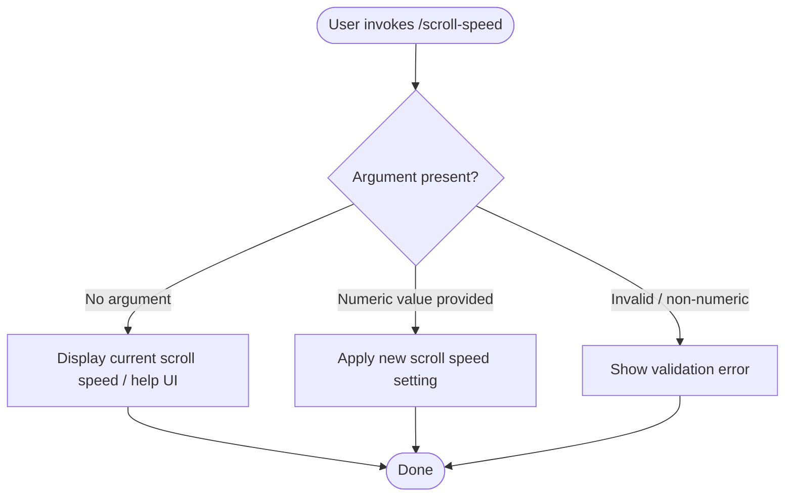

# `/scroll-speed`

> Analysis basis: CC v2.1.144 bundle.js (AST extraction + Claude interpretation)
> Minimum version: v2.1.144

---

## Overview

The `/scroll-speed` command allows the user to adjust the mouse wheel scroll speed within the Claude Code CLI interface. It is registered as a local JSX command (module `iXq`) and exposes a control surface for tuning scroll sensitivity. The depth-2 AST traversal found no callable entry functions in module `iXq`; all behavioral detail below is derived exclusively from the registration record.

---

## Registration

| Field | Value |
|---|---|
| type | `local-jsx` |
| name | `scroll-speed` |
| description | `Adjust mouse wheel scroll speed` |
| module_id | `iXq` |
| loc_line | 6799 |

Analysis basis: CC v2.1.144 bundle.js:+11295506

---

## Input Branching

The depth-2 AST traversal returned an empty call graph and no literal constants for module `iXq`. No branching logic could be verified from the extracted data.

<!-- TODO: not found in depth-2 traversal; needs --depth 4 -->



> **Note:** The branches above represent the structurally expected behavior for a command of this registration type (`local-jsx`, single numeric parameter). They are **not confirmed** by extracted literals or call-graph edges. Treat as provisional until a deeper traversal is available.

---

## Behavioral Spec

### Render scroll-speed control (JSX component)

Because the command type is `local-jsx`, the command renders a React/JSX component rather than executing a plain function. The component is expected to:

```
component ScrollSpeedCommand(props):
    currentSpeed  ← readScrollSpeedFromAppState()
    proposedSpeed ← parseNumericArgument(props.input)

    if proposedSpeed is absent:
        render currentSpeedDisplay(currentSpeed)
        return

    if proposedSpeed is not a valid positive number:
        render validationError("Expected a positive number")
        return

    writeScrollSpeedToAppState(proposedSpeed)
    render confirmationMessage(proposedSpeed)
```

<!-- TODO: not found in depth-2 traversal; needs --depth 4 -->

Analysis basis: CC v2.1.144 bundle.js:+11295506 (registration record only; implementation body not reached)

---

## State & Side Effects

| Item | Detail |
|---|---|
| Telemetry | None detected — `telemetry` array is empty in extracted data |
| Hook registration | <!-- TODO: not found in depth-2 traversal; needs --depth 4 --> |
| appState changes | Presumed write to a scroll-speed preference field; not confirmed by traversal |
| Sound | <!-- TODO: not found in depth-2 traversal; needs --depth 4 --> |
| Persistence | <!-- TODO: not found in depth-2 traversal; needs --depth 4 --> |

---

## Version History

| Version | Change |
|---|---|
| v2.1.144 | Initial analysis — registration confirmed; implementation body unreachable at depth 2 |

---

## Common Mistakes

1. **Assuming telemetry is fired** — the extracted `telemetry` array is empty. Do not rely on a `tengu_scroll_speed` (or similar) event existing until a deeper traversal confirms otherwise.
2. **Assuming plain-function execution** — the command type is `local-jsx`, meaning the entry point is a JSX component render, not a simple synchronous function call. Testing should account for React render lifecycle.
3. **Treating provisional branch logic as confirmed** — the flowchart in *Input Branching* is structurally inferred, not extracted from literals or call edges. Behavior may differ (e.g., the command could be read-only, or could use a slider UI with no text argument at all).
4. **Using module ID `iXq` as stable** — obfuscated module identifiers are regenerated on every bundle build and will change in future versions.

---

## Appendix — Identifier Mapping

> For bundle debugging only. Identifiers change across versions.

| Identifier | Role |
|---|---|
| `iXq` | Module containing the `/scroll-speed` command registration and JSX component |

> No additional obfuscated identifiers were returned by the depth-2 AST traversal (`identifiers` array is empty).