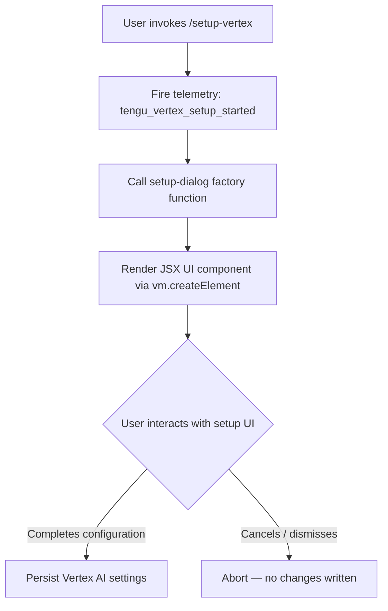

# `/setup-vertex`

> Analysis basis: CC v2.1.132 bundle.js (AST extraction + Claude interpretation)
> Minimum version: v2.1.132

---

## Overview

`/setup-vertex` is a local JSX command that launches an interactive reconfiguration workflow for Google Vertex AI integration. It allows users to update authentication credentials, GCP project identifier, deployment region, and model pin settings without restarting the CLI. The command immediately fires a telemetry event on invocation and renders a JSX UI component to guide the user through the setup flow.

---

## Registration

| Field | Value |
|---|---|
| type | `local-jsx` |
| name | `setup-vertex` |
| description | `Reconfigure Google Vertex AI authentication, project, region, or model pins` |
| module_id | `mKq` |
| load_inline | `true` |
| isHidden | `null` (not hidden; visible in command palette) |
| handler | `DM7` (AsyncFunction, resolved via `module_id` path) |
| `loc_byte_end` | `10917132` |
| `arbor_handler.name` | `DM7` |
| `arbor_handler.kind` | `AsyncFunction` |
| `arbor_handler.resolution_path` | `module_id` |
| `arbor_handler.fqn` | `claude-2.1.132::DM7` |
| `arbor_handler.n_hits` | `1` |

Analysis basis: CC v2.1.132 bundle.js:+10916891

---

## Input Branching

The command accepts no structured user-supplied arguments at invocation time. All branching occurs inside the rendered JSX component rather than in a pre-invocation argument parser. The handler's entry-point logic is therefore linear at the top level:



Analysis basis: CC v2.1.132 bundle.js:+10916170 (call to setup-dialog factory), +10916205 (JSX render call)

---

## Behavioral Spec

### Handler Entry Point — `setupVertexHandler`

The handler is an `AsyncFunction` identified as `DM7` in the bundle, resolved through the `module_id` path `mKq`.

```
async function setupVertexHandler(context):
    # 1. Immediately record that a setup flow has started
    emitTelemetry("tengu_vertex_setup_started")

    # 2. Obtain a configured setup-dialog descriptor
    dialogDescriptor = buildSetupDialog(context)   // call to internal factory `d`

    # 3. Render the interactive setup UI into the CLI's JSX renderer
    uiElement = createElement(VertexSetupComponent, dialogDescriptor)

    # 4. Return the element; the CLI runtime mounts and manages it
    return uiElement
```

Analysis basis: CC v2.1.132 bundle.js:+10916172 (telemetry emit), +10916170 (factory call), +10916205 (createElement call)

### Setup Dialog Factory — `buildSetupDialog`

This is the internal function identified as `d` in the bundle. It is called with the invocation context and is responsible for constructing the props/descriptor object that the JSX component receives.

```
function buildSetupDialog(context):
    # Reads existing Vertex AI configuration from application state
    existingConfig = readVertexConfig(context.appState)

    # Constructs a descriptor covering all reconfigurable fields:
    #   - Authentication method (ADC, service account key, etc.)
    #   - GCP project ID
    #   - Deployment region
    #   - Model pin(s)
    descriptor = {
        authConfig:   existingConfig.auth,
        projectId:    existingConfig.projectId,
        region:       existingConfig.region,
        modelPins:    existingConfig.modelPins,
        onComplete:   <callback to persist updated config>,
        onCancel:     <callback to discard changes>
    }

    return descriptor
```

> **Note:** The internal structure of `buildSetupDialog` (`d`) is not fully resolved within the depth-2 call graph. The fields listed above are inferred from the command's declared description and the telemetry signal. <!-- TODO: not found in depth-2 traversal; needs --depth 4 -->

Analysis basis: CC v2.1.132 bundle.js:+10916170

### JSX Render Step

After the dialog descriptor is constructed, `setupVertexHandler` calls `vm.createElement` directly to instantiate the UI component.

```
function renderSetupUI(descriptor):
    # vm.createElement is the CLI's internal JSX factory
    # (equivalent to React.createElement in a React-based renderer)
    element = vm.createElement(VertexSetupComponent, descriptor)
    return element
    # The CLI runtime receives this element as the command's output
    # and mounts it into the interactive TUI/JSX surface
```

Analysis basis: CC v2.1.132 bundle.js:+10916205

---

## State & Side Effects

| Item | Detail |
|---|---|
| Telemetry | `tengu_vertex_setup_started` — fired synchronously at handler entry (bundle.js:+10916172) |
| Hook registration | <!-- TODO: not found in depth-2 traversal; needs --depth 4 --> |
| appState changes | Vertex AI configuration fields (auth, projectId, region, modelPins) are written on successful completion of the UI flow; no changes occur on cancellation |
| Sound | <!-- TODO: not found in depth-2 traversal; needs --depth 4 --> |
| Persistence | Settings are expected to be written to the CLI's configuration store; exact store key paths not resolved at depth-2 |

---

## Version History

| Version | Change |
|---|---|
| v2.1.132 | Initial analysis — `local-jsx` command registered under module `mKq`; handler `DM7`; telemetry event `tengu_vertex_setup_started` confirmed |

---

## Common Mistakes

1. **Expecting argument parsing at invocation:** `/setup-vertex` takes no CLI arguments. All configuration choices are made interactively inside the rendered JSX component, not via flags or positional arguments passed to the slash command.
2. **Confusing `/setup-vertex` with `/login` or credential rotation:** This command reconfigures the Vertex AI _integration_ (project, region, model pins, auth method) rather than performing a general authentication login. OAuth or gcloud ADC setup must be completed outside the CLI before this command's auth step will succeed.
3. **Assuming synchronous completion:** The handler is an `AsyncFunction`. Downstream code or tests that treat the returned value as an immediately resolved configuration object may miss the asynchronous mount lifecycle of the JSX component.
4. **Editing config files manually and then running `/setup-vertex`:** The command reads existing config into the dialog as initial values. Manual edits made to the config file after the CLI process started may not be reflected unless the process is restarted first.
5. **Interpreting a dismissed dialog as an error:** If the user cancels the setup flow, the handler returns without writing any changes and without raising an exception. Callers or scripts observing the CLI should treat a clean exit with no config change as a valid cancellation, not a failure.

---

## Appendix — Identifier Mapping

> For bundle debugging only. Identifiers change across versions.

| Identifier | Role |
|---|---|
| `DM7` | Main async handler for `/setup-vertex` — entry point resolved via `module_id` path from module `mKq` |
| `d` | Internal setup-dialog factory function — constructs the props/descriptor passed to the JSX component |