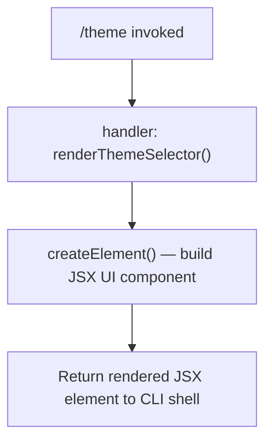

# `/theme`

> Analysis basis: CC v2.1.132 bundle.js (AST extraction + Claude interpretation)
> Minimum version: v2.1.132

---

## Overview

The `/theme` command allows the user to change the visual theme of the Claude Code CLI interface. It is registered as a `local-jsx` command, meaning its output is rendered as a JSX component directly in the terminal UI rather than producing plain-text output or invoking the agent. The handler constructs and returns a React element tree that presents theme selection to the user.

---

## Registration

| Field | Value |
|---|---|
| type | `local-jsx` |
| name | `theme` |
| description | `Change the theme` |
| module_id | `A5q` |
| load_inline | `true` |
| handler | `f$7` (resolved via `module_id` path) |
| loc_byte span | `11072126` – `11072257` |
| `loc_byte_end` | `11072257` |
| `arbor_handler.name` | `f$7` |
| `arbor_handler.kind` | `AsyncFunction` |
| `arbor_handler.resolution_path` | `module_id` |
| `arbor_handler.fqn` | `claude-2.1.132::f$7` |
| `arbor_handler.n_hits` | `0` |

Analysis basis: CC v2.1.132 bundle.js:+11072126

**Resolution note:** The handler `f$7` was resolved by Arbor via the `module_id` path (`A5q` → module exports → `f$7`). The `load_inline: true` flag indicates the module is loaded as an inline `load: () => Promise.resolve(...)` shape rather than a lazily-fetched separate chunk.

---

## Input Branching

The depth-2 call graph for this command reveals a single outbound call edge from the handler to a JSX element-creation function. No argument-dependent branching was detected within the traversal depth.



Because no conditional literals or branching identifiers were found in the depth-2 traversal, additional branching logic (e.g., handling a theme name argument vs. showing an interactive picker) cannot be confirmed from available data.

<!-- TODO: not found in depth-2 traversal; needs --depth 4 -->

---

## Behavioral Spec

### Theme UI Rendering

The handler is an `AsyncFunction` (`f$7`) that, when invoked by the CLI shell in response to `/theme`, constructs a JSX component tree via the framework's element-creation primitive (aliased here as `createElement`). The resulting element is handed back to the shell's local-jsx renderer, which mounts it inside the terminal UI.

```
async function renderThemeSelector(commandContext):
    uiElement = createElement(ThemeSelectorComponent, props)
    return uiElement
```

Because the command type is `local-jsx`, the shell does **not** forward input to the language model. The entire interaction is handled client-side within the CLI process.

Analysis basis: CC v2.1.132 bundle.js:+11071973

### Command Type Implications (`local-jsx`)

A `local-jsx` command bypasses the agent pipeline entirely:

```
on slashCommand("/theme"):
    if command.type == "local-jsx":
        element = await handler(context)
        mount(element, terminalUILayer)
        // No LLM call is made
    else:
        // would route to agent — not applicable here
```

This means `/theme` produces no assistant message, incurs no token usage, and does not appear in the conversation transcript as an agent turn.

---

## State & Side Effects

| Item | Detail |
|---|---|
| Telemetry | None detected in depth-2 traversal |
| Hook registration | None detected in depth-2 traversal |
| appState changes | Expected: theme preference persisted to CLI config; not confirmed at depth ≤ 2 <!-- TODO: not found in depth-2 traversal; needs --depth 4 --> |
| LLM invocation | None — `local-jsx` type routes away from agent pipeline |
| Sound | None detected |
| Conversation transcript | No assistant turn produced |

---

## Version History

| Version | Change |
|---|---|
| v2.1.132 | Initial analysis |

---

## Common Mistakes

1. **Expecting an agent response**: Because `/theme` is `local-jsx`, it never produces an AI-generated reply. If the theme picker does not appear, the issue lies in the JSX renderer layer, not the model pipeline.
2. **Passing a theme name as a text argument**: Whether `/theme <name>` is accepted as a direct argument (bypassing the interactive picker) cannot be confirmed from the available call graph depth. Treat argument-based invocation as unverified until a deeper traversal is available.
3. **Assuming telemetry fires on theme change**: No `tengu_*` telemetry events were found at depth ≤ 2. Do not rely on telemetry hooks to observe theme-change events without further analysis.
4. **Conflating `load_inline` with lazy-loading**: The `load_inline: true` flag means the module resolves synchronously via `Promise.resolve()`; there is no network fetch or dynamic import delay before the command becomes available.

---

## Appendix — Identifier Mapping

> For bundle debugging only. Identifiers change across versions.

| Identifier | Role |
|---|---|
| `f$7` | Primary async handler for `/theme`; constructs and returns the JSX theme-selector element (resolved via `module_id` path from module `A5q`) |
| `TqH` | JSX runtime namespace; `TqH.createElement` is the element-creation primitive called by the handler |