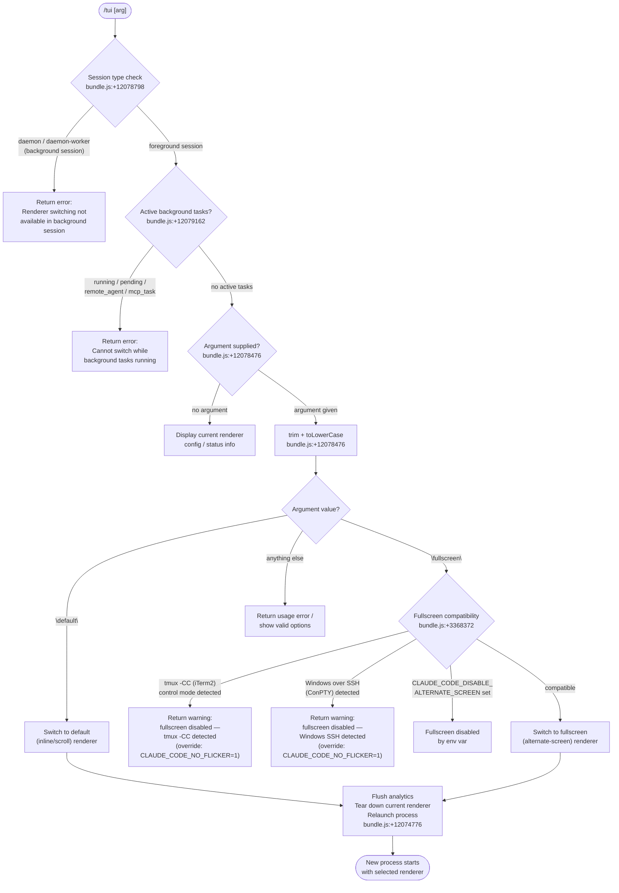

# `/tui`

> Analysis basis: CC v2.1.152 bundle.js (AST extraction + Claude interpretation)
> Minimum version: v2.1.152

---

## Overview

The `/tui` command switches the terminal UI renderer between `default` (inline/scrolling) and `fullscreen` (alternate-screen) modes during an active Claude Code session. It validates the current session context, checks environment compatibility, and — if all guards pass — tears down the current renderer, relaunches the process under the selected renderer mode, and restores state. When called without an argument it reports the current renderer configuration.

---

## Registration

| Field | Value |
|---|---|
| type | `local-jsx` |
| name | `tui` |
| description | `Set the terminal UI renderer (default \| fullscreen)` |
| argumentHint | `[default\|fullscreen]` |
| module_id | `vB1` |
| load_inline | `true` |
| loc_byte | `12080546` |
| loc_byte_end | `12080728` |
| loc_line | `10048` |
| arbor_handler.name | `xq5` |
| arbor_handler.fqn | `claude-2.1.152::xq5` |
| arbor_handler.kind | `AsyncFunction` |
| arbor_handler.resolution_path | `module_id` |
| arbor_handler.n_hits | `0` |

Analysis basis: CC v2.1.152 bundle.js:+12080546

---

## Input Branching

The command has more than three distinct execution paths (background-session guard, active-task guard, no-argument info path, invalid-argument path, `default` switch, `fullscreen` switch with sub-guards). A flowchart is mandatory.



---

## Behavioral Spec

### 1. Handler Entry — Argument Normalisation

The async handler (`xq5`) receives the raw argument string, trims whitespace, and converts it to lowercase before any further processing.

```
async function tuiCommandHandler(rawArg, context):
    arg = rawArg.trim().toLowerCase()          // bundle.js:+12078476
    sessionType = getSessionType(context)       // bundle.js:+12078558
    ...
```

Analysis basis: CC v2.1.152 bundle.js:+12078476

### 2. Background-Session Guard

The handler reads the session type from app state. If the process is running as a `daemon` or `daemon-worker` (background session), it immediately returns an error message directing the user to detach and run `/tui` from a foreground session.

```
function checkSessionType(sessionType):
    if sessionType in ["daemon", "daemon-worker"]:   // bundle.js:+12078798
        return ErrorResult(
            "Renderer switching isn't available in a background session " +
            "— press ← to detach and run /tui from a foreground session."
        )
    return OK
```

Analysis basis: CC v2.1.152 bundle.js:+12078798

### 3. Active-Task Guard

Before allowing a renderer switch the handler enumerates all active tasks via `Object.values` and checks each task's status field. If any task has status `"running"`, `"pending"`, `"remote_agent"`, or `"mcp_task"`, the switch is refused with a dedicated error message.

```
function checkActiveTasks(tasks):
    activeStatuses = ["running", "pending", "remote_agent", "mcp_task"]
                                                    // bundle.js:+12079162
    for task in Object.values(tasks):
        if task.status in activeStatuses:
            emit telemetry("tengu_tui_refused")     // bundle.js:+12079251
            return ErrorResult(
                "Cannot switch renderers while background tasks are running " +
                "— wait for them to finish (or stop them via /tasks), then run /tui again."
            )
    return OK
```

Analysis basis: CC v2.1.152 bundle.js:+12079123 – 12079292

### 4. No-Argument Info Path

When the argument is empty (or whitespace-only after trimming), the handler returns a JSX component describing the current renderer mode and available options rather than performing a switch.

```
function tuiInfoDisplay(currentRenderer, envFlags):
    // Reads allowed_tools, disallowed_tools, avoid_prompts, effort, model
    // from app state (bundle.js:+10666341)
    // Reads CLAUDE_CODE_NO_FLICKER, CLAUDE_CODE_DISABLE_ALTERNATE_SCREEN,
    // CLAUDE_CODE_FORCE_FULLSCREEN_UPSELL env vars (bundle.js:+12076752)
    return JSXComponent showing current renderer + hint to use
           "/tui default" or "/tui fullscreen"
```

Analysis basis: CC v2.1.152 bundle.js:+12078476, +12076752

### 5. Valid-Mode List Check

The handler consults an allowlist of valid renderer names. The list contains exactly `"fullscreen"` and `"default"`. If the normalised argument is not in this list, usage guidance is returned.

```
function validateRendererArg(arg):
    validModes = ["fullscreen", "default"]          // bundle.js:+3368706, +3368732
    if arg not in validModes:
        return ErrorResult("Usage: /tui [default|fullscreen]")
    return arg
```

Analysis basis: CC v2.1.152 bundle.js:+3368706

### 6. Fullscreen Compatibility Checks

When the target mode is `"fullscreen"`, the system compatibility checker (`fullscreenCompatibilityChecker`, internally `$q` → `rO_`/`oO_`/`ri`) runs several environment probes in order. Each check can veto fullscreen with a specific reason code.

```
function fullscreenCompatibilityChecker(envContext):
    // Check 1 — tmux -CC (iTerm2 control-mode)
    if isInTmuxControlMode():                       // bundle.js:+3368372
        // Spawns: tmux display-message -p "#{client_control_mode}"
        // timeout 2000 ms (bundle.js:+3367700)
        return Veto("tmux_cc_auto_off",
            "fullscreen disabled: tmux -CC (iTerm2 integration mode) detected " +
            "· set CLAUDE_CODE_NO_FLICKER=1 to override")

    // Check 2 — Windows over SSH (ConPTY)
    if platform == "windows" and isSSHSession():    // bundle.js:+3368558
        return Veto("win_ssh_auto_off",
            "fullscreen disabled: Windows over SSH (ConPTY re-rendering) detected " +
            "· set CLAUDE_CODE_NO_FLICKER=1 to override")

    // Check 3 — explicit env-var override
    if env.CLAUDE_CODE_DISABLE_ALTERNATE_SCREEN:    // bundle.js:+12076777
        return Veto("env_off")

    // Check 4 — bg_forced_on / env_on / settings_on / gb flags
    // (bundle.js:+3369125 – 3369510)
    resolveFromFlagPriority(...)

    return Compatible
```

Analysis basis: CC v2.1.152 bundle.js:+3368153, +3368372, +3368558

### 7. Renderer Relaunch Sequence

When a compatible target mode is confirmed, the handler orchestrates a coordinated teardown and relaunch (`yPH` — the relaunch orchestrator):

```
async function rendererRelaunch(targetMode, context):
    // Step 1 — record uptime for diagnostics
    uptimeMs = Math.round(process.uptime() * 1000)  // bundle.js:+12079802

    // Step 2 — flush analytics with timeout
    await Promise.race([
        analyticsFlush(),                            // "analytics flush timeout"
        timeout(30000)                               // bundle.js:+12074797
    ])

    // Step 3 — drain output queue
    await drainOutputQueue()                         // bundle.js:+12074848

    // Step 4 — tear down current renderer
    tearDownCurrentRenderer()                        // bundle.js:+12074758
    // Writes escape sequences \x1b7 / \x1b8 (save/restore cursor)
    // bundle.js:+3705105

    // Step 5 — wait for all pending operations
    await Promise.all([...])                         // bundle.js:+12074776

    // Step 6 — build spawn arguments for new process
    // Propagates --add-dir, --allow-dangerously-skip-permissions,
    // --effort, --permission-mode, --resume flags
    // bundle.js:+12076254, +12076392, +12076534, +12074730
    args = buildRelunchArgs(targetMode, context)

    // Step 7 — remove old signal handlers, register new ones
    process.removeAllListeners(["SIGINT","SIGTERM","SIGHUP"])
                                                     // bundle.js:+12075270
    // Step 8 — execve / spawnSync replacement
    // Uses bun:ffi execve on macOS (/usr/lib/libSystem.B.dylib)
    // or libc.so.6 on Linux (bundle.js:+12073878, +12073907)
    replaceSelf(args)

    emit telemetry("tengu_tui_command")              // bundle.js:+12079723
```

Analysis basis: CC v2.1.152 bundle.js:+12074776, +12075299, +12073826

### 8. Settings Loading (Side-Path)

During handler initialisation the settings subsystem (`settingsLoader`, internally `sm` / `pi8`) is invoked. It loads from disk in a specific priority order: `flagSettings` → `policySettings` → `userSettings` → `projectSettings` → `localSettings` → `SDK inline settings`.

```
function loadSettingsFromDisk():
    emit mark("loadSettingsFromDisk_start")          // bundle.js:+1221823
    log("info", "settings_load_started")             // bundle.js:+1218478
    layers = [
        "flagSettings",                              // bundle.js:+1210858
        "policySettings",                            // bundle.js:+1210880
        "userSettings",      // ~/.claude/settings.json  bundle.js:+1214066
        "projectSettings",                           // bundle.js:+1214117
        "localSettings",     // settings.local.json  bundle.js:+1214139
        "SDK inline settings"                        // bundle.js:+1213138
    ]
    merge(layers)
    log("info", "settings_load_completed")           // bundle.js:+1219203
    emit mark("loadSettingsFromDisk_end")            // bundle.js:+1221879
```

Analysis basis: CC v2.1.152 bundle.js:+1221823, +1221879

---

## State & Side Effects

| Item | Detail |
|---|---|
| Telemetry — `tengu_tui_refused` | Fired when a renderer switch is blocked by the active-task guard (bundle.js:+12079251) |
| Telemetry — `tengu_tui_command` | Fired after a successful renderer switch relaunch (bundle.js:+12079723) |
| Telemetry — `tengu_amber_creek` | Fired during fullscreen-mode eligibility evaluation (bundle.js:+3368889) |
| Telemetry — `tengu_pewter_brook` | Fired during fullscreen-mode eligibility evaluation (bundle.js:+3368797) |
| Telemetry — `tengu_feature_ok` | Fired on feature-flag happy path (bundle.js:+964519) |
| Telemetry — `tengu_feature_sad` | Fired on feature-flag sad path (bundle.js:+964654) |
| Telemetry — `tengu_feature_bad` | Fired on feature-flag error path (bundle.js:+964577) |
| Telemetry — `tengu_scroll_summary` | Fired during scrollback/alternate-screen tear-down (bundle.js:+5317860) |
| Telemetry — `tengu_bg_dispatch_sigkill_escalate` | Fired when background task kill escalates to SIGKILL (bundle.js:+15382331) |
| Telemetry — `tengu_bg_dispatch_low_mem` | Fired when background dispatcher detects low memory (bundle.js:+15382910) |
| Telemetry — `tengu_bg_spare_enable` | Fired when spare background worker is enabled (bundle.js:+15383605) |
| Telemetry — `tengu_bg_spare_claim` | Fired when spare worker is claimed (bundle.js:+15383726) |
| Telemetry — `tengu_bg_spare_claim_fail` | Fired on spare-worker claim failure (bundle.js:+15383989) |
| Telemetry — `tengu_daemon_control` | Fired on daemon lifecycle transitions (bundle.js:+15418464) |
| appState changes | Reads `allowed_tools`, `disallowed_tools`, `avoid_prompts`, `effort`, `model` from app state before relaunch (bundle.js:+10666341) |
| Process replacement | Uses `execve` via `bun:ffi` (macOS: `/usr/lib/libSystem.B.dylib`, Linux: `libc.so.6`) to replace the current process image (bundle.js:+12073878) |
| Signal handlers | Removes all listeners for `SIGINT`, `SIGTERM`, `SIGHUP` then re-registers them before `execve` (bundle.js:+12075270) |
| Analytics flush | Waits up to 30 000 ms for analytics drain before relaunch (bundle.js:+12074797) |
| Output drain | Drains the output queue with a `CMA.drain` call; labelled `"cleanup timeout"` (bundle.js:+12074848, +12074859) |
| Escape sequences | Emits `\x1b7` / `\x1b8` (DECSC/DECRC — save/restore cursor) during renderer teardown (bundle.js:+3705105) |
| Env vars read | `CLAUDE_CODE_NO_FLICKER`, `CLAUDE_CODE_DISABLE_ALTERNATE_SCREEN`, `CLAUDE_CODE_FORCE_FULLSCREEN_UPSELL` (bundle.js:+12076752) |
| tmux probe | Spawns `tmux display-message -p "#{client_control_mode}"` with a 2 000 ms timeout to detect iTerm2 control mode (bundle.js:+3367626, +3367700) |
| Hook registration | Registers `beforeExit` and `exit` process listeners for cleanup (bundle.js:+12075445) |
| Sound | None observed in traversal |

---

## Version History

| Version | Change |
|---|---|
| v2.1.152 | Initial analysis |

---

## Common Mistakes

1. **Running `/tui` inside a background/daemon session.** The command immediately returns an error. Detach to a foreground session first (press `←`) and re-run `/tui` there.
2. **Running `/tui fullscreen` while background tasks are active.** The switch is blocked until all `running`/`pending`/`remote_agent`/`mcp_task` tasks finish. Use `/tasks` to inspect and stop them first.
3. **Expecting fullscreen to work in tmux -CC (iTerm2 integration) mode without the override.** The tmux control-mode probe auto-disables fullscreen. Set `CLAUDE_CODE_NO_FLICKER=1` to override.
4. **Expecting fullscreen to work over Windows SSH (ConPTY) without the override.** Same auto-disable applies; same `CLAUDE_CODE_NO_FLICKER=1` override.
5. **Misspelling the argument.** Only `default` and `fullscreen` (case-insensitive) are accepted; any other value returns a usage error.
6. **Interrupting the session during the relaunch window.** The process is fully replaced via `execve`; interrupting between analytics flush and `execve` may leave the terminal in an inconsistent state.

---

## Appendix — Identifier Mapping

> For bundle debugging only. Identifiers change across versions.

| Identifier | Role |
|---|---|
| `xq5` | Main `/tui` command handler (AsyncFunction) |
| `A` | Generic local variable / argument intermediary |
| `M` | Local variable used in renderer/session context |
| `q` | Local collection variable (e.g. task set) |
| `L` | Local collection variable (e.g. listener set) |
| `s_` | Settings loader bootstrap |
| `sm` | Settings merge orchestrator |
| `Lk` | Settings layer key resolver |
| `Z9` | Performance mark recorder |
| `Sm` | Module importer (calls `require` for `perf_hooks`) |
| `pi8` | Settings load-from-disk implementation |
| `v8` | Log file writer (appendFileSync + mkdirSync) |
| `QS6` | Settings serialiser helper |
| `t76` | Flag-settings collector |
| `mNA` | User-settings file reader |
| `K` | Column formatter (padEnd, map) |
| `m3H` | Project-settings path resolver |
| `Gg` | Local-settings reader |
| `bNA` | SDK inline settings handler |
| `Tg` | Settings registry initialiser |
| `z_` | Process-info helper |
| `pq6` | Settings registry sub-key A |
| `jx8` | Settings registry sub-key B |
| `bq6` | Settings registry sub-key C |
| `PWH` | Settings registry sub-key D |
| `WWH` | Settings registry sub-key E |
| `Uq6` | Settings registry sub-key F |
| `C3H` | Settings registry sub-key G |
| `b3H` | Settings registry sub-key H |
| `hi8` | Settings registry sub-key I |
| `PNA` | Settings registry sub-key J |
| `Bn` | Settings registry sub-key K |
| `e76` | WSL environment detector |
| `gS6` | Settings post-load hook |
| `$q` | Fullscreen-eligibility checker orchestrator |
| `efH` | Local-agent detection check |
| `oO_` | Background-mode string resolver |
| `qK` | `"no"` / `"off"` colour-env normaliser |
| `uH` | Generic string coercion helper |
| `ri` | OS/terminal environment reader |
| `J97` | tmux control-mode probe (spawnSync) |
| `j97` | Terminal name prefix check (`startsWith`) |
| `N` | Log writer / file append utility |
| `OyK` | Debug-log formatter |
| `xMA` | Log destination resolver |
| `H` | Generic context / process handle |
| `CH` | JSON serialiser wrapper |
| `_` | Generic utility reference |
| `j4` | REDACTED-string sanitiser |
| `Y$A` | Sensitive-value mapper |
| `VxH` | Stdout write helper |
| `e3A` | Raw write wrapper |
| `DyK` | File-based logger |
| `obH` | Buffered output writer |
| `cqH` | Log-line formatter |
| `Q6` | Error classifier / logger |
| `Q96` | Log-rotation helper |
| `G$A` | Log path builder |
| `W$A` | Log file rotator |
| `YyK` | Async log appender |
| `tq` | Async-hooks register wrapper |
| `rO_` | Windows-SSH detection helper |
| `X97` | Fullscreen render-mode bootstrap |
| `E6` | Render-session manager |
| `hO6` | Render-session sub-component A |
| `SO6` | Render-session sub-component B |
| `oe` | Render-output formatter |
| `P68` | Render-session dedup guard |
| `x6` | Render-event dispatcher |
| `Cv8` | CLI-argument builder for relaunch |
| `vq6` | Argument accumulator |
| `V_` | App-state allowed/disallowed tools reader |
| `uT8` | Allowed-tools state accessor |
| `sA` | State atom accessor |
| `mT8` | Disallowed-tools state accessor |
| `kO` | App-state effort/model reader |
| `u9` | Session-type classifier |
| `_OH` | Daemon/daemon-worker string constants |
| `c` | Feature-flag evaluator |
| `WzH` | Fullscreen environment-flag resolver |
| `l_` | Main relaunch / process-restart orchestrator |
| `zO` | Config-merge helper |
| `mi8` | Settings snapshot builder |
| `OP` | File-read helper |
| `xn` | Encoding-aware file reader |
| `S3` | File-type/stat checker |
| `LU6` | BOM-aware reader |
| `MU6` | Encoding sniffer |
| `j8` | Error-code classifier |
| `L8` | Structured-error builder |
| `pn8` | Timestamp recorder |
| `DGH` | Config-directory resolver |
| `UB6` | Settings-path builder |
| `z76` | Atomic file writer (with temp + rename) |
| `O` | Symlink / stat object |
| `k8` | Status enum |
| `Wz` | Cache clearer |
| `lU6` | Gitignore-aware file writer |
| `b6` | Async-local-storage context getter |
| `KU6` | Store getter |
| `Zn8` | Git check-ignore runner |
| `cU6` | Git-ignored path checker |
| `T_` | Git command executor |
| `d64` | Path normaliser (home-dir expansion) |
| `ZVA` | Git ls-files checker |
| `EVA` | Gitignore-exclude-file reader |
| `Ob` | Claude config directory path builder |
| `SH` | Process stdout stream |
| `H8` | Process stderr stream |
| `mH` | Process stdin stream |
| `hH` | Error logger |
| `n_` | Error-message formatter |
| `V1` | Message renderer |
| `mGA` | Message formatter |
| `UtK` | Rolling error-log buffer |
| `SN` | Terminal-capability detector |
| `Nz6` | Terminal-info reader |
| `gJ` | Terminal name resolver |
| `pz_` | IDE-terminal detector (Cursor/VSCode) |
| `O77` | IDE version checker |
| `NzH` | Terminal-capability probe |
| `z77` | Terminal-column-count calculator |
| `Uz_` | Environment variable reader |
| `Qb` | JSX renderer bootstrap |
| `QS` | JSX render-tree builder |
| `Y87` | JSX element factory |
| `gO` | Analytics/telemetry gate |
| `C$` | JSX context provider |
| `q76` | JSX message formatter |
| `m9` | Telemetry event emitter |
| `w99` | Telemetry payload builder |
| `z2_` | Telemetry serialiser |
| `jx` | Telemetry transport |
| `f2_` | Telemetry persistence reader |
| `OvH` | Telemetry filter |
| `AKH` | Telemetry string helper |
| `VB1` | Relaunch-process orchestrator (main) |
| `yPH` | Relaunch implementation (execve sequence) |
| `Lh` | Binary-path resolver |
| `kP8` | Versioned binary path builder |
| `Q8H` | Local-bin path builder |
| `If` | Array normaliser |
| `uI` | Working-directory resolver |
| `y6` | Promise-rejection handler |
| `pv` | Promise utility |
| `uJ6` | Interval clearer |
| `SZ_` | clearInterval wrapper |
| `kNH` | Renderer teardown (unmount + write) |
| `nS` | Alternate-screen exit writer |
| `s_8` | Cursor-save/restore writer |
| `EL8` | Scroll-summary emitter |
| `_Z` | Scroll-state reader |
| `xD9` | Scroll-summary calculator |
| `bD9` | Scroll-metric aggregator |
| `BL` | Timeout-race helper |
| `vT` | Hook-registration wrapper |
| `I4` | Async-hook installer |
| `abH` | Output-queue drainer (CMA.drain) |
| `VL8` | Parallel cleanup runner |
| `n8` | Abortable timeout promise |
| `Xt_` | Spawn-argument assembler |
| `rK` | Process-context helper |
| `XB1` | execve / dlopen wrapper (bun:ffi) |
| `$` | Child-process registry |
| `w` | Background-process dispatcher |
| `f` | Process-manager |
| `z` | Signal-routing helper |
| `GH` | String coercion wrapper |
| `MP` | Relaunch-error file writer |