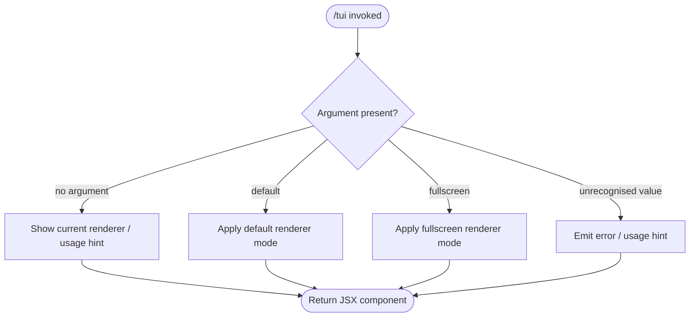

# `/tui`

> Analysis basis: CC v2.1.144 bundle.js (AST extraction + Claude interpretation)
> Minimum version: v2.1.144

---

## Overview

The `/tui` command allows the user to switch the terminal UI renderer between available display modes. It accepts a single optional argument — either `default` or `fullscreen` — and applies the selected rendering mode to the running Claude Code session. Because the command is registered as `local-jsx`, its output is rendered inline within the existing TUI pipeline rather than as a plain-text response.

---

## Registration

| Field | Value |
|---|---|
| type | `local-jsx` |
| name | `tui` |
| description | `Set the terminal UI renderer (default \| fullscreen)` |
| argumentHint | `[default\|fullscreen]` |
| module\_id | `c2q` |

Analysis basis: CC v2.1.144 bundle.js:+11413342

---

## Input Branching

The argument hint `[default|fullscreen]` is the only structural evidence available from the registration record. Because the depth-2 call-graph traversal returned no call edges, the full branching logic inside module `c2q` cannot be verified from this extraction pass.



> **Note:** Paths C, D, E, and F are inferred solely from the registered `argumentHint` value `[default|fullscreen]`. They are not confirmed by call-graph or literal evidence. See the module note below.

Analysis basis: CC v2.1.144 bundle.js:+11413342

---

## Behavioral Spec

### Renderer Mode Selection

```
function applyTuiMode(argument):
    mode = normalise(argument)          // trim whitespace, lower-case

    if mode is absent or empty:
        return renderUsageComponent()   // display current mode + valid options

    if mode == "default":
        setRendererMode(DEFAULT)
        return renderConfirmationComponent("default")

    if mode == "fullscreen":
        setRendererMode(FULLSCREEN)
        return renderConfirmationComponent("fullscreen")

    // unrecognised value
    return renderErrorComponent(
        received  = mode,
        expected  = ["default", "fullscreen"]
    )
```

> **Caveat:** The pseudocode above is derived entirely from the registered `argumentHint` string. No entry functions, literals, or call edges were recovered for module `c2q` at depth ≤ 2. The actual implementation may differ.

<!-- TODO: not found in depth-2 traversal; needs --depth 4 -->

Analysis basis: CC v2.1.144 bundle.js:+11413342

---

## State & Side Effects

| Item | Detail |
|---|---|
| Telemetry | None detected at depth ≤ 2 traversal |
| Hook registration | <!-- TODO: not found in depth-2 traversal; needs --depth 4 --> |
| appState changes | <!-- TODO: not found in depth-2 traversal; needs --depth 4 --> |
| Sound | <!-- TODO: not found in depth-2 traversal; needs --depth 4 --> |

> The telemetry, hook, and appState rows are empty because the depth-2 AST traversal of module `c2q` returned no call edges, no literals, and no telemetry event strings. This is explicitly flagged in the extraction note: `"no entry functions found for module 'c2q'"`.

Analysis basis: CC v2.1.144 bundle.js:+11413342

---

## Version History

| Version | Change |
|---|---|
| v2.1.144 | Initial analysis — registration confirmed; implementation internals not reachable at depth ≤ 2 |

---

## Common Mistakes

1. **Passing an unrecognised renderer name** — Only `default` and `fullscreen` appear in the registered argument hint. Any other value is likely rejected. Always check the hint with `/tui` (no argument) before scripting.
2. **Expecting a plain-text response** — The command is registered as `local-jsx`. Its output is a JSX component rendered by the TUI pipeline, not a raw string. Piping or capturing stdout may not capture the rendered result as expected.
3. **Assuming the mode persists across sessions** — Whether the selected renderer mode is saved to persistent configuration or is session-scoped only cannot be confirmed from the available extraction data. Do not rely on cross-session persistence without verification.
4. **Calling `/tui` inside a non-interactive context** — Because the command drives the terminal renderer itself, invoking it from a scripted or headless pipeline may have no visible effect or may produce an error.

---

## Appendix — Identifier Mapping

> For bundle debugging only. Identifiers change across versions.

| Identifier | Role |
|---|---|
| *(none)* | No obfuscated identifiers were recovered for module `c2q` at depth ≤ 2. The extraction note states: `"no entry functions found for module 'c2q'"`. Run a deeper traversal (`--depth 4` or higher) to populate this table. |