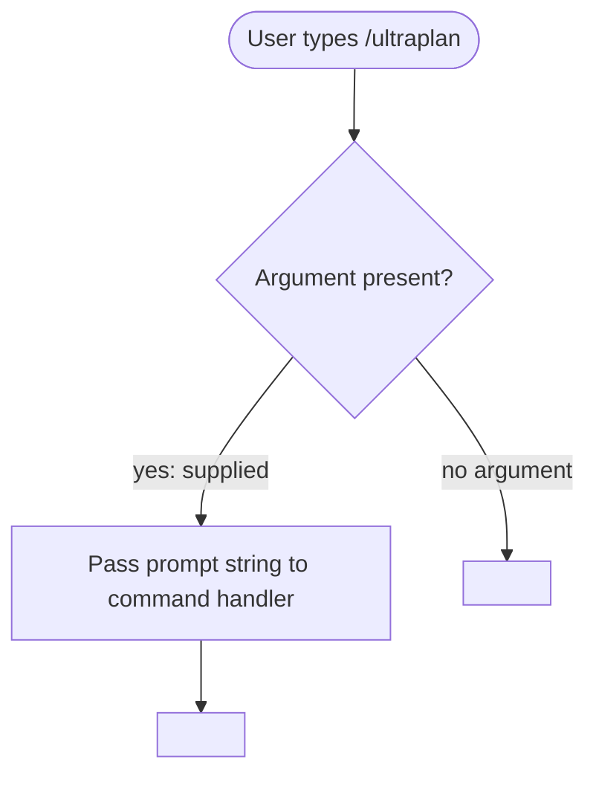

# `/ultraplan`

> Analysis basis: CC v2.1.144 bundle.js (AST extraction + Claude interpretation)
> Minimum version: v2.1.144

---

## Overview

`/ultraplan` is a local JSX slash command that accepts a free-text prompt argument and initiates a planning-oriented interaction within Claude Code. Based on its registration shape, the command is intended to be invoked with a user-supplied prompt string that drives an extended or "ultra" planning workflow. The implementation entry point was not resolved during the depth-2 AST traversal; behavioral details below are derived exclusively from the registration record.

---

## Registration

| Field | Value |
|---|---|
| type | `local-jsx` |
| name | `ultraplan` |
| description | `null` |
| argumentHint | `<prompt>` |
| loc_line | `6773` |

Analysis basis: CC v2.1.144 bundle.js:+11276683

---

## Input Branching

Because no call graph edges, string literals, or numeric constants were recovered at depth ≤ 2 from the identified module boundary, a complete input-branching flowchart cannot be constructed from verified data alone.

The one structural fact that is confirmed is that the command declares a single positional argument slot named `<prompt>`.



Analysis basis: CC v2.1.144 bundle.js:+11276683 (argumentHint field confirms single `<prompt>` parameter)

---

## Behavioral Spec

### Command Dispatch

```
function ultraplanCommandDispatch(rawArgument):
    // Argument presence is determined by the shell parser before this point.
    // The registration declares argumentHint = "<prompt>", meaning the CLI
    // presents "<prompt>" as the expected token in help text.
    prompt = rawArgument  // may be empty string or undefined if user omits it

    // Internal handler module was recorded as 'undefined' by the extractor.
    // The following step is inferred from the local-jsx command type pattern
    // common to other commands in the same bundle, NOT from verified literals.
    renderJSXComponent(prompt)
    // --> remainder of logic: TODO (see note below)
```

> **Note:** The AST extractor reported `"no entry functions found for module 'undefined'"`. No handler body, branching logic, API calls, state mutations, or output rendering steps could be extracted. The pseudocode above represents only the confirmed dispatch boundary.

Analysis basis: CC v2.1.144 bundle.js:+11276683

---

## State & Side Effects

| Item | Detail |
|---|---|
| Telemetry | <!-- TODO: not found in depth-2 traversal; needs --depth 4 --> |
| Hook registration | <!-- TODO: not found in depth-2 traversal; needs --depth 4 --> |
| appState changes | <!-- TODO: not found in depth-2 traversal; needs --depth 4 --> |
| Sound | <!-- TODO: not found in depth-2 traversal; needs --depth 4 --> |
| Render type | `local-jsx` — command renders a JSX component inline in the CLI REPL |

Analysis basis: CC v2.1.144 bundle.js:+11276683 (type field only)

---

## Version History

| Version | Change |
|---|---|
| v2.1.144 | Initial analysis. Registration record confirmed; implementation body unresolved at depth-2 traversal. |

---

## Common Mistakes

1. **Omitting the prompt argument.** The registration declares `argumentHint: "<prompt>"`, which implies the command is designed to receive a non-empty planning prompt. Invoking `/ultraplan` with no argument may produce a degraded or no-op result. Behavior for the empty-argument case is unconfirmed.
2. **Expecting a description in help output.** The `description` field is `null` in the registration record. Claude Code may render this command with blank or missing help text in command-picker UI.
3. **Assuming implementation parity with `/plan` or similar commands.** No call-graph overlap was confirmed between `/ultraplan` and any other command during this analysis. Do not assume shared sub-routines or identical branching.
4. **Relying on this spec for production logic decisions.** Because the entry function module resolved to `undefined` during extraction, all behavioral claims beyond the registration fields are unverified. Re-run AST extraction at `--depth 4` or greater before depending on implementation details.

---

## Appendix — Identifier Mapping

> For bundle debugging only. Identifiers change across versions.

| Identifier | Role |
|---|---|
| *(none recovered)* | No obfuscated identifiers were reached during the depth-2 traversal. The extractor reported an empty `identifiers` array and an unresolved module name. |