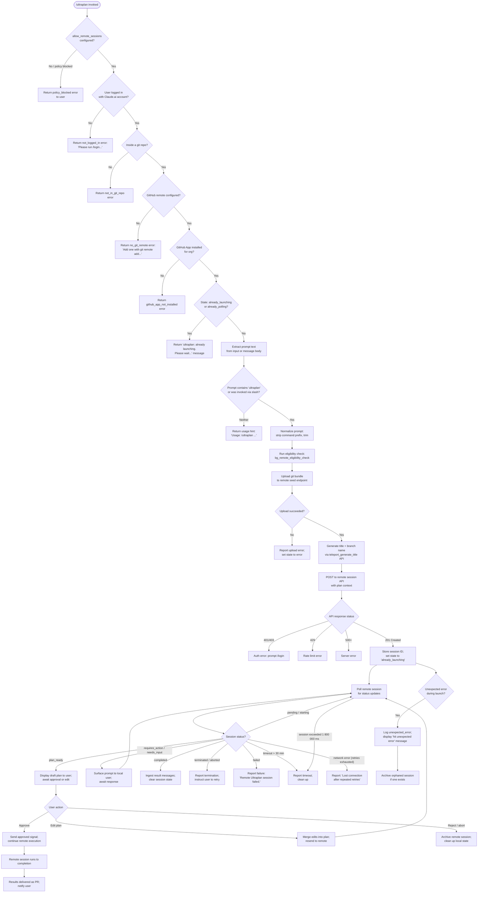

# `/ultraplan`

> Analysis basis: CC v2.1.152 bundle.js (AST extraction + Claude interpretation)
> Minimum version: v2.1.152

---

## Overview

`/ultraplan` launches a remote Claude Code web session that drafts an agentic plan on the user's behalf. The user can review, edit, and approve the plan locally before execution continues. When approved, the remote session proceeds and delivers results as a pull request on GitHub.

---

## Registration

| Field | Value |
|---|---|
| type | `local-jsx` |
| name | `ultraplan` |
| description | `" ... · Claude Code on the web drafts a plan you can edit and approve. See ..."` |
| argumentHint | `<prompt>` |
| load_inline | `true` |
| load_ident | `u_5` |
| loc_byte | `11917699` |
| loc_byte_end | `11917943` |
| loc_line | `9825` |
| arbor_handler.name | `u_5` |
| arbor_handler.fqn | `claude-2.1.152::u_5` |
| arbor_handler.kind | `AsyncFunction` |
| arbor_handler.resolution_path | `load_ident` |
| arbor_handler.n_hits | `1` |

Analysis basis: CC v2.1.152 bundle.js:+11917699

---

## Input Branching

The command has significantly more than three distinct execution paths (precondition failures, already-launching guard, prompt extraction, plan-drafting flow, remote session lifecycle, approval/rejection, timeout, and error recovery). A Mermaid flowchart is used below.



---

## Behavioral Spec

### Handler Entry Point — `u_5` (main async handler)

Analysis basis: CC v2.1.152 bundle.js:+11915843

```
async function ultraplanHandler(context):
    // 1. Read app state
    appState = context.getAppState()

    // 2. Check remote sessions policy (allow_remote_sessions)
    if not checkRemoteSessionsAllowed(appState):
        return policyBlockedError()

    // 3. Eligibility pre-check (login, git repo, GitHub remote, app install)
    eligibility = await runEligibilityCheck(context)  // → SA1 / bg_remote_eligibility_check
    if eligibility has failure:
        return eligibilityError(eligibility.reason)
        // Reasons: not_logged_in | not_in_git_repo | no_git_remote
        //          | github_app_not_installed | policy_blocked

    // 4. Guard against duplicate launches
    if appState.ultraplanState in ["already_polling", "already_launching"]:
        return message("ultraplan: already launching. Please wait for the session to start.")

    // 5. Extract and normalize prompt
    rawPrompt = extractPromptText(context.input)       // → UW8 / VF_ parsing
    if rawPrompt is empty or invalid:
        return usageHint(
            "Usage: /ultraplan <prompt>, or include \"ultraplan\" anywhere in your prompt"
        )

    // 6. Set state to 'already_launching'; emit tengu_ultraplan_launched telemetry
    context.setAppState({ultraplanState: "already_launching"})

    // 7. Upload git bundle seed
    uploadResult = await uploadGitBundleSeed(context)  // → jm_ / teleport_git_bundle_upload

    // 8. Generate title and branch name
    meta = await generateTitleAndBranch(rawPrompt)     // → iPL / teleport_generate_title

    // 9. POST session creation request
    session = await createRemoteSession(meta, rawPrompt, context)  // → pc / s_1

    // 10. Poll session for status
    await pollRemoteSession(session.id, context)       // → S_5 / gm1

    // 11. On completion: ingest results, update appState, archive session
    finalizeSession(session, context)

    // 12. On unexpected error: log, show error message, try to archive orphaned session
    on error:
        logError("unexpected_error")
        display("Ultraplan hit an unexpected error during launch. Wait for the user's next instructions.")
        tryArchiveOrphanedSession(session)
```

---

### Prompt Extraction — `promptNormalizer` (via `UW8` / `VF_`)

Analysis basis: CC v2.1.152 bundle.js:+11915843, +9676984, +9676778

```
function extractPromptText(rawInput):
    // VF_: scan for invocation patterns
    if rawInput.startsWith(knownPrefix):
        slice off prefix                    // index 0 branch
    matches = rawInput.matchAll(/ultraplan/gi)   // regex flag "gi" literal at +9676432
    if matches found:
        extract surrounding text into segments
        push segments to queue

    // UW8: normalize the result
    text = rawInput.slice(normalizedStart)       // +9677012
    text = text.replace(captureGroups, "$1$2")  // replacement literal "$1$2" at +9677109
    text = text trimmed to first 5 lines        // numeric literal 5 at +9677132

    // Clean up: lowercase where needed (A.replace → M.toLowerCase, truncate at 40 chars)
    // 40 char limit for display/branch label at +15408364
    return normalizedText
```

---

### Eligibility Check — `eligibilityChecker` (via `SA1` / `m9`)

Analysis basis: CC v2.1.152 bundle.js:+8843348, +4697645

```
async function runEligibilityCheck(context):
    emit telemetry("bg_remote_eligibility_check")

    // Check 1: Login status
    loginInfo = await getLoginInfo()                // → m9 / AKH
    if not loginInfo.isLoggedIn:
        return failure("not_logged_in",
            "Please run /login and sign in with your Claude.ai account (not Console).")

    // Check 2: Git repository
    gitStatus = await detectGitRepo()              // → z2_ / f2_ / O99.readFileSync
    if not gitStatus.inRepo:
        return failure("not_in_git_repo")

    // Check 3: GitHub remote
    remoteUrl = await getGitRemoteUrl()            // → JS / git config --get remote.origin.url
    if not remoteUrl:
        return failure("no_git_remote",
            "Background tasks require a GitHub remote. Add one with `git remote add origin REPO_URL`.")

    // Check 4: org policy (allow_remote_sessions feature flag)
    if allow_product_feedback or enterprise/team tier required:
        check tier membership                      // literals "enterprise", "team", "firstParty"
    if policy disables remote sessions:
        return failure("policy_blocked",
            "Remote sessions are disabled by your organization's policy. Contact your admin to enable them.")

    // Check 5: GitHub App installation
    appInstalled = await checkGithubAppInstalled(loginInfo, orgUuid)  // → EyH
    if not appInstalled:
        return failure("github_app_not_installed")
        // Note: requires github.com remote (literal at +8844009); BYOC environments noted at +8843721

    return success()
```

---

### Git Bundle Upload — `gitBundleUploader` (via `jm_`)

Analysis basis: CC v2.1.152 bundle.js:+8765247

```
async function uploadGitBundleSeed(context):
    emit telemetry("teleport_git_bundle_upload")

    // Verify git state
    if not inGitRepo():
        throw Error("Not in a git repository")   // literal at +8765337

    // Create seed stash ref
    run git ["update-ref", "refs/seed/stash", "-d"]  // literal "refs/seed/stash" at +8765377
    run git ["update-ref", "refs/seed/root", ...]    // literal "refs/seed/root" at +8765395

    // Check for commits
    refCount = run git ["for-each-ref", "--count=1", "refs/"]  // literals at +8765479-506
    if refCount == 0:
        throw Error("Repository has no commits yet")  // literal at +8765683

    stashRef = run git ["stash", "create"]           // literals at +8765761, +8765769

    // Build bundle file
    bundleFile = writeTempFile("ccr-seed.bundle")    // literals at +8766564, +8766575

    // Upload with fallback strategies: head → fallback_head → squashed → fallback_squashed
    for strategy in ["head", "fallback_head", "squashed", "fallback_squashed"]:
        result = attemptUpload(bundleFile, strategy)
        if result.status == 200:                     // literal at +8766089
            emit telemetry("tengu_ccr_bundle_upload")
            return success(strategy)

    if all strategies failed:
        emit("upload_failed")
        throw uploadError()

    // Cleanup: unlink temp bundle via KtH.unlink
    unlink(bundleFile)
```

---

### Session Creation — `remoteSessionCreator` (via `pc`)

Analysis basis: CC v2.1.152 bundle.js:+8779696

```
async function createRemoteSession(meta, prompt, context):
    // Resolve environment
    environments = await listEnvironments()          // → qa / teleport_environments_list
    if environments is empty:
        // Auto-create default cloud environment
        env = await createDefaultEnvironment()       // → esH / teleport_default_environment_create
        // Default env: anthropic_cloud, python 3.11, node 20, /home/user
        if creation fails:
            warn("Could not create a cloud environment. Set one up at https://claude.ai/code/onboarding?magic=env-setup")

    // Resolve bundle transfer mode (emit tengu_teleport_bundle_mode)
    bundleMode = resolveBundleMode()                 // one of: "bundle" | "explicit_env_bundle"
                                                     // | "git_repository" | "no_git_at_all"
                                                     // | "explicit_source_url"

    // Emit source decision telemetry
    emit telemetry("tengu_teleport_source_decision")

    // Set API headers
    headers = {
        "Content-Type": "application/json",          // literal at +3146851
        "anthropic-version": "2023-06-01",           // literal at +3146905
        "anthropic-beta": "ccr-byoc-2025-07-29",    // literal at +8780514
        "x-organization-uuid": orgUuid               // literal at +8780536
    }

    // Determine permission mode: "set" or "unset" (literals at +8780006, +8780012)
    permMode = appState.permissionMode ?? "none"     // literal "none" at +8781705

    // POST session creation
    response = await apiClient.post(sessionEndpoint, {
        prompt: prompt,
        title: meta.title,
        branch: meta.branch,
        bundleMode: bundleMode,
        permissionMode: permMode,
        source: "cli",                               // literal at +11914726
        agentType: "remote_agent"                    // literal at +8850159
    })

    // Validate response
    if response.status == 201:                       // literal at +8781848
        if not response.data.sessionId:
            throw Error("Server returned a malformed session response (no session id)")
        emit telemetry("tengu_ccr_session_link")
        return {id: response.data.sessionId}

    if response.status in [401, 403]:
        return authError()
    if response.status == 429:
        return rateLimitError()
    if response.status >= 500:
        return serverError()
```

---

### Session Poller — `sessionPoller` (via `S_5` / `gm1`)

Analysis basis: CC v2.1.152 bundle.js:+11909215, +11899607

```
async function pollRemoteSession(sessionId, context):
    emit telemetry("tengu_ultraplan_timeout_seconds")  // records configured timeout (5400s literal at +11908781)

    startTime = Date.now()
    MAX_DURATION_MS = 1800000    // 30 minutes (literal at +8851844)
    POLL_INTERVAL_MS = 1000      // 1 second (literal at +8851837)

    while true:
        if Date.now() - startTime > MAX_DURATION_MS:
            throw Error("remote session exceeded 30 minutes")

        sessionData = await fetchSession(sessionId)  // → xA1 via byH

        match sessionData.status:
            case "pending" | "starting":
                await sleep(POLL_INTERVAL_MS)
                continue

            case "plan_ready":
                emit telemetry("tengu_ultraplan_plan_ready")
                // Display draft plan prefix "Here is a draft plan to refine:" (literal at +11909088)
                plan = assemblePlan(sessionData)     // → h_5 / y_5
                userDecision = await awaitUserApproval(plan)  // → Yh / xNL / uNL

                if userDecision == "approved":
                    emit telemetry("tengu_ultraplan_approved")
                    sendApprovalSignal(sessionId)
                    continue
                elif userDecision == "edited":
                    mergePlanEdits(plan, userDecision.edits)
                    sendApprovalSignal(sessionId)
                    continue
                else:
                    archiveSession(sessionId)
                    return

            case "requires_action" | "needs_input":
                emit telemetry("tengu_ultraplan_awaiting_input")
                userInput = await promptUserForInput(sessionData.inputRequest)
                sendUserInput(sessionId, userInput)
                continue

            case "running":
                // Ongoing execution — display progress hooks
                processHookEvents(sessionData)       // hook_progress / hook_response / hook_started
                await sleep(POLL_INTERVAL_MS)
                continue

            case "completed":
                // Ingest result messages (L.ingest at +11900291)
                ingestResults(sessionData.messages)
                emit telemetry("tengu_ultraplan_plan_ready")  // final state
                return success()

            case "terminated" | "aborted":
                report("Remote Ultraplan session failed. Wait for the user's next instructions.")
                return

            case "failed":
                emit telemetry("tengu_ultraplan_failed")
                report("Remote Ultraplan session failed. Wait for the user's next instructions.")
                // literal at +11911147
                return

        // Network error with retry exhaustion
        on networkError after retries:
            report("Lost connection to the remote session after repeated retries — the session may still be running")
            // literal at +11900105
            return

    // Results delivered as PR
    // "Results will land as a pull request when the remote session finishes."
    // literal at +11910353
```

---

### GitHub App Check — `githubAppChecker` (via `EyH`)

Analysis basis: CC v2.1.152 bundle.js:+8735291

```
async function checkGithubAppInstalled(loginInfo, orgUuid):
    if not loginInfo.accessToken:
        log("checkGithubAppInstalled: No access token found, assuming app not installed")
        // literal at +8735324
        return false

    if not orgUuid:
        log("checkGithubAppInstalled: No org UUID found, assuming app not installed")
        // literal at +8735437
        return false

    response = await apiClient.get(githubAppCheckEndpoint)
    if response.status == 400:                   // literal at +8736095
        return false

    if apiClient.isAxiosError(response):
        return false

    // Log "is" or "is not" installed (literals at +8735835, +8735840)
    return response.data.installed
```

---

### Plan Assembly — `planAssembler` (via `h_5` / `y_5`)

Analysis basis: CC v2.1.152 bundle.js:+11909081, +11909035

```
function assemblePlan(sessionData):
    lines = []
    lines.push("Here is a draft plan to refine:")   // literal at +11909088
    planContent = extractPlanContent(sessionData)    // → y_5 / N_5
    lines.push(planContent)
    return lines.join("\n")                          // q.join at +11909171
```

---

### Title and Branch Generation — `titleBranchGenerator` (via `iPL`)

Analysis basis: CC v2.1.152 bundle.js:+8768559

```
async function generateTitleAndBranch(promptText):
    // Truncate prompt to first 75 chars for display (literal at +8768564)
    shortened = promptText.slice(0, 75)

    // Replace template placeholder in endpoint path
    endpoint = "claude/task".replace("{description}", shortened)
    // literal "claude/task" at +8768570; "{description}" at +8768606

    // Call teleport_generate_title API
    emit telemetry("teleport_generate_title")
    response = await apiClient.post(endpoint, {
        schema: "json_schema",                   // literal at +8768690
        fields: ["title", "branch"]              // literals at +8768794, +8768802
    })

    return {
        title: response.data.title ?? "Background task",   // literal at +8784239
        branch: response.data.branch
    }
```

---

### Remote Session Watcher — `remoteSessionWatcher` (via `byH` / `xA1`)

Analysis basis: CC v2.1.152 bundle.js:+8850156, +8851983

```
async function watchRemoteSession(sessionId):
    // Generate random bytes for session token (XI / et1.randomBytes, 8 bytes literal at +12918952)
    token = randomBytes(8)

    // Open temp file for session tracking (lsH / fs.open)
    tmpFile = openTempSessionFile()

    // Record start time
    startTs = Date.now()                             // Y2 at +12919105

    // Initial status: "pending" (literal at +12919059)
    status = "pending"

    // Polling interval: 1000 ms, max 1 800 000 ms (literals at +8851837, +8851844)
    while status not in terminal states:
        response = await fetchSessionStatus(sessionId)

        // Extract latest assistant message (literal "assistant" at +8852115)
        latestMsg = response.messages.findLast(m => m.role == "assistant")

        // Detect hook events: hook_progress, hook_response, hook_started
        // literals at +8853034, +8853063, +8853554
        if latestMsg.type in ["hook_progress", "hook_response", "hook_started"]:
            forwardHookEvent(latestMsg)

        // Detect workflow name "remote-workflow" (literal at +8852497)
        status = response.status

        // Terminal statuses: completed | archived | terminated | failed
        // literals at +8852363, +8852288, +11900606, +8766969
        if status in terminalStates:
            break

        await sleep(POLL_INTERVAL_MS)

    return response
```

---

## State & Side Effects

| Item | Detail |
|---|---|
| Telemetry | `tengu_ultraplan_create_failed` (+11913143), `tengu_ultraplan_prompt_identifier` (+11908914), `tengu_ccr_bundle_seed_enabled` (+8843813), `tengu_ccr_bundle_upload` (+8765569), `tengu_teleport_bundle_mode` (+8780924), `tengu_ccr_session_link` (+8775325), `tengu_teleport_source_decision` (+8785994), `tengu_ultraplan_launched` (+11914814), `tengu_ultraplan_timeout_seconds` (+11908747), `tengu_ultraplan_awaiting_input` (+11909391), `tengu_ultraplan_plan_ready` (+11909459), `tengu_ultraplan_approved` (+11909867), `tengu_ultraplan_failed` (+11910740), `tengu_config_parse_error` (+3204028), `tengu_bg_dispatch_sigkill_escalate` (+15382331), `tengu_feature_bad` (+964577), `tengu_feature_ok` (+964519), `tengu_bg_low_mem_mb` (+12685538), `tengu_bg_dispatch_low_mem` (+15382910), `tengu_bg_spare_enable` (+15383605), `tengu_bg_sendclaim_failed` (+15363060), `tengu_bg_spare_claim` (+15383726), `tengu_bg_spare_spawn` (+15382024), `tengu_bg_spare_claim_fail` (+15383989) |
| appState reads | `_.getAppState()` at +11916178 — reads `allow_remote_sessions`, `ultraplanState`, `permissionMode` |
| appState writes | `_.setAppState()` at +11916396 — writes `ultraplanState` to `"already_launching"`, `"already_polling"`, or clears on completion/error |
| Hook registration | `tq` → `CMA.register` at +58661 — registers lifecycle/notification hooks; `task-notification` hook type literal at +11914123 |
| File system | Git bundle written to temp file then uploaded; temp file unlinked via `KtH.unlink` at +8767500 and `AT6` / `d4.unlink` at +12834299; session tracking temp file opened via `lsH` / `fs.open` |
| Remote API calls | `c_.post` (session create), `c_.get` (environments list, session status, GitHub App check), `c_.isAxiosError` / `c_.isCancel` for error classification |
| Subprocess calls | Multiple `git` subcommands: `config --get remote.origin.url`, `stash create`, `update-ref`, `for-each-ref`, `rev-parse --verify HEAD`, `symbolic-ref --short refs/remotes/origin/HEAD`, `show-ref --quiet` |
| Sound | <!-- TODO: not found in depth-2 traversal; needs --depth 4 --> |
| Background daemon | Interacts with spare-process pool (`tengu_bg_spare_*`); low-memory guard via `s4A.freemem` and `tengu_bg_dispatch_low_mem`; SIGKILL escalation via `tengu_bg_dispatch_sigkill_escalate` |
| Session timeout | Maximum polling duration: 1,800,000 ms (30 minutes) at +8851844; configurable inner timeout seed: 5400 s at +11908781; per-status timeout: 60,000 ms at +11900927 |

---

## Version History

| Version | Change |
|---|---|
| v2.1.152 | Initial analysis |

---

## Common Mistakes

1. **Invoking without a Claude.ai login** — `/ultraplan` requires an OAuth session via `/login`, not just an API key. API key authentication is explicitly rejected with the message found at +8733314.
2. **Running outside a git repository** — The command requires a valid git repo with at least one commit. Empty repositories produce `"Repository has no commits — run git add . && git commit -m "initial" then retry"` (+8785431).
3. **Missing GitHub remote** — A `github.com` remote named `origin` is required. Add one with `git remote add origin REPO_URL` before invoking the command (+8845507).
4. **GitHub App not installed** — The Anthropic GitHub App must be installed on the target organization. The command cannot proceed until this is done; users are directed to `https://claude.ai/code` (+8785336).
5. **Calling `/ultraplan` while one is already launching** — The command guards against concurrent launches via the `already_launching` / `already_polling` state check. Issuing a second invocation while the first is pending returns a clear message instead of starting a second session.
6. **Expecting immediate results** — The remote session can run up to 30 minutes. Results are delivered as a GitHub pull request, not inline in the terminal; dismissing the terminal early does not cancel the remote session.
7. **Organization policy blocking remote sessions** — Enterprise/team administrators can disable the `allow_remote_sessions` feature flag. Users will receive `"Remote sessions are disabled by your organization's policy."` (+8845779) and must contact their admin.

---

## Appendix — Identifier Mapping

> For bundle debugging only. Identifiers change across versions.

| Identifier | Role |
|---|---|
| `u_5` | Main async handler for `/ultraplan` (Arbor-resolved entry point) |
| `UW8` | Prompt text normalizer (slices and cleans raw input) |
| `pW8` | Prompt parsing helper (called by `UW8`) |
| `VF_` | Invocation pattern scanner (startsWith / matchAll for "ultraplan" keyword) |
| `m9` | Login/auth state resolver |
| `w99` | Auth check orchestrator |
| `z2_` | Git repository detector |
| `jx` | Tier membership checker (firstParty / enterprise / team) |
| `f2_` | Config file reader (readFileSync + utf-8 decode) |
| `OvH` | Feature flag evaluator (allow_remote_sessions etc.) |
| `V1` | Telemetry string formatter |
| `mGA` | String normalizer used by telemetry |
| `uH` | Universal string coercion helper |
| `AKH` | Access token retriever |
| `pLH` | Permission/policy helper |
| `yN6` | Launch orchestrator (coordinates eligibility → upload → create → poll) |
| `c` | Generic React/JSX component renderer |
| `L` | Promise lifecycle tracker (add / finally / delete) |
| `om1` | Status display component |
| `$v8` | Plan display wrapper |
| `fv8` | Prompt identifier renderer |
| `E6` | App config accessor |
| `I_5` | Plan identifier parser |
| `x_5` | Core ultraplan workflow function (eligibility → bundle → session → poll) |
| `CJH` | Eligibility check caller |
| `SA1` | Background remote eligibility check implementation |
| `h_5` | Plan content assembler |
| `y_5` | Plan content extractor |
| `pc` | Remote session creator (POST to session API) |
| `b6` | Base API client factory |
| `jO` | Git metadata helper |
| `Gm_` | Auth header builder |
| `hH` | Error logger |
| `Wb` | OAuth URL resolver |
| `Cq` | Environment URL validator (local / staging / prod) |
| `$X` | HTTP request builder |
| `jm_` | Git bundle uploader (teleport_git_bundle_upload) |
| `y6` | Path utilities wrapper |
| `N` | Log-level router (debug / warn / error) |
| `JS` | Git remote URL resolver (git config --get remote.origin.url) |
| `t_1` | Permission-mode event emitter (control_request / set_permission_mode) |
| `CH` | JSON serializer helper |
| `s_1` | Session link recorder (tengu_ccr_session_link) |
| `qa` | Environment list fetcher (teleport_environments_list) |
| `esH` | Default environment creator (teleport_default_environment_create) |
| `GH` | String conversion utility |
| `iPL` | Title and branch name generator (teleport_generate_title) |
| `db` | App state reader |
| `EyH` | GitHub App installation checker |
| `sv` | Default branch resolver (symbolic-ref / show-ref) |
| `g9` | Process signal helper |
| `n_` | Error normalizer |
| `qP` | Cancel-check helper |
| `YY` | User-input awaiter |
| `_w` | Base URL resolver (localhost / staging / prod) |
| `E_` | Module initializer |
| `r2_` | Environment URL builder |
| `C_5` | Session state machine |
| `byH` | Remote session watcher (polling loop entry) |
| `XI` | Session token generator (randomBytes) |
| `lsH` | Session temp-file manager (fs.open) |
| `Y2` | Session start-time recorder |
| `I2L` | Session duration formatter |
| `xA1` | Session status fetcher and event dispatcher |
| `Yh` | User approval UI coordinator |
| `bNL` | Task-started event handler |
| `RNL` | Task-updated event handler |
| `PF_` | Plan approval signal sender |
| `xNL` | Local workflow event handler |
| `uNL` | User-typed event handler |
| `y_H` | Session state classifier (active / aborted / user_typed) |
| `S_5` | Polling orchestrator (calls `gm1` repeatedly) |
| `gm1` | Single poll iteration (fetch status, dispatch state) |
| `v_5` | App config reader used in polling |
| `b_5` | Poll result accumulator |
| `AT6` | Temp file cleanup helper (unlink after upload) |
| `K` | Column formatter (padEnd) |
| `vu` | Session archive poster |
| `tq` | CMA hook registrar |
| `R_5` | Error boundary for launch flow |
| `x6` | App config watcher (watchFile / unwatchFile) |
| `Q6` | Config path resolver |
| `N$_` | Config namespace resolver |
| `zzH` | Config file parser and backup manager |
| `B6` | JSON parser wrapper |
| `Mb` | Config key prefix stripper |
| `L8` | Config value serializer |
| `zpq` | Config directory reader |
| `R$_` | Config backup path builder |
| `$` | Utility: Sn1 caller |
| `w` | Background session daemon manager |
| `R` | Subprocess kill handler |
| `mH` | Daemon feature-ok reporter |
| `SH` | Daemon feature-bad reporter |
| `jI8` | macOS memory guard (freemem check) |
| `mY6` | Roster file reader (readFile → JSON parse) |
| `B` | MCP tool-use filter |
| `d4A` | Spare process claimer and connector |
| `a4A` | Session lifecycle tracker (add / finally / delete / rm) |
| `D` | Spare process spawner and disposer |
| `S` | Session disposer |
| `C_7` | Config file watcher registrar |
| `xi` | Config watcher callback |
| `s66` | Parallel session initializer (Promise.all over JS / db / B4 / b6) |