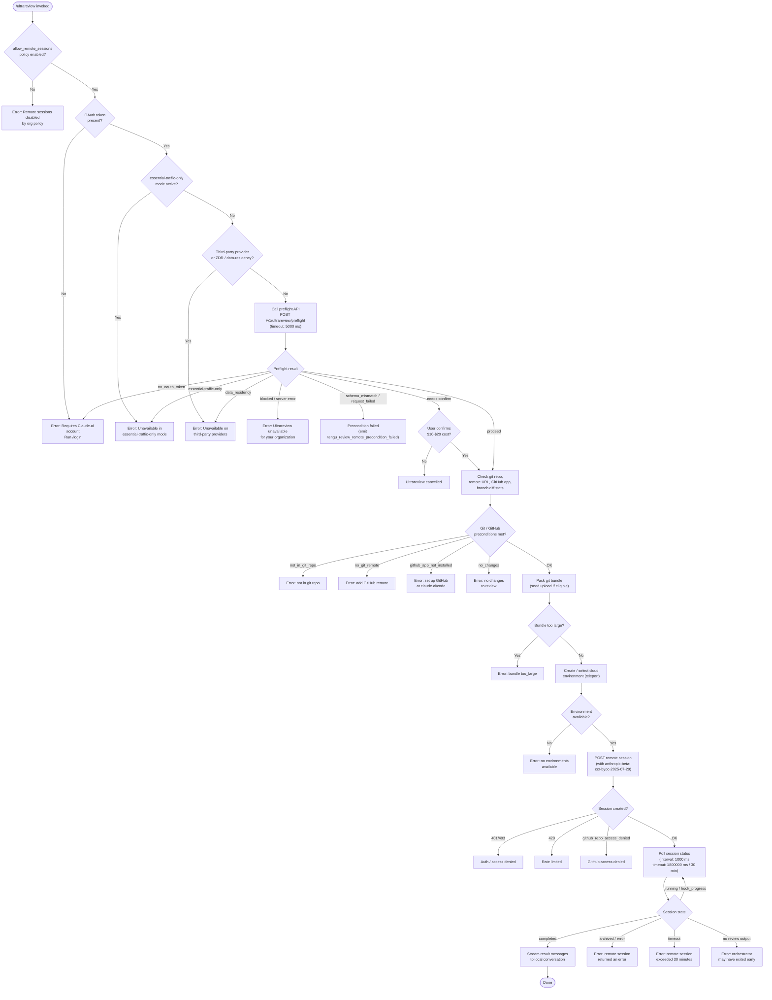

# `/ultrareview`

> Analysis basis: CC v2.1.152 bundle.js (AST extraction + Claude interpretation)
> Minimum version: v2.1.152

---

## Overview

`/ultrareview` is an alias for `/code-review ultra` that performs deep, automated bug-finding across your current branch by launching a remote Claude Code session running on the web. It orchestrates a multi-phase pipeline: local precondition checks, a preflight API call, git repository packaging (bundle upload), cloud environment provisioning, and finally a remote agent session that streams results back to the local CLI. Estimated cost is $10–$20 USD per run and the typical wall-clock time is approximately 10–20 minutes.

---

## Registration

| Field | Value |
|---|---|
| type | `local-jsx` |
| name | `ultrareview` |
| description | `Alias of /code-review ultra · ... · Est. cost ... USD · Finds and verifies bugs in your branch. Runs in Claude Code on the web. See ...` |
| loc_byte | `11929118` |
| loc_byte_end | `11929409` |
| loc_line | `9850` |
| module_id | `_p1` |
| load_inline | `true` |
| arbor_handler.name | `a_5` |
| arbor_handler.fqn | `claude-2.1.152::a_5` |
| arbor_handler.kind | `AsyncFunction` |
| arbor_handler.resolution_path | `module_id` |
| arbor_handler.n_hits | `1` |

Analysis basis: CC v2.1.152 bundle.js:+11929118

---

## Input Branching

The command involves many distinct conditional paths (remote-sessions policy, auth state, git state, preflight API result, cost-confirmation, bundle upload, session lifecycle). A Mermaid flowchart is used.



---

## Behavioral Spec

### 1. Top-level Handler (`a_5`)

The async handler is the Arbor-resolved function `a_5` (module `_p1`).

```
async function ultrareviewHandler(context):
    // Phase 1: org policy gate
    if not policyAllows("allow_remote_sessions"):
        display("Remote sessions are disabled by your organization's policy. Contact your organization admin to enable them.")
        emit tengu_review_overage_blocked
        return

    // Phase 2: random jitter delay (prevents thundering-herd on launch)
    delay = Math.random() * 2          // constant: 2  (bundle.js:+13371602)
    await sleep(delay via setTimeout)   // bundle.js:+13371641

    // Phase 3: parse flags from user input
    flags = parseUserFlags(input)       // via pm1 / Kv8
    hasFixFlag   = flags.has("fix")     // literal "fix"   bundle.js:+11889916
    hasCommentFlag = flags.has("comment") // literal "comment" bundle.js:+11889922

    // Phase 4: preflight check
    preflightResult = await runPreflight(context)  // via Cs_

    // Phase 5: overage / confirm gate
    if preflightResult.needs_confirm:
        shown = await showCostConfirmDialog()   // emit tengu_review_overage_dialog_shown
        if not confirmed:
            display("Ultrareview cancelled.")   // bundle.js:+11927752
            return

    // Phase 6: remote session launch
    try:
        success = await launchRemoteSession(context, flags)  // via o_5
    catch:
        display("Ultrareview failed to launch the remote session. Check that this is a GitHub repo and try again.")
        // bundle.js:+11926623
        return

    if not success:
        emit tengu_review_remote_teleport_failed
```

Analysis basis: CC v2.1.152 bundle.js:+11926773

---

### 2. Preflight Check (`xm1` via `Cs_`)

```
async function runPreflight(context):
    // POST /v1/ultrareview/preflight with timeout 5000 ms
    // bundle.js:+11888385, +11888442
    response = await httpPost("/v1/ultrareview/preflight", {
        headers: { "teleport-org": orgId },
        timeout: 5000
    })

    status = response.status   // one of: "proceed", "blocked", "needs-confirm",
                               //         "essential-traffic-only", "no-auth",
                               //         "data-residency", "zdr"

    if status == "essential-traffic-only":
        display("Ultrareview runs in Claude Code on the web and is unavailable when essential-traffic-only mode is active.")
        // bundle.js:+11888515
        emit tengu_review_remote_precondition_failed
        return ABORT

    if status == "zdr" or status == "data-residency":
        display("Ultrareview runs in Claude Code on the web and is unavailable on third-party providers.")
        // bundle.js:+11888662
        emit tengu_review_remote_precondition_failed
        return ABORT

    if status == "no-auth":
        display("Ultrareview requires a Claude.ai account. Run /login to authenticate.")
        // bundle.js:+11888795
        emit tengu_review_remote_precondition_failed
        return ABORT

    if status == "blocked" or status == "server":
        display("Ultrareview is unavailable for your organization.")
        // bundle.js:+11892529
        emit tengu_review_remote_precondition_failed
        return ABORT

    if status == "needs-confirm":
        // surface cost dialog: "$10-$20" bundle.js:+11887850, "~10–20 min" bundle.js:+11887942
        return NEEDS_CONFIRM

    if status == "schema_mismatch" or status == "request_failed":
        emit tengu_review_remote_precondition_failed("api_ultrareview_preflight")  // bundle.js:+11889006
        return ABORT

    emit tengu_review_bughunter_config   // bundle.js:+11887733
    return PROCEED
```

Analysis basis: CC v2.1.152 bundle.js:+11892287

---

### 3. Remote Session Orchestration (`bs_` via `o_5`)

```
async function launchAndMonitorRemoteSession(context, flags):
    // Step A: git preconditions
    repoCheck = await checkGitRepo()           // via SA1 / RX8
    if not repoCheck.inRepo:
        emit tengu_review_remote_precondition_failed("not_in_git_repo")
        return false

    remoteUrl = await getGitRemoteUrl()        // via JS / X9H
    if not remoteUrl:
        emit tengu_review_remote_precondition_failed("no_git_remote")
        display("Background tasks require a GitHub remote. Add one with `git remote add origin REPO_URL`.")
        // bundle.js:+8845507
        return false

    if not remoteUrl.includes("github.com"):   // bundle.js:+8844009
        // non-GitHub remote: ghes_optimistic path or forced_bundle
        pass

    githubAppOk = await checkGithubAppInstalled()  // via EyH
    if not githubAppOk:
        emit tengu_review_remote_precondition_failed("github_app_not_installed")
        display("Please setup GitHub on https://claude.ai/code")
        return false

    // Step B: determine merge-base and diff stats
    mergeBase = await gitMergeBase(defaultBranch, "HEAD")  // "merge-base" bundle.js:+11891388
    diffStat  = await gitDiffShortstat(mergeBase)          // "--shortstat" bundle.js:+11891902
    if diffStat.isEmpty:
        emit tengu_review_remote_precondition_failed("no_changes")
        return false

    // Step C: pack git bundle
    bundleResult = await packAndUploadBundle(context)    // via jm_ (teleport_git_bundle_upload)
    if bundleResult.status == "too_large":
        display error
        return false
    emit tengu_teleport_bundle_mode
    emit tengu_ccr_bundle_upload

    // Step D: acquire cloud environment
    envs = await listEnvironments()            // via qa (teleport_environments_list)
    env  = selectOrCreateEnvironment(envs)     // via esH (teleport_default_environment_create)
    if no env:
        display("No environments available for session creation")  // bundle.js:+8783642
        return false

    // Step E: create remote session
    sessionPayload = buildSessionPayload(bundleResult, flags)
    // header: anthropic-beta: ccr-byoc-2025-07-29  (bundle.js:+8780514)
    // header: x-organization-uuid                   (bundle.js:+8780536)
    response = await httpPost(sessionEndpoint, sessionPayload)

    if response.status in [401, 403, 429]:
        handle auth/rate errors
        return false

    sessionId = response.body.session_id
    if not sessionId:
        display("Server returned a malformed session response (no session id)")
        return false

    emit tengu_ccr_session_link

    // Step F: poll until terminal state
    // poll interval: 1000 ms  (bundle.js:+8851837)
    // max duration:  1800000 ms = 30 min  (bundle.js:+8851844)
    await pollSessionUntilDone(sessionId)     // via xA1 / byH

    emit tengu_review_remote_launched
    return true
```

Analysis basis: CC v2.1.152 bundle.js:+11926220, +8779696, +8850156

---

### 4. Session Polling (`xA1`)

```
async function pollSessionUntilDone(sessionId):
    startTime = Date.now()
    loop:
        state = await getSessionState(sessionId)   // via byH / lsH

        if state == "running" or state == "starting" or state == "pending":
            sleep(1000)   // bundle.js:+8851837
            if Date.now() - startTime > 1800000:   // bundle.js:+8851844
                raise "remote session exceeded 30 minutes"   // bundle.js:+8854486
            continue

        if state == "completed":
            resultMessages = extractResultMessages(state)
            if resultMessages.isEmpty:
                raise "no review output — orchestrator may have exited early"  // bundle.js:+8854523
            streamResultsToConversation(resultMessages)
            return

        if state == "archived" or state == "error":
            raise "remote session returned an error"   // bundle.js:+8854445

        if event.type == "hook_progress" or "hook_response":
            relayProgressToUser()

        if event.type == "hook_started" and name == "SessionStart":
            markSessionStarted()
```

Analysis basis: CC v2.1.152 bundle.js:+8850681

---

### 5. Git Bundle Upload (`jm_`)

```
async function packAndUploadBundle(context):
    // Verify git work tree
    gitRevParse("--is-inside-work-tree")   // bundle.js:+8735177, +8735189

    // Count objects to check size
    countResult = gitCountObjects("-v")    // bundle.js:+8762277, +8762293
    sizeKB = parseCountObjectsSize(countResult)
    maxBytes = 5000000   // bundle.js:+8762718  (5 MB limit in kB units × 1024)
    emit tengu_ccr_bundle_max_bytes

    if sizeKB * 1024 > maxBytes:
        return { status: "too_large" }

    // Seed-bundle path if eligible
    if seedBundleEligible:
        emit tengu_ccr_bundle_seed_enabled
        createSeedRefs()     // refs/seed/stash, refs/seed/root  bundle.js:+8765377, +8765395

    // Create git bundle file
    bundleFile = createTempBundle()        // via byH / lsH (fs.open)

    // Try HEAD bundle first, fall back to squashed
    strategies = ["head", "fallback_head", "squashed", "fallback_squashed"]
    // bundle.js:+8767225, +8767264, +8767299, +8767342
    for strategy in strategies:
        result = attemptBundleStrategy(strategy)
        if result.ok:
            emit tengu_ccr_bundle_upload("success", strategy)
            return { status: "success", strategy }

    emit tengu_ccr_bundle_upload("upload_failed")
    return { status: "upload_failed" }
```

Analysis basis: CC v2.1.152 bundle.js:+8765247

---

### 6. Flag Parsing (`Kv8` via `pm1`)

```
function parseUserFlags(rawInput):
    // Trim and split on whitespace
    tokens = rawInput.trim().split()

    // Recognised flags: "fix", "comment", "pr"
    // bundle.js:+11889916, +11889922, +11890750
    flags = new Set()
    for token in tokens:
        normalized = sanitize(token)   // via KS: replace special chars
        if normalized in ["fix", "comment", "pr"]:
            flags.add(normalized)

    // /ultrareview is a strict alias of /code-review ultra
    // bundle.js:+11890001
    baseCommand = "/code-review ultra"
    return { flags, baseCommand }
```

Analysis basis: CC v2.1.152 bundle.js:+11889629

---

### 7. Org Policy Gate (`m9`)

```
function checkOrgPolicy(policySet):
    // Checks "allow_remote_sessions"   (bundle.js:+11926776)
    // and   "allow_product_feedback"   (bundle.js:+4697692)
    // Uses NG7.has for Set membership
    remoteAllowed = policySet.has("allow_remote_sessions")

    // Checks enterprise / team account tier
    // literals: "enterprise" bundle.js:+4694329, "team" bundle.js:+4694364
    // literal: "firstParty"  bundle.js:+4694073
    tierOk = accountTier in ["enterprise", "team"] or isFirstParty

    return remoteAllowed and tierOk
```

Analysis basis: CC v2.1.152 bundle.js:+4697645

---

## State & Side Effects

| Item | Detail |
|---|---|
| Telemetry: `tengu_review_bughunter_config` | Fired after a clean preflight response (bundle.js:+11887733) |
| Telemetry: `tengu_review_remote_precondition_failed` | Fired on any early abort: bad preflight status, no git remote, no GitHub app, no changes (bundle.js:+11890048) |
| Telemetry: `tengu_review_overage_blocked` | Fired when org policy blocks launch (bundle.js:+11927108) |
| Telemetry: `tengu_review_overage_dialog_shown` | Fired when cost-confirmation dialog is displayed (bundle.js:+11927445) |
| Telemetry: `tengu_review_remote_teleport_failed` | Fired when teleport launch fails (bundle.js:+11895175) |
| Telemetry: `tengu_review_remote_launched` | Fired on successful remote session start (bundle.js:+11895698) |
| Telemetry: `tengu_ccr_bundle_max_bytes` | Records bundle size check (bundle.js:+8762192) |
| Telemetry: `tengu_ccr_bundle_seed_enabled` | Fired when seed-bundle optimisation is active (bundle.js:+8843813) |
| Telemetry: `tengu_ccr_bundle_upload` | Records upload outcome and strategy used (bundle.js:+8765569) |
| Telemetry: `tengu_teleport_bundle_mode` | Records which bundle-mode was chosen (bundle.js:+8780924) |
| Telemetry: `tengu_teleport_source_decision` | Records source-code acquisition decision (bundle.js:+8785994) |
| Telemetry: `tengu_ccr_session_link` | Records the created remote session link (bundle.js:+8775325) |
| Telemetry: `tengu_teleport_generate_title` | Records AI-generated session title call (bundle.js:+8768868) |
| Telemetry: `tengu_bg_spare_enable` | Background spare process enabled (bundle.js:+15381664) |
| Telemetry: `tengu_bg_spare_spawn` | Background spare process spawned (bundle.js:+15382024) |
| Telemetry: `tengu_daemon_config_reload` | Daemon config reloaded during session supervision (bundle.js:+15397117) |
| Telemetry: `tengu_feature_ok` / `tengu_feature_sad` | Feature gate pass/fail (bundle.js:+964519, +964654) |
| Network I/O | `POST /v1/ultrareview/preflight` (timeout 5000 ms, bundle.js:+11888385); remote session creation and polling endpoints |
| File I/O | Temporary git bundle written to disk (`fs.open`, `.bundle` suffix, bundle.js:+8766575); cleaned up on completion (`KtH.unlink`, bundle.js:+8767500) |
| Git operations | `rev-parse`, `count-objects`, `config --get remote.origin.url`, `symbolic-ref`, `show-ref`, `merge-base`, `diff --shortstat`, `stash create`, `update-ref`, `for-each-ref` |
| Session supervision | Background supervisor process (`"supervisor"` literal, bundle.js:+15396324) manages heartbeat, start/stop, config reload |
| Jitter delay | `Math.random() * 2` seconds before launch to stagger concurrent invocations (bundle.js:+13371602) |
| `--fix` flag side effect | When findings arrive, applies them to the local working tree (bundle.js:+11926511) |

---

## Version History

| Version | Change |
|---|---|
| v2.1.152 | Initial analysis |

---

## Common Mistakes

1. **Running without a GitHub remote**: `/ultrareview` requires a `github.com` remote to be configured. Add one with `git remote add origin REPO_URL` before invoking the command.
2. **Using an API key instead of a Claude.ai account**: The command requires OAuth authentication. Pure API-key users must run `/login` and authenticate with a Claude.ai account.
3. **Invoking from inside a repository with no commits**: The bundle upload will fail with "Repository has no commits". Stage and commit at least one commit first.
4. **Invoking with no branch changes**: If the current branch has no diff relative to the default branch, the command aborts with a `no_changes` precondition error.
5. **Running in an org with remote sessions disabled**: Administrators must explicitly enable the `allow_remote_sessions` policy. Users cannot override this from the CLI.
6. **Expecting instant results**: The estimated runtime is ~10–20 minutes and the cost is $10–$20 USD. The command is designed for deliberate, scheduled use rather than quick feedback loops.
7. **Running in essential-traffic-only mode**: This mode disables all non-essential API calls, including the ultrareview preflight and session endpoints.

---

## Appendix — Identifier Mapping

> For bundle debugging only. Identifiers change across versions.

| Identifier | Role |
|---|---|
| `a_5` | Top-level async handler for `/ultrareview` (Arbor-resolved, `AsyncFunction`) |
| `m9` | Org policy / account-tier gate function |
| `w99` | Policy set lookup helper |
| `z2_` | First-party / tier resolver |
| `jx` | Account tier classification (firstParty, enterprise, team) |
| `f2_` | File-based config reader (`readFileSync`, utf-8) |
| `OvH` | Policy flag checker (`wMq`, `A.some`, `_.includes`) |
| `V1` | Telemetry mode resolver |
| `mGA` | Telemetry string formatter |
| `uH` | String conversion utility |
| `AKH` | Additional policy/config helper |
| `pm1` | User flag parser dispatcher |
| `Kv8` | Flag tokeniser (trim/split/sanitise) |
| `KS` | String character sanitiser (`H.replace`) |
| `lhH` | MCP server connection manager |
| `dPK` | MCP update applier (`applyMcpUpdate`) |
| `yR5` | MCP retry / reconnect logic |
| `Rs_` | Pre-launch git precondition orchestrator |
| `RX8` | Git work-tree verifier (`rev-parse --is-inside-work-tree`) |
| `b6` | Async shell-command runner |
| `KU6` | Async store getter |
| `z_` | Promise resolver helper |
| `T_` | Git command executor |
| `a0H` | Git process spawner with option handling |
| `D` | Background-process spare manager |
| `w64` | String-to-number converter (base 10) |
| `Tz` | Process/task status tracker |
| `L8` | Log/event emitter |
| `hH` | Error/result handler for git commands |
| `JS` | Git remote URL resolver (`config --get remote.origin.url`) |
| `Lb` | Remote URL cache lookup |
| `fn8` | `J9H` store getter for `remoteUrl` |
| `RmH` | Credential-scrubbing replacer (`://***@`) |
| `X9H` | URL parser and host extractor |
| `DVA` | URL component splitter |
| `L9` | String slice/index utility |
| `a_1` | Git object-count checker (`count-objects -v`) |
| `o_1` | Object-count parser |
| `r_1` | Repository event emitter |
| `E6` | Repository state machine / task queue |
| `Z8` | Git ref verifier (`--verify --quiet`) |
| `Y` | Supervisor session lifecycle controller |
| `rPH` | ENOENT-aware config reader |
| `A1` | AsyncLocalStorage store accessor |
| `aHA` | Config merge helper |
| `GH` | String coercion helper |
| `Ao1` | Column-width calculator for output formatting |
| `T` | Key/event handler (preventDefault, stop) |
| `O0` | User-settings accessor |
| `JGK` | Heartbeat scheduler |
| `se` | Heartbeat tick function |
| `sv` | Current-branch resolver (`symbolic-ref --short refs/remotes/origin/HEAD`) |
| `$n8` | `J9H` store getter for `branch` |
| `RD` | Default-branch resolver (`show-ref`, fallback `main`/`master`) |
| `Ln8` | `J9H` store getter for `defaultBranch` |
| `O` | Stopped-state handler |
| `k8` | Background-session stop logic |
| `Cs_` | Preflight check dispatcher |
| `xm1` | Preflight HTTP caller (`POST /v1/ultrareview/preflight`) |
| `B6` | JSON parser wrapper |
| `ys_` | Preflight response classifier |
| `H8` | Feature-sad telemetry reporter |
| `SH` | Feature-ok telemetry reporter |
| `MRH` | Review config builder |
| `o66` | Review event emitter (`tengu_review_bughunter_config`) |
| `StH` | Session display / UI component |
| `wZ` | Terminal UI writer |
| `HzH` | Subscription/plan checker |
| `B5` | Plan tier resolver |
| `sD` | Subscription type classifier (stripe, apple, google_play) |
| `x6` | Task-queue processor |
| `TA` | Plan-aware display renderer |
| `Pb` | Array-based tier membership checker |
| `Xb` | Role/tier gate (max, pro, admin, billing, owner) |
| `O1` | Role classifier |
| `h8_` | Role-set builder helper |
| `y8_` | Role-check helper |
| `ra` | Review-config accessor |
| `o_5` | Remote session launch orchestrator |
| `bs_` | Remote session full pipeline (git checks → bundle → session) |
| `CJH` | Eligibility check caller |
| `SA1` | Background-remote eligibility gate |
| `pLH` | Session prompt formatter |
| `Cm1` | Cost estimate display builder |
| `pc` | Remote session creator (`POST` to session endpoint) |
| `jO` | Message type detector |
| `Gm_` | Token/credential fetcher for remote session |
| `Wb` | Session token builder |
| `Cq` | OAuth URL validator |
| `$X` | HTTP client (Axios) with auth headers |
| `jm_` | Git bundle packer and uploader (`teleport_git_bundle_upload`) |
| `y6` | Promise resolver (`pv`) |
| `t_1` | Control-request builder (`randomUUID`) |
| `CH` | JSON stringifier wrapper |
| `s_1` | Session-link recorder (`tengu_ccr_session_link`) |
| `qa` | Environments lister (`teleport_environments_list`) |
| `esH` | Default environment creator (`teleport_default_environment_create`) |
| `iPL` | Session payload / title generator (`teleport_generate_title`) |
| `db` | Session task enqueuer |
| `EyH` | GitHub App installation checker |
| `g9` | Browser/env detection helper |
| `n_` | Error normaliser |
| `qP` | Cancellation detector |
| `YY` | Error display helper |
| `byH` | Remote agent session monitor |
| `XI` | Random-bytes session ID generator |
| `lsH` | Session file opener (`fs.open`) |
| `Y2` | Session timestamp recorder |
| `I2L` | Session status message formatter |
| `xA1` | Session event poller and result extractor |
| `bJH` | Session cleanup / teardown |
| `_w` | Event/stream dispatcher |
| `r_5` | Result message mapper |
| `Ss_` | Post-session cleanup function |

---

Note: index built via Arbor fallback; some signals (telemetry, literals) may be missing — see arbor-fallback.js.