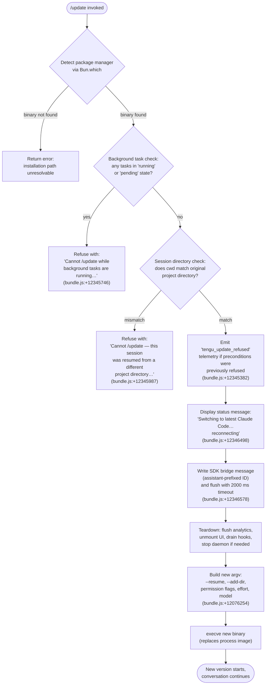

# `/update`

> Analysis basis: CC v2.1.152 bundle.js (AST extraction + Claude interpretation)
> Minimum version: v2.1.152

---

## Overview

`/update` switches the running Claude Code CLI to the latest installed version without ending the current conversation. It performs safety checks (no background tasks running, session directory consistency), tears down the current process state, then re-executes the binary via `execve`, passing the active session ID and other CLI flags so the conversation resumes seamlessly in the new version.

---

## Registration

| Field | Value |
|---|---|
| type | `local` |
| name | `update` |
| description | `Switch to the latest version (conversation continues)` |
| loc_byte | `12347476` |
| loc_byte_end | `12347678` |
| loc_line | `10298` |
| supportsNonInteractive | `false` |
| isHidden | `true` |
| module_id | `ic1` |
| load_inline | `true` |
| arbor_handler.name | `u45` |
| arbor_handler.fqn | `claude-2.1.152::u45` |
| arbor_handler.kind | `AsyncFunction` |
| arbor_handler.resolution_path | `module_id` |
| arbor_handler.n_hits | `0` |

Analysis basis: CC v2.1.152 bundle.js:+12347476

The handler `u45` was resolved via the `module_id` path: the registration carries `module_id: "ic1"`, and the Arbor symbol graph followed the module exports to locate `u45` as the async function implementing the command. The `load_inline: true` flag indicates the handler is bundled inline rather than in a separate chunk.

Because `isHidden: true`, the command does not appear in the standard `/help` listing and is not advertised to users directly.

---

## Input Branching

The handler contains four or more distinct decision branches before reaching the re-exec path, so a flowchart is used.



---

## Behavioral Spec

### Pre-flight: Locate the Claude Binary

```
function locateBinary():
    path = Bun.which("claude")          # bundle.js:+1060798
    if path is null:
        raise error("claude binary not found")
    return path

function resolveVersionsDir(home):
    # ~/.local/share/versions  (bundle.js:+7727838, +7727847, +9019284)
    return join(home, ".local", "share", "versions")

function resolveLatestBinPath(versionsDir):
    # …/bin  (bundle.js:+7727918)
    entries = listDir(versionsDir)          # sorted, pick newest
    return join(versionsDir, latestEntry, "bin", "claude")
```

Analysis basis: CC v2.1.152 bundle.js:+12345282 (call to package-manager resolver), +1060798 (`Bun.which`), +7727838–7727918 (path constants)

---

### Pre-flight: Background Task Guard

```
function checkBackgroundTasks(appState):
    tasks = Object.values(appState.backgroundTasks)  # bundle.js:+12345605
    for task in tasks:
        if task.status in ["running", "pending"]:    # bundle.js:+12345643, +12345665
            emit telemetry "tengu_update_refused"    # bundle.js:+12345382
            return Err(
                "Cannot /update while background tasks are running — " +
                "wait for them to finish, then try again."
            )                                        # bundle.js:+12345746
    return Ok
```

Analysis basis: CC v2.1.152 bundle.js:+12345605, +12345643, +12345665, +12345746

---

### Pre-flight: Session Directory Consistency Guard

```
function checkSessionDirectory(currentCwd, originalProjectDir):
    if currentCwd != originalProjectDir:             # bundle.js:+12345987
        emit telemetry "tengu_update_refused"
        return Err(
            "Cannot /update — this session was resumed from a different " +
            "project directory. Restart manually with --resume to continue " +
            "on the latest version."
        )
    return Ok
```

The `--resume` flag string appears at bundle.js:+12074730 and is also threaded into the rebuilt argv below.

Analysis basis: CC v2.1.152 bundle.js:+12345987, +12074730

---

### Status Message and SDK Bridge Write

```
function emitSwitchingMessage(sdkOutput, sessionId):
    # Synthesise an assistant message with an "assistant-" prefixed UUID
    # (bundle.js:+12346288) so the frontend renders a status turn.
    msgId = generateUUID()                           # bundle.js:+12346355 (lc1 → wN8.randomUUID)
    msg = {
        role: "assistant",                           # bundle.js:+12344331
        content: [{
            type: "text",                            # bundle.js:+12345428
            text: "Switching to latest Claude Code… reconnecting"  # bundle.js:+12346498
        }]
    }
    sdkOutput.writeSdkMessages([msg])               # bundle.js:+12346474

function flushBridge(sdkOutput):
    # Race: flush completes OR 2000 ms timeout fires  (bundle.js:+12346578)
    await Promise.race([
        sdkOutput.flush(),
        timeout(2000, label="bridge flush")          # bundle.js:+12346583
    ])
```

Analysis basis: CC v2.1.152 bundle.js:+12346474, +12346498, +12346565, +12346578, +12346583

---

### Teardown Sequence

```
async function teardown(sdkOutput, appState):
    # 1. Flush analytics with 30 000 ms timeout  (bundle.js:+12074797, +12074803)
    await Promise.race([
        flushAnalytics(),
        timeout(30000, label="flush timeout (relaunch)")
    ])

    # 2. Unmount terminal UI  (bundle.js:+5316392)
    terminalRenderer.unmount()

    # 3. Drain CMA hooks  (bundle.js:+58704)
    await hookDrainer.drain()

    # 4. Update app state: mark session as updating  (bundle.js:+12346388)
    setAppState({ ...getAppState(), isUpdating: true })

    # 5. Teardown SDK output  (bundle.js:+12346619)
    sdkOutput.teardown()

    # 6. Stop daemon / background session if applicable  (bundle.js:+15418389)
    await stopDaemon()
```

Analysis basis: CC v2.1.152 bundle.js:+12074797, +5316392, +58704, +12346388, +12346619, +15418389

---

### Argv Construction for Re-exec

```
function buildNewArgv(originalArgv, sessionId, appState):
    args = Array.from(originalArgv)                  # bundle.js:+12076079

    # Always inject --resume <sessionId>  (bundle.js:+12074730)
    args.push("--resume", sessionId)

    # Re-append --add-dir entries from original invocation  (bundle.js:+12076254)
    for dir in getExtraDirectories(originalArgv):
        args.push("--add-dir", dir)

    # Conditionally re-append permission flags  (bundle.js:+12076392)
    if hadDangerousPermissions(originalArgv):
        args.push("--allow-dangerously-skip-permissions")

    # Re-append --effort if set  (bundle.js:+12076534)
    if appState.effort:
        args.push("--effort", appState.effort)

    # Re-append --permission-mode if set  (bundle.js:+12076551)
    if appState.permissionMode:
        args.push("--permission-mode", appState.permissionMode)

    return args
```

Analysis basis: CC v2.1.152 bundle.js:+12076079, +12076254, +12076392, +12076534, +12076551

---

### Process Replacement via execve

```
async function performExec(newBinaryPath, newArgv, env):
    # Remove all existing signal listeners before replacing process image
    process.removeAllListeners()                     # bundle.js:+12075299

    # Install minimal handlers so SIGINT/SIGHUP do not interfere during exec
    process.on("SIGINT", noop)                       # bundle.js:+12075270
    process.on("SIGHUP", noop)                       # bundle.js:+12075289

    # Use spawnSync to perform a dry-run validation if needed  (bundle.js:+12075356)
    # Then invoke execve to replace the current process image  (bundle.js:+12074233)
    f.execve(newBinaryPath, newArgv, env)
    # If execve returns (error path), log "relaunch_spawn_error"  (bundle.js:+12075581)
    # and call process.exit(128)  (bundle.js:+12075718)
```

Analysis basis: CC v2.1.152 bundle.js:+12075299, +12075270, +12075289, +12074233, +12075581, +12075718

---

## State & Side Effects

| Item | Detail |
|---|---|
| Telemetry — `tengu_update_refused` | Emitted when any pre-flight check blocks the update (background tasks running, or directory mismatch). bundle.js:+12345382 |
| Telemetry — `tengu_scroll_summary` | Emitted during terminal UI teardown (scroll/render cleanup). bundle.js:+5317860 |
| Telemetry — `tengu_amber_creek` | Emitted by fullscreen-mode detection logic during UI teardown. bundle.js:+3368889 |
| Telemetry — `tengu_pewter_brook` | Emitted by alternate fullscreen-mode path. bundle.js:+3368797 |
| Telemetry — `tengu_bg_dispatch_sigkill_escalate` | Emitted if a background worker requires SIGKILL escalation during shutdown. bundle.js:+15382331 |
| Telemetry — `tengu_feature_bad` / `tengu_feature_ok` | Emitted by terminal feature detection during UI unmount. bundle.js:+964577, +964519 |
| Telemetry — `tengu_bg_low_mem_mb` | Emitted if low-memory condition detected during daemon teardown. bundle.js:+12685538 |
| Telemetry — `tengu_bg_dispatch_low_mem` | Emitted by background session dispatcher on low-memory path. bundle.js:+15382910 |
| Telemetry — `tengu_bg_spare_enable` | Emitted when a spare background slot is activated. bundle.js:+15383605 |
| Telemetry — `tengu_bg_sendclaim_failed` | Emitted when a background send-claim attempt fails. bundle.js:+15363060 |
| Telemetry — `tengu_bg_spare_claim` | Emitted on background spare-slot claim. bundle.js:+15383726 |
| Telemetry — `tengu_bg_spare_spawn` | Emitted when a spare worker is spawned during cleanup. bundle.js:+15382024 |
| Telemetry — `tengu_bg_spare_claim_fail` | Emitted when spare claim fails after exhausting retries. bundle.js:+15383989 |
| Telemetry — `tengu_daemon_control` | Emitted when the daemon stop/restart sequence is invoked. bundle.js:+15418464 |
| Telemetry — `tengu_config_parse_error` | Emitted if a config file cannot be parsed during teardown path. bundle.js:+3204028 |
| SDK bridge write | An assistant-role text message ("Switching to latest Claude Code… reconnecting") is written to the SDK output channel before teardown. bundle.js:+12346474, +12346498 |
| Bridge flush timeout | 2 000 ms race timeout on bridge flush. bundle.js:+12346578 |
| Analytics flush timeout | 30 000 ms race timeout on analytics flush before exec. bundle.js:+12074797 |
| `appState` changes | `isUpdating` (or equivalent) flag set to `true` via `setAppState` before teardown. bundle.js:+12346388 |
| Hook registration | CMA hooks are drained (`CMA.drain`) before exec. bundle.js:+58704 |
| Terminal UI | Terminal renderer is unmounted (`H.unmount`) and terminal state written via `DwH.writeSync`. bundle.js:+5316392, +5316314 |
| Process signal listeners | All existing listeners removed; minimal SIGINT/SIGHUP no-ops installed. bundle.js:+12075299 |
| Process replacement | `f.execve` replaces the process image; no return on success. bundle.js:+12074233 |
| Sound | <!-- TODO: not found in depth-2 traversal; needs --depth 4 --> |

---

## Version History

| Version | Change |
|---|---|
| v2.1.152 | Initial analysis |

---

## Common Mistakes

1. **Running `/update` with active background tasks.** The command hard-refuses if any background task is in `"running"` or `"pending"` state. Wait for all background agents to finish before invoking `/update`.

2. **Expecting `/update` to appear in `/help`.** The command is registered with `isHidden: true` and will not appear in the standard help listing. It must be typed directly.

3. **Using `/update` after changing project directory mid-session.** If the working directory at invocation time differs from the original project directory (e.g., after a `--resume` from a different path), the command refuses with a clear error and instructs the user to restart manually with `--resume`.

4. **Assuming the process returns after `/update`.** The command uses `execve` to replace the process image. If `execve` fails, the process exits with code `128` and logs `"relaunch_spawn_error"`. There is no soft-failure path.

5. **Expecting `supportsNonInteractive: true`.** `/update` cannot be driven from non-interactive scripts or CI pipelines — it requires an interactive session.

---

## Appendix — Identifier Mapping

> For bundle debugging only. Identifiers change across versions.

| Identifier | Role |
|---|---|
| `u45` | Main handler (AsyncFunction): orchestrates the entire `/update` flow |
| `JN8` | Package manager / binary detection helper (entry point of callGraph) |
| `L$` | `Bun.which` wrapper: locates the `claude` binary on PATH |
| `YVA` | Inner resolver used by binary-location helper; calls `Bun.which` directly |
| `Lh` | Version directory resolver: builds path to versioned install directory |
| `kP8` | Path join helper used by version directory resolver |
| `If` | Array type guard (`Array.isArray` wrapper) |
| `FjH` | Home directory path builder; calls `uQ9.homedir` |
| `PD8` | OS home directory accessor (`os.homedir`) |
| `Q8H` | Bin subdirectory path builder |
| `u9` | App-state reader used early in handler |
| `_OH` | Internal state accessor called by `u9` |
| `c` | Shared utility (context/config accessor) used throughout |
| `sw` | Basename utility; calls `FP.basename` |
| `y6` | Logger / diagnostic emitter |
| `pv` | Low-level write/log primitive |
| `uI` | Path utility (used in exec-path construction) |
| `Xt_` | New binary path resolver; calls `ZB1.dirname`, `uI`, `z_`, `rK` |
| `z_` | Path fragment builder (calls `pv`) |
| `rK` | Secondary path fragment builder (calls `pv`) |
| `vAH` | Pre-exec validation helper |
| `Hs` | Hook-state checker; calls `Oz5.has` to inspect active hooks |
| `FI8` | Hook registry accessor used by `Hs` |
| `Ce_` | Conversation history appender; calls `_.appendEntry`, `I4`, `y6` |
| `I4` | Hook registration coordinator; calls `tq` |
| `tq` | CMA register call (`CMA.register`) |
| `hH` | Shell/subprocess executor used during teardown logging |
| `n_` | Error string builder (`Error` + `String` wrapper) |
| `uH` | String coercion utility |
| `V1` | Output formatter; calls `mGA` |
| `mGA` | String formatting helper; calls `uH` |
| `UtK` | Circular buffer manager (`tp6.shift` / `tp6.push`) |
| `TT` | Transition/timer utility called mid-flow |
| `O` | SDK output object (`writeSdkMessages`, `flush`, `teardown`) |
| `k8` | Internal SDK transport used by `O` |
| `lc1` | UUID generator; calls `wN8.randomUUID` |
| `BL` | Timeout-race helper (`setTimeout`, `Promise.race`, `clearTimeout`) |
| `DYH` | String conversion helper (`String` coerce) |
| `yPH` | Full relaunch orchestrator: unmount, drain, spawnSync, execve |
| `uJ6` | Interval cleanup helper; calls `SZ_` |
| `SZ_` | `clearInterval` wrapper |
| `kNH` | Terminal unmount sequence; calls `DwH.writeSync`, `H.unmount`, `nS`, `s_8`, `uH` |
| `H` | Terminal renderer / Ink instance (`unmount`, `replaceAll`) |
| `nS` | Post-unmount state reset |
| `s_8` | Terminal write helper (`jr.writeSync`, `QEH`, `UEH`, `lG`) |
| `QEH` | Terminal capability detector; checks Ghostty / iTerm versions |
| `UEH` | Alternate terminal write path |
| `lG` | tmux/screen multiplexer escape helper |
| `EL8` | Scroll-summary renderer; calls `_Z`, `xD9`, `bD9`, `$q` |
| `_Z` | Scroll state accessor |
| `xD9` | Scroll dimension helper |
| `bD9` | Scroll timing/metrics calculator (`Date.now`, `Math.max`, `Math.round`) |
| `RD9` | Scroll metrics finalizer |
| `$q` | Fullscreen/render mode dispatcher |
| `efH` | Local-agent feature flag checker (`LiK.has`) |
| `oO_` | Output formatter for fullscreen mode |
| `ri` | Render item builder; calls `J97` |
| `N` | ANSI/color string formatter |
| `rO_` | Windows-SSH detection helper |
| `s_` | Render pipeline coordinator; calls `sm` |
| `X97` | Alternate render path coordinator |
| `E6` | Event emitter / render-event dispatcher |
| `vT` | Hook-drain coordinator; calls `I4` |
| `abH` | CMA drain call (`CMA.drain`) |
| `VL8` | Analytics flush sequencer (`Promise.all`, `Promise.race`, `n8`) |
| `n8` | Analytics writer/flusher with timeout and abort |
| `K` | Analytics channel map helper |
| `q` | File cleanup utility (`d0K.unlinkSync`) |
| `L` | Promise lifecycle tracker (`q.add`, `M.finally`, `q.delete`) |
| `XB1` | execve orchestrator: resolves cwd, loads FFI, calls `f.execve` |
| `M` | Native module handle / FFI module object |
| `A` | Process map / active-process registry |
| `$` | Worker registry / spawn tracker |
| `Sn1` | Worker record constructor (`Ki`, `Date.now`, `A1`, `KI6`, `CH`) |
| `w` | Background worker manager (dispatch, SIGKILL, spare, exec) |
| `R` | Supervisor process handler (`WGK`, `Tz`, `N`, `hH`, `z.write`) |
| `mH` | Worker health-bad telemetry emitter (`tengu_feature_bad`) |
| `SH` | Worker health-ok telemetry emitter (`tengu_feature_ok`) |
| `jI8` | Low-memory check helper; calls `E6` |
| `mY6` | Config file reader for worker config (`BP.readFile`) |
| `B` | Session retirement helper (`F6.filter`, `gH.has`) |
| `d4A` | Background socket connector (`mR8.connect`, `M.on`, `M.write`) |
| `a4A` | Background session lifecycle manager (spawn, retire, cleanup) |
| `D` | Background dispatcher; calls `jI8`, `E6`, `Q4A`, `hH` |
| `L8` | Logging/status utility |
| `S` | Disposable resource handle |
| `f` | FFI execve module (`lhH`, `dPK`, `L.get`, `N`, `yR5`) |
| `lhH` | MCP server connection orchestrator |
| `dPK` | MCP update applicator (`H.applyMcpUpdate`, `A.cleanup`) |
| `yR5` | MCP client state rebuilder (`_.getClients`, `lhH`, `dPK`) |
| `z` | Daemon stop/restart handler (`SH`, `mH`, `_y`, `qm`) |
| `_y` | Daemon control message builder (`Qb`, `WQ.push`, `LEH`, `f$_`) |
| `qm` | Daemon stop sequencer (`Promise.race`, `process.exit`) |
| `GH` | String coercion/display helper |
| `MP` | Pre-exit file writer (`ExH.writeFileSync`, `Rm8.join`) |
| `Cv8` | Argv reconstruction helper (`Array.from`, `vq6`, `q.push`, `x6`) |
| `vq6` | Original argv accessor/parser |
| `x6` | Config file watcher / update detector (`Q6`, `BG`, `N$_`, `zzH`) |
| `Q6` | Config path resolver |
| `N$_` | Config watcher setup helper |
| `zzH` | Config file copier/backup handler (`q.readFileSync`, `q.mkdirSync`, `q.copyFileSync`) |
| `B6` | JSON parse wrapper |
| `Mb` | String prefix/slice helper |
| `zpq` | Config backup directory scanner |
| `R$_` | Config backup path joiner |
| `C_7` | File-watch registration helper (`y68.watchFile`, `y68.unwatchFile`) |
| `xi` | Watch callback handler |
| `V_` | Session-flag reader (`allowed_tools`, `disallowed_tools`, `avoid_prompts`) |
| `uT8` | `allowed_tools` state accessor; calls `sA` |
| `sA` | Generic app-state field accessor |
| `mT8` | `disallowed_tools` state accessor; calls `sA` |
| `kO` | Session effort/model reader (`effort`, `model` fields) |