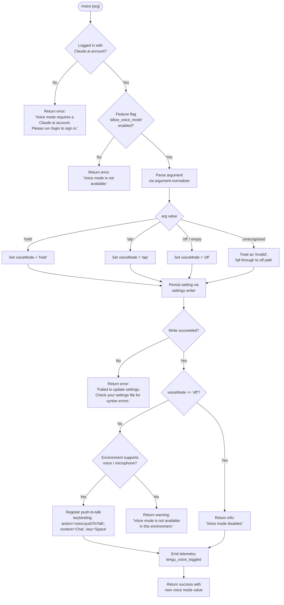

# `/voice`

> Analysis basis: CC v2.1.152 bundle.js (AST extraction + Claude interpretation)
> Minimum version: v2.1.152

---

## Overview

The `/voice` command toggles voice mode in Claude Code, allowing users to switch between `hold`, `tap`, and `off` interaction styles for voice-based input. It validates authentication and feature-flag eligibility before modifying the persisted voice-mode setting, and registers a push-to-talk keybinding (`Space` in the `Chat` context) when voice is activated.

---

## Registration

| Field | Value |
|---|---|
| type | `local` |
| name | `voice` |
| description | `Toggle voice mode` |
| argumentHint | `[hold\|tap\|off]` |
| supportsNonInteractive | `false` |
| isHidden | `null` |
| module_id | `xo1` |
| load_inline | `true` |
| loc_byte | `12631782` |
| loc_byte_end | `12632024` |
| loc_line | `10831` |
| arbor_handler.name | `Rf5` |
| arbor_handler.fqn | `claude-2.1.152::Rf5` |
| arbor_handler.kind | `AsyncFunction` |
| arbor_handler.resolution_path | `module_id` |
| arbor_handler.n_hits | `1` |

Analysis basis: CC v2.1.152 bundle.js:+12631782

---

## Input Branching

The handler has more than three distinct branches based on authentication state, feature-flag availability, argument value, and environment capability. A flowchart is mandatory.



Analysis basis: CC v2.1.152 bundle.js:+12629153 (mode literals `hold`/`tap`/`off`/`invalid`), +12629277 (no-account error), +12629376 (not-available error), +12629695 (settings-write error), +12629833 (disabled message), +12630077 (environment-unavailable message)

---

## Behavioral Spec

### Top-level handler (`Rf5`)

The Arbor-resolved handler is `Rf5` (AsyncFunction, resolved via `module_id` → `xo1`).

```
async function voiceCommandHandler(args, context):
    # 1. Authentication gate
    authStatus = getAuthenticationStatus(context)           # calls sD
    if not authStatus.isLoggedIn:
        return textResult(
            "Voice mode requires a Claude.ai account. " +
            "Please run /login to sign in."
        )

    # 2. Feature-flag gate
    voiceAllowed = checkFeatureFlag("allow_voice_mode", context)  # calls L6A → m9
    if not voiceAllowed:
        return textResult("Voice mode is not available.")

    # 3. Parse the argument
    rawArg = normaliseArgument(args)                        # calls Sf5 → H.trim
    mode   = parseVoiceMode(rawArg)                         # literals: hold|tap|off|invalid

    # 4. Persist the new setting
    writeOk = writeVoiceSetting(mode, context)              # calls l_
    if not writeOk:
        return textResult(
            "Failed to update settings. " +
            "Check your settings file for syntax errors."
        )

    # 5. Handle 'off'
    if mode == "off":
        emitTelemetry("tengu_voice_toggled", {mode: "off"})
        return textResult("Voice mode disabled.")

    # 6. Environment capability check
    if not environmentSupportsVoice(context):               # calls $6A / yI6
        return textResult(
            "Voice mode is not available in this environment."
        )

    # 7. Register push-to-talk keybinding
    registerKeybinding(
        action  = "voice:pushToTalk",
        context = "Chat",
        key     = "Space"
    )                                                       # calls jX → NA8 → $Y6

    # 8. Emit telemetry and return
    emitTelemetry("tengu_voice_toggled", {mode: mode})      # calls c (telemetry helper)
    return successResult({voiceMode: mode})
```

Analysis basis: CC v2.1.152 bundle.js:+12629236 (entry call to `F86`), +12629247 (call to `sD`), +12629414 (call to `s_`), +12629461 (call to `Sf5`), +12629597 (call to `l_`), +12629776 (telemetry emit), +12629923 (call to `$6A`), +12631043 (call to `jX`)

---

### Authentication & settings loading (`sD` / `F86`)

```
function getAuthAndSettings(context):
    # Load settings from disk (calls sm → pi8)
    settings = loadSettingsFromDisk()

    # Determine auth type; checks ANTHROPIC_API_KEY and apiKeyHelper
    # Falls back to "none" if neither present
    authType = resolveAuthType(settings)    # literals: "ANTHROPIC_API_KEY", "apiKeyHelper", "none"

    # For voice, the caller needs a Claude.ai OAuth session (not just an API key)
    return {isLoggedIn: authType != "none" and isClaudeAiSession(authType)}
```

Analysis basis: CC v2.1.152 bundle.js:+12629236 (`Rf5` → `F86`), +12619761 (`F86` → `K6A`), +12619652 (`K6A` → `sD`), +2940937 (literal `ANTHROPIC_API_KEY`), +2941070 (literal `none`)

---

### Feature-flag check (`L6A` / `m9`)

```
function checkVoiceModeFlag(context):
    # Reads 'allow_voice_mode' from policy/user settings
    flagValue = readFlag("allow_voice_mode")    # literal at +12619719
    return Boolean(flagValue)
```

Analysis basis: CC v2.1.152 bundle.js:+12619775 (`F86` → `L6A`), +12619716 (`L6A` → `m9`), +12619719 (literal `allow_voice_mode`)

---

### Argument normalisation (`Sf5`)

```
function normaliseVoiceArg(rawInput):
    trimmed = rawInput.trim()
    if trimmed in ["hold", "tap", "off"]:
        return trimmed
    if trimmed == "":
        return "off"          # default: toggle off when no arg supplied
    return "invalid"
```

Analysis basis: CC v2.1.152 bundle.js:+12629106 (`Sf5` → `H.trim`), +12629153 (literal `hold`), +12629165 (literal `tap`), +12629176 (literal `off`), +12629197 (literal `invalid`)

---

### Settings persistence (`l_`)

`l_` is the settings-write path. It:

1. Resolves the target settings file (user settings at `.claude/settings.json`).
2. Reads the existing JSON, merges the `voiceMode` key, then writes back atomically (using a temp file with `randomBytes`-generated name, `fchmodSync`, `fsyncSync`, `renameSync`).
3. Returns `true` on success, `false` on any filesystem error.

```
function writeVoiceSetting(mode, context):
    path    = resolveSettingsPath()         # calls Ob → KN.join, literal ".claude/settings.json"
    current = readSettingsFile(path)        # calls lU6
    current["voiceMode"] = mode
    return atomicWriteJSON(path, current)   # calls z76 → Vf.writeFileSync … Vf.fsyncSync … q.renameSync
```

Analysis basis: CC v2.1.152 bundle.js:+12629597 (`Rf5` → `l_`), +1223192 (`l_` → `zO`), +1223966 (`l_` → `Ob`), +1223962 (`l_` → `lU6`), +1009846 (`z76` → `q.readlinkSync`), +1010969 (`z76` → `Vf.fchmodSync`), +1011035 (`z76` → `Vf.fsyncSync`), +1011163 (`z76` → `q.renameSync`), literal `settings.json` at +1214330

---

### Keybinding registration (`jX` / `$Y6`)

When voice is successfully activated, a keybinding entry is written:

```
function registerPushToTalkKeybinding(context):
    # Load existing keybindings.json (literal at +3787277)
    bindings = loadKeybindingsConfig()          # calls NA8 → $Y6 → biq.readFileSync
    entry = {
        context:  "Chat",                       # literal at +12631065
        key:      "Space",                      # literal at +12631072
        action:   "voice:pushToTalk"            # literal at +12631046
    }
    mergeOrAppendBinding(bindings, entry)       # calls tD_ / eD_
    writeKeybindingsConfig(bindings)            # calls $Y6 → j8 / GH
    emitTelemetry("tengu_custom_keybindings_loaded")
    emitTelemetry("tengu_keybinding_fallback_used")   # if action_not_found fallback used
```

Analysis basis: CC v2.1.152 bundle.js:+12631043 (`Rf5` → `jX`), +3796134 (`jX` → `NA8`), +3789024 (`NA8` → `$Y6`), +3787277 (literal `keybindings.json`), +12631046 (literal `voice:pushToTalk`), +12631065 (literal `Chat`), +12631072 (literal `Space`), +3796287 (literal `action_not_found`)

---

### MCP / environment capability gate (`$6A` / `yI6`)

Before completing activation the handler checks whether the runtime environment exposes microphone / voice infrastructure. The literal `"System Settings → Privacy & Security → Microphone"` at +12630584 suggests that on macOS the check inspects system permission state and surfaces a user-facing hint when the permission is absent.

```
function environmentSupportsVoice(context):
    # Checks platform + microphone permission
    platform = getPlatformInfo()        # calls $6A
    if platform.isSSH or platform.isRemote:
        return false
    micPermission = queryMicrophonePermission()     # calls yI6
    if micPermission == "denied":
        hintUser("System Settings → Privacy & Security → Microphone")
        return false
    return true
```

Analysis basis: CC v2.1.152 bundle.js:+12629923 (call to `$6A`), +12630002 (call to `yI6`), +12630077 (literal `Voice mode is not available in this environment.`), +12630584 (literal `System Settings → Privacy & Security → Microphone`)

---

## State & Side Effects

| Item | Detail |
|---|---|
| Telemetry — primary | `tengu_voice_toggled` (bundle.js:+12629778) — fired on every successful mode change including disable |
| Telemetry — feature gating | `tengu_feature_ok` (+964519), `tengu_feature_sad` (+964654), `tengu_feature_bad` (+964577) — general feature-gate outcome signals |
| Telemetry — keybindings | `tengu_custom_keybindings_loaded` (+3787183), `tengu_keybinding_fallback_used` (+3796216) — fired when push-to-talk binding is registered |
| Telemetry — config errors | `tengu_config_parse_error` (+3204028) — fired if settings JSON is malformed |
| Telemetry — MCP / OAuth (transitive) | `tengu_mcp_oauth_flow_start`, `tengu_mcp_oauth_flow_success`, `tengu_mcp_oauth_flow_error` — reachable via deep call graph; not directly triggered by `/voice` |
| Settings write | Modifies `.claude/settings.json` with `voiceMode` key; atomic write via temp-file + rename |
| Keybinding registration | Appends `{context:"Chat", key:"Space", action:"voice:pushToTalk"}` to `keybindings.json` when activating |
| appState changes | Voice mode state updated in process-level app state; consulted by UI components for push-to-talk overlay |
| Sound / audio | Microphone permission queried on macOS; user directed to System Settings if denied |
| Feature flag dependency | `allow_voice_mode` policy/user flag must be truthy; controlled via `m9` / `L6A` path |

---

## Version History

| Version | Change |
|---|---|
| v2.1.152 | Initial analysis |

---

## Common Mistakes

1. **Omitting the argument** — `/voice` without an argument is interpreted as `off`, immediately disabling voice mode rather than cycling to the next mode.
2. **Using `/voice` without a Claude.ai account** — API-key-only setups are blocked at the auth gate; the command returns an error directing the user to `/login`.
3. **Running in SSH/remote environments** — The environment-capability check rejects voice activation in headless/remote sessions regardless of argument; use a local terminal.
4. **Stale `keybindings.json`** — If `keybindings.json` already contains a conflicting `Space` binding in the `Chat` context, the merge logic emits a `duplicate` warning (literal at +3785016) and uses the last value; earlier bindings are silently overwritten.
5. **Corrupted settings file** — If `.claude/settings.json` has a syntax error, the write path returns failure and the command surfaces "Failed to update settings. Check your settings file for syntax errors." without modifying voice state.
6. **Expecting `hold`/`tap` to differ in this command** — `/voice` only persists the mode string; the behavioural difference between `hold` and `tap` is enforced by the UI layer, not by this command's own handler.

---

## Appendix — Identifier Mapping

> For bundle debugging only. Identifiers change across versions.

| Identifier | Role |
|---|---|
| `Rf5` | Top-level `/voice` command handler (AsyncFunction; arbor_handler) |
| `F86` | Auth + settings bootstrap caller |
| `K6A` | Inner auth resolver |
| `sD` | Auth-state determination function |
| `A4` | Auth utility sub-function |
| `VN` | Auth detail builder |
| `gO` | First-party auth helper |
| `QJ` | Auth query helper |
| `JO` | Auth resolution with API-key and OAuth support |
| `o1H` | Auth object constructor |
| `IZ` | Settings loader wrapper |
| `vI6` | Voice availability check sub-step |
| `L6A` | Feature-flag reader for voice |
| `m9` | Feature-flag evaluation (reads `allow_voice_mode`) |
| `w99` | Flag cache writer |
| `jx` | Flag fetch with account-tier check |
| `V1` | Memory/settings accessor |
| `AKH` | Flag error handler |
| `z2_` | Flag refresh helper |
| `s_` | Settings-load orchestrator |
| `sm` | Settings load-from-disk top-level |
| `Lk` | Settings load sub-step |
| `Z9` | Performance-mark recorder |
| `Sm` | `perf_hooks` require wrapper |
| `pi8` | Settings-load inner loop |
| `v8` | Log-file appender |
| `QS6` | Settings telemetry helper |
| `t76` | Flag-set manager |
| `mNA` | Settings namespace merger |
| `m3H` | Settings path resolver |
| `Gg` | User-settings loader |
| `bNA` | SDK inline-settings loader |
| `Tg` | Settings-layer aggregator |
| `z_` | Platform/WSL detector |
| `pq6` | Policy-settings source |
| `jx8` | Flag-settings source |
| `bq6` | Project-settings source |
| `PWH` | Local-settings source |
| `WWH` | Another settings-layer source |
| `Uq6` | Settings merge utility |
| `C3H` | Settings conflict resolver |
| `b3H` | Settings diff helper |
| `hi8` | Settings integrity checker |
| `PNA` | Settings normaliser |
| `Bn` | Boolean coercion for settings |
| `e76` | Settings-write gate |
| `gS6` | Settings-load completion signal |
| `Sf5` | Argument trimmer / normaliser |
| `H` | String-utility namespace (trim, etc.) |
| `l_` | Settings write orchestrator |
| `zO` | Write-path initialiser |
| `Q6` | Path resolver utility |
| `mi8` | Settings-merge writer |
| `OP` | File-read wrapper |
| `xn` | File-read with encoding detection |
| `S3` | Real-path resolver (lstat/realpathSync) |
| `N` | Path-normalisation utility |
| `LU6` | File-encoding detector |
| `MU6` | BOM stripper |
| `j8` | File-write helper |
| `L8` | Error-code helper |
| `pn8` | Write-timestamp recorder |
| `DGH` | Settings-directory resolver |
| `UB6` | Settings-path builder |
| `z76` | Atomic file writer (temp+rename) |
| `O` | Symbolic-link state tracker |
| `k8` | Stopped-session marker |
| `CH` | JSON stringifier wrapper |
| `Wz` | Cache-clear utility |
| `lU6` | Settings file read + parse |
| `b6` | Async-store accessor |
| `KU6` | Store getter |
| `Zn8` | Branch resolver |
| `A` | String method namespace (endsWith, etc.) |
| `cU6` | Git-ignore checker |
| `T_` | Git subprocess runner |
| `d64` | Path expander (homedir / absolute) |
| `ZVA` | Git ls-files checker |
| `EVA` | Git-ignore write helper |
| `Ob` | `.claude` directory path builder |
| `SH` | Info-level logger |
| `c` | Telemetry emit function |
| `H8` | Warning-level logger |
| `mH` | Debug-level logger |
| `hH` | Error logger with history |
| `n_` | Error-message extractor |
| `uH` | String coercion utility |
| `UtK` | Error-history ring buffer |
| `f` | MCP server manager (top-level) |
| `lhH` | MCP connection orchestrator |
| `r6H` | MCP server registry builder |
| `NX6` | MCP server type classifier |
| `W7H` | MCP server connection handler |
| `i6H` | SDK server enumerator |
| `vX6` | SSE/HTTP server connector |
| `pV` | MCP connection state accessor |
| `XO` | MCP result wrapper |
| `$v_` | MCP status helper |
| `e8` | MCP message dispatcher |
| `iE6` | MCP capability filter |
| `RbL` | MCP needs-auth cache loader |
| `Ed_` | MCP cache path builder |
| `OM8` | MCP cache reader |
| `zM8` | MCP cache writer |
| `yX` | Config hash utility |
| `$M8` | MCP config key accessor |
| `gK` | MCP config getter |
| `O8` | MCP debug logger |
| `EQ_` | OAuth flow orchestrator |
| `GRL` | OAuth metadata fetcher |
| `Wg` | OAuth token manager |
| `U_H` | OAuth HTTP callback server |
| `FeH` | OAuth in-flight request map |
| `D` | Background session manager |
| `fG8` | MCP cache-clear helper |
| `WB` | MCP reconnect handler |
| `am` | OAuth token accessor |
| `Y` | Supervisor config updater |
| `XL` | MCP error logger |
| `GH` | String error formatter |
| `TRL` | OAuth timeout handler |
| `WRL` | SSH environment check for OAuth |
| `VQ_` | MCP complete-authentication handler |
| `BeH` | In-flight request getter |
| `geH` | Needs-auth cache getter |
| `xJ1` | MCP cache save helper |
| `A1` | Async-local-storage accessor |
| `CG8` | Cache file path builder |
| `TQ_` | MCP tool-call dispatcher |
| `qv_` | MCP transport factory |
| `M8` | Stdio MCP transport |
| `j` | Process kill helper |
| `y` | Background worker writer |
| `SJ1` | Concurrency limiter |
| `ur` | Async iterator utility |
| `rE6` | MCP timeout parser |
| `Vd_` | MCP retry-count parser |
| `dPK` | MCP update applier |
| `bG8` | MCP config serialiser |
| `xI` | MCP server cleanup caller |
| `HH6` | MCP cleanup orchestrator |
| `$` | Daemon-status accessor |
| `Sn1` | Daemon status reader |
| `Ki` | Daemon IPC helper |
| `KI6` | Daemon status-file path builder |
| `yR5` | MCP server refresh loop |
| `DM8` | Duplicate-server filter |
| `n8` | Timeout-with-abort helper |
| `jX` | Keybinding registration entry point |
| `NA8` | Keybinding file loader |
| `$Y6` | Keybinding config parser / writer |
| `Hw_` | Keybinding default-map builder |
| `rp` | Keybinding telemetry helper |
| `iKH` | Keybindings file path builder |
| `B6` | JSON parse wrapper |
| `EA8` | Array-of-strings validator |
| `GA8` | Keybinding entries iterator |
| `xiq` | Keybinding telemetry emitter |
| `tD_` | Duplicate-key detector in keybinding JSON |
| `eD_` | Keybinding entry merger |
| `IA8` | Keybinding context validator |
| `Lw_` | Keybinding schema checker |
| `Kw_` | Keybinding block validator |
| `THH` | Keybinding display-name mapper |
| `bbH` | Locale / language-code normaliser |
| `x6` | Config-file watcher |
| `N$_` | Config directory resolver |
| `zzH` | Config file reader with backup |
| `Mb` | Config path prefix handler |
| `zpq` | Config file directory scanner |
| `R$_` | Config backup path builder |
| `w` | Background session dispatcher |
| `R` | Background worker kill handler |
| `jI8` | macOS memory-pressure reporter |
| `mY6` | Background task queue reader |
| `B` | Background session pool |
| `E6` | Tool-registry lookup |
| `d4A` | IPC connect-and-claim |
| `a4A` | Background session lifecycle manager |
| `S` | Session state accessor |
| `C_7` | File-watcher setup/teardown |
| `xi` | Watch-file registration helper |
| `tq` | CMA (Content Management API?) register wrapper |

---