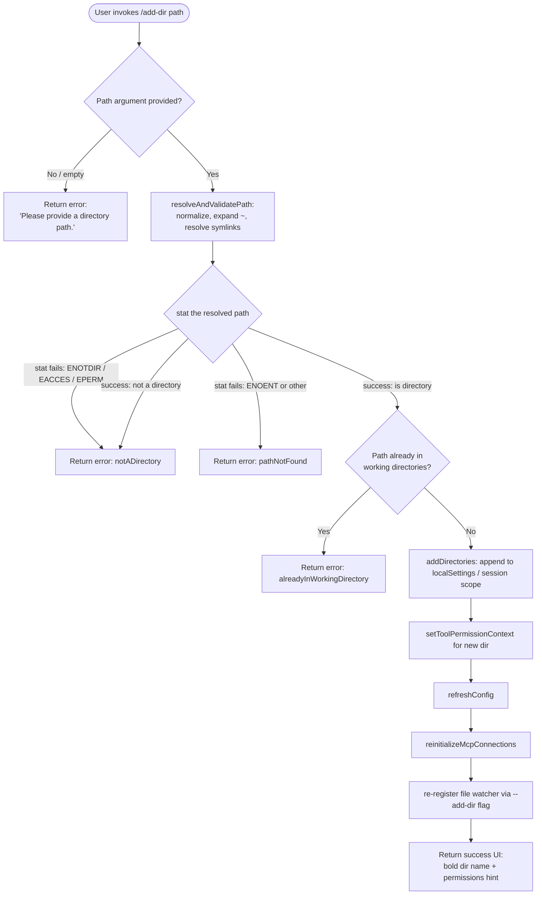

# `/add-dir`

> Analysis basis: CC v2.1.152 bundle.js (AST extraction + Claude interpretation)
> Minimum version: v2.1.152

---

## Overview

`/add-dir` adds a new working directory to the current Claude Code session. The user supplies a filesystem path (absolute, relative, or tilde-prefixed); the command validates and resolves it, registers it with the session's working-directory list, updates tool-permission context, refreshes configuration, and re-initializes MCP server connections and the file-watcher for the new directory.

---

## Registration

| Field | Value |
|---|---|
| type | `local-jsx` |
| name | `add-dir` |
| description | `Add a new working directory` |
| argumentHint | `<path>` |
| module_id | `xG1` |
| load_inline | `true` |
| loc_byte | `10668772` |
| loc_byte_end | `10668920` |
| loc_line | `8606` |
| arbor_handler.name | `IFL` |
| arbor_handler.fqn | `claude-2.1.152::IFL` |
| arbor_handler.kind | `AsyncFunction` |
| arbor_handler.resolution_path | `module_id` |
| arbor_handler.n_hits | `0` |

Analysis basis: CC v2.1.152 bundle.js:+10668772

---

## Input Branching

The handler has five distinct outcome branches (empty path, not-a-directory, path-not-found / permission-denied, already-in-working-directory, and success), so a Mermaid flowchart is used.



Analysis basis: CC v2.1.152 bundle.js:+10667553 (handler entry `IFL`), +3763549 (emptyPath branch), +3763647 (notADirectory), +3763792 (pathNotFound), +3763903 (alreadyInWorkingDirectory), +3763979 (success)

---

## Behavioral Spec

### 1. Handler entry — `addDirHandler` (`IFL`)

```
async function addDirHandler(args, context):
    rawPath = args[0]

    // Branch 1: empty input
    if rawPath is empty or whitespace:
        display error "Please provide a directory path."
        return

    // Resolve and validate the supplied path
    result = await resolveAndValidatePath(rawPath)   // fdH

    match result.status:
        "emptyPath"              → display error "Please provide a directory path."
        "notADirectory"          → display styled error (notADirectory message)
        "pathNotFound"           → display styled error (pathNotFound message)
        "alreadyInWorkingDirectory" → display styled notice
        "success"                →
            resolvedPath = result.path

            // Update session allowed_tools / disallowed_tools / avoid_prompts
            // dimensions via appState getAppState (V_)
            sessionState = getAppState()         // V_ → H.getAppState

            // Merge allowed_tools (uT8 → sA) and disallowed_tools (mT8 → sA)
            mergeToolPermissions(sessionState, resolvedPath)

            // Persist into localSettings / session scope
            appendWorkingDirectory(resolvedPath, scope="session")   // addDirectories literal

            // Update tool-permission context for new root
            setToolPermissionContext(resolvedPath)   // _.setToolPermissionContext

            // Rebuild permission-rule engine for new directory (bf)
            rebuildPermissionRules(resolvedPath)

            // Check bypass-permissions mode eligibility; log if rejected
            // "bypassPermissions" guard: if disableBypassPermissionsMode or session
            // not launched in bypassPermissions mode, emit advisory log
            guardBypassPermissions()

            // Determine whether path is already in watcher list (Y.includes)
            if resolvedPath not in watchedPaths:
                // Pass --add-dir flag to watcher subprocess (itq, literal "--add-dir")
                relaunchFileWatcher(flag="--add-dir", path=resolvedPath)

            // Refresh configuration from disk (MA.refreshConfig)
            await refreshConfig()

            // Re-initialize MCP server connections for new working root (q6H)
            await reinitializeMcpConnections(resolvedPath)

            // Write per-directory history / context files (sl_)
            await initializeDirectoryContext(resolvedPath)

            // Render success card
            displaySuccess(bold(resolvedPath), dim("· /permissions to manage"))
```

Analysis basis: CC v2.1.152 bundle.js:+10667553 (`IFL`), +10667589 (`addDirectories`), +10667636 (`localSettings`), +10667652 (`session`), +10667663 (`_.setToolPermissionContext`), +10667695 (`bf`), +10667710 (`$k`), +10667719 (`Y.includes`), +10667733 (`cq6`), +10667747 (`MA.refreshConfig`), +10667766 (`sl_`), +10667773 (`itq`), +10667807 (`q6H`), +10667825 (`P6.bold`), +10668111 (`P6.dim`), +10668118 (hint literal), +10668254 (did-not-add literal)

---

### 2. Path resolution — `resolveAndValidatePath` (`fdH`)

```
async function resolveAndValidatePath(rawPath):
    if rawPath is empty:
        return { status: "emptyPath" }

    // Normalize: strip surrounding whitespace, expand tilde, resolve symlinks
    normalizedPath = normalizePath(rawPath)      // Gq: trim, ~/expand, av.normalize,
                                                 //     av.join, av.resolve, av.isAbsolute

    // Stat the filesystem entry
    try:
        stats = await stat(normalizedPath)       // Ziq.stat
    catch error:
        if error.code in ["ENOTDIR", "EACCES", "EPERM"]:
            return { status: "notADirectory" }
        return { status: "pathNotFound" }

    if not stats.isDirectory():
        return { status: "notADirectory" }

    // Check duplicate
    currentDirs = getCurrentWorkingDirectories()
    canonicalNew = canonicalize(normalizedPath)  // bN path-canonicalization
    for each existingDir in currentDirs:
        if canonicalize(existingDir) == canonicalNew:
            return { status: "alreadyInWorkingDirectory" }

    return { status: "success", path: normalizedPath }
```

Analysis basis: CC v2.1.152 bundle.js:+10668305 (`fdH`), +3763568 (`jA8.resolve`), +3763602 (`Ziq.stat`), +3763647 (`notADirectory`), +3763737 (`ENOTDIR`), +3763752 (`EACCES`), +3763766 (`EPERM`), +3763792 (`pathNotFound`), +3763877 (`bN`), +3763903 (`alreadyInWorkingDirectory`), +3763979 (`success`)

---

### 3. Path normalization — `normalizePath` (`Gq`)

```
function normalizePath(rawPath):
    // Reject null bytes
    if rawPath.includes('\0'):
        throw TypeError("Path contains null bytes")     // literal at +1006030

    trimmed = rawPath.trim()

    // Windows-style drive letter handling (platform guard)
    if platform == "windows":
        trimmed = applyWindowsPathFixes(trimmed)        // c0H

    // Tilde expansion
    if trimmed.startsWith("~/"):
        home = os.homedir()                             // XU6.homedir
        trimmed = path.join(home, trimmed.slice(2))     // av.join, slice "~/"

    trimmed = path.normalize(trimmed)                   // av.normalize

    if not path.isAbsolute(trimmed):
        trimmed = path.resolve(trimmed)                 // av.resolve

    return trimmed
```

Analysis basis: CC v2.1.152 bundle.js:+1006024 (`Error`), +1006030 (null-bytes literal), +1006064 (`H.trim`), +1006086 (`av.normalize`), +1006137 (`XU6.homedir`), +1006171 (`q.startsWith`), +1006184 (`~/` literal), +1006197 (`av.join`), +1006219 (`q.slice`), +1006259 (`a6` — windows guard), +1006326 (`av.isAbsolute`), +1006390 (`av.resolve`)

---

### 4. Tool-permission rule rebuild — `rebuildPermissionRules` (`bf`)

```
function rebuildPermissionRules(newDir):
    // Obtain current rule state from appState
    existing = appState.getPermissionRules()

    // Merge allow / deny / ask rule sets
    applyRuleSet("allow",  rules=existing.alwaysAllowRules)   // literals +4646938, +4646946
    applyRuleSet("deny",   rules=existing.alwaysDenyRules)    // literals +4646978, +4646985
    applyRuleSet("ask",    rules=existing.alwaysAskRules)     // literal  +4647003

    // Supported mutation modes: addRules, replaceRules, removeRules
    //   addRules     → append new patterns              (+4646753)
    //   replaceRules → overwrite entire rule list       (+4647101)
    //   removeRules  → delete matching patterns         (+4647758)

    // Guard: if setMode == "bypassPermissions" and mode is unavailable,
    // emit advisory: "Ignoring permission update: setMode 'bypassPermissions'
    // rejected…"                                        (+4646477)

    // Remove any directories no longer in scope
    pruneRemovedDirectories(existing.removeDirectories)       // literal +4648142
```

Analysis basis: CC v2.1.152 bundle.js:+4646475 (`N`), +4646477 (bypass-permissions advisory literal), +4646753 (`addRules`), +4646938 (`allow`), +4646978 (`deny`), +4647003 (`alwaysAskRules`), +4647101 (`replaceRules`), +4647758 (`removeRules`), +4648142 (`removeDirectories`)

---

### 5. Directory context initialization — `initializeDirectoryContext` (`sl_`)

```
async function initializeDirectoryContext(dirPath):
    // Validate environment mode (production / test)
    mode = detectEnvironmentMode()       // sPH: "production" / "test"

    // Resolve real path (NFC-normalized Unicode)
    realDir = await fs.realpath(dirPath)
    realDir = realDir.normalize("NFC")   // literal +12835189

    // Locate or create context directory (ZD.join, ZD.dirname)
    contextDir = path.join(configRoot, derivedSubpath)

    // Read existing context file if present (d4.readFile, encoding "utf8")
    existing = await fs.readFile(contextFile, "utf8")   // literal +12835381

    // Write history entry  (hH — append to rolling history buffer)
    appendToHistory(existing)

    // Create parent directory if needed (d4.mkdir, mode 0o700 → 448 decimal)
    await fs.mkdir(parentDir, { recursive: true, mode: 448 })   // literal +12835505

    // Append new entry to context file (d4.appendFile, mode 0o600 → 384 decimal)
    await fs.appendFile(contextFile, entry, { mode: 384 })      // literal +12835572
```

Analysis basis: CC v2.1.152 bundle.js:+12835129 (`sl_` entry), +12835163 (`d4.realpath`), +12835189 (`NFC`), +12835338 (`ZD.join`), +12835367 (`d4.readFile`), +12835440 (`hH`), +12835463 (`d4.mkdir`), +12835505 (mode `448`), +12835544 (`d4.appendFile`), +12835572 (mode `384`)

---

### 6. MCP connection re-initialization — `reinitializeMcpConnections` (`q6H`)

```
async function reinitializeMcpConnections(newDir):
    // Collect currently active MCP server configs
    configs = getMcpServerConfigs()     // uP_

    // For each server, build connection descriptor (x8, Tg)
    for each serverConfig in configs:
        descriptor = buildConnectionDescriptor(serverConfig)   // Gq9 → QD6 → x8

        // Resolve the working root for this server (R07)
        resolvedRoot = resolveServerRoot(descriptor, newDir)

        // Normalize display path (Nz: escape backslashes, parens)
        displayPath = escapePath(resolvedRoot)

        // Check inclusion: skip if new dir already covered (f.has)
        if newDir in activeServerRoots:
            continue

        // Filter out disabled / incompatible transport modes
        // Supported transports: stdio, sse, http, sse-ide, ws-ide
        //   (literals +10162599, +10162633, +10162665, +10162698, +10162734)
        if serverConfig.status == "disabled":
            continue

        // Skip if cached needs-auth (literal +10163192, +10163258)
        if serverConfig.authState == "needs-auth":
            log("Skipping connection (cached needs-auth)")
            continue

        // Start / restart connection (lhH → MCP client lifecycle)
        await startMcpConnection(serverConfig)
```

Analysis basis: CC v2.1.152 bundle.js:+4648609 (`uP_`), +4648688 (`N`), +4648978 (`Gq9`), +4645706 (`QD6`), +4644731 (`zO`), +4644731 (`R07`), +10162497 (`disabled`), +10162599 (`stdio`), +10163192 (skip-cached-auth literal), +10163258 (`needs-auth`)

---

### 7. Success UI rendering

```
function renderSuccessCard(resolvedPath):
    line1 = bold(resolvedPath)                          // P6.bold  +10667825
    line2 = dim("· /permissions to manage")             // P6.dim   +10668111
    return JSX card combining line1 and line2

function renderFailureCard(reason):
    // reason is one of the status strings from resolveAndValidatePath
    // Generic fallback message: "Did not add a working directory." (+10668254)
    // Unknown runtime errors reported as "Unknown error"            (+10668010)
    return JSX error card
```

Analysis basis: CC v2.1.152 bundle.js:+10667825, +10668111, +10668254, +10668010

---

## State & Side Effects

| Item | Detail |
|---|---|
| Telemetry | `tengu_daemon_config_reload` emitted after config refresh (bundle.js:+15397117) |
| appState changes | `addDirectories` list updated (scope: `localSettings` / `session`) |
| Tool-permission context | `_.setToolPermissionContext` called for the new directory root |
| Permission rules | Allow / deny / ask rule sets rebuilt via `rebuildPermissionRules` |
| File watcher | Re-launched with `--add-dir <path>` flag when path is not already watched |
| Config refresh | `MA.refreshConfig` called; triggers `tengu_daemon_config_reload` |
| MCP connections | `reinitializeMcpConnections` cycles through all server configs for the new root |
| Directory context files | Created / appended under config root; directories at mode `0o700` (448), files at mode `0o600` (384) |
| History buffer | Rolling history appended via `hH`; managed with shift/push queue (`UtK`) |
| Sound | None detected in depth-2 traversal |

---

## Version History

| Version | Change |
|---|---|
| v2.1.152 | Initial analysis |

---

## Common Mistakes

1. **Omitting the path argument** — invoking `/add-dir` with no argument produces the error "Please provide a directory path." and exits immediately; no state is modified.
2. **Supplying a file path instead of a directory** — the command stats the target and returns a `notADirectory` error if `stats.isDirectory()` is false, even if the path exists.
3. **Using a path already in the working-directory list** — the canonicalization check (`bN`) will detect duplicates after symlink resolution and return `alreadyInWorkingDirectory` without modifying state.
4. **Tilde paths without a slash** — only `~/…` is expanded to the home directory; a bare `~` or `~username` is not handled by the tilde-expansion branch and will be passed to `path.normalize`/`path.resolve` as-is.
5. **Paths containing null bytes** — rejected immediately with a `TypeError` before any filesystem operation.
6. **Expecting instant MCP reconnect** — `reinitializeMcpConnections` is async and iterates all configured servers; connections flagged `needs-auth` are silently skipped.

---

## Appendix — Identifier Mapping

> For bundle debugging only. Identifiers change across versions.

| Identifier | Role |
|---|---|
| `IFL` | Main async handler for `/add-dir` (addDirHandler) |
| `V_` | getAppState wrapper; reads session state object |
| `uT8` | Merge allowed_tools list into session state |
| `mT8` | Merge disallowed_tools list into session state |
| `sA` | Low-level state setter shared by uT8 / mT8 |
| `bf` | rebuildPermissionRules — permission rule engine refresh |
| `N` | Core permission-rule application function |
| `OyK` | Rule parser / rule-set evaluator |
| `xMA` | Rule normalization helper |
| `CH` | JSON serialization helper (JSON.stringify wrapper) |
| `j4` | Path/key formatting utility |
| `Y$A` | Rule mapping helper |
| `VxH` | Output write helper |
| `e3A` | Buffered write wrapper |
| `DyK` | File-write orchestrator (manages temp file, rename, append) |
| `obH` | Write-queue / debounce scheduler |
| `cqH` | Queued-write callback handler |
| `Q96` | File size / byte-length checker |
| `G$A` | Config-path join helper |
| `W$A` | Atomic rename helper (stat → rename → unlink) |
| `YyK` | mkdir + appendFile sequence for new files |
| `tq` | CMA (config-manager agent) registration trigger |
| `qf` | Path display formatter |
| `d84` | Backslash / special-char replacer for display |
| `$k` | Permission-context key extractor |
| `Y` | Watcher / supervisor process handle |
| `rPH` | File-watcher process spawner |
| `A1` | Async-local-storage context reader |
| `L8` | Error code classifier |
| `aHA` | Watcher argument builder |
| `GH` | String coercion utility |
| `Ao1` | Column-width calculator for display |
| `T` | Supervisor session controller |
| `O0` | Session stop / restart orchestrator |
| `l_` | Full session reload function |
| `Z` | Watcher lifecycle object (stop / updateConfig / start) |
| `JGK` | Heartbeat / keepalive manager |
| `se` | Heartbeat tick handler |
| `cq6` | Session flags reader |
| `sl_` | initializeDirectoryContext — per-dir context file writer |
| `sPH` | Environment mode detector (production / test) |
| `uH` | String coercion / normalization utility |
| `Et1` | Test-environment guard |
| `gC` | Config-root path resolver |
| `j8` | EISDIR / error code guard |
| `oh` | Platform detection helper |
| `pv` | OS platform string reader |
| `z_` | Permission-bits helper |
| `hH` | History-buffer append function |
| `n_` | Error string extractor |
| `V1` | History entry formatter |
| `mGA` | History serializer |
| `UtK` | Rolling-queue manager (shift / push) |
| `itq` | File-watcher re-launch orchestrator |
| `aw` | Watcher cache invalidation (YYH.delete) |
| `n9` | Watcher config reader / state machine |
| `B6` | JSON parse wrapper |
| `d5` | Watcher config writer |
| `dO` | Atomic config file writer (randomBytes temp name) |
| `q6H` | reinitializeMcpConnections — MCP server restart driver |
| `uP_` | MCP server config collector |
| `Gq9` | MCP connection descriptor builder |
| `QD6` | MCP transport selector |
| `x8` | MCP connection constructor |
| `R07` | Server root resolver for MCP |
| `zO` | MCP path normalizer |
| `S3` | Filesystem type checker (isFIFO, isSocket, etc.) |
| `OP` | Path permission checker |
| `x07` | MCP display-path formatter |
| `Nz` | Path escaper (backslash, parens) |
| `l84` | Escape prefix handler |
| `uE` | Object.hasOwn guard |
| `n84` | Escape mid-string handler |
| `c84` | replaceAll-based path escaper |
| `f` | MCP server registry (has / get / values) |
| `lhH` | MCP client lifecycle manager (connect / reconnect) |
| `dPK` | MCP update applicator (applyMcpUpdate) |
| `yR5` | MCP server state synchronizer |
| `fdH` | resolveAndValidatePath — path validation entry point |
| `Gq` | normalizePath — tilde expansion, normalize, resolve |
| `b6` | Async-local-storage context reader for path ops |
| `KU6` | Context store getter |
| `Gr` | Permission-bits resolver for directory |
| `bN` | Path canonicalization (symlink, /var/→/tmp rewrite) |
| `B0` | Case-fold helper (toLowerCase) |
| `x8A` | Platform-specific path adjuster |
| `Dg` | Canonicalized-path comparator |
| `$dH` | Success-card JSX renderer |

---

Note: index built via Arbor fallback; some signals (telemetry, literals) may be missing — see arbor-fallback.js.