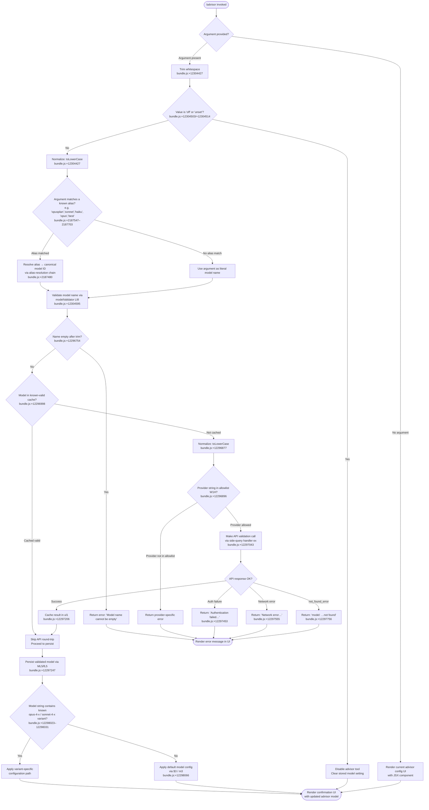

# `/advisor`

> Analysis basis: CC v2.1.153 bundle.js (AST extraction + Claude interpretation)
> Minimum version: v2.1.153

---

## Overview

The `/advisor` command configures the **Advisor Tool**, a feature that allows Claude Code to consult a stronger model for guidance at key decision points during a task. When invoked, it renders a JSX-based configuration UI (type `local-jsx`) that lets the user select or validate the advisor model, validate the model name against the API, and persist the setting into session state. The command is the primary entry point for enabling, disabling, or switching the advisor model during an active Claude Code session.

---

## Registration

| Field | Value |
|---|---|
| type | `local-jsx` |
| name | `advisor` |
| description | Configure the Advisor Tool to consult a stronger model for guidance at key moments during a task |
| loc_byte | `12304971` |
| loc_byte_end | `12305258` |
| loc_line | `9228` |
| argumentHint | `null` |
| isHidden | `null` |
| module_id | `Fl1` |
| load_inline | `true` |
| arbor_handler.name | `PL5` |
| arbor_handler.fqn | `claude-2.1.153::PL5` |
| arbor_handler.kind | `AsyncFunction` |
| arbor_handler.resolution_path | `module_id` |
| arbor_handler.n_hits | `1` |

Analysis basis: CC v2.1.153 bundle.js:+12304971

---

## Input Branching

The command's handler `PL5` produces distinct behaviour along several axes: whether the user provides an argument (a model name string), whether the argument maps to a known alias, whether the name passes API validation, and whether the advisor is being disabled/unset. Four or more distinct paths exist, so a flowchart is used.



---

## Behavioral Spec

### Top-level handler — advisorHandler (PL5)

`PL5` is an `AsyncFunction` resolved via `module_id` → `Fl1`.

Analysis basis: CC v2.1.153 bundle.js:+12304427

```
async function advisorHandler(input):
    rawArg = input.args.trim()                  // bundle.js:+12304427

    if rawArg is "off" or rawArg is "unset":    // bundle.js:+12304503, +12304514
        disableAdvisorTool()
        return renderAdvisorUI(state={disabled: true})

    normalizedArg = rawArg.toLowerCase()

    resolvedModel = resolveModelAlias(normalizedArg)   // calls L1
    if resolvedModel is null:
        resolvedModel = normalizedArg

    validationResult = await validateModelName(resolvedModel)  // calls LI8
    if validationResult.error:
        return renderErrorUI(validationResult.message)

    persistAdvisorModel(validationResult.canonicalId)  // calls ML5 → fL5
    return renderAdvisorUI(
        element = SJ.createElement(...),        // bundle.js:+12304463
        joinedDisplay = DiH.join(...)           // bundle.js:+12304738
    )
```

---

### Alias resolution — aliasResolver (L1)

Analysis basis: CC v2.1.153 bundle.js:+12304581

Known short-name aliases found in literals:

| Alias | Notes |
|---|---|
| `opusplan` | bundle.js:+2187547 |
| `[1m]` | bundle.js:+2187573 |
| `sonnet` | bundle.js:+2187588 |
| `haiku` | bundle.js:+2187627 |
| `opus` | bundle.js:+2187666 |
| `best` | bundle.js:+2187703 |

```
function aliasResolver(normalizedInput):
    // Normalize to lowercase
    lower = normalizedInput.toLowerCase()       // bundle.js:+2187462

    // Check provider prefix
    if lower.startsWith("anthropic."):          // bundle.js:+2181693
        strip prefix and continue

    // Check model alias table via f0 → E1H → xH
    canonicalId = lookupAliasTable(lower)       // bundle.js:+2187480

    if canonicalId found:
        // Apply provider-specific encoding via WN → m3/$3
        return encodeForProvider(canonicalId)   // bundle.js:+2187565

    // Check if input already looks like a versioned model string
    // (contains "sonnet", "haiku", "opus", "best" as substrings)
    if containsKnownFamily(lower):              // bundle.js:+2187588–2187703
        // Map to canonical via SBH → $3       bundle.js:+2187642
        return resolveByFamily(lower)

    // Check via TZ / K3q for remaining patterns
    // bundle.js:+2187680, +2187717
    result = resolveViaTZ(lower)
    if result: return result

    // Apply replacement normalization pass
    // bundle.js:+2187793
    return applyReplacementNorm(lower)
```

---

### Model name validation — modelValidator (LI8)

Analysis basis: CC v2.1.153 bundle.js:+12304595

```
async function modelValidator(candidateModel):
    trimmed = candidateModel.trim()             // bundle.js:+12296717

    if trimmed is empty:
        return {error: true, message: "Model name cannot be empty"}
                                                // bundle.js:+12296754

    lower = trimmed.toLowerCase()               // bundle.js:+12296877

    // Check provider allowlist W1H
    if NOT W1H.includes(lower):                 // bundle.js:+12296896
        return {error: true, message: providerError}

    // Check in-memory validation cache ul1
    if ul1.has(lower):                          // bundle.js:+12296998
        return {ok: true, canonicalId: ul1.get(lower)}

    // Perform live API probe via ex (side_query)
    probeResult = await sideQueryProbe(lower)   // bundle.js:+12297043

    match probeResult:
        case AUTH_FAILURE:
            return {error: true,
                    message: "Authentication failed. Please check your API credentials."}
                                                // bundle.js:+12297453
        case NETWORK_ERROR:
            return {error: true,
                    message: "Network error. Please check your internet connection."}
                                                // bundle.js:+12297555
        case not_found_error:                   // bundle.js:+12297674
            return {error: true,
                    message: "model: " + lower} // bundle.js:+12297756
        case SUCCESS:
            ul1.set(lower, canonicalId)         // bundle.js:+12297206
            return {ok: true, canonicalId}
```

---

### Advisor model persistence — modelPersister (ML5 → fL5)

Analysis basis: CC v2.1.153 bundle.js:+12297247

```
function modelPersister(canonicalId):
    // Delegate to fL5 for actual write
    fL5(canonicalId)                            // bundle.js:+12297302

function fL5(modelId):
    // Resolve base model via m3
    base = resolveBaseModel(modelId)            // bundle.js:+12297975

    lowerModel = modelId.toLowerCase()          // bundle.js:+12297993

    // Check for opus-4-x variant strings
    // bundle.js:+12298023–12298185
    if lowerModel.includes("opus-4-7") or lowerModel.includes("opus_4_7"):
        applyVariantConfig("opus-4-7")
    elif lowerModel.includes("opus-4-6") or ...:
        applyVariantConfig("opus-4-6")
    elif lowerModel.includes("opus-4-5") or ...:
        applyVariantConfig("opus-4-5")
    // Check for sonnet-4-x variants
    // bundle.js:+12298230–12298331
    elif lowerModel.includes("sonnet-4-6") or ...:
        applyVariantConfig("sonnet-4-6")
    elif lowerModel.includes("sonnet-4-5") or ...:
        applyVariantConfig("sonnet-4-5")
    else:
        // Default path via $3
        applyDefaultModelConfig(modelId)        // bundle.js:+12298066

    // String-encode final config
    ML5(String(finalConfig))                    // bundle.js:+12297943
```

---

### Side-query API probe — sideQueryProbe (ex)

Analysis basis: CC v2.1.153 bundle.js:+12297043

`ex` is the depth-2 entry for live model validation. It performs a lightweight API call (`side_query` — literal found at bundle.js:+13103592) to verify that a given model ID is accessible under the current authentication context.

```
async function sideQueryProbe(modelId):
    // Build probe request body (1024-byte cap observed)
    // bundle.js:+13103408
    payload = buildSideQueryPayload(modelId, maxSize=1024)

    // Check global fetch availability
    // bundle.js:+13103645
    if NOT globalThis.fetch available:
        return NETWORK_ERROR

    // Hash the model string for dedup cache
    // via mAA → U6K.createHash("sha256")
    // bundle.js:+13103753, +13058311, +13058326
    hash = sha256(modelId).slice(0,4+7)

    // Probe via Rp (API client)
    // bundle.js:+13103560
    response = await apiClient.request(payload)

    // Parse response for auth / not_found / success
    // bundle.js:+13104190 (I88), +13104247 (Array.isArray)
    return classifyProbeResponse(response)
```

---

### Provider/model normalization utilities

Analysis basis: CC v2.1.153 bundle.js:+2181540 (ag), +2043067 (m3), +2044572 ($3)

- **ag** — high-level model-string normalizer: trims, lowercases, validates `anthropic.` prefix (bundle.js:+2181693), checks `claude-` prefix (bundle.js:+2181314), delegates to `hBH`, `q3q`, `qb4`, `G1H`, `L1`, `Kb4`.
- **m3** — resolves a model string to a canonical internal representation via `IA` → `xH` (bundle.js:+2043067).
- **$3** — compound resolver that chains `$xH`, `Ih4`, `tqq`, `_i6`, `IA` to produce the final provider-annotated model descriptor (bundle.js:+2044572).
- **DX6** — provider-aware model inclusion check: lowercases input and checks against an includes-list (bundle.js:+12304669, +5309884, +5309907). Called directly from `PL5` (bundle.js:+12304669).

---

### UI rendering

Analysis basis: CC v2.1.153 bundle.js:+12304463

`PL5` calls `SJ.createElement(...)` (bundle.js:+12304463) to produce the JSX tree returned as the command's output. The display string is composed by joining elements from `DiH` (bundle.js:+12304738). The exact component tree is not recoverable at depth 2 without further traversal.

---

## State & Side Effects

| Item | Detail |
|---|---|
| Telemetry | `tengu_bg_dispatch_sigkill_escalate` (bundle.js:+15386200); `tengu_bg_dispatch_low_mem` (+15386779); `tengu_bg_spare_enable` (+15387474); `tengu_bg_spare_claim` (+15387595); `tengu_bg_spare_claim_fail` (+15387858); `tengu_bg_proto_mismatch` (+15374533); `tengu_bg_dispatch_stale_drop` (+15375772); `tengu_bg_attach_legacy_autorespawn` (+15377848); `tengu_bg_attach` (+15378259); `tengu_bg_attach_stall_gave_up` (+15379176); `tengu_bg_attach_stall_respawn` (+15379445); `tengu_bg_attach_kick` (+15380362); `tengu_prompt_cache_1h_config` (+13064699); `tengu_api_success` (+13105043) |
| Validation cache | Successful model validations are stored in `ul1` (a `Map`) keyed by lowercased model name; `ul1.has` / `ul1.set` at bundle.js:+12296998 / +12297206 |
| Advisor state | Calling `/advisor off` or `/advisor unset` clears the advisor model; string literals `"off"` (+12304503) and `"unset"` (+12304514) are the recognized disable tokens |
| API side effects | A lightweight `side_query` API call is issued for unknown models; uses `fetch` / `globalThis.fetch` (+13103645) with the current session auth headers via `Rp` |
| Console logging | `console.error` used in auth-helper timeout path (+1775487) and SDK error path (+2913767) |
| appState changes | Advisor model is persisted via `fL5` → `$3` / `m3` chains; changes are reflected in the active session model configuration |
| Sound | <!-- TODO: not found in depth-2 traversal; needs --depth 4 --> |
| Hook registration | <!-- TODO: not found in depth-2 traversal; needs --depth 4 --> |

---

## Version History

| Version | Change |
|---|---|
| v2.1.153 | Initial analysis |

---

## Common Mistakes

1. **Using `/advisor` without arguments to disable it.** The command without arguments opens the configuration UI — it does not disable the advisor. Use `/advisor off` or `/advisor unset` to turn it off (bundle.js:+12304503, +12304514).
2. **Providing a partial model name without a recognized alias.** If the input does not match an alias (`opusplan`, `sonnet`, `haiku`, `opus`, `best`) and is not a complete API model ID, the validator will reject it with a "not_found_error" response. Always use a full model identifier or a recognized alias.
3. **Expecting instant effect with an uncached model name.** When the model name has not been validated before, a live API round-trip (`side_query`) is performed. Network errors or credential issues will block the command from completing.
4. **Case sensitivity confusion.** The handler normalizes input to lowercase internally (bundle.js:+12304427, +12296877), but the validated canonical ID stored in `ul1` is also lowercase. Providing a mixed-case model name is safe — it will be normalized — but the stored key will differ from a verbatim Anthropic model ID string.
5. **Confusing `/advisor` with `/model`.** `/advisor` configures a secondary "consultant" model used at key moments during a task, not the primary model used for the session.

---

## Appendix — Identifier Mapping

> For bundle debugging only. Identifiers change across versions.

| Identifier | Role |
|---|---|
| `PL5` | Top-level advisor command handler (AsyncFunction) |
| `L1` | Model alias resolver |
| `LI8` | Model name validator (API + cache) |
| `ML5` | Model persistence outer wrapper |
| `fL5` | Model persistence inner worker (variant dispatch) |
| `DX6` | Provider-aware model inclusion checker |
| `ag` | High-level model-string normalizer |
| `m3` | Canonical model-ID resolver |
| `$3` | Provider-annotated model descriptor composer |
| `$xH` | Sub-resolver used by `$3` |
| `Ih4` | Chained resolver inside `$3` |
| `tqq` | Object.entries-based resolver used by `$3` |
| `_i6` | Candidate-find resolver (uses `b__.find`) |
| `WN` | Model-normalization wrapper calling `m3` / `$3` |
| `SBH` | Family-based model resolver (calls `$3`) |
| `TZ` | Fallback model resolver (calls `m3` / `$3`) |
| `K3q` | Secondary resolver wrapping `TZ` |
| `Cr6` | `Mb4.includes` model-check utility |
| `RBH` | Replacement-normalization helper |
| `G1H` | Provider-allowlist checker (`W1H.includes`) |
| `hBH` | Prefix-allowlist checker (`Ab4.includes`) |
| `q3q` | indexOf-based model-position resolver |
| `qb4` | Includes + G1H + L1 combined resolver |
| `Kb4` | G1H / L1 / A3q / startsWith compound resolver |
| `A3q` | `startsWith`-based candidate filter |
| `ex` | Side-query API probe (live model validation) |
| `Rp` | Core API client |
| `sD` | Store-access helper (`M3q.getStore`) |
| `Lt4` | String split/trim/slice utility |
| `N9` | Background context helper |
| `ci` | Error-formatting helper (calls `br6`) |
| `y6` | Flag-check helper |
| `M9_` | URI encoding helper |
| `JO` | Response classifier (calls `cf_`) |
| `z3q` | Boolean coercion helper |
| `Hw` | Auth header builder |
| `qt4` | Auth token packager |
| `S_` | Session state reader |
| `ad6` | Proxy-auth helper with trust check |
| `$t4` | Request state tracker (UUID, Map) |
| `oD` | Object-descriptor helper |
| `Nz` | Token / credential normalizer |
| `Kt4` | Request retry / backoff logic |
| `XOH` | Timestamp / promise cache handler |
| `ku8` | `Date.now` timestamp wrapper |
| `MO6` | Authorization header normalizer |
| `LzH` | SDK error logger |
| `le6` | Promise resolution chain helper |
| `h` | Blur/focus timing tracker |
| `I` | Away-summary logic controller |
| `E` | Request skip/default controller |
| `lWH` | Agent-type prefix finder |
| `l2` | `m$` wrapper |
| `RP` | OAuth-aware request handler |
| `cBH` | Provider-type dispatcher |
| `Yo6` | WIF/fetch credential resolver |
| `G` | Token retrieval handler |
| `X` | IPC buffer/stream processor |
| `J` | Stream-line parser |
| `w` | Daemon process manager |
| `NM` | Stream end/error handler |
| `jm5` | IPC message dispatcher (ping/nudge/yield/lease/kill/resize/attach) |
| `EH` | String coercion utility |
| `eZH` | Provider-detection + oD wrapper |
| `B9` | Provider-flag resolver |
| `cS` | `IA` gateway wrapper |
| `T` | MCP server type list |
| `yV6` | MCP server type validator |
| `mC8` | MCP type helper |
| `uj5` | H/A `.find` search utility |
| `mAA` | SHA-256 hash helper |
| `ur6` | Context header builder (`c1`, `IA`, `br6`) |
| `c1` | String constructor wrapper |
| `br6` | AsyncLocalStorage store getter |
| `I88` | `IA` wrapper |
| `WIH` | Prompt-cache / token-window builder |
| `GA` | `Hw` / `yb` / `dq` composite |
| `Lm8` | Memory metrics helper |
| `T6` | Token-budget tracker |
| `Mm8` | Message-metadata helper |
| `gG` | `uf_` / `tZH` composition helper |
| `uf_` | `IA` normalizer |
| `tZH` | `xH` + `Ffq` formatter |
| `w8K` | Request encoding helper |
| `VP` | Model-string replacer |
| `_H8` | `ae` / `B9` includes composite |
| `TP` | Content-map helper |
| `RYH` | Response array parser |
| `RH` | JSON.stringify wrapper |
| `up` | Random-bytes ID generator |
| `d7` | `Hw` / `b6` composite |
| `XfH` | Response timestamp helper |
| `c` | General context accumulator |
| `cj6` | Cache-control wrapper (`cL9` / `dj6`) |
| `cL9` | `iv7` / `yH` cache helper |
| `dj6` | Cache-control variant helper |
| `Ud` | Agent-ID resolver |
| `nv7` | Built-in agent-prefix handler |
| `N6H` | `startsWith`-based agent type checker |
| `yH` | Error-logging model helper |
| `_96` | Tail helper |
| `xH` | Low-level string builder |
| `IA` | Internal API helper |
| `o_` | `Ap` object helper |
| `Ai6` | Object.entries model-map builder |
| `E1H` | `xH` wrapper |
| `f0` | Alias-table lookup via `E1H` |

---

Note: index built via Arbor fallback; some signals (telemetry, literals) may be missing — see arbor-fallback.js.