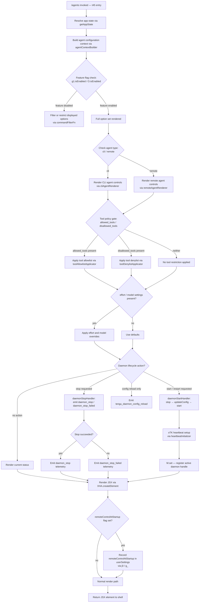

# `/agents`

> Analysis basis: CC v2.1.153 bundle.js (AST extraction + Claude interpretation)
> Minimum version: v2.1.153

---

## Overview

The `/agents` command provides a management interface for agent configurations within Claude Code. It renders a JSX-based UI component (type `local-jsx`) that allows users to view, configure, and control agent instances — including daemon lifecycle management, tool-access policy editing, and feature-flag gating. The command surfaces a rich set of sub-operations covering allowed/disallowed tool lists, effort and model settings, background daemon stop/start cycles, and remote-control status.

---

## Registration

| Field | Value |
|---|---|
| type | `local-jsx` |
| name | `agents` |
| description | `Manage agent configurations` |
| module_id | `$c1` |
| load_inline | `true` |
| loc_byte | `12241719` |
| loc_byte_end | `12241844` |
| loc_line | `9197` |
| arbor_handler.name | `t45` |
| arbor_handler.fqn | `claude-2.1.153::t45` |
| arbor_handler.kind | `AsyncFunction` |
| arbor_handler.resolution_path | `module_id` |
| arbor_handler.n_hits | `0` |

Analysis basis: CC v2.1.153 bundle.js:+12241719

---

## Input Branching

The command handler (`t45`) fans out into multiple distinct execution paths depending on agent state, feature flags, daemon status, and tool-policy context. There are well over three distinct branches, so a Mermaid flowchart is used below.



Analysis basis: CC v2.1.153 bundle.js:+12241553 (t45→T_ edge), +12241561 (t45→zv edge), +12241574 (XHA.createElement call)

---

## Behavioral Spec

### 1. Handler Entry and App-State Resolution

The top-level async handler (`t45`) is the Arbor-resolved entry point. It immediately delegates to two co-routines: `agentStateResolver` (mapped from `T_`) to read current application state, and `agentComponentBuilder` (mapped from `zv`) to construct the full component tree.

```
async function agentCommandHandler():
    appState = agentStateResolver()          // reads live app state
    componentTree = agentComponentBuilder(appState)
    element = XHA.createElement(componentTree)
    return element
```

Analysis basis: CC v2.1.153 bundle.js:+12241553, +12241561, +12241574

---

### 2. App-State Resolution (`agentStateResolver` / `T_`)

`agentStateResolver` calls `H.getAppState` to obtain the live application state snapshot, then invokes two helper routines:

- `toolAllowlistReader` (`pZ8`) — reads the `"allowed_tools"` field from state (Analysis basis: +10638573)
- `toolDenylistReader` (`UZ8`) — reads the `"disallowed_tools"` field from state (Analysis basis: +10638628)

Both helpers delegate to `sA` (a shared state-accessor utility).

```
function agentStateResolver():
    state = H.getAppState()
    allowedTools  = toolAllowlistReader(state)   // key: "allowed_tools"
    disallowedTools = toolDenylistReader(state)  // key: "disallowed_tools"
    return { state, allowedTools, disallowedTools }
```

Additionally, `T_` is reachable from the randomized jitter path (`H → Math.random`, `H → setTimeout`) suggesting that the state-refresh cycle uses a randomized back-off interval.

Analysis basis: CC v2.1.153 bundle.js:+10638465, +10638573, +10638628, +13359476, +13359513

---

### 3. Agent-Type Discrimination and Configuration Building (`agentContextBuilder` / `G0`)

`agentContextBuilder` distinguishes between `"cli"` and `"remote"` agent types (Analysis basis: +4694798, +4694809). It calls:

- `connectionTypeResolver` (`xH`) — normalises the connection string
- `booleanCoercer` (`c1`) — coerces boolean-like values (`"yes"`/`"on"` → true, `"no"`/`"off"` → false; Analysis basis: +26948, +26954, +27099, +27104)
- `featureFlagTable` (`T6`) — looks up and caches feature-flag states
- Telemetry emission: **`tengu_slate_harbor`** fires within this path (Analysis basis: +4694828)

```
function agentContextBuilder(rawConfig):
    connType = connectionTypeResolver(rawConfig)   // "cli" or "remote"
    boolFields = booleanCoercer(rawConfig)
    flags = featureFlagTable(connType)
    emit("tengu_slate_harbor")
    return { connType, boolFields, flags }
```

Analysis basis: CC v2.1.153 bundle.js:+4694646, +4694663, +4694708, +4694825, +4694798, +4694809

---

### 4. Feature-Flag Table (`featureFlagTable` / `T6`)

`featureFlagTable` maintains a registry (`WzH`) of enabled flags and a processed set (`PO_`, `zz6`). For each flag it:

1. Checks `WzH.has` to see if the flag is already registered (Analysis basis: +3183845)
2. If not cached, calls `featureFlagEntryBuilder` (`O88`) which consults `PO_` (processed set), `WzH.get`, `PO_.add`, and two factory helpers (`XO_`, `ZO_`) (Analysis basis: +3181394–+3181519)
3. Adds the result to `zz6` (Analysis basis: +3183868)
4. Uses `vQ.has` / `vQ.get` to check a secondary flag cache (Analysis basis: +3183882, +3183899)
5. Delegates to `featureFlagActivator` (`b6`) which calls `Date.now` for timestamp-based flag expiry (Analysis basis: +3203071)
6. Emits **`tengu_slate_harbor`** (telemetry for feature-flag resolution; Analysis basis: +4694828)

```
function featureFlagTable(connType):
    for each flag in featureFlagRegistry:
        if not flagCache.has(flag):
            entry = featureFlagEntryBuilder(flag)
            flagCache.add(flag)
        if secondaryCache.has(flag):
            existing = secondaryCache.get(flag)
        else:
            activated = featureFlagActivator(flag, Date.now())
            secondaryCache.set(flag, activated)
    return resolvedFlags
```

Analysis basis: CC v2.1.153 bundle.js:+3183755, +3183792, +3183827, +3183845, +3183856, +3183868, +3183882, +3183899, +3183919

---

### 5. Daemon Lifecycle Management (`daemonLifecycleManager` / `Y`)

`daemonLifecycleManager` is the central daemon-control sub-system. It orchestrates:

| Operation | Internal call | Key literal |
|---|---|---|
| Write daemon config | `q.write` | — |
| Stop a running daemon | `G.stop` | `"daemon_stop"` (+15422261) |
| Handle stop failure | `uH` path | `"daemon_stop_failed"` (+15422298) |
| Delete daemon entry | `M.delete` | — |
| Stop existing before restart | `E.stop` | — |
| Apply updated config | `E.updateConfig` | — |
| Restart daemon | `E.start` | — |
| Register heartbeat | `oTK → JHH` | `"heartbeat"` (+15399415) |
| Register in active map | `M.set` | — |
| Start new daemon handle | `V.start` | — |
| Emit config-reload telemetry | `c` path | `"tengu_daemon_config_reload"` (+15400987) |

```
async function daemonLifecycleManager(action, daemonConfig):
    if action == STOP:
        result = await G.stop()
        if result.ok:
            emit("daemon_stop")
        else:
            emit("daemon_stop_failed")
        M.delete(daemonId)

    elif action == RESTART:
        await E.stop()
        await E.updateConfig(daemonConfig)
        newHandle = await E.start()
        heartbeatInitializer(newHandle)   // oTK → JHH, key "heartbeat"
        M.set(daemonId, newHandle)
        await V.start()

    elif action == CONFIG_RELOAD:
        q.write(daemonConfig)
        emit("tengu_daemon_config_reload")

    return renderCurrentStatus()
```

Analysis basis: CC v2.1.153 bundle.js:+15400186, +15400462, +15400471, +15400582, +15400591, +15400609, +15400711, +15400756, +15400767, +15400987, +15422261, +15422298, +15399415

---

### 6. Daemon Stop with Background-Session Guard (`daemonStopController` / `z`)

`daemonStopController` wraps the stop flow with three specialised handlers and a race/timeout:

- `daemonStopEmitter` (`SH`) — emits `"daemon_stop"` event (Analysis basis: +15422261)
- `daemonStopFailedEmitter` (`uH`) — emits `"daemon_stop_failed"` (Analysis basis: +15422298)
- `daemonControlEmitter` (`Dy`) — emits **`tengu_daemon_control`** telemetry (Analysis basis: +15422336); internally uses `tb → qR` and the `JO_` path which calls `wO_.randomUUID` and `H.emit`
- `daemonShutdownRacer` (`wm`) — runs `Promise.race([Promise.all([...]), timeout])` with a **500 ms** timeout constant (Analysis basis: +15417474); calls `process.exit` on unrecoverable failure

The literal `"background session"` (+15422213) and `"stopped"` (+15422170) are status strings checked before stop is attempted.

```
async function daemonStopController(daemonId):
    status = getDaemonStatus(daemonId)
    if status == "stopped":
        return  // no-op

    if status == "background session":
        // guard: cannot stop a background session directly
        emitDaemonControlTelemetry("tengu_daemon_control")
        return

    try:
        result = await daemonShutdownRacer(
            Promise.race([
                Promise.all([shutdownFn(daemonId)]),
                timeoutPromise(500)             // 500 ms hard limit
            ])
        )
        daemonStopEmitter()                     // "daemon_stop"
    catch:
        daemonStopFailedEmitter()               // "daemon_stop_failed"
```

Analysis basis: CC v2.1.153 bundle.js:+15422258, +15422281, +15422333, +15422387, +15417432, +15417446, +15417459, +15417464, +15417471, +15417513, +15417474

---

### 7. Tool-Policy Resolution (`commandFilterFn` / `Q_H` + `toolPolicyResolver` / `AE6`)

Tool-access policies are resolved via two functions:

- `commandFilterFn` (`Q_H`) — filters the command list using `H.filter`, then calls `toolPolicyResolver` (Analysis basis: +9578683, +9578698)
- `toolPolicyResolver` (`AE6`) — builds the final policy from two sources:
  - `toolSearchBuilder` (`G5H`) — uses `_Z8.flatMap` and `BO`; filters entries with `"deny"` action (+10352320)
  - `toolNarrowingBuilder` (`Fl_`) — handles `"cliArg"` (+10352906) and `"toolsNarrowing"` (+10352927) sources; uses `Pr8`, `NL6`, `xS`
  - `toolPolicyComposer` (`IW1`) — merges the two sets into a unified policy

```
function toolPolicyResolver(commands, state):
    searchPolicy = toolSearchBuilder(state)        // flatMap + deny filter
    narrowingPolicy = toolNarrowingBuilder(state)  // cliArg + toolsNarrowing
    return toolPolicyComposer(searchPolicy, narrowingPolicy)
```

The literal `"avoid_prompts"` (+10638689), `"effort"` (+10638791), and `"model"` (+10638804) are also read from state during this phase as agent-level configuration keys.

Analysis basis: CC v2.1.153 bundle.js:+9578683, +9578698, +10352243, +10352320, +10352580, +10352906, +10352927, +10352969, +10352986, +10353010

---

### 8. Agent-Type Renderer (`agentTypeRenderer` / `wg_`)

`agentTypeRenderer` renders platform-specific controls:

- Calls `platformTypeResolver` (`xR`) which checks for `"windows"` platform (+4799032), reads connection type (`c1`, `xH`), checks `I9H` (a platform introspection helper), and `T6` (feature flags) (Analysis basis: +4799025–+4799123)
- Telemetry: emits **`tengu_cobalt_ridge`** (Analysis basis: +4799126)
- Calls `ctH` (a context-aware rendering helper) and `W_` (the module-loader / React-context provider)

```
function agentTypeRenderer(agentConfig):
    platform = platformTypeResolver(agentConfig)   // "windows" check
    emit("tengu_cobalt_ridge")
    context = ctH(platform)
    return W_(context)
```

Analysis basis: CC v2.1.153 bundle.js:+9579265, +9579289, +9579295, +4799032, +4799126

---

### 9. Agent SDK and Team-Agent Path (`agentSdkResolver` / `Ua`)

`agentSdkResolver` handles SDK-type agent connections. It checks for agent types:
- `"sdk-ts"` (+5223810), `"sdk-py"` (+5223824), `"sdk-cli"` (+5223838), `"local-agent"` (+5223853)

It further checks for the `--agent-teams` CLI argument literal (+5351343) — indicating support for team-based agent configurations — and emits **`tengu_amber_flint`** telemetry when a team agent path is entered (Analysis basis: +5351455).

```
function agentSdkResolver(config):
    sdkType = resolveSdkType(config)   // sdk-ts / sdk-py / sdk-cli / local-agent
    if hasAgentTeams(config):          // --agent-teams flag
        emit("tengu_amber_flint")
        return teamAgentRenderer(config)
    return standardSdkRenderer(sdkType, config)
```

Analysis basis: CC v2.1.153 bundle.js:+5223738, +5223810, +5223824, +5223838, +5223853, +5351343, +5351433, +5351452, +5351455

---

### 10. Feature-Gate for Workflows (`workflowFeatureGate` / `$X_` + `Uj7`)

When the `"allow_workflows"` flag (+4097132) is present, `workflowFeatureGate` calls `Uj7`, which:
- Verifies the user has at least `"pro"` tier (+4097800) via `A1`
- Emits **`tengu_workflows_enabled`** telemetry (Analysis basis: +4097555)
- Uses `T6` (feature-flag table) and `c1` (boolean coercion)

```
function workflowFeatureGate(userTier, flags):
    if flags.allow_workflows and userTier >= "pro":
        emit("tengu_workflows_enabled")
        return enableWorkflowControls()
    return disabledPlaceholder()
```

Analysis basis: CC v2.1.153 bundle.js:+4097132, +4097479, +4097552, +4097555, +4097620, +4097793, +4097800

---

### 11. Feature-Enable/Disable Telemetry (`featureStatusReporter` / `SH` + `uH`)

Two simple reporters fire `tengu_feature_ok` and `tengu_feature_bad` for feature health checks:

- `featureOkReporter` (`SH`): emits **`tengu_feature_ok`** (+965124)
- `featureBadReporter` (`uH`): emits **`tengu_feature_bad`** (+965182)

Both delegate to the shared renderer `c`.

Analysis basis: CC v2.1.153 bundle.js:+965122, +965180, +965124, +965182

---

### 12. Daemon Status File (`daemonStatusReader` / `Ar1`)

`daemonStatusReader` reads `"daemon.status.json"` (+12389569) from disk:
- Calls `r9` (store reader via `pD7.getStore`) and `dI6` which joins `_r1` path segments (+12389555) and uses `d8` for file operations
- Uses `Zi → v1H` for JSON parsing
- Records `Date.now` for freshness (Analysis basis: +12389681)
- Formats results via `RH → JSON.stringify` (Analysis basis: +183108)

```
function daemonStatusReader():
    storePath = r9(pD7.getStore())
    filePath = dI6(storePath, "daemon.status.json")
    raw = readFile(filePath)
    parsed = Zi(raw)                    // JSON parse via v1H
    parsed.timestamp = Date.now()
    return RH(parsed)                   // JSON.stringify for output
```

Analysis basis: CC v2.1.153 bundle.js:+12389555, +12389564, +12389569, +12389666, +12389681, +12389713, +12389736

---

### 13. Remote-Control Startup Flag (`remoteControlHandler` / `G`)

When `remoteControlAtStartup` (+13542269) is detected, `G`:
- Calls `b.preventDefault()` to suppress default rendering (Analysis basis: +13542245)
- Writes `"remoteControlAtStartup"` into `"userSettings"` via `j0 → g_` (Analysis basis: +13542266, +3358902, +3358905)
- Calls back to the daemon-lifecycle manager `Y` and the state object `H`

```
function remoteControlHandler(event):
    event.preventDefault()
    userSettings.set("remoteControlAtStartup", true)   // j0 / g_
    daemonLifecycleManager(RESTART)
```

Analysis basis: CC v2.1.153 bundle.js:+13542245, +13542266, +13542269, +13542298, +13542375

---

### 14. Agent Configuration Rendering (`agentConfigRenderer` / `zv`)

`zv` is the primary composition function called by `t45`. It assembles all sub-components via sequential `push` operations into arrays `z` and `Y`, then passes the assembled tree to `XHA.createElement`. Key calls in order:

1. `xH` — connection-type normalisation (+9579338)
2. `G0` — agent context builder (+9579377)
3. `Y.push` — supervisor component push; literal `"supervisor"` (+15400194)
4. `Dg_` — module context initialiser (via `r$1`, `W_`) (+9579464)
5. `pN` — policy/permission resolver (+9579478)
6. `Q_H` — command filter (+9579500)
7. `wg_` — agent-type renderer (+9579515)
8. `tK` — platform tool-checker (+9579527)
9. `z.push` — daemon control components (+9579587)
10. `Ua` — SDK resolver (+9579687)
11. `A.has` / `K.some` / `W4` — eligibility checks (+9579705, +9579733, +9579745)
12. `g1.isEnabled` / `O.isEnabled` — feature-flag checks (+9579756, +9579886)
13. `K.filter` / `JlH.has` / `K.map` — final list filtering and mapping (+9579832, +9579847, +9579875)
14. `NX` — connection-type label resolver (+9579928)
15. `$.includes` — inclusion check before final render (+9579973)

Analysis basis: CC v2.1.153 bundle.js:+9579338–+9579973

---

## State & Side Effects

| Item | Detail |
|---|---|
| Telemetry: `tengu_slate_harbor` | Fires during agent-context and feature-flag resolution (+4694828) |
| Telemetry: `tengu_daemon_config_reload` | Fires when daemon config is reloaded without full restart (+15400987) |
| Telemetry: `tengu_workflows_enabled` | Fires when workflow feature gate passes for qualifying user tier (+4097555) |
| Telemetry: `tengu_cobalt_ridge` | Fires in platform-type renderer path (+4799126) |
| Telemetry: `tengu_feature_ok` | Fires on successful feature health check (+965124) |
| Telemetry: `tengu_feature_bad` | Fires on failed feature health check (+965182) |
| Telemetry: `tengu_daemon_control` | Fires during daemon stop/control flow (+15422336) |
| Telemetry: `tengu_amber_flint` | Fires when team-agent (`--agent-teams`) path is taken (+5351455) |
| Daemon state (`M` map) | Active daemon handles stored; `M.set` / `M.delete` mutate the registry (+15400756, +15400471) |
| userSettings write | `"remoteControlAtStartup"` key written via `j0 → g_` (+13542269, +3358905) |
| Heartbeat registration | `oTK → JHH` registers a recurring heartbeat after daemon start (+15400711, +15399415) |
| File I/O | `daemon.status.json` read from store path (+12389569); `q.write` writes daemon config (+15400186); `VTK.unlinkSync` may delete stale files (+15364512) |
| `process.exit` | Called by `daemonShutdownRacer` on unrecoverable shutdown failure (+15417513) |
| Random jitter | `Math.random` + `setTimeout` used in state-refresh back-off (+13359476, +13359513) |
| JSX render | `XHA.createElement` produces the final JSX tree returned to shell (+12241574) |
| `avoid_prompts` setting | Read from agent state during tool-policy resolution (+10638689) |
| `effort` setting | Read from agent state as an agent-level override (+10638791) |
| `model` setting | Read from agent state as an agent-level model override (+10638804) |

---

## Version History

| Version | Change |
|---|---|
| v2.1.153 | Initial analysis |

---

## Common Mistakes

1. **Treating `/agents` as a prompt-type command.** It is `local-jsx` — it renders an interactive UI component, not a text prompt. Do not expect plain text output from the command handler.
2. **Assuming tool policies are set globally.** The `allowed_tools` / `disallowed_tools` / `avoid_prompts` fields are per-agent configuration keys read from agent state, not global CLI flags.
3. **Ignoring the 500 ms daemon shutdown timeout.** `daemonShutdownRacer` enforces a hard 500 ms limit; operations that stall the shutdown will be abandoned and `process.exit` will be called.
4. **Overlooking tier gating for workflows.** The `allow_workflows` feature gate requires at least `"pro"` tier; lower tiers will see a disabled placeholder regardless of flag state.
5. **Confusing `"background session"` with a stoppable daemon.** The daemon-stop controller treats a `"background session"` status as a guard condition — it emits telemetry and returns without stopping, so the stop silently no-ops.
6. **Expecting the `--agent-teams` behaviour without the flag.** Team-agent rendering and `tengu_amber_flint` telemetry are only triggered when the `--agent-teams` CLI argument is present.

---

## Appendix — Identifier Mapping

> For bundle debugging only. Identifiers change across versions.

| Identifier | Role |
|---|---|
| `t45` | Top-level async command handler for `/agents` (Arbor-resolved entry) |
| `T_` | Agent state resolver — calls `getAppState`, reads tool lists |
| `H` | App-state / event-emitter object; also carries `Math.random` jitter |
| `pZ8` | Tool allowlist reader — extracts `"allowed_tools"` from state |
| `sA` | Shared state-accessor utility used by both tool list readers |
| `UZ8` | Tool denylist reader — extracts `"disallowed_tools"` from state |
| `zv` | Agent component builder — primary composition function |
| `xH` | Connection-type / string normaliser |
| `G0` | Agent context builder — distinguishes `cli` vs `remote` |
| `WQ` | Internal helper called by agent context builder |
| `c1` | Boolean coercer (`yes/on` → true, `no/off` → false) |
| `T6` | Feature-flag table — registry lookup and caching |
| `Dz6` | Feature-flag sub-helper #1 |
| `wz6` | Feature-flag sub-helper #2 |
| `wHH` | Feature-flag normaliser — calls `xH` and `tb` |
| `O88` | Feature-flag entry builder — uses `PO_`, `WzH`, `XO_`, `ZO_` |
| `b6` | Feature-flag activator — uses `Date.now` for expiry timestamping |
| `Y` | Daemon lifecycle manager — central daemon start/stop/config coordinator |
| `z2H` | Supervisor component builder — renders supervisor UI element |
| `r9` | Store reader — wraps `pD7.getStore` |
| `J8` | Internal helper used by supervisor component builder |
| `X8A` | Internal helper used by supervisor component builder |
| `EH` | String formatter within supervisor component |
| `K` | List/map utility — used for `padEnd`, `map`, `has` operations |
| `q` | File/stream writer — also used for `add`/`delete` set operations |
| `ya1` | Supervisor config layout helper — uses `Object.keys`, `Math.max`, `Gz` |
| `M` | Daemon handle registry map — `M.set`, `M.delete`, `M.get` |
| `A` | Close-handler / toLowerCase utility |
| `L` | Async set manager — `q.add`, `M.finally`, `q.delete` |
| `G` | Remote-control handler — calls `preventDefault`, writes `remoteControlAtStartup` |
| `b` | Event object passed to remote-control handler |
| `j0` | User-settings writer — delegates to `g_` |
| `E` | Daemon handle object — has `stop`, `updateConfig`, `start` methods |
| `oTK` | Heartbeat initialiser — calls `JHH` with `"heartbeat"` key |
| `JHH` | Heartbeat implementation |
| `V` | Secondary daemon handle — `V.start` |
| `c` | Shared renderer utility used by feature-status reporters |
| `Dg_` | Module context initialiser — calls `r$1` and `W_` |
| `W_` | Module loader / React-context provider |
| `iS6` | Module initialiser helper (bound via `.bind`) |
| `pN` | Policy and permission resolver |
| `g98` | Policy resolver sub-helper — uses `xH` and `uE` |
| `uE` | Permission utility helper |
| `X9` | Permission-check orchestrator |
| `bH9` | Permission pre-checker — calls `kD6` |
| `TR` | Permission type dispatcher (`firstParty`, `enterprise`, `team`) |
| `_1` | Essential-traffic checker |
| `JKH` | String-based permission checker — calls `xH` |
| `kD6` | Permission resolver — calls `TR`, `ID6`, `T4H` |
| `$X_` | Workflow feature gate wrapper |
| `Uj7` | Workflow enabler — checks tier, emits `tengu_workflows_enabled` |
| `pj7` | Workflow policy helper — uses `uE` |
| `Q_H` | Command filter function — filters commands by tool policy |
| `AE6` | Tool policy resolver — composes search and narrowing policies |
| `G5H` | Tool search policy builder — uses `flatMap` and deny filter |
| `Fl_` | Tool narrowing policy builder — handles `cliArg` / `toolsNarrowing` |
| `IW1` | Tool policy composer — merges search and narrowing results |
| `wg_` | Agent-type renderer — platform-aware UI renderer |
| `xR` | Platform type resolver — checks for `"windows"`, `T6`, `I9H` |
| `tK` | Platform tool-checker — uses `n6` and `I9H` |
| `z` | Daemon control component array |
| `SH` | Feature-OK reporter — emits `tengu_feature_ok` |
| `uH` | Feature-bad reporter — emits `tengu_feature_bad` |
| `Dy` | Daemon control emitter — emits `tengu_daemon_control` |
| `tb` | Daemon control sub-helper — calls `qR` |
| `TEH` | Daemon event helper — uses `Yy` |
| `JO_` | Daemon event emitter — calls `wO_.randomUUID`, `H.emit`, `IgH`, `up` |
| `wm` | Daemon shutdown racer — `Promise.race` with 500 ms timeout |
| `VQ` | Shutdown executor — calls `GKH.shutdown` |
| `yQ` | Timeout cleaner — calls `clearTimeout`, `dO_` |
| `r8` | Timeout-based abort helper — throws `Error("aborted")`, 500 ms |
| `Ua` | Agent SDK resolver — handles SDK types and team-agent path |
| `NX` | Connection-type label resolver — uses `xH` |
| `Mw` | SDK connection helper — uses `c1` |
| `ceH` | SDK context helper |
| `x9` | Team-agent renderer — checks `--agent-teams`, uses `T6`, `Bb7` |
| `Bb7` | Team-agent sub-helper |
| `aIL` | Agent init loader A — calls `y$1` and `W_` |
| `sIL` | Agent init loader B — calls `x$1` and `W_` |
| `fI` | Agent feature inspector — calls `Pd_`, `N`, `IA`, `A5` |
| `Pd_` | Agent profile builder — reads `standard`/`tst`/`tst-auto` profiles |
| `N` | Name/label formatter — uses `toUpperCase`, `trim`, `GS`, `ixH` |
| `IA` | Provider resolver — handles `bedrock`, `foundry`, `anthropicAws`, `mantle`, `vertex` |
| `A5` | Agent capability checker |
| `W4` | Eligibility checker utility |
| `O` | Feature-flag enabled checker — uses `N8` |
| `N8` | Feature-flag state store |
| `$` | Inclusion-check wrapper — uses `Ar1` |
| `Ar1` | Daemon status reader — reads `daemon.status.json`, uses `Date.now`, `r9`, `dI6`, `RH` |
| `Zi` | JSON parser wrapper — uses `v1H` |
| `dI6` | Path joiner — joins `_r1` segments and `d8` |
| `RH` | JSON stringifier wrapper — calls `JSON.stringify` |

---

Note: index built via Arbor fallback; some signals (telemetry, literals) may be missing — see arbor-fallback.js.