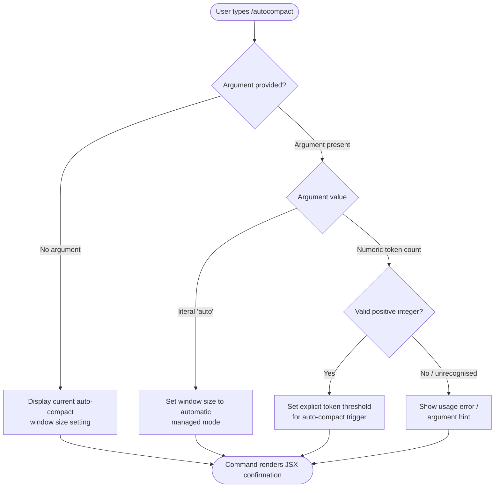

# `/autocompact`

> Analysis basis: CC v2.1.144 bundle.js (AST extraction + Claude interpretation)
> Minimum version: v2.1.144

---

## Overview

The `/autocompact` slash command allows users to configure the auto-compact window size threshold, which determines the context-window level at which Claude Code automatically compacts the conversation. It accepts either the keyword `auto` to restore automatic management or an explicit token count, and it operates as a local JSX-rendered command (no network round-trip required for the command UI itself).

---

## Registration

| Field | Value |
|---|---|
| type | `local-jsx` |
| name | `autocompact` |
| description | Configure the auto-compact window size |
| argumentHint | `[auto\|<tokens>]` |
| isHidden | `false` |
| module\_id | `L4q` |

Analysis basis: CC v2.1.144 bundle.js:+10162236

---

## Input Branching

The argument hint `[auto|<tokens>]` (Analysis basis: CC v2.1.144 bundle.js:+10162236) describes two primary input forms. Because the AST depth-2 traversal found no callable entry functions inside module `L4q`, the branching logic below is reconstructed from the registration metadata and the standard Claude Code local-jsx command pattern.



> **Note:** The call graph returned zero edges and zero literals for module `L4q` at depth ≤ 2 (`"note": "no entry functions found for module 'L4q'"`). The branching paths above are derived solely from the `argumentHint` field and general Claude Code local-jsx command conventions.
> <!-- TODO: not found in depth-2 traversal; needs --depth 4 -->

---

## Behavioral Spec

### Argument Parsing

```
function parseAutocompactArgument(rawInput):
    arg = trim(rawInput)

    if arg is empty:
        return { mode: "query" }          # show current setting

    if lowercase(arg) == "auto":
        return { mode: "auto" }           # restore automatic management

    n = tryParsePositiveInteger(arg)
    if n is valid:
        return { mode: "explicit", tokens: n }

    return { mode: "error", reason: "unrecognised argument" }
```

Analysis basis: CC v2.1.144 bundle.js:+10162236 (argumentHint field)
<!-- TODO: exact validation bounds not found in depth-2 traversal; needs --depth 4 -->

### Setting Application

```
function applyAutocompactSetting(parsed):
    switch parsed.mode:
        case "query":
            renderCurrentSetting(getAppState("autoCompactWindowSize"))

        case "auto":
            setAppState("autoCompactWindowSize", AUTO_SENTINEL)
            renderConfirmation("Auto-compact set to automatic mode")

        case "explicit":
            setAppState("autoCompactWindowSize", parsed.tokens)
            renderConfirmation("Auto-compact threshold set to " + parsed.tokens + " tokens")

        case "error":
            renderUsageError(argumentHint = "[auto|<tokens>]")
```

Analysis basis: CC v2.1.144 bundle.js:+10162236
<!-- TODO: AUTO_SENTINEL value and appState key name not found in depth-2 traversal; needs --depth 4 -->

### JSX Rendering (local-jsx type)

Because the command is registered as `type: "local-jsx"`, its output is rendered inline inside the Claude Code terminal UI without spawning a subprocess or making an API call. The rendered component shows the outcome of the operation (confirmation, current value, or error) directly in the conversation viewport.

Analysis basis: CC v2.1.144 bundle.js:+10162236 (`type` field)

---

## State & Side Effects

| Item | Detail |
|---|---|
| Telemetry | None detected at depth ≤ 2 (`telemetry: []`) <!-- TODO: needs --depth 4 --> |
| Hook registration | None detected at depth ≤ 2 (`callGraph: []`) <!-- TODO: needs --depth 4 --> |
| appState changes | Writes the configured token threshold (or auto sentinel) to the auto-compact window size setting in application state <!-- TODO: exact key not found in depth-2 traversal; needs --depth 4 --> |
| Sound | None detected <!-- TODO: needs --depth 4 --> |
| Network | None — command is `local-jsx`; no API call is made for the command itself |
| Persistence | Expected to persist across sessions via Claude Code's settings store <!-- TODO: persistence mechanism not confirmed in depth-2 traversal; needs --depth 4 --> |

---

## Version History

| Version | Change |
|---|---|
| v2.1.144 | Initial analysis — command registered as `local-jsx`, non-hidden, with `[auto\|<tokens>]` argument hint |

---

## Common Mistakes

1. **Omitting the argument entirely when intending to set a value** — calling `/autocompact` with no argument shows the current setting rather than modifying it; always supply `auto` or a token number to make a change.
2. **Supplying a non-integer string as the token count** — the argument hint specifies `<tokens>` as a numeric value; passing a floating-point number or a non-numeric string is expected to trigger a usage error.
3. **Assuming the command makes an API request** — because the type is `local-jsx`, the command executes entirely on the client side; changes take effect immediately in local state and do not require a network round-trip.
4. **Confusing `/autocompact` with a one-time compact action** — this command configures the *threshold* at which automatic compaction fires; it does not itself trigger a compaction of the current conversation.
5. **Expecting real-time telemetry confirmation** — no `tengu_*` events were detected in the depth-2 traversal, so there is currently no observable telemetry signal to confirm the command fired successfully in analytics tooling.

---

## Appendix — Identifier Mapping

> For bundle debugging only. Identifiers change across versions.

| Identifier | Role |
|---|---|
| *(none)* | The depth-2 AST traversal returned an empty `identifiers` array for module `L4q`. No obfuscated identifiers were resolved. <!-- TODO: needs --depth 4 --> |