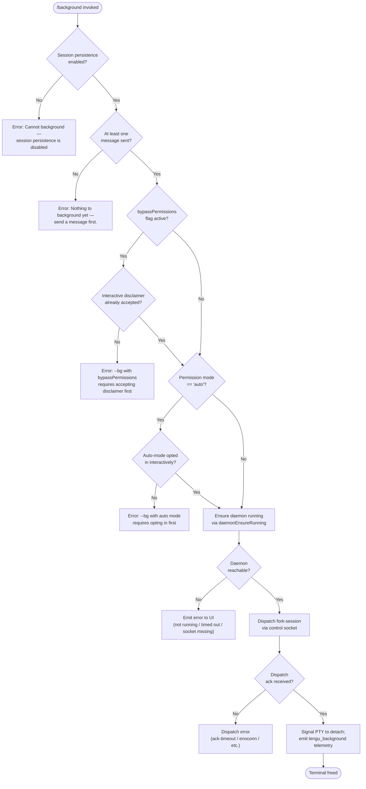

# `/background`

> Analysis basis: CC v2.1.153 bundle.js (AST extraction + Claude interpretation)
> Minimum version: v2.1.153

---

## Overview

The `/background` command (alias `/bg`) detaches the current interactive Claude Code session from the terminal and hands it off to the background daemon, freeing the controlling terminal for other use. Internally it validates preconditions (session persistence enabled, at least one message exchanged), ensures the daemon is running, dispatches a fork-session job via a Unix control socket, and then signals the foreground PTY to detach.

---

## Registration

| Field | Value |
|---|---|
| type | `local-jsx` |
| name | `background` |
| description | `Send this session to the background and free the terminal` |
| aliases | `["bg"]` |
| argumentHint | `[prompt]` |
| immediate | `null` |
| module_id | `dt1` |
| load_inline | `true` |
| loc_byte | `12723694` |
| loc_byte_end | `12723934` |
| loc_line | `9988` |
| arbor_handler.name | `Sz5` |
| arbor_handler.fqn | `claude-2.1.153::Sz5` |
| arbor_handler.kind | `AsyncFunction` |
| arbor_handler.resolution_path | `module_id` |
| arbor_handler.n_hits | `0` |

Analysis basis: CC v2.1.153 bundle.js:+12723694

---

## Input Branching

There are four or more distinct precondition branches before the command proceeds to dispatch; a Mermaid flowchart is used.



Analysis basis: CC v2.1.153 bundle.js:+12723029 (handler entry `Sz5`), +12723110 (persistence guard), +12723286 (empty-session guard), +12716536 (bypass-permissions guard), +12716698 (auto-mode guard)

---

## Behavioral Spec

### Handler entry — `backgroundCommandHandler` (`Sz5`)

The Arbor-resolved handler `Sz5` is an `AsyncFunction`.

```
async function backgroundCommandHandler(context):
    sessionConfig = context.sessionConfig          // includes persistence flag
    messages     = context.messages

    // Guard 1: persistence must be enabled
    if not sessionConfig.persistenceEnabled:
        return errorMessage("Cannot background — session persistence is disabled, "
                            "so the forked job would have nothing to resume.")

    // Guard 2: at least one user message must exist
    if messages is empty:
        return errorMessage("Nothing to background yet — send a message first.")

    // Guard 3: bypassPermissions + disclaimer check
    permissionMode = resolvePermissionMode(sessionConfig)   // via Ig / kz5 path
    if permissionMode == "bypassPermissions":
        if not disclaimerAccepted(userSettings):
            return errorMessage("--bg with bypassPermissions requires accepting the "
                                "disclaimer first. Run `claude --dangerously-skip-permissions` "
                                "once interactively.")

    // Guard 4: auto-mode opt-in check
    if permissionMode == "auto":
        if not autoModeOptedIn(userSettings):
            return errorMessage("--bg with auto mode requires opting in first. "
                                "Run `claude --permission-mode auto` once interactively.")

    // Ensure daemon is available
    daemonReachable = await ensureDaemonRunning(context)    // qF path (daemonEnsureRunning)
    if not daemonReachable:
        return renderDaemonUnavailableError()

    // Dispatch the fork-session job
    dispatchResult = await dispatchForkSession(context)     // Pz5 / L_A path
    if dispatchResult.error:
        return renderDispatchError(dispatchResult)

    // Fire telemetry and detach PTY
    emit("tengu_background", { ... })
    detachPty(context.pty)                                  // k5H / ta path → detach-request
```

Analysis basis: CC v2.1.153 bundle.js:+12723029, +12723041, +12723077, +12723081, +12723095, +12723247

---

### Permission-mode resolution — `resolvePermissionFlags` (`kz5`)

```
function resolvePermissionFlags(argv):
    // Strip everything after "--"
    separatorIdx = argv.indexOf("--")
    effective    = argv.slice(0, separatorIdx)   // or full argv if no "--"

    // Detect --permission-mode bypassPermissions
    pmIdx = effective.indexOf("--permission-mode")
    if pmIdx >= 0 and effective[pmIdx+1] == "bypassPermissions":
        return { mode: "bypassPermissions" }

    // Detect --dangerously-skip-permissions / --allow-dangerously-skip-permissions
    if effective.includes("--dangerously-skip-permissions")
       or effective.includes("--allow-dangerously-skip-permissions"):
        return { mode: "bypassPermissions" }

    // Detect --permission-mode auto → check Ig feature flag
    if effective.includes("auto") and featureFlagEnabled("auto"):
        return { mode: "auto" }

    return { mode: "default" }
```

Analysis basis: CC v2.1.153 bundle.js:+12716293 (`kz5` → `H.indexOf`), +12716303 (`"--"` literal), +12716336, +12716367, +12716399, +12716445, +12716678, +12716687

---

### Daemon lifecycle — `daemonEnsureRunning` (`qF`)

```
async function daemonEnsureRunning(opts):
    status = getDaemonStatus()               // reads daemon.status.json
    if status == "up":
        return true

    platform = detectPlatform()              // "macos" | "linux" | "windows"

    // If service exec path is stale (binary deleted), fall back to transient spawn
    if staledExecPath():
        emit("tengu_bg_daemon_service_stale_exec")
        warn("daemon service exec path is stale — falling back to transient spawn")

    // If no daemon and user hasn't declined, ask to install
    if status == "ask" and not userDeclinedInstall():
        answer = promptUser("Install as a service now? [y/N/never, or 'once' just for now] ")
        emit("tengu_bg_daemon_cold_start_ask_answer", { answer })
        if answer in ["yes", "once"]:
            installDaemonService()           // emit("tengu_bg_daemon_install")
        elif answer == "never":
            persistNeverInstall()

    // Spawn transient daemon if still not up
    if not daemonReachable():
        result = spawnTransientDaemon(["run", "--origin", "transient",
                                       "--spawned-by", processId])
        if result.error:
            emit("tengu_bg_daemon_spawn_failed")
            return false

    // Wait for daemon to become reachable (up to 30 000 ms / 60 000 ms)
    ok = await waitForDaemonReachable(timeoutMs)
    if not ok:
        emit("tengu_bg_daemon_service_poll_fallthrough")
    return ok
```

Analysis basis: CC v2.1.153 bundle.js:+12659755 (`qF`), +12659803, +12659818, +12659863, +12659880, +12660137, +12660155, +12660396, +12661158, +12661219, +12661230, +12661396, +12661483, +12661505

---

### Fork-session dispatch — `forkSessionDispatch` (`Pz5`)

```
async function forkSessionDispatch(context):
    // Build argv for the background worker
    argv = ["--agent"]
    if context.sessionName:
        argv += ["--name", context.sessionName, "-n", context.sessionName]
    if context.resumeId:
        argv += ["--resume=<id>"]           // "--resume=" prefix
    if context.continueSession:
        argv += ["-c", "--continue"]
    if context.forkSessionId:
        argv += ["--fork-session", "--session-id=<id>"]

    // Determine session kind
    kind = determineSessionKind(context)    // "repl", "none", "bg", "slash" etc.

    // Write dispatch file and connect to control socket
    dispatchId   = generateUUID()
    dispatchFile = writeDispatchFile(context.jobsDir, dispatchId, argv)
    // connect via bO (controlSocketConnect) with protocol "cli-bg-dispatch"
    socket = await connectControlSocket(daemonSocketPath, dispatchId)

    // Await acknowledgement (timeout: 6 000 ms)
    ack = await awaitAck(socket, 6000)
    if not ack:
        emit("tengu_bg_dispatch_fallback", { reason: "no ack" })
        return { error: "ack-timeout" }

    // Handle EALIVE / ESTALE response codes
    if ack.code == "EALIVE":
        return { error: "short_alive",
                 message: "Previous session is still shutting down — try again in a moment" }
    if ack.code == "ESTALE":
        return { error: "stale_short" }

    emit("tengu_bg_dispatch")
    return { ok: true, sessionId: ack.sessionId }
```

Analysis basis: CC v2.1.153 bundle.js:+12699199, +12699222, +12699287, +12699309, +12699347, +12699381, +12699490, +12700011, +12700031, +12700091, +12700156, +12695022, +12695026, +12695055, +12695111, +12695267, +12695348, +12695369, +12695499, +12696880

---

### PTY detach — `sendDetachRequest` (`k5H` → `ta`)

```
function sendDetachRequest(ptyHandle):
    // Sends the "detach-request" control message to the worker PTY
    writeControlMessage(ptyHandle.sa, "detach-request")
    // Worker signals its controlling PTY to release the terminal
```

Literal `"detach-request"` confirmed at:
Analysis basis: CC v2.1.153 bundle.js:+10732563

---

### Away-summary on re-attach — `awaySummaryManager` (`I`)

When the user later reattaches (`/background` places the session in the daemon pool), an away-summary may be generated:

```
async function maybeTriggerAwaySummary(session):
    now = Date.now()

    if cacheAgeUnknown:
        log("[awaySummary] skipped: cache age unknown")
        return

    if cacheStale(now, 0.9):
        log("[awaySummary] skipped: cache stale")
        return

    if nearRateLimit():
        log("[awaySummary] skipped: at or near rate limit")
        return

    if draftInputPresent():
        log("[awaySummary] skipped: draft input present")
        return

    generateAwaySummary(session)
    emit("away_summary_generate")
```

Analysis basis: CC v2.1.153 bundle.js:+14831362, +14831438, +14831526, +14831609, +14831840

---

### Spare-pool management — `spawnBgSpare` (`wLA`)

The daemon pre-warms spare workers so `/background` dispatch is fast:

```
function spawnBgSpare():
    emit("tengu_bg_spare_spawn")
    bytes = randomBytes()
    socketPath = buildSocketPath(joinPaths(...))
    proc = Bun.spawn([
        "--bg-pty-host", "200", "50",
        "--bg-spare",
        "ignore"   // stdio
    ])
    proc.unref()
    trackSpare(proc)
```

When a dispatch claims a spare, `tengu_bg_spare_claim` is emitted; on failure, `tengu_bg_spare_claim_fail`.

Analysis basis: CC v2.1.153 bundle.js:+15365388, +15365429, +15365466, +15365627, +15365645, +15365663, +15365669, +15365686, +15387474, +15387595, +15387858

---

### Dispatch error rendering — `renderDispatchError` (`Nk8`)

```
function renderDispatchError(result):
    switch result.errorCode:
        case "not running":
            return "Background service is not running"
        case "timed out":
            return "Background service timed out"
        case "dispatch-write":
            return "Couldn't write dispatch file"
        case "socket missing":
            return "Socket missing"
        case "estarting":
            return "Service still starting"
        case "gate_blocked":
            emit("tengu_background_spawn_failed")
            return renderGateBlockedError()
        default:
            emit("tengu_background", { ... })
```

Analysis basis: CC v2.1.153 bundle.js:+12706120, +12706158, +12706197, +12706248, +12706287, +12706336, +12719993, +12720056, +12720064

---

## State & Side Effects

| Item | Detail |
|---|---|
| Telemetry — primary | `tengu_background` (success path) |
| Telemetry — already backgrounded | `tengu_background_already_bg` |
| Telemetry — spawn failed | `tengu_background_spawn_failed` |
| Telemetry — dispatch | `tengu_bg_dispatch`, `tengu_bg_dispatch_fallback`, `tengu_bg_dispatch_rescued` |
| Telemetry — daemon lifecycle | `tengu_bg_daemon_cold_start_ask`, `tengu_bg_daemon_cold_start_ask_answer`, `tengu_bg_daemon_install`, `tengu_bg_daemon_service_stale_exec`, `tengu_bg_daemon_service_poll_fallthrough`, `tengu_bg_daemon_spawn_failed` |
| Telemetry — spare pool | `tengu_bg_spare_spawn`, `tengu_bg_spare_enable`, `tengu_bg_spare_claim`, `tengu_bg_spare_claim_fail`, `tengu_bg_spare_refill` |
| Telemetry — attach path | `tengu_bg_attach`, `tengu_bg_attach_kick`, `tengu_bg_attach_stall_ms`, `tengu_bg_attach_stall_gave_up`, `tengu_bg_attach_stall_respawn`, `tengu_bg_attach_legacy_autorespawn` |
| Telemetry — memory / signal | `tengu_bg_dispatch_sigkill_escalate`, `tengu_bg_dispatch_low_mem`, `tengu_bg_low_mem_mb` |
| Telemetry — daemon control | `tengu_daemon_control`, `tengu_daemon_config_reload`, `tengu_daemon_idle_exit` |
| Telemetry — config guards | `tengu_config_parse_error`, `tengu_config_lock_contention`, `tengu_config_stale_write`, `tengu_config_auth_loss_prevented` |
| Dispatch file | Written to `<configDir>/jobs/` directory; path built via `bK`/`tG` helpers |
| Control socket | Unix domain socket; connected via `bO` (controlSocketConnect); protocol label `"cli-bg-dispatch"` |
| Daemon status file | `daemon.status.json` read/written for lifecycle coordination |
| PTY detach | `"detach-request"` message sent to worker PTY handle; terminal is released |
| appState changes | `H.setAppState` called inside `yW8` (session state manager) when re-attach updates session phase |
| Session name | Generated via `X86` → `f85` path (rename/generate-name sub-agent); telemetry `tengu_rename_full_session_fork` |
| Away summary | Triggered on re-attach via `I` (awaySummaryManager); telemetry `away_summary_generate` |
| Flush timeout | 2 000 ms timeout (`"flush timeout"` literal) applied before detach to allow pending writes |
| Sound | None observed in depth-2 traversal |

---

## Version History

| Version | Change |
|---|---|
| v2.1.153 | Initial analysis |

---

## Common Mistakes

1. **Invoking `/background` before sending any message.** The command hard-stops with `"Nothing to background yet — send a message first."` — at least one user turn must exist in the conversation.
2. **Using `/background` with `--dangerously-skip-permissions` without prior interactive acceptance.** The disclaimer must be accepted by running `claude --dangerously-skip-permissions` at least once in an interactive session before backgrounding is permitted in bypass-permissions mode.
3. **Using `/background` with `--permission-mode auto` without prior interactive opt-in.** Similarly, auto-mode requires one interactive run of `claude --permission-mode auto` before it can be used in background mode.
4. **No daemon installed and declining installation.** If the user answers `"no"` or `"never"` to the service-installation prompt and no daemon is running, the background dispatch fails. Run `claude daemon install` first.
5. **Session persistence disabled.** Some deployment configurations disable session persistence; `/background` is entirely unavailable in that configuration and will return an explicit error.
6. **Rapid invocation after a prior background session exits.** The `"EALIVE"` error (`"Previous session is still shutting down — try again in a moment"`) can appear if the previous job's control socket has not yet been cleaned up.

---

## Appendix — Identifier Mapping

> For bundle debugging only. Identifiers change across versions.

| Identifier | Role |
|---|---|
| `Sz5` | `backgroundCommandHandler` — Arbor-resolved async handler for `/background` |
| `Nk8` | `renderDispatchError` / dispatch-result rendering function |
| `Ik8` | Background status display component (renders `"(backgrounded)"` label) |
| `kz5` | `resolvePermissionFlags` — parses argv for permission-mode flags |
| `Pz5` | `forkSessionDispatch` — builds argv, writes dispatch file, connects socket |
| `L_A` | `bgDispatchCore` — low-level dispatch orchestrator (socket write, ack wait) |
| `qF` | `daemonEnsureRunning` — daemon lifecycle manager (install / spawn / wait) |
| `Ul` | `buildDispatchPayload` — constructs job directory, UUID, dispatch record |
| `Wk6` | `daemonInstallAndWait` — installs service and polls for reachability (5 000 ms) |
| `wLA` | `spawnBgSpare` — spawns pre-warmed spare worker via `Bun.spawn` |
| `k5H` | `sendDetachRequest` — sends `"detach-request"` control message to PTY host |
| `ta` | `writeControlMessage` — writes raw bytes to the daemon worker control socket |
| `bO` | `controlSocketConnect` — connects to Unix domain control socket |
| `HV8` | `waitForControlLease` — awaits `"lease"` event on control socket with timeout |
| `KRH` | `buildDispatchPath` — joins paths to produce the dispatch socket path |
| `j_A` | `registerShutdownHook` — registers cleanup hook before PTY detach |
| `h4` | `hookRegistrar` — internal hook registration mechanism |
| `H9` | `q3ARegister` — underlying hook/signal registration call |
| `gL` | `flushWithTimeout` — races a flush promise against a 2 000 ms timeout |
| `kT` | `cleanupOnDetach` — cleanup routine called before terminal is freed |
| `N9` | `daemonWorkerInit` — initialises the daemon-worker context |
| `DOH` | `daemonWorkerLabel` — sets `"daemon-worker"` label on process |
| `w2H` | `bgEnvironmentCheck` — checks `"production"` / `"test"` environment flag |
| `sC` | `environmentResolver` — resolves current environment string |
| `re1` | `bgModeValidator` — validates mode constraints for background operation |
| `Ff` | `sessionListCollector` — collects active sessions via `K.values` |
| `gv` | `sessionCountFilter` — filters sessions at index `0` (initial count check) |
| `Ig` | `autoModeFeatureFlag` — reads the `"auto"` permission-mode feature flag |
| `Bl` | `argvPermissionParser` — checks argv slice for `--permission-mode` tokens |
| `S8` | `settingsReader` — reads `userSettings` / `localSettings` / `flagSettings` / `policySettings` |
| `qp` | `settingsAccessor` — top-level accessor for merged settings object |
| `b6` | `configFileWriter` — writes config with lock, calls `EzH` for file operations |
| `EzH` | `configFileReadWrite` — atomic read/write of config JSON with backup rotation |
| `jq7` | `configFileWatcher` — watches config file for external changes via `T88.watchFile` |
| `Ar1` | `daemonStatusWriter` — writes `daemon.status.json` |
| `dI6` | `daemonStatusPathBuilder` — joins paths for `daemon.status.json` |
| `o9` | `jobsDirectoryManager` — manages the `jobs/` directory (stat, readFile, set/delete cache) |
| `i5` | `dispatchFileWriter` — atomically writes dispatch file via `QO` |
| `QO` | `atomicFileWrite` — atomic write via temp file + rename (uses `randomBytes` for temp name) |
| `ew` | `dispatchCacheInvalidator` — deletes entry from `VYH` dispatch cache |
| `tHH` | `jobStatusFormatter` — formats job state strings (`"working"`, `"active"`, `"daemon"`) |
| `j4` | `pathSanitizer` — sanitizes and redacts `[REDACTED]` path segments |
| `kt1` | `sessionListFormatter` — formats session list items joined by `", "` |
| `Xz5` | `platformShellBuilder` — builds shell command array (`cmd.exe /d /s /c` or `/bin/sh`) |
| `AB6` | `windowsShellCheck` — checks for Windows platform and Git Bash availability |
| `Iz5` | `sessionIdExtractor` — extracts `--session-id=` / `--session-id` from argv |
| `q_A` | `dispatchArgvNormalizer` — normalizes path-bearing argv segments, truncates at 80 chars |
| `ht1` | `dispatchRetryScheduler` — schedules retry logic with `Date.now` timing |
| `cF` | `dispatchListHandler` — handles `"list"` sub-command of dispatch result |
| `dO` | `backgroundServiceChecker` — checks `"background service"` status via `GzH` |
| `GzH` | `serviceStatusProbe` — probes background service reachability via `T6` |
| `XHH` | `daemonErrorWrapper` — wraps daemon errors via `EKH` / `Bp` |
| `EKH` | `errorKindMapper` — maps error codes to display kinds |
| `b$` | `jsxErrorWrapper` — wraps error in JSX error boundary |
| `D` | `daemonSessionManager` — manages active daemon sessions (spawn, retire, dispose) |
| `wk8` | `lowMemoryChecker` — checks `ELA.freemem` and emits `tengu_bg_low_mem_mb` |
| `wLA` | `spawnBgSpare` — see above |
| `Y1` | `featureFlagReader` — reads feature flags via `SH` / `uH` |
| `SH` | `syncFeatureCheck` — synchronous feature flag check |
| `uH` | `asyncFeatureCheck` — async feature flag check |
| `jm5` | `daemonControlProtocolHandler` — full daemon control protocol (ping/nudge/yield/reply/kill/resize/attach) |
| `X86` | `sessionNameGenerator` — drives session-rename sub-agent via `f85` / `yy` |
| `f85` | `renameAgentRunner` — runs the session-name generation agent |
| `yy` | `agentQueryDispatcher` — dispatches agent query through `BRH` / `D8K` |
| `D8K` | `mainQueryLoop` — central query/streaming loop (tool calls, retries, streaming fallback) |
| `BRH` | `agentResponseBuilder` — builds agent response from `Td_` + `D8K` |
| `I` | `awaySummaryManager` — manages away-summary generation on reattach |
| `G58` | `awaySummaryAgent` — runs the away-summary agent call |
| `yW8` | `sessionStateManager` — manages `getAppState` / `setAppState` transitions |
| `I0` | `sessionAgentOrchestrator` — orchestrates per-session agent invocations |
| `HH` | `voiceSessionManager` — manages voice recording/transcription sessions |
| `P` | `repaintManager` — triggers terminal repaints after state changes |
| `lAH` | `fsAsyncHelper` — async filesystem operations (`mkdir`, `rm`) |
| `Rt1` | `pathJoinHelper` — joins paths for dispatch socket directory |
| `St1` | `cryptoRandomHelper` — generates random bytes for socket names |
| `vk8` | `daemonDirManager` — creates / unlinks daemon working directories |
| `r8` | `controlSocketTimeout` — manages control socket connect timeout via `setTimeout` / `clearTimeout` |
| `oTK` | `heartbeatManager` — sends `"heartbeat"` keepalives to daemon supervisor |
| `z2H` | `supervisorStateSync` — syncs supervisor state and writes session status |
| `ya1` | `sessionMetricsWriter` — writes per-session metrics (object keys, Math.max) |
| `G` | `remoteControlHandler` — handles `"remoteControlAtStartup"` event (calls `Y`, `H`) |
| `NYH` | `jobCacheRefresher` — refreshes job cache entries via `bK`, `o9`, `ew`, `i5` |