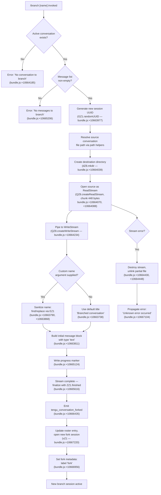

# `/branch`

> Analysis basis: CC v2.1.153 bundle.js (AST extraction + Claude interpretation)
> Minimum version: v2.1.153

---

## Overview

`/branch` (also invocable as `/fork`) creates a divergent copy of the current conversation at its present point in history, launching a new parallel session that starts from the same message state. The command copies the existing conversation log into a fresh session file, then opens that new session so the user can explore an alternative direction without affecting the original. A `tengu_conversation_forked` telemetry event is emitted upon success.

---

## Registration

| Field | Value |
|---|---|
| type | `local-jsx` |
| name | `branch` |
| description | `Create a branch of the current conversation at this point` |
| argumentHint | `[name]` |
| aliases | `["fork"]` |
| module_id | `Zi_` |
| load_inline | `true` |
| loc_byte | `12154665` |
| loc_byte_end | `12154859` |
| loc_line | `9084` |
| arbor_handler.name | `iQL` |
| arbor_handler.fqn | `claude-2.1.153::iQL` |
| arbor_handler.kind | `AsyncFunction` |
| arbor_handler.resolution_path | `module_id` |
| arbor_handler.n_hits | `0` |

Analysis basis: CC v2.1.153 bundle.js:+12154665

---

## Input Branching

The command has 4+ distinct logical branches depending on the presence of an active conversation, whether messages exist, whether a custom name argument was supplied, and the outcome of the file-copy operation.



---

## Behavioral Spec

### Top-Level Handler: `iQL` (AsyncFunction)

The Arbor symbol graph resolves the handler as `iQL` (FQN: `claude-2.1.153::iQL`, resolution path: `module_id`).
Analysis basis: CC v2.1.153 bundle.js:+10667220

```
async function branchCommandHandler(userArgs, appContext):
    // 1. Delegate to the branch-execution helper
    result = await executeBranch(userArgs, appContext)
    return result
```

### Branch Execution Orchestrator: `vZ1`

Called by `iQL`; orchestrates the full branching workflow.
Analysis basis: CC v2.1.153 bundle.js:+10666131

```
async function executeBranch(userArgs, appContext):

    // --- Guard: active conversation ---
    if not appContext.currentConversation:
        throw Error("No conversation to branch")
        // (bundle.js:+10664185)

    // --- Guard: messages present ---
    messageList = getConversationMessages(appContext)
    if messageList is empty:
        throw Error("No messages to branch")
        // (bundle.js:+10665206)

    // --- Determine branch title ---
    rawName = userArgs.trim()
    if rawName is non-empty:
        branchTitle = sanitizeName(rawName)
        // sanitizeName: find/replace via nameNormalizer (EZ1)
    else:
        branchTitle = "Branched conversation"
        // (bundle.js:+10663738)

    // --- Allocate new session identity ---
    newSessionId = crypto.randomUUID()
    // (bundle.js:+10663977)

    // --- Resolve paths ---
    sourceFilePath = resolveConversationPath(appContext)
    // uses path join helpers (y6, vO, O_) — bundle.js:+10663996–10664006
    destDirPath    = resolveDestDir(newSessionId, appContext)

    // --- Create destination directory ---
    await fs.mkdir(destDirPath, { recursive: true })
    // (bundle.js:+10664039)

    // --- Copy conversation file ---
    readStream  = fs.createReadStream(sourceFilePath,
                      { encoding: "utf8", highWaterMark: 448 })
    // (bundle.js:+10664070, +10664088, +10664121)
    writeStream = fs.createWriteStream(destFilePath,
                      { highWaterMark: 384 })
    // (bundle.js:+10664234, +10664280)

    readStream.on("open", ...)
    // (bundle.js:+10664147)

    try:
        // pipe with readline interface for line-by-line processing
        lineInterface = readline.createInterface(readStream)
        // (bundle.js:+10664328)

        lines = await collectLines(lineInterface)
        // randomised jitter map applied: bundle.js:+10664383

        await writeStream.write(serializedLines)
        // (bundle.js:+10664517)

        // parse written content for validation
        parsed = JSON.parse(rawContent)
        // via U6 — bundle.js:+10664632

        // mark as "content-replacement"
        // (literal "content-replacement" — bundle.js:+10664665)

        await writeStream.end()
        await streamFinished(writeStream)
        // (bundle.js:+10665616)

    catch streamError:
        readStream.destroy()
        // (bundle.js:+10664430)
        await fs.unlink(destFilePath, { force: true })
        // (bundle.js:+10664448)
        if readStream.once was registered:
            cleanup listener
            // (Ti_.once — bundle.js:+10664136)
        throw streamError

    // --- Emit progress marker ---
    emitProgress("progress")
    // (literal "progress" — bundle.js:+10665124)

    // --- Emit fork telemetry ---
    emit("tengu_conversation_forked")
    // (bundle.js:+10666435)

    // --- Open the forked session ---
    openForkSession(newSessionId, branchTitle, "fork")
    // label literal "fork" — bundle.js:+10666956
    // type "text" used for initial message block — bundle.js:+10663811

    return success
```

### Name Sanitizer: `EZ1`

Normalises the optional `[name]` argument supplied by the user.
Analysis basis: CC v2.1.153 bundle.js:+10663790

```
function sanitizeName(rawInput):
    // find existing title entry in known list
    match = collection.find(entry => matchesTitle(entry, rawInput))
    // (bundle.js:+10663790)
    if match:
        cleaned = match.replace(specialChars, safeReplacement)
        // (bundle.js:+10663868)
    else:
        cleaned = rawInput
    return cleaned
```

### Fork Session Opener: `vZ1` → `Sh` / `v5H`

After the file copy succeeds, the forked session is registered in the session roster and UI state is updated.
Analysis basis: CC v2.1.153 bundle.js:+10666402, +10666420

```
function openForkSession(sessionId, title, label):
    // Attach conversation metadata
    attachMetadata(sessionId, title)
    // Sh: emits "custom-title" event and updates session store
    // (bundle.js:+12845471 — literal "custom-title")

    // Attach agent-name if applicable
    attachAgentName(sessionId)
    // v5H: emits "agent-name" event
    // (bundle.js:+12848494 — literal "agent-name")

    // Emit session-renamed telemetry
    emit("tengu_session_renamed")
    // (bundle.js:+12845563)

    // Emit agent-name-set telemetry
    emit("tengu_agent_name_set")
    // (bundle.js:+12848592)

    // Set label to "fork" in appState
    appState.sessionLabel = "fork"
    // (bundle.js:+10666956)

    // Activate the new session context
    activateSession(sessionId)
```

### Duplicate-Line Guard: `nQL`

Applied during the line-collection phase to prevent duplicate message IDs appearing in the forked file.
Analysis basis: CC v2.1.153 bundle.js:+10665808

```
function deduplicateLines(lines):
    seenIds = new Set()
    result  = []
    for line of lines:
        normalised = normaliseLineId(line)
        // WS: H.replace with escape pattern — bundle.js:+10665909, +192206
        id = parseInt(normalised.id)
        // (bundle.js:+10666009)
        if not seenIds.has(id):
            seenIds.add(id)
            // (bundle.js:+10666003, +10666056)
            result.push(line)
    return result
```

### Timestamp / ISO String Helpers: `vZ1` internal

The new session entry is stamped with the current wall-clock time.
Analysis basis: CC v2.1.153 bundle.js:+10666525, +10666574

```
function buildSessionTimestamp(dateObject):
    isoString  = dateObject.toISOString()
    // (bundle.js:+10666525)
    epochMs    = dateObject.getTime()
    // (bundle.js:+10666574)
    return { isoString, epochMs }
```

---

## State & Side Effects

| Item | Detail |
|---|---|
| Telemetry — fork | `tengu_conversation_forked` emitted on successful branch (bundle.js:+10666435) |
| Telemetry — session rename | `tengu_session_renamed` emitted when title is applied (bundle.js:+12845563) |
| Telemetry — agent name | `tengu_agent_name_set` emitted when agent name is set (bundle.js:+12848592) |
| Telemetry — feature ok/bad | `tengu_feature_ok` / `tengu_feature_bad` emitted by telemetry layer (bundle.js:+965124, +965182) |
| File system — mkdir | New session directory created with `fs.mkdir` (bundle.js:+10664039) |
| File system — copy | Source conversation file streamed to destination; read chunk size: 448 bytes (bundle.js:+10664070); write buffer: 384 bytes (bundle.js:+10664280) |
| File system — cleanup | Partial destination file unlinked on stream error via `fs.unlink` (bundle.js:+10664448) |
| appState changes | New session ID registered in roster; label set to `"fork"`; title set to provided name or `"Branched conversation"` |
| Session activation | `H.resume` called to activate forked session context (bundle.js:+10666943) |
| Error on empty conversation | Hard error `"No conversation to branch"` thrown before any I/O (bundle.js:+10664185) |
| Error on no messages | Hard error `"No messages to branch"` thrown before any I/O (bundle.js:+10665206) |
| Sound | <!-- TODO: not found in depth-2 traversal; needs --depth 4 --> |

---

## Version History

| Version | Change |
|---|---|
| v2.1.153 | Initial analysis |

---

## Common Mistakes

1. **Running `/branch` with no active conversation** — if no session is loaded (e.g. immediately after startup with `--no-session`), the command throws `"No conversation to branch"` and exits without creating any files.
2. **Running `/branch` before any messages** — an empty conversation (system prompt only, no user/assistant turns) triggers the `"No messages to branch"` guard and does nothing.
3. **Expecting in-place modification** — `/branch` does **not** alter the original conversation; it writes an entirely new file. Changes made in the branch do not propagate back.
4. **Alias confusion** — `/fork` is an exact alias for `/branch` (registration `aliases: ["fork"]`); both trigger identical behaviour and the same telemetry event.
5. **Name argument with special characters** — the `[name]` argument is passed through `EZ1`'s sanitisation (find/replace); characters that cannot be normalised are silently stripped, which may produce a shorter or empty title defaulting back to `"Branched conversation"`.
6. **Assuming instant availability** — the forked session is only accessible after the full stream pipe completes and `streamFinished` resolves; attempting to immediately re-branch before that point may encounter stale state.

---

## Appendix — Identifier Mapping

> For bundle debugging only. Identifiers change across versions.

| Identifier | Role |
|---|---|
| `iQL` | Top-level async handler for `/branch` (Arbor-resolved, FQN `claude-2.1.153::iQL`) |
| `vZ1` | Branch execution orchestrator; coordinates I/O, title, roster update |
| `EZ1` | Name sanitiser; find/replace on user-supplied branch title |
| `VZ1` | File-copy core; manages ReadStream/WriteStream pipeline for conversation data |
| `nQL` | Duplicate-line deduplication guard applied during line collection |
| `jl` | Conversation-line collector / sorter (provides sorted sliced line list) |
| `yRH` | Worktree/branch detection helper (git worktree porcelain parser) |
| `LHK` | Path completion and directory-walking helper |
| `LCH` | Binary buffer builder used in file copy framing |
| `Sh` | Session title attachment; emits `"custom-title"` event and `tengu_session_renamed` |
| `v5H` | Agent-name attachment; emits `"agent-name"` event and `tengu_agent_name_set` |
| `TMH` | Append-sync logger; writes structured log entries to disk |
| `WS` | ID normaliser; applies regex replace to sanitise line identifiers |
| `G3` | Conversation context resolver (resolves current session reference) |
| `h4` | Session registry accessor |
| `H9` | Registration hook (calls `q3A.register`) |
| `y6` | Path construction helper (used in source/destination path building) |
| `O_` | Secondary path helper |
| `Xv` | Extended path builder (joins multiple segments via `ED.join`) |
| `UM` | Unified path assembler (calls `OS`, `vO`, `O_`, `dwH.join`, `y6`) |
| `FI` | File-identity helper used alongside path builders |
| `vO` | Volatile path component resolver |
| `X8` | Error-classification helper |
| `J8` | Error-construction utility |
| `yH` | Telemetry flush / log helper |
| `l_` | Error type checker (`ENOENT` guard — bundle.js:+173074) |
| `xH` | String coercion utility |
| `fZA` | Telemetry formatter (calls `xH`) |
| `GH4` | Telemetry ring-buffer manager (shift/push on `cU6`) |
| `U6` | JSON.parse wrapper |
| `RH` | JSON.stringify wrapper |
| `EH` | String conversion wrapper |
| `b$` | Error wrapper calling `J8` |
| `L9` | Substring extraction helper (`indexOf` / `slice`) |
| `eg` | Session-update emitter; calls `Of6` then stamps `Date.now` |
| `Of6` | Persistent state writer (`readFile`/`writeFile` pair) |
| `wLA` | Background spare-session spawner |
| `ZLA` | Background session lifecycle manager (roster CRUD) |
| `jLA` | Daemon claim/send helper |
| `iAA` | Session directory initialiser (`mkdir` + `writeFile`) |
| `tv6` | Session path joiner (uses `V$.join`, `Go_`) |
| `bK` | Pins-directory path builder (`FP.join`, `tG`) |
| `o9` | Session-roster reader/writer with cache |
| `p66` | Background-session dispatch helper |
| `x5H` | Path join + read helper |
| `Ch` | Split-path helper |
| `UB` | Session-URL builder |
| `_j` | Session state transition helper (→ `"active"` — bundle.js:+4084789) |
| `i5` | Session-roster entry builder |
| `Y` | Session lifecycle controller (stop/start/updateConfig) |
| `D` | Spare-session allocation dispatcher |
| `w` | Background worker process manager |
| `j` | Worker kill-all helper |
| `y` | Individual worker kill helper |
| `DC` | Duplicate-check helper |
| `W` | Worker queue (push-based) |
| `qL` | Queue utility |
| `X` | IPC socket message framer/receiver |
| `NM` | IPC response serialiser |
| `jm5` | IPC protocol message handler (multiplex dispatcher) |
| `Jm5` | IPC protocol sub-handler |
| `f` | MCP tool-list refresher |
| `YSH` | MCP server connection builder |
| `EWK` | MCP update applicator |
| `Qb5` | MCP client reconciler |
| `dO` | Background-service context builder |
| `GzH` | Background-service wrapper (calls `T6`) |
| `PLA` | Protocol-level acknowledge builder |
| `yTK` | Timeout/retry scheduler for IPC |
| `r8` | Promise-with-timeout utility |
| `P` | Terminal repaint coordinator |
| `mC8` | Terminal cell painter |
| `_0` | Project-path resolver |
| `sv` | Project directory helper |
| `Ez` | Path segment normaliser |
| `u3` | Realpath resolver (`im.realpath` + normalise) |
| `V3H` | File reader with line-type filter |
| `Dm5` | Terminal dimension calculator |
| `m` | Write-with-clear-timeout helper |
| `b` | Timer handle holder |
| `V` | Interval/timer reference |
| `wAH` | Worker-attach helper |
| `wm5` | Worker-monitor loop |
| `I` | Away-summary scheduler |
| `o28` | App-state getter (calls `sLH.getState`) |
| `XS5` | Away-summary params builder |
| `wwK` | Away-summary config checker |
| `G58` | Away-summary API caller |
| `R01` | UUID generator wrapper (`jv.randomUUID`) |
| `g` | Message history accessor |
| `s` | Voice-toggle silence-timeout handler |
| `Q` | Silence-timeout dispatcher |
| `r` | Permission-response router |
| `x` | Idle-exit timer manager |
| `a` | Focus-silence-timeout handler |
| `T` | Terminal state reference |
| `l` | Session-filter helper |
| `HH` | Voice session loop handler |
| `d` | Permission-decision handler |
| `_h8` | Permission decision sub-handler |
| `MS6` | IPC write helper (destroy + write + serialise) |
| `Sh` | *(see above — session title emitter)* |
| `cf` | Conversation-filter predicate |
| `B6` | Log-path builder |
| `wk8` | Memory-check helper |
| `T6` | Memory threshold evaluator |
| `TD6` | Pinned-file loader |
| `iJ_` | Pins-file path resolver |
| `Nj7` | Pins directory scanner |
| `B` | Orphaned-permission checker |
| `UH` | Permission-filter helper |
| `QH` | Permission-set manager |
| `tTK` | Realpath + stat verifier |
| `Wz` | Worker state accessor |
| `N` | Shell command builder |
| `Cm5` | Worker-verify helper (`h28`) |
| `z` | Daemon-control writer |
| `uH` | Utility writer helper |
| `SH` | Secondary writer helper |
| `R` | Worker-spawn-and-verify orchestrator |
| `Lm5` | Claim-frame timeout handler |
| `Km5` | Claim-frame builder |
| `RB` | Binary-frame encoder |
| `K` | Column-padding formatter |