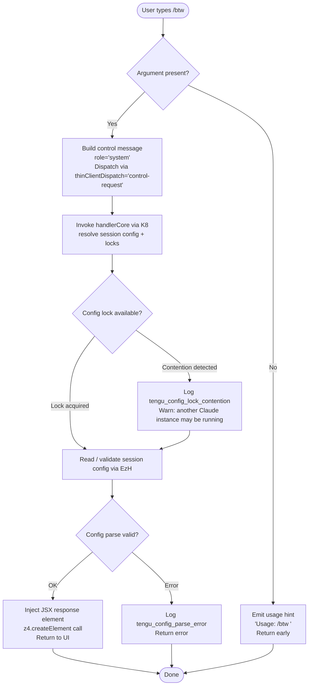

# `/btw`

> Analysis basis: CC v2.1.153 bundle.js (AST extraction + Claude interpretation)
> Minimum version: v2.1.153

---

## Overview

`/btw` ("by the way") allows the user to inject a quick side question or clarification into the session without formally interrupting or resetting the main conversational thread. The command dispatches the question immediately as a `control-request` to the thin-client layer, bypassing the normal turn queue. The handler is an `AsyncFunction` (`AdL`) resolved via the `kZ1` module export.

---

## Registration

| Field | Value |
|---|---|
| type | `local-jsx` |
| name | `btw` |
| description | Ask a quick side question without interrupting the main conversation |
| argumentHint | `<question>` |
| immediate | `true` |
| thinClientDispatch | `control-request` |
| module_id | `kZ1` |
| load_inline | `true` |
| loc_byte | `10673016` |
| loc_byte_end | `10673255` |
| loc_line | `7580` |
| arbor_handler.name | `AdL` |
| arbor_handler.fqn | `claude-2.1.153::AdL` |
| arbor_handler.kind | `AsyncFunction` |
| arbor_handler.resolution_path | `module_id` |
| arbor_handler.n_hits | `0` |

Analysis basis: CC v2.1.153 bundle.js:+10673016

---

## Input Branching

Three distinct paths are identifiable from the call graph and literal constants: (1) no argument supplied (usage error path), (2) argument supplied and question is dispatched as a system-role control message, and (3) the handler delegates further to config/file-system utilities (side-effect paths reachable through `K8` → `pO_`). A Mermaid flowchart is used.



Analysis basis: CC v2.1.153 bundle.js:+10672611, +10672613, +10672652, +10672675, +10672721

---

## Behavioral Spec

### 1. Argument Validation

When the user invokes `/btw` without a trailing `<question>` token, the handler returns the literal usage string immediately without sending any network request.

```
function handleBtw(userInput):
    question = userInput.trim()
    if question is empty:
        display "Usage: /btw <your question>"
        return
    dispatchControlRequest(question)
```

Usage string literal: `"Usage: /btw <your question>"` (CC v2.1.153 bundle.js:+10672613)

### 2. Control-Request Dispatch

The validated question is wrapped in a message object with `role = "system"` and forwarded via the `thinClientDispatch` pathway (`"control-request"`). The `immediate: true` registration flag means this bypasses any pending turn queue.

```
async function dispatchControlRequest(question):
    message = { role: "system", content: question }
    send via thinClientDispatch channel "control-request"
    await handlerCore(sessionContext)   // K8
```

Analysis basis: CC v2.1.153 bundle.js:+10672652, +10672675

### 3. Session Config Acquisition (`handlerCore` / `K8`)

`handlerCore` (bundle identifier `K8`) coordinates config-file locking and reading before the response can be assembled. It calls `sessionConfigWriter` (`pO_`) which acquires an exclusive file-system lock.

```
async function handlerCore(sessionContext):
    configGuard = await acquireConfigLock()   // pO_
    if lockContentionDetected:
        emit telemetry "tengu_config_lock_contention"
        log warning "Lock acquisition took longer than expected - another Claude instance may be running"
    config = readAndParseConfig()             // EzH
    if configAuthLossDetected:
        emit telemetry "tengu_config_auth_loss_prevented"
        abort write to avoid wiping auth
    buildResponse(config)
```

Analysis basis: CC v2.1.153 bundle.js:+3201149, +3204155, +3204066, +3204634

### 4. Config File Read and Validation (`EzH`)

The config reader (`EzH`) reads the config file as UTF-8, parses JSON, and handles several error conditions.

```
function readAndParseConfig(path):
    if configAccessedBeforeAllowed:
        throw Error "Config accessed before allowed."
    raw = filesystem.readFileSync(path, "utf-8")
    parsed = JSON.parse(raw)       // via U6
    if parseError:
        emit telemetry "tengu_config_parse_error"
        return error
    stripBomIfPresent(parsed)      // Pb: startsWith check + slice
    return parsed
```

Constants: encoding `"utf-8"` (CC v2.1.153 bundle.js:+3206182), guard string `"Config accessed before allowed."` (CC v2.1.153 bundle.js:+3206099)

### 5. Lock Contention Jitter (`H`)

The lock-acquisition helper (`H`) uses a randomised delay strategy to reduce contention between concurrent Claude Code instances.

```
function acquireLockWithJitter():
    base = Math.random() * 2      // range [0, 2)
    delay = base + 1              // range [1, 3)
    setTimeout(retryLock, delay)
```

Constants: multiplier `2` (CC v2.1.153 bundle.js:+13359474), addend `1` (CC v2.1.153 bundle.js:+13359490)

### 6. JSX Response Rendering

After the control message is processed, `AdL` calls `z4.createElement` to produce a JSX element that is rendered back into the Claude Code UI panel.

```
function renderBtwResponse(result):
    element = createElement(ResponseComponent, { result })
    return element
```

Analysis basis: CC v2.1.153 bundle.js:+10672721

---

## State & Side Effects

| Item | Detail |
|---|---|
| Telemetry | `tengu_config_lock_contention` (bundle.js:+3204155) — emitted when lock wait exceeds threshold |
| Telemetry | `tengu_config_stale_write` (bundle.js:+3204291) — emitted on stale write detection |
| Telemetry | `tengu_config_parse_error` (bundle.js:+3206730) — emitted when config JSON fails to parse |
| Telemetry | `tengu_config_auth_loss_prevented` (bundle.js:+3204634) — emitted when a write would erase auth credentials |
| Telemetry | `tengu_bg_dispatch_sigkill_escalate` (bundle.js:+15386200) — emitted if a background session requires SIGKILL escalation (reachable via session management path) |
| Telemetry | `tengu_bg_dispatch_low_mem` (bundle.js:+15386779) — emitted when system free memory is low |
| Telemetry | `tengu_bg_spare_enable` (bundle.js:+15387474) — emitted when a spare background session slot is enabled |
| Telemetry | `tengu_bg_spare_claim` (bundle.js:+15387595) — emitted when a spare session slot is claimed |
| Telemetry | `tengu_bg_spare_claim_fail` (bundle.js:+15387858) — emitted when claim of a spare slot fails |
| File I/O | Config lock file acquired and released via `pO_`; backup files may be written (max `5` backups, CC v2.1.153 bundle.js:+3205085); backup directory suffix `"backups"` (bundle.js:+3205667); backup filename marker `".backup."` (bundle.js:+3204952) |
| File I/O | Config written with `0o600` permissions (`384` octal, bundle.js:+3205367) |
| File locking | Lock timeout warning threshold checked; contention message: `"Lock acquisition took longer than expected - another Claude instance may be running"` (bundle.js:+3204066) |
| Auth guard | If re-read config is missing auth that cache has, write is refused; references GH issue #3117 (bundle.js:+3204482, +3201356) |
| thinClientDispatch | Sends a `"control-request"` packet immediately (`immediate: true`), bypassing the normal turn queue |
| UI | `z4.createElement` call renders a JSX response element into the active panel (bundle.js:+10672721) |
| Sound | <!-- TODO: not found in depth-2 traversal; needs --depth 4 --> |
| appState changes | <!-- TODO: not found in depth-2 traversal; needs --depth 4 --> |

---

## Version History

| Version | Change |
|---|---|
| v2.1.153 | Initial analysis |

---

## Common Mistakes

1. **Omitting the question argument** — `/btw` with no text returns the usage hint `"Usage: /btw <your question>"` and does nothing else. Always supply a question.
2. **Expecting a full conversational turn** — because `immediate: true` and `thinClientDispatch: "control-request"` are set, the side question is injected as a control signal, not as a standard user turn. It does not reset or replay the conversation history.
3. **Running multiple Claude Code instances simultaneously** — `pO_` acquires a file-system lock; a second instance contending on the same config will trigger `tengu_config_lock_contention` telemetry and may slow the response.
4. **Assuming synchronous execution** — the handler `AdL` is an `AsyncFunction`; awaiting config I/O and potential lock retries means the response may not be instantaneous despite the `immediate` flag.
5. **Treating `/btw` as a persistent state setter** — the command is designed for ephemeral side questions. It does not persist any new context to the main conversation thread.

---

## Appendix — Identifier Mapping

> For bundle debugging only. Identifiers change across versions.

| Identifier | Role |
|---|---|
| `AdL` | Main async handler for `/btw` (arbor_handler; resolved via module_id `kZ1`) |
| `H` | Lock-acquisition jitter helper (uses `Math.random` + `setTimeout`) |
| `K8` | Session handler core — orchestrates config lock, read, and response assembly |
| `pO_` | Session config writer / lock coordinator (file-system lock acquisition) |
| `_` | Filesystem abstraction (readdirStringSync, statSync, etc.) |
| `B6` | Path existence / access check utility |
| `L` | File-system wrapper with lock-set tracking (`mkdirSync`, `statSync`, `readdirStringSync`, `unlinkSync`, `copyFileSync`) |
| `q` | Secondary filesystem handle (`readFileSync`, `statSync`, `mkdirSync`, `readdirStringSync`, `unlinkSync`, `copyFileSync`, `renameSync`) |
| `M` | Session/stream manager with `.finally` cleanup and `.close` teardown |
| `r3q` | Object construction helper wrapping `x9_` and `Object.assign` |
| `x9_` | Inner initializer called by `r3q` (calls `i3q`) |
| `N` | Message/header builder (assembles API request with role normalisation and header injection) |
| `chK` | Sub-builder called from `N`; delegates to `Ek`, `dhK`, `L3A` |
| `RH` | JSON serialiser wrapper (`JSON.stringify`) |
| `j4` | Header value formatter (replaces, slices, and processes header strings) |
| `ixH` | Calls `NOA`; likely an include/exclusion filter |
| `ihK` | File-context builder — resolves paths, computes byte lengths, queues async reads |
| `c` | Compact utility / small helper (used in multiple config and session paths) |
| `J8` | Error constructor / throw helper |
| `EzH` | Config file reader and validator (readFileSync, JSON.parse, backup logic) |
| `U6` | JSON parse wrapper |
| `Pb` | BOM / prefix stripper (`startsWith` + `slice`) |
| `UUq` | Backup directory enumerator (`readdirStringSync`, `basename`, `join`, `dirname`) |
| `UO_` | Path joiner helper (`AD.join` + `d8`) |
| `w` | Background session / process manager (spawns, kills, monitors memory) |
| `Wz6` | <!-- TODO: not found in depth-2 traversal; needs --depth 4 --> |
| `A` | Lowercase transformer / map-like structure (`toLowerCase`, `get`, `set`, `values`) |
| `V` | String with `startsWith` check (likely a version or prefix string) |
| `P` | MCP/SDK transport manager (`Promise.all`, connection lifecycle) |
| `mC8` | Transport constructor or configuration factory |
| `yH` | Plugin or extension loader (`l_`, `xH`, `_1`, `GH4`, error logging) |
| `l_` | Error wrapper (`Error`, `String`) |
| `E` | Array-like with `.slice` (message or chunk buffer) |
| `c76` | Atomic file writer (random temp name, `writeFileSync`, `fchmodSync`, `fsyncSync`, `renameSync`) |
| `O` | Stat result object (`isSymbolicLink`, delegates to `N8`) |
| `X8` | Error-throw guard (`J8`) |
| `fQH` | <!-- TODO: not found in depth-2 traversal; needs --depth 4 --> |
| `pUq` | Object entries iterator helper |
| `$QH` | Timestamp helper (`Date.now`) |
| `mO_` | Config file move/rename helper (`dirname`, `B6`, `TG`, `RH`, `c76`) |

---

Note: index built via Arbor fallback; some signals (telemetry, literals) may be missing — see arbor-fallback.js.