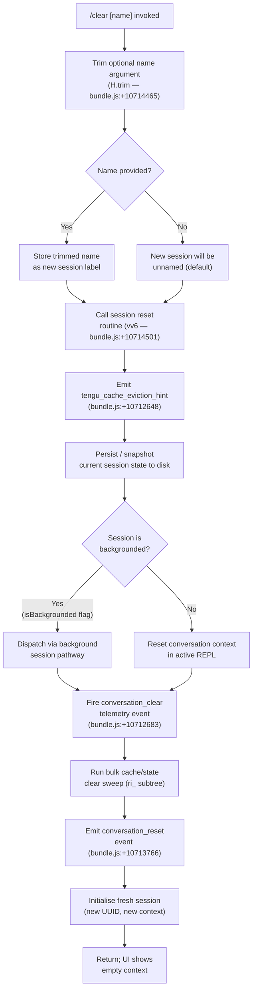

# `/clear`

> Analysis basis: CC v2.1.153 bundle.js (AST extraction + Claude interpretation)
> Minimum version: v2.1.153

---

## Overview

`/clear` starts a fresh conversation session with an empty context window, while the previous session is persisted to disk and remains resumable via `/resume`. It is also registered under the aliases `/reset` and `/new`. The command accepts an optional `[name]` argument that, when provided, labels the new session.

---

## Registration

| Field | Value |
|---|---|
| type | `local` |
| name | `clear` |
| description | `Start a new session with empty context; previous session stays on disk (resumable with /resume)` |
| argumentHint | `[name]` |
| aliases | `reset`, `new` |
| supportsNonInteractive | `true` |
| thinClientDispatch | `post-text` |
| module_id | `DE1` |
| load_inline | `true` |
| loc_byte | `10714639` |
| loc_byte_end | `10714930` |
| loc_line | `7601` |
| arbor_handler.name | `FdL` |
| arbor_handler.fqn | `claude-2.1.153::FdL` |
| arbor_handler.kind | `AsyncFunction` |
| arbor_handler.resolution_path | `module_id` |
| arbor_handler.n_hits | `0` |

Analysis basis: CC v2.1.153 bundle.js:+10714639

---

## Input Branching

The handler has 3+ distinct paths depending on the presence of an optional session name argument and the backgrounded state of the current session. A Mermaid flowchart is used.



---

## Behavioral Spec

### Handler Entry Point — `sessionClearHandler` (bundle ident: `FdL`)

```
async function sessionClearHandler(args, context):
    rawName = args ?? ""
    trimmedName = rawName.trim()          // H.trim — bundle.js:+10714465

    await performSessionReset(trimmedName, context)  // vv6 — bundle.js:+10714501
```

Analysis basis: CC v2.1.153 bundle.js:+10714465

---

### Core Session Reset — `performSessionReset` (bundle ident: `vv6`)

```
async function performSessionReset(newSessionName, context):
    // 1. Compute context token budget
    tokenBudget = computeTokenBudget(context)   // Iv6 — bundle.js:+10712544
        // uses parseInt, Number.isFinite (bundle.js:+12944095, +12944117)
        // clamps with Math.max / Math.min (bundle.js:+12944313, +12944326)
        // base radix: 10 (bundle.js:+12944106)
        // scaling constant: 1000 (bundle.js:+12944282)

    // 2. Save & snapshot the current session
    sessionSnapshot = buildSessionSnapshot(context)  // BSH — bundle.js:+10712556
        // fires "SessionEnd" lifecycle event (bundle.js:+12934755)

    // 3. Emit cache eviction hint telemetry
    emit("tengu_cache_eviction_hint")               // bundle.js:+10712648

    // 4. Set up abort signal for the reset operation
    abortSignal = AbortSignal.timeout(timeout)       // bundle.js:+10712604

    // 5. Clear in-memory conversation state
    clearAbortControllerMap()                        // _.clear — bundle.js:+10712964
        // literal key "abortController" — bundle.js:+10713300

    // 6. Reset all in-process caches via comprehensive sweep
    runCacheClearSweep(context)                      // ri_ — bundle.js:+10712946

    // 7. Resolve new working-directory context
    resolveWorkingDirectory(newSessionName)          // jw — bundle.js:+10712955

    // 8. Rebuild tool / UI registrations for fresh session
    rebuildSessionRegistrations(context)
        // G3 — bundle.js:+10713708  (session state)
        // Jl — bundle.js:+10713936  (listeners)
        // Sh — bundle.js:+10713949  (session header)
        // du — bundle.js:+10714198  (log dispatcher)
        // YAH — bundle.js:+10714218 (async log handler)

    // 9. Emit conversation_reset telemetry marker
    emit("conversation_reset")                       // literal — bundle.js:+10713766

    // 10. Generate new session UUID
    newSessionId = OE1.randomUUID()                  // bundle.js:+10713805

    // 11. Flush pending I/O and event queues
    flushPendingIO(context)                          // IO — bundle.js:+10713365
    flushGarbageCollectionHints(context)             // GiH — bundle.js:+10713403

    // 12. Launch new session context
    launchNewSession(newSessionId, newSessionName, context)
        // coordinator mode: "coordinator" | "normal" — bundle.js:+10714158, +10714172

    return { sessionId: newSessionId }
```

Analysis basis: CC v2.1.153 bundle.js:+10712544, +10712604, +10712635, +10712683, +10712814, +10712843, +10712860, +10712883

---

### Token Budget Calculation — `computeTokenBudget` (bundle ident: `Iv6`)

```
function computeTokenBudget(context):
    raw = parseInt(context.contextSizeValue, 10)    // bundle.js:+12944095, radix 10 at +12944106
    if not Number.isFinite(raw):
        raw = defaultBudget                          // falls back via qD — bundle.js:+12944160

    scaled = raw * 1000                              // constant 1000 — bundle.js:+12944282
    clamped = Math.max(minBudget,
              Math.min(maxBudget, scaled))           // bundle.js:+12944313, +12944326
    return clamped
```

Analysis basis: CC v2.1.153 bundle.js:+12944095

---

### Session Snapshot / End — `buildSessionSnapshot` (bundle ident: `BSH`)

```
function buildSessionSnapshot(context):
    // Fire "SessionEnd" lifecycle hook (bundle.js:+12934755)
    emitLifecycleEvent("SessionEnd", context)       // H7 — bundle.js:+12934728

    // Persist conversation to disk via background writer
    persistToDisk(context)                           // UW — bundle.js:+12934786

    // Emit y6 (session-state accessor) and myH (session-metadata writer)
    updateSessionMetadata(context)                   // y6 — bundle.js:+12934983
                                                     // myH — bundle.js:+12934988
    return snapshotResult
```

Analysis basis: CC v2.1.153 bundle.js:+12934728, +12934755

---

### Comprehensive Cache Clear Sweep — `runCacheClearSweep` (bundle ident: `ri_`)

The sweep touches every major in-process cache store. Key sub-operations observed in the call graph (depth ≤ 2):

```
function runCacheClearSweep(context):
    clearSkillIndex()           // sR → Lu.H.clearSkillIndexCache — bundle.js:+10711518
    clearEmbeddingStore()       // zE9 → bU.clear — bundle.js:+10711526
    clearPluginIndexCache()     // ho — bundle.js:+10711545
        // sub-clears: uvH, EM8 (MCP client map), hj6, q8H
        // IM8 → wW1.clear — bundle.js:+10334853
        // BE9 → rX6.clear, Ev_.clear — bundle.js:+6509914, +6509926
        // uE9 (session-state reset) — bundle.js:+6509732
        // cwH (context-window helper reset) — bundle.js:+6508822
        // resets autonomous-loop counter: zd7.resetAutonomousLoopDelivered — bundle.js:+6537539
    clearNotificationCache()    // ko → i08.clear — bundle.js:+10711558
    clearHookIndexCache()       // hj6 (shared) — bundle.js:+10711563
    clearToolFilterCache()      // fq1 → gyH.clear, jp_.clear — bundle.js:+8757459, +8757471
    clearPermissionCache()      // fo9 → PsH.clear, qG6.clear — bundle.js:+8064364, +8064376
    clearPathCache()            // vi8 → _pH.clear — bundle.js:+1061755
    clearEmbeddingIndex()       // rZ9 → e58.clear — bundle.js:+6461939
    clearHasEntryCache()        // eu8 — bundle.js:+10711847
    clearDisplayCache()         // Di8 → HpH.clear — bundle.js:+1054533
    clearProjectStateCache()    // sa9 → Da.clear, GJH.clear — bundle.js:+8130817, +8130828

    // Resolve and mark all remaining Object.keys entries as cleared
    for key in Object.keys(remainingStores):         // bundle.js:+10711656
        clearStore(key)

    return Promise.resolve()                         // bundle.js:+10711872
```

Analysis basis: CC v2.1.153 bundle.js:+10711510, +10711518, +10711526, +10711545, +10711558, +10711563, +10711808, +10711817, +10711826, +10711832, +10711841, +10711847, +10711854, +10711860, +10711866, +10711872

---

### Working Directory Resolution — `resolveNewWorkingDirectory` (bundle ident: `jw`)

```
function resolveNewWorkingDirectory(nameOrPath):
    if path.isAbsolute(nameOrPath):                 // zJ8.isAbsolute — bundle.js:+8116963
        resolved = nameOrPath
    else:
        resolved = path.resolve(nameOrPath)          // zJ8.resolve — bundle.js:+8116983

    validated = validateRepoRoot(resolved)           // B6 — bundle.js:+8116998
    if not exists(validated):                        // X8 — bundle.js:+8117053
        throw new Error("path not valid")            // bundle.js:+8117065

    normalised = normalisePath(resolved)             // wn8 — bundle.js:+8117105
    return normalised
```

Analysis basis: CC v2.1.153 bundle.js:+8116963

---

### I/O Queue Flush — `flushPendingIO` (bundle ident: `IO`)

```
function flushPendingIO(context):
    pendingItem = addToProcessingQueue(action)       // qy8 → ZHK.add — bundle.js:+12899814
    await pendingItem.finally(
        () => ZHK.delete(pendingItem)               // bundle.js:+12899839
    )
    pendingWrite = _y8.get(key)                      // bundle.js:+12901242
    if pendingWrite:
        pendingWrite.flush()                         // _.flush — bundle.js:+12901264
        _y8.delete(key)                              // bundle.js:+12901274
```

Analysis basis: CC v2.1.153 bundle.js:+12901221

---

### Non-Interactive / Thin-Client Dispatch

When `supportsNonInteractive` is `true` and `thinClientDispatch` is `"post-text"`, the clear command may be invoked in headless pipelines. The handler still executes the same session reset path, but instead of updating a REPL view it posts a text result to the thin-client transport layer.

Analysis basis: CC v2.1.153 bundle.js:+10714639 (registration field `thinClientDispatch`)

---

## State & Side Effects

| Item | Detail |
|---|---|
| Telemetry — `tengu_cache_eviction_hint` | Fired immediately on entering the reset routine (bundle.js:+10712648) |
| Telemetry — `tengu_run_hook` | Fired when any lifecycle hook is dispatched during the reset (bundle.js:+12983448) |
| Telemetry — `tengu_feature_ok` / `tengu_feature_bad` | Tracks hook execution outcome (bundle.js:+965124, +965182) |
| Telemetry — `tengu_repl_hook_finished` | Fires after each REPL hook completes (bundle.js:+12967325) |
| Telemetry — `tengu_session_renamed` | Fires if the new session name differs from the old one (bundle.js:+12845563) |
| Telemetry — `tengu_hook_plugin_metrics` | Emitted with plugin hook performance data (bundle.js:+12961876) |
| Telemetry — `tengu_hook_plugin_injected` | Fired when a plugin hook is injected into the new session (bundle.js:+12981788) |
| Lifecycle event — `SessionEnd` | String literal `"SessionEnd"` emitted to hook subscribers before the old session is closed (bundle.js:+12934755) |
| Lifecycle event — `conversation_clear` | String literal `"conversation_clear"` posted to event bus (bundle.js:+10712683) |
| Lifecycle event — `conversation_reset` | String literal `"conversation_reset"` posted after the new session is initialised (bundle.js:+10713766) |
| Disk persistence | Previous session is snapshotted and written to disk by `UW` subtree; it remains accessible via `/resume` |
| Cache stores cleared | Skill index, embedding store, plugin index, MCP client map, notification cache, hook index, tool-filter cache, permission cache, path cache, embedding index, display cache, project-state cache — see `runCacheClearSweep` |
| AbortController map | Cleared via `_.clear` (bundle.js:+10712964); any in-flight operations keyed on `"abortController"` are dropped |
| New UUID assignment | `OE1.randomUUID()` generates the fresh session ID (bundle.js:+10713805) |
| Hook side effects | `SessionStart`, hook lifecycle hooks (`PreToolUse`, `PostToolUse`, `SessionStart`, `Setup`, etc.) are all re-registered for the new session via the full hook-loader path (`xU` subtree) |
| Sound | No sound effects found in depth-2 traversal |
| appState changes | `"isBackgrounded"` flag is read to choose dispatch path (bundle.js:+10712751); coordinator mode is set to `"coordinator"` or `"normal"` (bundle.js:+10714158, +10714172) |

---

## Version History

| Version | Change |
|---|---|
| v2.1.153 | Initial analysis |

---

## Common Mistakes

1. **Confusing `/clear` with session deletion** — `/clear` keeps the previous session on disk. Use `/resume` to return to it. The old session is never deleted by this command.
2. **Expecting hooks to be suppressed** — All lifecycle hooks (`SessionEnd` on the old session, `SessionStart` on the new one) still fire normally during `/clear`. Hook-heavy setups may observe a brief latency spike.
3. **Assuming the working directory resets** — If no path argument is supplied, the working directory is re-resolved from the current environment, not reset to the project root. Provide an explicit path via the `[name]` argument if you need a different root.
4. **Using `/reset` or `/new` expecting different behavior** — These are exact aliases registered at the same handler; they are functionally identical to `/clear`.
5. **Running `/clear` in non-interactive scripts without checking `supportsNonInteractive`** — The flag is `true`, so the command is safe in headless use; however, the `thinClientDispatch: "post-text"` setting means the caller must consume the posted text result rather than waiting for a REPL prompt.
6. **Expecting in-flight tool calls to be gracefully cancelled** — The `AbortController` map is cleared synchronously; any tool execution that has not yet checked its abort signal will continue until the next checkpoint.

---

## Appendix — Identifier Mapping

> For bundle debugging only. Identifiers change across versions.

| Identifier | Role |
|---|---|
| `FdL` | Main handler for `/clear` (`sessionClearHandler`) — AsyncFunction |
| `vv6` | Core session reset routine (`performSessionReset`) |
| `Iv6` | Token budget calculator (`computeTokenBudget`) |
| `qD` | Default token budget fallback resolver |
| `S8` | Settings store accessor |
| `hm` | Helper used during budget fallback path |
| `Fv` | Low-level store getter (accessed by multiple helpers) |
| `gp` | Session persistence gating helper |
| `tO_` | Session cache get/set wrapper (uses `zBq` map) |
| `Xz` | Dual-cache clear helper (`RR6.clear`, `Ox8.clear`) |
| `eO_` | Session state flush helper |
| `BSH` | Session snapshot / end builder (`buildSessionSnapshot`) |
| `H7` | Session lifecycle event emitter |
| `y6` | Session-state accessor (read) |
| `wS` | Session state writer helper |
| `KW` | Effort/model capability checker (reads model string literals) |
| `EV` | Effort-level resolver (`high` branch) |
| `Xv` | Session context formatter |
| `S6` | Session output formatter |
| `UW` | Disk persistence writer / session serialiser |
| `xH` | String coercion utility |
| `Fp` | Settings reader for persistence |
| `N` | Log/debug level resolver (reads `"debug"` literal) |
| `ZMH` | Session metadata composer |
| `PAA` | Plugin/hook loader for new session |
| `P6K` | Plugin path resolver |
| `XAA` | Third-party plugin filter |
| `G6K` | Plugin group key resolver |
| `c` | Generic application-state accessor |
| `RH` | JSON serialisation wrapper (`JSON.stringify`) |
| `yH` | Async file logger (uses `mmH.push`, `an.logError`) |
| `uH` | Feature-flag reader |
| `e0H` | Feature-flag accessor (reads `uU6`) |
| `rV` | Abort-controller lifecycle manager |
| `J` | Callback registry accessor |
| `aAH` | Async action helper |
| `Sv` | Session viewer / display state |
| `Jy8` | Session stream helper |
| `DAA` | MCP daemon connection manager |
| `Wy8` | Hook output JSON parser |
| `i_H` | Hook entry transformer (`Object.entries` / `Object.fromEntries`) |
| `YAA` | HTTP hook executor (`kP.post`) |
| `X6K` | HTTP hook response parser |
| `_MH` | Hook execution metric emitter |
| `Gy8` | Subprocess hook spawner (uses `Xy8.spawn`) |
| `$yH` | Hook finaliser |
| `SH` | Feature-state reader |
| `myH` | Session metadata writer |
| `eq6` | Cache eviction helper (associated with `tengu_cache_eviction_hint`) |
| `L` | Task queue manager (`q.add`, `M.finally`, `q.delete`) |
| `q` | Pending-file cleanup set (uses `VTK.unlinkSync`) |
| `M` | Background session connection object |
| `A` | Connection type classifier |
| `w` | Background session dispatcher / process manager |
| `R` | Background process record |
| `tTK` | Path realpath/stat resolver |
| `Wz` | Serialisation helper |
| `Cm5` | Checksum helper (`h28`) |
| `z` | Daemon write channel |
| `wk8` | macOS memory pressure checker |
| `T6` | Token-usage tracker |
| `TD6` | Pinned-file loader (`pins.json`) |
| `iJ_` | Pin file path resolver |
| `U6` | JSON parse wrapper |
| `X8` | ENOENT error classifier |
| `Nj7` | Pin directory scanner |
| `B` | Background session retirement manager |
| `UH` | MCP-aware session filter |
| `QH` | Orphaned-permission tracker |
| `jLA` | Daemon claim sender |
| `iAA` | Daemon roster writer (`sAH.writeFile`) |
| `Lm5` | Claim timeout handler |
| `Km5` | Claim frame builder |
| `b$` | Error-code classifier |
| `EH` | String coercion for error objects |
| `RB` | Binary message frame encoder (uses `Buffer`) |
| `ZLA` | Background session lifecycle runner |
| `K` | Session roster formatter |
| `bK` | Session directory path builder |
| `o9` | Session state file reader/writer (uses `VYH` map) |
| `_j` | Session activation helper (`ZV`) |
| `i5` | Session roster entry writer |
| `p66` | Session warm-up poller |
| `x5H` | Session socket path builder |
| `Ch` | Session log tailer |
| `UB` | Session socket connector |
| `tv6` | Session directory initialiser |
| `Y` | Daemon config reload handler |
| `D` | Spare session lifecycle manager |
| `$` | Spare session disposer |
| `wLA` | Spare session spawner (uses `Bun.spawn`) |
| `J8` | Generic error logger |
| `S` | Session disposer interface |
| `mX` | Middleware/context provider |
| `Yj` | Context push helper |
| `ri_` | Comprehensive cache clear sweep (`runCacheClearSweep`) |
| `di_` | Initial cache-clear entry point |
| `sR` | Skill-index reset dispatcher |
| `Lu` | Skill-index cache clear (`H.clearSkillIndexCache`) |
| `HG8` | Hook global state resetter |
| `NY1` | Notification-state resetter |
| `thH` | Theme/display state resetter |
| `zE9` | Embedding store clear (`bU.clear`) |
| `HIH` | Embedding index writer |
| `V96` | Vision cache resetter |
| `ho` | Plugin index & MCP session resetter |
| `uvH` | MCP subagent type resolver |
| `EM8` | MCP client map manager (`ox.get/delete`) |
| `hj6` | Hook index cache clear |
| `q8H` | Compact-state resetter |
| `IM8` | In-process tool state clear (`wW1.clear`) |
| `BE9` | Permission cache clear (`rX6.clear`, `Ev_.clear`) |
| `uE9` | Session state reset helper |
| `cwH` | Context-window helper resetter |
| `pw` | Output-token counter resetter |
| `Uv_` | UI state resetter |
| `ko` | Notification-queue clear (`i08.clear`) |
| `fq1` | Tool-filter cache clear (`gyH.clear`, `jp_.clear`) |
| `fo9` | Permission-list cache clear (`PsH.clear`, `qG6.clear`) |
| `vi8` | Path normalisation cache clear (`_pH.clear`) |
| `e69` | Edge-case/error-state resetter |
| `rZ9` | Embedding-index cache clear (`e58.clear`) |
| `eu8` | Has-entry cache clear |
| `Di8` | Display/rendering cache clear (`HpH.clear`) |
| `Vw1` | Validation cache resetter |
| `sa9` | Project-state cache clear (`Da.clear`, `GJH.clear`) |
| `jw` | Working-directory resolver (`resolveNewWorkingDirectory`) |
| `B6` | Repository root validator |
| `wn8` | Path normalisation helper (uses `oU6.getStore`) |
| `QqH` | NFC path normaliser |
| `O_` | Low-level store read helper |
| `cVH` | Context-variable holder |
| `OI` | Orchestration instruction handler |
| `IO` | I/O queue flusher (`flushPendingIO`) |
| `qy8` | Processing queue item wrapper (`ZHK.add/delete`) |
| `GiH` | GC-hint emitter (`Qj9`) |
| `Qj9` | GC-hint implementation |
| `YE1` | Event-listener registrar (`WfH`) |
| `WfH` | Watcher-frame handler |
| `G3` | Session-state rebuilder |
| `h4` | Session header accessor |
| `H9` | Hook-registration entry point |
| `FI` | File-index accessor |
| `UM` | Path-join helper for session dirs |
| `OS` | Low-level object-store reader |
| `Nv6` | New-session registration helper |
| `jx8` | UUID emitter (`BqH.randomUUID`, `UR6.emit`) |
| `Jl` | Listener registrar for new session |
| `Sh` | Session-header writer (emits `Uk6`) |
| `TMH` | Synchronous log appender (`A.appendFileSync`) |
| `phH` | Symlink-based session task registrar |
| `LAA` | Session tasks directory creator |
| `ksH` | Session task path builder |
| `T3` | Task symlink path resolver |
| `NtH` | Session task file opener |
| `qE` | Subagent path/context accessor |
| `zf` | Zero-fill / state initialiser |
| `W_` | Module-init bootstrapper (sets `__esModule`) |
| `iS6` | Initialisation binding helper |
| `W` | Query-language executor (`qL`) |
| `qL` | Query language implementation |
| `G` | Remote-control startup gate (`remoteControlAtStartup`) |
| `b` | Event object (`b.preventDefault`) |
| `j0` | Settings loader entry point (`g_`) |
| `g_` | Full settings loader (reads all four settings layers) |
| `Ff` | Feature-flag finaliser |
| `du` | Log-dispatcher rebuilder |
| `YAH` | Async log handler rebuilder (`AHK`) |
| `AHK` | Async file appender |
| `xU` | Plugin hook loader (`loadPluginHooks`) |
| `UK` | Git bare-repo checker |
| `yEH` | Policy-settings merger |
| `emH` | Plugin hook timing logger |
| `I8` | Plugin hook log file writer |
| `cX6` | Full REPL session initialiser |
| `ZX` | Session context extractor |
| `uX` | Main REPL conversation loop |
| `f` | MCP server manager |
| `YSH` | MCP server connection bootstrapper |
| `EWK` | MCP server update applier |
| `Qb5` | MCP retry/reconnect manager |
| `vq` | Subagent UUID generator (`sz1.randomUUID`) |