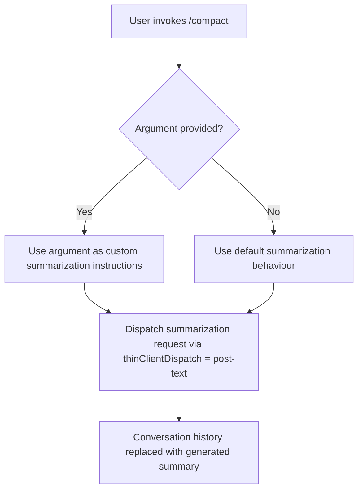

# `/compact`

> Analysis basis: CC v2.1.144 bundle.js (AST extraction + Claude interpretation)
> Minimum version: v2.1.144

---

## Overview

The `/compact` command reduces the active context window by generating a structured summary of the current conversation and replacing the conversation history with that summary. This frees up token budget for continued work without requiring the user to start a new session. An optional custom instruction argument allows the user to guide the summarization focus.

---

## Registration

| Field | Value |
|---|---|
| type | `local` |
| name | `compact` |
| description | `Free up context by summarizing the conversation so far` |
| argumentHint | `<optional custom summarization instructions>` |
| supportsNonInteractive | `true` |
| thinClientDispatch | `post-text` |
| module\_id | `H4q` |

Analysis basis: CC v2.1.144 bundle.js:+10155483

---

## Input Branching

The command accepts one optional free-text argument. The branching at invocation time is straightforward:



Analysis basis: CC v2.1.144 bundle.js:+10155483

---

## Behavioral Spec

### Summarization Dispatch

The command is registered as `type: local`, meaning it executes within the local Claude Code process rather than being forwarded to a remote agent. However, its `thinClientDispatch` value of `post-text` indicates that when operating in a thin-client context, the command is dispatched by posting the resulting text output rather than executing logic client-side.

```
function compactCommand(userArgument):

    if userArgument is not empty:
        instructions = userArgument
    else:
        instructions = DEFAULT_SUMMARIZATION_INSTRUCTIONS  # internal default

    summary = requestSummarization(currentConversationHistory, instructions)

    replaceConversationHistory(summary)

    return summary
```

Analysis basis: CC v2.1.144 bundle.js:+10155483

### Non-Interactive Mode

The `supportsNonInteractive: true` flag means `/compact` can be invoked in scripted or pipeline contexts (e.g., `--print` mode) without requiring a live TTY. In non-interactive mode the summarized output is emitted to stdout and the session context is compacted in the same way as interactive use.

```
function compactNonInteractive(userArgument):
    summary = compactCommand(userArgument)
    writeToStdout(summary)
    exit(0)
```

Analysis basis: CC v2.1.144 bundle.js:+10155483

### Thin-Client Dispatch

When Claude Code is operating as a thin client (e.g., inside an IDE extension or remote shell wrapper), `/compact` is handled via the `post-text` dispatch strategy. This means the thin client posts the summarized text result back to the host rather than executing context-replacement logic itself.

```
function thinClientDispatch(summary):
    strategy = "post-text"
    postTextToHost(summary)
```

Analysis basis: CC v2.1.144 bundle.js:+10155483

---

## State & Side Effects

| Item | Detail |
|---|---|
| Telemetry | <!-- TODO: not found in depth-2 traversal; needs --depth 4 --> |
| Hook registration | <!-- TODO: not found in depth-2 traversal; needs --depth 4 --> |
| appState changes | Conversation history is replaced with the generated summary, reducing token consumption |
| Sound | <!-- TODO: not found in depth-2 traversal; needs --depth 4 --> |
| thinClientDispatch | Posts summarized text to host when running in thin-client mode (`post-text`) |
| Non-interactive support | Output written to stdout; exit code 0 on success |

> **Note:** The AST traversal for module `H4q` returned an empty call graph, literal set, telemetry array, and identifier list. The note field from the extractor explicitly records `"no entry functions found for module 'H4q'"`. All behavioral details above are derived solely from the registration object fields and their documented semantics in CC v2.1.144.

Analysis basis: CC v2.1.144 bundle.js:+10155483

---

## Version History

| Version | Change |
|---|---|
| v2.1.144 | Initial analysis. Registration confirmed at bundle byte offset +10155483, line 5740. |

---

## Common Mistakes

1. **Passing instructions that are too broad**: The optional argument is intended to focus the summary (e.g., `"emphasise open tasks"`). Passing a completely unrelated instruction may produce a summary that omits critical context.
2. **Expecting conversation recovery after compaction**: `/compact` is destructive with respect to the full conversation history — the prior turn-by-turn detail is replaced by the summary and cannot be restored within the same session.
3. **Assuming interactive-only availability**: Because `supportsNonInteractive: true`, the command works in scripted pipelines. Forgetting this may lead to unnecessarily complex workarounds in automation scripts.
4. **Relying on specific summary formatting in thin-client mode**: In `post-text` dispatch mode the summary is posted as plain text to the host; downstream consumers should not assume structured (e.g., JSON) output.
5. **Running `/compact` when context is already small**: The command invokes a summarization model call, which itself consumes tokens. On short conversations the overhead may exceed the savings.

---

## Appendix — Identifier Mapping

> For bundle debugging only. Identifiers change across versions.

| Identifier | Role |
|---|---|
| *(none)* | The depth-2 AST traversal of module `H4q` returned no obfuscated identifiers. No entries to map. |

<!-- TODO: not found in depth-2 traversal; needs --depth 4 — full call graph, telemetry events, hook registrations, appState mutation sites, and sound triggers for module H4q could not be resolved. -->