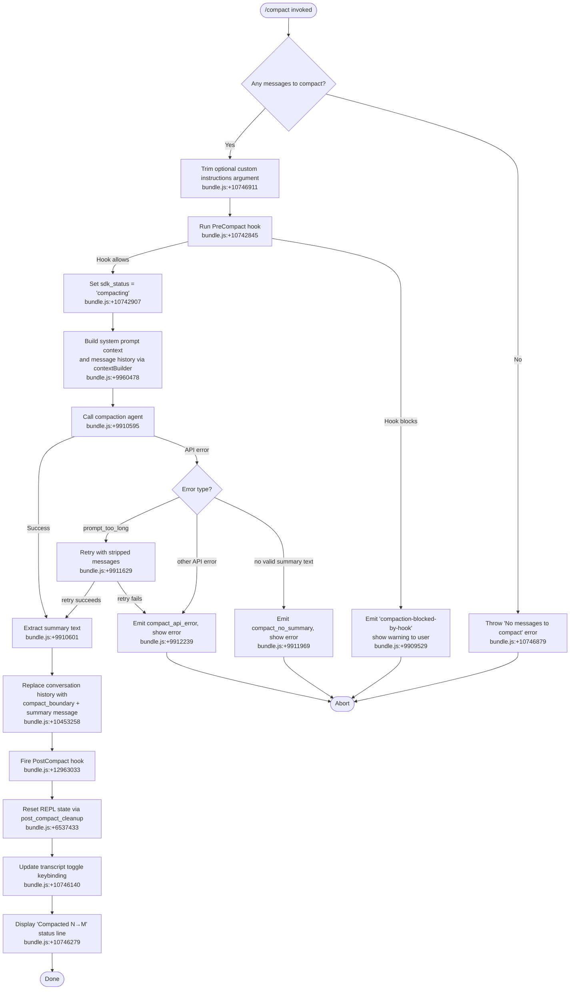

# `/compact`

> Analysis basis: CC v2.1.153 bundle.js (AST extraction + Claude interpretation)
> Minimum version: v2.1.153

---

## Overview

`/compact` frees up context window space by replacing the current conversation history with a condensed summary generated by a dedicated compaction agent. The user may optionally supply custom summarization instructions as an argument. After the summary is produced, the message list is replaced in-place and a `PostCompact` hook is fired.

---

## Registration

| Field | Value |
|---|---|
| type | `local` |
| name | `compact` |
| description | `Free up context by summarizing the conversation so far` |
| argumentHint | `<optional custom summarization instructions>` |
| supportsNonInteractive | `true` |
| thinClientDispatch | `post-text` |
| module_id | `fV1` |
| load_inline | `true` |
| loc_byte | `10747817` |
| loc_byte_end | `10748130` |
| arbor_handler.name | `JcL` |
| arbor_handler.fqn | `claude-2.1.153::JcL` |
| arbor_handler.kind | `AsyncFunction` |
| arbor_handler.resolution_path | `module_id` |
| arbor_handler.n_hits | `0` |

Analysis basis: CC v2.1.153 bundle.js:+10747817

---

## Input Branching

The command has 4+ distinct paths depending on whether messages exist, whether a PreCompact hook blocks the operation, whether the API call succeeds, and whether the result can be applied.



---

## Behavioral Spec

### Entry Point — Handler (`JcL`)

```
async function compactCommandHandler(args, context):
    rawInstructions = args.trim()                    // bundle.js:+10746911
    if no messages exist:
        throw Error("No messages to compact")        // bundle.js:+10746879

    customInstructions = rawInstructions || null
    loadSystemContext(context)                        // bundle.js:+10746928 (Lc)
    result = await runCompactionPipeline(context, customInstructions)
    applyCompactionResult(result, context)           // bundle.js:+10746983 (MV1)
    resetReplState(context)                          // bundle.js:+10747138 (ho)
    updateTranscriptToggle(context)                  // bundle.js:+10747210 (LV1)
    if result.canceled:
        display("Compaction canceled.")              // bundle.js:+10747418
    else:
        displayStatusLine(result)
    emitTelemetry("tengu_compact", ...)             // bundle.js:+9913542
```

Analysis basis: CC v2.1.153 bundle.js:+10746848

---

### Compaction Boundary Marker (`n$` / `buildCompactBoundary`)

Before summarisation, the conversation is tagged with a sentinel entry:

```
function buildCompactBoundary(messages):
    // Inserts a message of type "system" with content "compact_boundary"
    // at position [1, 0] relative to existing messages.
    // This sentinel is used by future compaction passes to locate the
    // summary splice point.
    boundary = { role: "system", content: "compact_boundary" }
    return [boundary, ...messages.slice(1, 0)]       // bundle.js:+10453258 / +10453312
```

Analysis basis: CC v2.1.153 bundle.js:+10746848 → `n$` at +10453388

---

### Pre-Compact Hook Execution (`Lc` / `runPreCompactHook`)

```
async function runPreCompactHook(context):
    hookResult = await runHookOfType("PreCompact", context)  // bundle.js:+10746928
    if hookResult.blocks:
        emitTelemetry("compaction-blocked-by-hook")          // bundle.js:+9909529
        showWarning("compaction blocked by PreCompact hook") // bundle.js:+9909563
        return BLOCKED
    return ALLOWED
```

Analysis basis: CC v2.1.153 bundle.js:+9928998 (hook dispatch entry `S_`)

---

### Compaction Pipeline (`XcL` / `runCompactionPipeline`)

```
async function runCompactionPipeline(context, customInstructions):
    startTime = performance.now()                    // bundle.js:+10742928
    setProgressState("compact_progress")             // bundle.js:+10742791
    setProgressState("hooks_start")                  // bundle.js:+10742822
    setProgressState("pre_compact")                  // bundle.js:+10742845

    hookDecision = await runPreCompactHook(context)
    if hookDecision == BLOCKED:
        return CANCELED

    setProgressState("sdk_status", "compacting")    // bundle.js:+10742887 / +10742907
    setProgressState("stream_mode", "requesting")   // bundle.js:+10743207 / +10743226
    setProgressState("compact_start")               // bundle.js:+10743351

    // Build conversation context for the summarizer
    [systemPrompt, messageHistory] = await Promise.all([
        buildSystemPromptContext(context),           // bundle.js:+10743067 (MV1)
        buildMessageContext(context)                 // bundle.js:+10742950 (oZ → xCL)
    ])

    // Run the compaction agent in its own agent loop
    summaryResult = await runCompactionAgent(
        systemPrompt, messageHistory, customInstructions
    )                                                // bundle.js:+10742992 (Mc)

    // Validate and process result
    if summaryResult.error == "prompt_too_long":
        summaryResult = await retryWithStrippedMessages(context)
        // emits tengu_compact_ptl_retry at +9911629

    setProgressState("compact_end")                 // bundle.js:+10744766
    return summaryResult
```

Analysis basis: CC v2.1.153 bundle.js:+10742928

---

### Compaction Agent Loop (`itH` / `runCompactionAgent`)

```
async function runCompactionAgent(systemPrompt, messages, instructions):
    // The agent is restricted: tool use is denied during compaction
    // "Tool use is not allowed during compaction"  (bundle.js:+9921074)
    // Tool calls return deny.

    agentConfig = {
        systemPrompt: "You are a helpful AI assistant tasked with summarizing conversations.",
        // bundle.js:+9923393
        allowToolUse: false,
        maxTurns: computed from context
    }

    spanType = instructions ? "compact_manual" : "compact_auto"
    // bundle.js:+9910317 / +9910332
    openTelemetrySpan = openSpan("claude_code.compaction", spanType)
    // bundle.js:+9910381

    response = await queryModel(agentConfig, messages)

    if response has no text content:
        emitTelemetry("tengu_compact", status="compact_not_enough_messages")
        // bundle.js:+9910519
        return { error: "no_summary" }

    summaryText = extractFirstTextBlock(response)    // bundle.js:+9910601
    return { summary: summaryText }
```

Analysis basis: CC v2.1.153 bundle.js:+9910357 (entry `itH`)

---

### Context Builder for Compaction (`xCL` / `buildContextForCompaction`)

```
async function buildContextForCompaction(context):
    // Collects and normalizes the existing conversation messages.
    // Message roles recognized: "assistant", "user", "api_system", "attachment"
    // bundle.js:+9960527 / +9960549 / +9960566 / +9960645

    // Content type normalization covers:
    //   "image", "text", "file", "pdf", "notebook", "mcp_resource",
    //   "tool_use", "tool_result", "thinking", "redacted_thinking", etc.
    // bundle.js:+10438267, +10438338, +10438224, +10438717, +10438643,
    //            +10443266, +10416251

    normalizedMessages = normalizeAttachmentForAPI(rawMessages)
    // bundle.js:+10449440
    return normalizedMessages
```

Analysis basis: CC v2.1.153 bundle.js:+9960478

---

### Reactive Compact Path (`Fv_` / `reactiveCompact`)

When context usage crosses the automatic threshold, a background reactive compact fires independently of the `/compact` command:

```
async function reactiveCompact(context):
    if messageGroups.length < 2:
        log("Reactive compact: fewer than 2 groups, nothing to compact")
        // bundle.js:+6506380
        emitTelemetry("tengu_reactive_compact_attempt", reason="too_few_groups")
        return

    summaryResult = await runCompactionAgent(context)

    if summaryResult.ok:
        emitTelemetry("tengu_reactive_compact_succeeded")   // bundle.js:+6543556
        setProgressState("post_compact")                    // bundle.js:+6542960
    else:
        emitTelemetry("tengu_reactive_compact_failed")      // bundle.js:+6541175
        log("reactive compaction failed")                    // bundle.js:+10744558
```

Analysis basis: CC v2.1.153 bundle.js:+6540909

---

### Post-Compact State Reset (`ho` / `resetAfterCompact`)

```
function resetAfterCompact(context):
    // Clears in-flight tracking maps
    clearPendingStreamMap()                         // bundle.js:+6537501 (IM8)
    clearRequestExpirySet()                         // bundle.js:+6537507 (BE9)
    clearAutonomousLoopState()                      // bundle.js:+6537539
    clearToolResultsCache()                         // bundle.js:+6537519 (cwH)
    resetOsNotificationState()                      // bundle.js:+6537589 (pw)
    emitProgressEvent("post_compact_cleanup")       // bundle.js:+6537433
```

Analysis basis: CC v2.1.153 bundle.js:+6537417

---

### Result Display (`LV1` / `renderCompactionResult`)

```
function renderCompactionResult(result, context):
    // Register transcript toggle keybinding
    registerAction("app:toggleTranscript", keybind="ctrl+o", scope="Global")
    // bundle.js:+10746140 / +10746163 / +10746172

    // Format "Compacted N→M" status line
    statusText = "Compacted " + formatCounts(result)
    // "Compacted " literal at bundle.js:+10746279
    dimmedLine = dim(statusText)
    display(dimmedLine + " · " + keybindHint)
    // bundle.js:+10746272 (j6.dim) / +10746292 (K.join)
```

Analysis basis: CC v2.1.153 bundle.js:+10746124

---

### Error Display Cases

| Condition | User-visible string | Telemetry | loc_byte |
|---|---|---|---|
| Context limit unreducible | `Compaction failed · conversation could not be reduced below the context limit` | `tengu_compact_failed` | +10743890 |
| Media too large | `Compaction failed · attached media exceeds size limits` | `tengu_compact_failed` | +10744013 |
| Unknown API error | `unknown error` | `compact_api_error` | +10744138 |
| No summary text | `Failed to generate conversation summary - response did not contain valid text content` | `tengu_compact` / `compact_no_summary` | +9911997 |
| Manual cancel | `Compaction canceled.` | — | +10747418 |

Analysis basis: CC v2.1.153 bundle.js:+10743890

---

## State & Side Effects

| Item | Detail |
|---|---|
| Telemetry | `tengu_compact` (+9913542), `tengu_reactive_compact_succeeded` (+6543556), `tengu_reactive_compact_failed` (+6541175), `tengu_reactive_compact_attempt` (+6507103), `tengu_compact_ptl_retry` (+9911629), `tengu_compact_failed` (+9924672), `tengu_compact_cache_prefix` (+9911157), `tengu_compact_cache_sharing_success` (+9921951), `tengu_compact_cache_sharing_fallback` (+9922581), `tengu_precomputed_compact_consumed` (+6520371), `tengu_precomputed_compact_discarded` (+6520990), `tengu_post_compact_file_restore_success` (+9925154), `tengu_post_compact_file_restore_error` (+9925196), `tengu_sepia_moth` (+6514404), `tengu_amber_redwood2` (+9929023) |
| Hook registration | `PreCompact` hook fires before summarisation; `PostCompact` hook fires after message replacement (literals at +12929914, +12963033). Blocks compaction if it returns a blocking decision. |
| appState changes | `sdk_status` set to `"compacting"` during operation (+10742907); progress stages `compact_progress`, `hooks_start`, `pre_compact`, `compact_start`, `compact_end` written to progress state; `compactMetadata` written to appState after success (+10744222). |
| Conversation mutation | The existing message list is replaced: a `compact_boundary` sentinel is inserted (+10453258), followed by the new summary message. Old messages before the boundary are discarded. |
| Sound / notification | `notification` progress event emitted (+10743112). OS notification not directly triggered by `/compact` itself. |
| Keybinding | `app:toggleTranscript` action bound to `ctrl+o` (Global scope) after compact completes (+10746140). |
| Telemetry span | OpenTelemetry span `claude_code.compaction` opened via `jP6` for the compaction agent run (+9910381). |

---

## Version History

| Version | Change |
|---|---|
| v2.1.153 | Initial analysis |

---

## Common Mistakes

1. **Running `/compact` with zero messages** — the handler immediately throws `"No messages to compact"` (+10746879). Ensure at least one exchange exists before invoking the command.
2. **Expecting tool results to survive compaction** — tool-use history is summarised as prose; individual tool inputs/outputs are not preserved verbatim. The `compact_boundary` sentinel marks where new context begins.
3. **Assuming custom instructions override the agent's system prompt** — custom instructions are appended to the summarisation request, not substituted for the built-in agent system prompt (`"You are a helpful AI assistant tasked with summarizing conversations."` at +9923393).
4. **Blocking PreCompact hooks without noticing** — if a `PreCompact` hook returns a block decision, compaction silently cancels and emits `"compaction-blocked-by-hook"` (+9909529). There is no retried attempt.
5. **Confusing reactive and manual compaction** — the reactive path (`Fv_`) runs automatically when context usage crosses a threshold and uses the same agent logic but a separate code path. Its failure (`tengu_reactive_compact_failed`) does not surface as a user-visible `/compact` error.

---

## Appendix — Identifier Mapping

> For bundle debugging only. Identifiers change across versions.

| Identifier | Role |
|---|---|
| `JcL` | Main `/compact` command handler (AsyncFunction) |
| `n$` | Compact-boundary builder — splices `compact_boundary` sentinel into messages |
| `OZ8` | Message boundary insertion helper |
| `GJ` | Low-level message list mutator |
| `Lc` | Pre-compact hook runner |
| `S_` | Hook system entry point |
| `T6` | MCP / hook registry lookup |
| `XcL` | Compaction pipeline orchestrator |
| `oZ` | Context normalisation dispatcher |
| `xCL` | Conversation context builder for compaction |
| `XDH` | Context collection helper |
| `vd_` | Message normalization / attachment expansion |
| `Mc` | Compaction agent runner (runs the summarizer model turn) |
| `H7` | Agent query builder |
| `y6` | Model capability check |
| `wS` | Streaming model selector |
| `KW` | Extended-thinking / effort-level selector |
| `EV` | Effort/budget parameter mapper |
| `Xv` | Agent working directory resolver |
| `S6` | System prompt assembler |
| `UW` | Hook dispatcher (runs hook processes) |
| `Fp` | Policy-settings loader |
| `N` | Log-level / debug message emitter |
| `ZMH` | Hook event collector |
| `PAA` | Plugin/hook meta-loader |
| `XAA` | Third-party hook filter |
| `Gy8` | Shell-hook executor (spawns hook subprocess) |
| `DAA` | MCP-tool hook executor |
| `YAA` | HTTP hook executor |
| `MV1` | Post-compaction app-state applier |
| `ET` | System-prompt builder for main agent |
| `T_` | App-state reader (for allowed/disallowed tools) |
| `Fu` | Agent boot / main-thread context builder |
| `W_` | Module bootstrap / exports setup |
| `PcL` | Compaction miss-detection and cache logic |
| `kv_` | Pending-stream tracker |
| `diH` | Pre-computed compact consumer |
| `GM8` | Compact cache main gate |
| `VY` | Telemetry value emitter |
| `yv_` | Summary boundary finder (findIndex in message list) |
| `ZM8` | Compact progress tracker |
| `yM8` | Full compaction agent execution loop |
| `uvH` | Agent-type prefix resolver |
| `N6H` | Agent-type identifier builder |
| `fj` | Message de-serializer / context reader |
| `x6H` | Tool permission cache checker |
| `kj6` | Tool header index builder |
| `cVH` | Context-size validator |
| `Ac` | File-attachment path resolver |
| `BX6` | Cache-file writer |
| `HIH` | Cache directory / file writer |
| `MxH` | Token-usage tracker |
| `riH` | Rich-result history builder |
| `h4` | History formatter |
| `tX6` | UUID generator for turn tokens |
| `K8H` | Message-accumulator / appender |
| `NCL` | Array content type checker |
| `vCL` | Content-block validator |
| `Dd7` | Snapshot-state collector for compaction |
| `SM8` | File-snapshot restorer |
| `xM8` | App-state snapshot reader |
| `RM8` | Plan-file snapshot handler |
| `bM8` | Full-plan state reader |
| `CM8` | Tool-result snapshot builder |
| `Z7H` | Background-file watcher set builder |
| `MIH` | Tool-permission set reconciler |
| `fIH` | File-watch event processor |
| `xU` | Plugin hook loader |
| `owH` | Compaction system-prompt assembler (builds summary prompt sent to model) |
| `gv_` | Tool listing builder for prompt |
| `ASH` | First-party tool filter |
| `KM8` | Token-count rounder |
| `qM8` | Per-message token attribution mapper |
| `YT` | Message serializer (turns internal messages to API format) |
| `XM` | Token-count rounding utility |
| `xQ7` | Token map entry setter |
| `eG` | Extended-thinking gate |
| `P$` | App-state getter for compaction context |
| `Fv_` | Reactive compaction orchestrator |
| `XM8` | Reactive compaction summarisation driver |
| `BiH` | Message pair builder (user+assistant) |
| `kE9` | Context-window fill calculator |
| `cQ7` | Single reactive-compact API attempt |
| `lQ7` | Retry-window calculator |
| `ix` | Path sanitizer / PII scrubber |
| `Xb7` | URL credential scrubber |
| `jb7` | IP address scrubber |
| `zb7` | Email address scrubber |
| `$b7` | Home-directory path replacer |
| `Wb7` | URL scrubber |
| `Pb7` | Generic path scrubber |
| `e6` | Config-state getter |
| `EH` | String-cast error reporter |
| `ho` | Post-compact REPL state reset |
| `EM8` | Pending-stream clearer |
| `hj6` | Ephemeral state remover |
| `q8H` | Composite reset dispatcher |
| `IM8` | In-progress cache clearer |
| `BE9` | Request-expiry set clearer |
| `uE9` | Abort-controller dispatcher |
| `cwH` | Tool-result cache clearer |
| `pw` | OS notification state resetter |
| `Uv_` | Conversation-ID regenerator |
| `qIH` | REPL input state setter |
| `LV1` | Compaction result renderer / keybinding registrar |
| `VrH` | Model-selector display helper |
| `ol7` | Model picker config loader |
| `JX` | Keybinding registration dispatcher |
| `Wq8` | Keybinding name resolver |
| `Gq8` | Keybinding conflict checker |
| `pDH` | OTEL metric emitter for compaction |
| `L4` | OTEL span builder |
| `nvH` | OTEL attribute attacher |
| `itH` | Compaction agent inner loop (model call + summary extraction) |
| `jP6` | OTEL span opener for compaction |
| `iV` | Span attribute setter |
| `Qy` | Active-span tracker |
| `UiH` | Compaction config reader |
| `JM8` | Summary text trimmer |
| `Z8` | Conversation session reset |
| `X` | Stdio / stream message reader |
| `NM` | Stream end handler |
| `jm5` | Background-session multiplexer |
| `sw1` | Main compaction-agent turn runner |
| `$z1` | Summary cache key builder |
| `I08` | Summary cache reader |
| `fz1` | Summary cache writer |
| `I0` | Agent turn dispatcher |
| `yW8` | App-state updater for turn |
| `hW8` | Turn-ID generator |
| `dy` | Random-bytes generator |
| `F_H` | Tool history filter |
| `Bu` | Compaction completion handler |
| `cV6` | Tombstone checker |
| `zAH` | Streaming error recorder |
| `BZ8` | Stream-boundary builder |
| `aW1` | Tombstone appender |
| `D` | Background-session state machine |
| `V7H` | Tool-use-in-flight tracker |
| `NQL` | Config resolver |
| `Tv_` | Context-overflow guard |
| `T7H` | Max-output-token resolver |
| `MzH` | Model output-token limit table |
| `b6H` | `CLAUDE_CODE_MAX_OUTPUT_TOKENS` env var parser |
| `AE` | Last-message finder |
| `jM8` | Compaction summary message builder |
| `wM8` | Last-assistant-message finder |
| `e8` | Content-block extractor |
| `I` | Away-summary scheduler |
| `o28` | Rate-limit state reader |
| `XS5` | Cache freshness checker |
| `G58` | Away-summary executor |
| `aRL` | Compaction result appender |
| `Tn` | Status-line text formatter |
| `rE6` | Tool-search mode decision engine |
| `hWH` | Tool-search config reader |
| `W7H` | Tool-search model capability checker |
| `FhH` | Tool-search platform filter |
| `Pd_` | Tool-search context builder |
| `ICL` | Tool-search integration config |
| `Gv_` | Message list flattener for API |
| `iRL` | Array content unwrapper |
| `rRL` | Message role filter |
| `oRL` | Content-block normaliser |
| `iE6` | Content-block type mapper |
| `eQ_` | Nested content flattener |
| `nw1` | Unicode surrogate-pair checker |
| `UeH` | Hook collection loader |
| `Td_` | Hook config parser |
| `D8K` | Main API query executor |
| `T` | Conversation-store turn iterator |
| `Y` | Terminal supervisor state machine |
| `z2H` | JSON-RPC message framer |
| `ya1` | Terminal column padder |
| `G` | Key-event handler |
| `oTK` | Heartbeat sender |
| `uU` | Content-array validator |
| `rw1` | Context-trim / budget enforcer for compaction |
| `IcH` | Token budget calculator |
| `sVH` | Content-block token estimator |
| `hX_` | Token count parser |
| `FN` | System-message prefix checker |
| `x` | Session write-stream handler |
| `S` | Session state emitter |
| `z` | Background-session daemon |
| `Dy` | Event queue dispatcher |
| `wm` | Daemon shutdown sequencer |
| `vq` | Conversation UUID generator |
| `UM` | Platform-string builder |
| `OS` | OS name resolver |
| `O_` | OS release resolver |
| `G0` | CLI/remote context tag builder |
| `c1` | String coercer |
| `dw6` | Deferred tool context builder |
| `nX6` | Continuation-prompt sanitizer |
| `dQ7` | Prompt text cleaner |
| `_o` | Tool-permission cache invalidator |
| `aw1` | Post-turn summary assembler |
| `sN` | Status-line queue manager |
| `eC` | Status-line color selector |
| `gT7` | Status-line LRU cache |
| `Wf8` | Compaction metrics flusher |
| `jIH` | Session status setter |
| `zd_` | App-state diff applier after compact |
| `EWK` | MCP server update applier |
| `Qb5` | MCP connection pool reconciler |
| `YSH` | MCP server capability loader |
| `bz6` | Memory-load prompt builder |
| `lw5` | Environment-info prompt block builder |
| `cw5` | Worktree context prompt block builder |
| `iw5` | Background-session prompt block builder |
| `rw5` | Reproduce-verify workflow prompt block builder |
| `aw5` | Brief-mode prompt block builder |
| `ew5` | Focus-mode prompt block builder |
| `gw5` | Env/growthbook feature prompt block builder |
| `hw5` | File-context prompt block builder |
| `hE9` | Hook-result context injector |
| `bw5` | Compaction reminder prompt block builder |
| `xw5` | Verified-vs-assumed prompt block builder |
| `uw5` | Companion-mode prompt block builder |
| `mw5` | Tool-use guidance prompt block builder |
| `Bw5` | Tone-and-style prompt block builder |
| `uBq` | Memory-dir prompt assembler |
| `$zH` | Anthropic-AWS credential loader |
| `pZ8` | Allowed-tools state reader |
| `UZ8` | Disallowed-tools state reader |
| `TK` | Model-name constant resolver |
| `mR` | Model-preference reader |
| `DD` | System-prompt merger |
| `pG8` | Log-level gate |
| `_d_` | Debug-context snapshot builder |