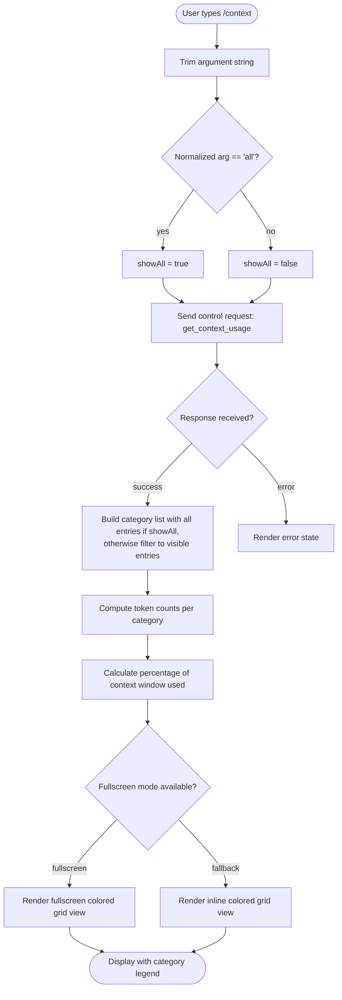

# `/context`

> Analysis basis: CC v2.1.150 bundle.js (AST extraction + Claude interpretation)
> Minimum version: v2.1.150

---

## Overview

The `/context` command visualizes the current context window usage as a colored grid, broken down by token-consuming category (system prompt, tools, messages, memory files, skills, etc.). It dispatches a `get_context_usage` control request to the local agent and renders the resulting data as a JSX component in the terminal. Passing the optional `all` argument expands the display to include all sub-categories, including deferred and subagent-only entries.

---

## Registration

| Field | Value |
|---|---|
| type | `local-jsx` |
| name | `context` |
| description | Visualize current context usage as a colored grid |
| argumentHint | `[all]` |
| thinClientDispatch | `control-request` |
| module_id | `XT1` |

Analysis basis: CC v2.1.150 bundle.js:+11096957

---

## Input Branching

The command entry point (identified as `commandHandler`) trims the raw argument string, then branches on whether the normalized value equals `"all"`.



Analysis basis: CC v2.1.150 bundle.js:+11095651, +11095657, +11095682, +11095690, +11095717

---

## Behavioral Spec

### 1. Argument Normalization

```
function normalizeArgument(rawArg):
    trimmed = rawArg.trim()                        // strip leading/trailing whitespace
    lower   = trimmed.toLowerCase()
    if lower == "all":
        return { showAll: true }
    else:
        return { showAll: false }
```

Analysis basis: CC v2.1.150 bundle.js:+11095657, +11095682

---

### 2. Control Request Dispatch

The command sends a control request with the method identifier `"get_context_usage"` to the local agent. The request is dispatched via `sendControlRequest`, which pads the method name to a fixed width of 40 characters using space (`"  "` padding unit) before transmission.

```
function dispatchContextRequest(session):
    method  = "get_context_usage"
    paddedMethod = method.padEnd(40, " ")          // pad to 40 chars
    response = session.sendControlRequest(paddedMethod)
    return response
```

Maximum padded method name width: 40 characters (bundle.js:+15286881)

Analysis basis: CC v2.1.150 bundle.js:+11095717, +11095747, +15284889, +15286881

---

### 3. Context Window Computation

Token counts and percentage calculations are performed using standard math operations. The window size is compared against a baseline of 1,000,000 tokens. The computed percentage is clamped between 0 and 100, and `Math.round` / `Math.floor` are applied for display rounding.

```
function computeWindowStats(usageData):
    totalTokens   = usageData.totalTokens
    windowSize    = max(usageData.contextWindow, 1000000)    // floor at 1 000 000
    usedPercent   = clamp(round(totalTokens / windowSize * 100), 0, 100)
    freePercent   = 100 - usedPercent
    return { totalTokens, windowSize, usedPercent, freePercent }
```

Token baseline constant: 1,000,000 (bundle.js:+9887037)

Percentage ceiling constant: 100 (bundle.js:+11094005)

Analysis basis: CC v2.1.150 bundle.js:+9887037, +11094005, +9909534, +9909545, +9910129, +9910291

---

### 4. Category Classification

Usage data is broken into named display categories. Each category carries a label string, an internal key, and a color hint. The full ordered list of categories extracted from literals is:

| Display Label | Internal Key | Color Hint |
|---|---|---|
| System prompt | `promptBorder` | standard |
| System tools | `inactive` | standard |
| MCP tools | `cyan_FOR_SUBAGENTS_ONLY` | cyan (subagents only) |
| MCP tools (deferred) | *(deferred)* | standard |
| System tools (deferred) | *(deferred)* | standard |
| Custom agents | `permission` | standard |
| Memory files | `claude` | standard |
| Skills | `warning` | yellow/warning |
| Messages | `purple_FOR_SUBAGENTS_ONLY` | purple (subagents only) |
| Autocompact buffer | *(derived)* | standard |
| Free space | *(derived)* | standard |

When `showAll` is `false`, entries whose color hints include `_FOR_SUBAGENTS_ONLY` or whose state is `deferred` are filtered out of the grid display.

```
function buildCategoryList(usageData, showAll):
    categories = []
    for each entry in ALL_CATEGORIES:
        if showAll == false:
            if entry.isSubagentOnly or entry.isDeferred:
                continue
        tokenCount = usageData[entry.key] ?? 0
        categories.push({ label: entry.label, tokens: tokenCount, color: entry.color })
    categories.push({ label: "Free space",         tokens: freeTokens,      color: "default" })
    categories.push({ label: "Autocompact buffer", tokens: compactBuffer,   color: "default" })
    return categories
```

Analysis basis: CC v2.1.150 bundle.js:+9908686, +9908717, +9908765, +9908795, +9908829, +9908856, +9908905, +9908991, +9909080, +9909111, +9909147, +9909177, +9909209, +9909233, +9909709, +9909735, +11093790, +11093813

---

### 5. Fullscreen Mode Detection

Before rendering, the command checks for conditions that disable fullscreen. Two known blocking conditions exist: tmux `-CC` mode (iTerm2 integration) and Windows over SSH (ConPTY). If neither is detected, a `"fullscreen"` render mode is selected; otherwise the render mode falls back to `"default"`.

```
function resolveRenderMode(environment):
    if environment.isTmuxCC:
        warn("fullscreen disabled: tmux -CC (iTerm2 integration mode) detected · set CLAUDE_CODE_NO_FLICKER=1 to override")
        return "default"
    if environment.isWindowsOverSSH:
        warn("fullscreen disabled: Windows over SSH (ConPTY re-rendering) detected · set CLAUDE_CODE_NO_FLICKER=1 to override")
        return "default"
    return "fullscreen"
```

Analysis basis: CC v2.1.150 bundle.js:+3360074, +3360260, +3360408, +3360434

---

### 6. Grid Rendering

The grid renderer maps each category to a proportional block of colored cells. Percentages below 20 display as `"< 20"` in the legend annotation. The percentage label is formatted with one decimal place (suffix `".0"` appended for whole numbers).

```
function renderGrid(categories, renderMode):
    for each category in categories:
        pct = round(category.tokens / totalTokens * 100, 1)
        if pct < 20:
            label = "< 20"
        else:
            label = formatOneDecimal(pct)         // e.g. "42.0"
        cellCount = floor(pct / 100 * GRID_WIDTH)
        renderColoredCells(category.color, cellCount, label)
    if renderMode == "fullscreen":
        useFullscreenContainer()
    else:
        useInlineContainer()
```

Percentage threshold for abbreviated label: 20 (bundle.js:+208219, +208228)

Percentage threshold for legend annotation step: 10 (bundle.js:+208261)

Decimal format suffix: `".0"` (bundle.js:+208190)

Analysis basis: CC v2.1.150 bundle.js:+208190, +208219, +208228, +208248, +208261

---

### 7. System Prompt Token Analysis

The system prompt token budget is further decomposed by configuration source. Sources are resolved in the following priority order and each contributes independently to the displayed system prompt block:

| Source Label | Config Key |
|---|---|
| Project | `projectSettings` |
| User | `userSettings` |
| Local | `localSettings` |
| Flag | `flagSettings` |
| Policy | `policySettings` |
| Plugin | `plugin` |
| Built-in | `built-in` |

Analysis basis: CC v2.1.150 bundle.js:+11094739, +11094759, +11094779, +11094796, +11094813, +11094831, +11094849, +11094866, +11094883, +11094902, +11094921, +11094932, +11094951, +11094964

---

### 8. Tool Usage Analysis (Built-in and MCP)

Built-in tool analysis (`analyzeBuiltIn`) and MCP tool analysis (`analyzeMcp`) iterate over conversation history messages of role `"assistant"` that contain content blocks of type `"tool_use"`. Results are accumulated per tool name into a token-count map.

```
function analyzeToolUsage(messages, toolType):
    seen    = new Set()
    results = []
    for each message in messages where message.role == "assistant":
        for each block in message.content where block.type == "tool_use":
            if toolType == "builtin" or toolType == "bundled":
                if not seen.has(block.name):
                    seen.add(block.name)
                    results.push(countTokens(block))
            elif toolType == "mcp":
                serverPrefix = block.name.split("__")[0]  // "__" delimiter
                if serverPrefix != "unknown":
                    accumulate(results, serverPrefix, countTokens(block))
    return results
```

MCP name separator: `"__"` (bundle.js:+9905591)

Fallback server label: `"unknown"` (bundle.js:+9905601)

Analysis basis: CC v2.1.150 bundle.js:+9903031, +9903245, +9903292, +9903313, +9903325, +9904339, +9904372, +9904387, +9905279, +9905591, +9905601

---

### 9. Auto-compact Window Configuration

The auto-compact buffer size is resolved from multiple configuration layers in priority order: environment variable `CLAUDE_CODE_AUTO_COMPACT_WINDOW` → settings file → experiment flag → `"auto"` default. If the environment variable contains a non-numeric value, it is treated as `"invalid"` and skipped.

```
function resolveAutoCompactWindow(env, settings, experiments):
    raw = env["CLAUDE_CODE_AUTO_COMPACT_WINDOW"]
    if raw is set:
        parsed = parseInt(raw)
        if isNaN(parsed):
            log("invalid")
        else:
            return { source: "env", value: parsed }
    if settings.autoCompactEnabled is set:
        return { source: "settings", value: settings.autoCompactEnabled }
    if experiments.autoCompact is set:
        return { source: "experiment", value: experiments.autoCompact }
    return { source: "auto", value: "auto" }
```

Environment variable name: `"CLAUDE_CODE_AUTO_COMPACT_WINDOW"` (bundle.js:+9895305)

Source labels: `"env"`, `"settings"`, `"experiment"`, `"auto"` (bundle.js:+9895497, +9895567, +9895654, +9895746)

Analysis basis: CC v2.1.150 bundle.js:+9895228, +9895236, +9895241, +9895301, +9895305, +9895406, +9895497, +9895567, +9895654, +9895746

---

### 10. Random Delay on Render

After rendering, a random delay jitter is applied via `setTimeout` before the display finalizes. The random factor is drawn from `Math.random()` and multiplied by a constant of `2`.

```
function scheduleRenderFinalize(renderFn):
    jitter = Math.random() * 2
    setTimeout(renderFn, jitter)
```

Jitter multiplier constant: 2 (bundle.js:+13290153)

Analysis basis: CC v2.1.150 bundle.js:+13290155, +13290192, +13290153

---

### 11. Agent Memory Loading

When memory files are present, they are loaded and their token usage attributed to the `"Memory files"` category. A telemetry event is fired upon successful load.

```
function loadAgentMemory(session):
    systemPrompt = session.getSystemPrompt()
    if systemPrompt is array:
        for each entry in systemPrompt:
            if entry.threadType == "main-thread":
                recordMemoryTokens(entry)
    emit("tengu_agent_memory_loaded")
```

Thread type constant: `"main-thread"` (bundle.js:+9136079)

Analysis basis: CC v2.1.150 bundle.js:+9135902, +9135918, +9135924, +9136020, +9136079

---

## State & Side Effects

| Item | Detail |
|---|---|
| Telemetry — `tengu_amber_creek` | Fired when the fullscreen grid render path (`A67` → `V6`) is executed (bundle.js:+3360591) |
| Telemetry — `tengu_pewter_brook` | Fired on the standard (non-fullscreen) grid render path (`Y9` → `V6`) (bundle.js:+3360499) |
| Telemetry — `tengu_agent_memory_loaded` | Fired after agent memory files are successfully loaded into the token map (bundle.js:+9136022) |
| Telemetry — `tengu_bridge_repl_ws_connected` | Fired when the remote bridge WebSocket transport connects (bundle.js:+13315068) |
| Telemetry — `tengu_bridge_repl_ws_closed` | Fired when the remote bridge WebSocket transport closes (bundle.js:+13315801) |
| Control request | Dispatches `"get_context_usage"` via `thinClientDispatch: "control-request"` — no conversational message is added to history |
| Hook registration | `$rH` registers a listener on the `"data"` event of the control channel; listener converts the response to string and passes it to the render pipeline (bundle.js:+7595569, +7595574) |
| Write side effect | The `Np` render helper uses a `"write"` channel operation to emit terminal output (bundle.js:+3750615) |
| appState changes | No persistent appState mutation observed within depth-2 traversal |
| Sound | No audio events observed within depth-2 traversal |
| Background session flag | Category list logic checks for `"bg"` and `"local-agent"` session type flags to determine subagent context (bundle.js:+3359863, +3359928) |
| Auto-compact setting key | Reads `autoCompactEnabled` from settings to compute the compaction buffer segment (bundle.js:+9896908) |

---

## Version History

| Version | Change |
|---|---|
| v2.1.150 | Initial analysis — colored grid display, `[all]` argument, 11 named categories, fullscreen/default render modes, auto-compact buffer segment, MCP `"__"` prefix grouping |

---

## Common Mistakes

1. **Omitting the `all` argument when debugging subagent context** — without `all`, entries color-tagged `_FOR_SUBAGENTS_ONLY` (MCP tools in cyan, Messages in purple) and all deferred tool categories are silently hidden from the grid. Run `/context all` to see the complete breakdown.

2. **Misreading the `< 20` label as zero** — any category whose share of the total is below 20% is annotated `"< 20"` rather than its exact value. This is a display threshold, not an absence of tokens (bundle.js:+208228).

3. **Expecting `/context` to affect the conversation** — the command dispatches a `control-request` outside the normal message pipeline; it never inserts a user or assistant turn and does not consume context tokens of its own.

4. **Assuming fullscreen mode is always available** — iTerm2 tmux `-CC` integration and Windows-over-SSH (ConPTY) environments both suppress fullscreen rendering and fall back to inline mode. Set `CLAUDE_CODE_NO_FLICKER=1` to override (bundle.js:+3360074, +3360260).

5. **Interpreting the percentage as out of the active model context limit** — the window size used for percentage calculations is floored at 1,000,000 tokens; if the actual model limit is smaller, the displayed percentage will be lower than the real utilization (bundle.js:+9887037).

6. **Expecting `CLAUDE_CODE_AUTO_COMPACT_WINDOW` to accept string values** — a non-numeric value in this environment variable is logged as `"invalid"` and ignored; the resolver falls through to settings, then experiment, then `"auto"` (bundle.js:+9895406).

---

## Appendix — Identifier Mapping

> For bundle debugging only. Identifiers change across versions.

| Identifier | Role |
|---|---|
| `OFL` | Top-level command handler for `/context` |
| `Y9` | Fullscreen / render-mode resolver |
| `WxH` | Feature-flag set membership check |
| `I3_` | Session type classifier (local-agent / bg detection) |
| `mH` | String coercion utility |
| `fi` | Platform / OS detection helper |
| `N` | Terminal environment inspector (tmux, SSH, Windows detection) |
| `N3_` | Boolean flag normalizer for session options |
| `HA` | Async render coordinator |
| `A67` | Fullscreen grid render path entry |
| `V6` | Colored grid cell emitter (shared by both render paths) |
| `H$` | Control-channel factory |
| `Z2H` | Control-channel constructor |
| `K` | Control request sender / padEnd formatter |
| `L` | Pending-request queue manager |
| `$rH` | Data-event listener registrar on control channel |
| `Np` | Terminal write helper |
| `H` | Jitter / random-delay scheduler |
| `JZ6` | Category list builder and token formatter |
| `v1` | Token count accessor |
| `XuH` | Category color resolver |
| `Ws` | Percentage formatter (one-decimal, `< 20` threshold) |
| `EH` | String-based token label formatter |
| `$FL` | Free-space / autocompact segment calculator |
| `XO` | Buffer slice helper for free-space computation |
| `k28` | Full context-usage data aggregator (orchestrates all sub-analyzers) |
| `sT` | Model / plan type resolver (opusplan, haiku, plan) |
| `AT` | Auto-compact enabled flag reader |
| `zc` | Auto-compact window size resolver (env → settings → experiment → auto) |
| `tG` | System prompt builder and environment info collector |
| `$u` | Agent memory loader and main-thread system prompt extractor |
| `XvL` | User-message token analyzer |
| `PvL` | System prompt token analyzer per config source |
| `WvL` | Built-in tool usage analyzer (`analyzeBuiltIn`) |
| `EvL` | MCP tool usage analyzer (`analyzeMcp`) |
| `ZvL` | Attachment / file token analyzer |
| `GvL` | Custom-agent / subagent token analyzer |
| `IvL` | Attachment metadata token accumulator |
| `TvL` | Prompt-block token analyzer (builtin/bundled prompt sources) |
| `e8H` | Token count clamper (Math.min based) |
| `HH` | Recording / voice session state array |
| `oq8` | Queue helper for pending control requests |
| `KLH` | Context window size resolver from model metadata |
| `lH` | Remote bridge WebSocket transport handler |
| `wH` | WebSocket connection state tracker |
| `GH` | Grid cell group renderer |
| `SH` | Category segment accumulator array |
| `f6` | Plugin / MCP reconciliation and managed-settings loader |
| `gH` | Token-count cache map (get/set/entries) |