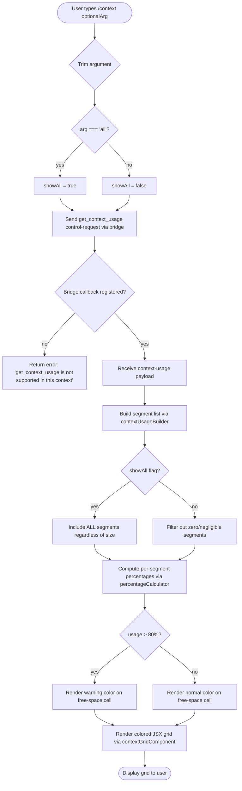

# `/context`

> Analysis basis: CC v2.1.153 bundle.js (AST extraction + Claude interpretation)
> Minimum version: v2.1.153

---

## Overview

The `/context` command renders a visual snapshot of the current session's context-window consumption as a colored grid of named segments. It dispatches a `get_context_usage` control request to the host bridge, collects token-count data for each context region (system prompt, memory files, MCP tools, messages, etc.), and renders a JSX component that maps each segment to a colored cell with percentage and token labels. An optional `all` argument forces inclusion of every segment regardless of size.

---

## Registration

| Field | Value |
|---|---|
| type | `local-jsx` |
| name | `context` |
| description | `Visualize current context usage as a colored grid` |
| argumentHint | `[all]` |
| thinClientDispatch | `control-request` |
| module_id | `dN1` |
| load_inline | `true` |
| loc_byte | `11147438` |
| loc_byte_end | `11147664` |
| loc_line | `7782` |
| arbor_handler.name | `PrL` |
| arbor_handler.fqn | `claude-2.1.153::PrL` |
| arbor_handler.kind | `AsyncFunction` |
| arbor_handler.resolution_path | `module_id` |
| arbor_handler.n_hits | `0` |

Analysis basis: CC v2.1.153 bundle.js:+11147438

---

## Input Branching

Four or more distinct code paths exist depending on the argument value and the context-usage data returned by the bridge, so a flowchart is used.



Analysis basis: CC v2.1.153 bundle.js:+11146163 (literal `"all"`), +11146198 (`sendControlRequest`), +11146574 (threshold literal `80`), +11144271 (`"Free space"`), +11144294 (`"Autocompact buffer"`)

---

## Behavioral Spec

### Handler Entry Point (`PrL`)

The Arbor-resolved handler `PrL` is an `AsyncFunction` reached via `module_id` → `dN1`. It is the authoritative entry point for `/context`.

```
async function contextCommandHandler(rawArg, sessionContext):
    arg = rawArg.trim()                            // A.trim @ +11146138
    showAll = (arg === "all")                       // literal "all" @ +11146163

    // Determine display mode from free-space state
    usageData = await sendControlRequest(          // K.sendControlRequest @ +11146198
        type: "get_context_usage"                  // literal @ +11146228
    )

    segments = buildSegmentList(usageData, showAll)
    percentages = computePercentages(segments)     // Pt + Math.round @ +11145971

    jsxElement = renderContextGrid(               // lv6.createElement @ +11146262
        segments,
        percentages,
        usageData.system                          // literal "system" @ +11146345
    )

    return jsxElement
```

Analysis basis: CC v2.1.153 bundle.js:+11146132

---

### Control-Request Dispatch (`sendControlRequest` / `K.sendControlRequest`)

The command uses the `thinClientDispatch: "control-request"` mechanism. The bridge handler `Xn1` checks whether a `get_context_usage` callback is registered; if not, it emits the error string `"get_context_usage is not supported in this context (onGetContextUsage callback not registered)"` and short-circuits.

```
function dispatchControlRequest(type, payload):
    if not bridge.hasGetContextUsageCallback():
        return errorResponse(
            "get_context_usage is not supported in this context ..."
        )
    return bridge.invoke("get_context_usage", payload)
```

Analysis basis: CC v2.1.153 bundle.js:+12324497

---

### Segment List Builder (`cv6`)

`cv6` enumerates the known context regions and produces a structured array consumed by the grid renderer. The regions are labeled using string constants embedded in the bundle.

```
function buildSegmentList(usageData, showAll):
    rawSegments = usageData.filter(...)           // A.filter @ +11144236

    knownLabels = [
        { key: "Free space",        label: "Free space"        },  // +11144271
        { key: "Autocompact buffer",label: "Autocompact buffer" }, // +11144294
        { key: "System prompt",     label: "System prompt"     },  // literal @ +9942770
        { key: "System tools",      label: "System tools"      },  // +9942851
        { key: "MCP tools",         label: "MCP tools"         },  // +9942916
        { key: "Memory files",      label: "Memory files"      },  // +9943234
        { key: "Messages",          label: "Messages"          },  // +9943798
        { key: "Skills",            label: "Skills"            },  // +9943296
        { key: "Custom agents",     label: "Custom agents"     },  // +9943167
        { key: "Permission",        label: "permission"        },  // +9943198
    ]

    result = []
    for each segment in rawSegments:
        if showAll OR segment.tokenCount > 0:
            result.push(mapToDisplaySegment(segment))

    // Locate autocompact boundary marker
    boundary = findAutocompactBoundary(usageData)  // "compact_boundary" @ +10453258

    return result
```

Analysis basis: CC v2.1.153 bundle.js:+11144236, +11144554

---

### Percentage Calculator (`Pt`)

`Pt` uses the total token budget reported by the session to compute a rounded percentage for each segment. Numbers below 20% receive the label `"< 20"` per a threshold literal.

```
function computePercentages(segments):
    total = getContextWindowSize(sessionModel)     // t1 + wK @ +11144195
    results = []
    for each seg in segments:
        pct = Math.round((seg.tokens / total) * 100)  // Math.round @ +209537
        if pct < 20:
            label = "< 20"                            // literal @ +209517
        else:
            label = formatNumber(pct,                 // "en-US" @ +211487
                                 style: "compact")    // "compact" @ +211505
        results.push({ seg, pct, label })
    return results
```

Analysis basis: CC v2.1.153 bundle.js:+209534

---

### Context Grid Renderer (JSX component)

The grid component (`TaH` → `ep` → `aw_` → `lrq.createElement`) subscribes to the `"data"` event on the response stream, serializes context usage into `toString()` form, and renders colored cells. The 80% threshold governs the "free space" cell's warning color.

```
function renderContextGrid(segments, percentages, systemFlag):
    cells = []
    for each { seg, pct, label } in percentages:
        color = resolveColorForSegment(seg.key)
        if seg.key === "Free space" AND pct <= (100 - 80):
            color = WARNING_COLOR                     // threshold 80 @ +11146574
        cells.push(createElement(GridCell, {
            label: seg.label,
            pct: label,
            color: color,
            tokens: seg.tokens
        }))

    return createElement(ContextGridWrapper, { cells })
```

Analysis basis: CC v2.1.153 bundle.js:+11146258, +11146262, +11146574

---

### Autocompact Boundary Marker (`XrL` / `n$`)

A distinct sub-feature reads the `compact_boundary` field from the usage payload to overlay a boundary line on the grid.

```
function resolveAutocompactBoundary(usagePayload):
    raw = usagePayload["compact_boundary"]      // literal @ +10453258
    if raw is undefined:
        return null
    markerPosition = computeMarkerOffset(raw)   // OZ8 + GJ @ +10453388
    return raw.slice(markerPosition)            // H.slice @ +10453411
```

Analysis basis: CC v2.1.153 bundle.js:+11146094, +10453388

---

### Number Formatter (`EH`)

A helper wraps `String()` to produce locale-aware short representations of token counts.

```
function formatTokenCount(n):
    return String(n)                            // String @ +173142
```

Analysis basis: CC v2.1.153 bundle.js:+11146452

---

## State & Side Effects

| Item | Detail |
|---|---|
| Telemetry | `tengu_amber_creek` (+3371527); `tengu_pewter_brook` (+3371435); `tengu_marlin_porch` (+3736008); `tengu_sparrow_ledger` (+13037676); `tengu_heron_brook` (+13020284); `tengu_slate_harrier` (+13047197). The first two are emitted by the fullscreen-capability sub-path reached during handler setup (`s17` / `T6`). |
| Control-request dispatch | Sends `"get_context_usage"` message over the bridge (`thinClientDispatch: "control-request"`). If no callback is registered on the receiving end, the bridge replies with a descriptive error string and the command surfaces it to the user. |
| appState changes | None detected in depth-2 traversal. The command is read-only with respect to session state. |
| Sound | None detected. |
| Bridge event subscriptions | `TaH` attaches a listener to the `"data"` event on the control-response stream to receive token-count payloads (bundle.js:+7702783). |
| Fullscreen detection | Before rendering, `s17` / `T6` evaluate the terminal environment for tmux/iTerm2 and Windows SSH conditions (literals `"iTerm.app"` +3369986, `"tmux"` +3370079, `"windows"` +3370548) and emit the corresponding telemetry. This affects the display surface, not the data itself. |

---

## Version History

| Version | Change |
|---|---|
| v2.1.153 | Initial analysis |

---

## Common Mistakes

1. **Forgetting the `all` argument**: By default, zero-token segments are filtered out. Run `/context all` to see every segment including empty ones — useful when debugging why a slot shows no allocation.
2. **Running in a context where the host has not registered the `onGetContextUsage` callback**: In thin-client or headless configurations where the bridge does not implement this control-request type, the command returns an error instead of a grid. Check that your host integration registers the callback.
3. **Misinterpreting the 80% threshold**: The "free space" cell turns a warning color when free space is **at or below 20%** of the window (i.e., usage ≥ 80%), not when any single segment reaches 80%.
4. **Expecting real-time streaming**: The grid is a point-in-time snapshot; it does not auto-refresh. Re-run the command to see updated numbers after a large tool result or compaction event.
5. **Confusing the `compact_boundary` marker with current usage**: The autocompact boundary line shows where the last compaction cut happened in the message history, which can make the "Messages" segment appear smaller than the raw message list suggests.

---

## Appendix — Identifier Mapping

> For bundle debugging only. Identifiers change across versions.

| Identifier | Role |
|---|---|
| `PrL` | Main async handler for `/context` (Arbor-resolved entry point) |
| `$q` | Context-data assembly orchestrator called from `PrL` |
| `Y3H` | Terminal/environment capability check |
| `qY_` | Color-mode resolver (yes/no/on/off literals) |
| `c1` | String normalizer — "no"/"off" branch |
| `xH` | String normalizer — "yes"/"on" branch |
| `Yr` | Fullscreen-mode resolver |
| `a17` | iTerm2/tmux terminal detector |
| `o17` | Terminal prefix checker (`H.startsWith`) |
| `N` | Log/debug helper (uses `"debug"` literal, `JSON.stringify`) |
| `chK` | Logging subsystem setup |
| `L3A` | Log-level initializer |
| `RH` | JSON serializer wrapper |
| `j4` | Path abbreviator (uses `H.replace`, `A.lastIndexOf`, `A.slice`) |
| `pOA` | Token-map builder (`UhK.map`) |
| `ixH` | File-write helper |
| `NOA` | Low-level write (`H.write`) |
| `ihK` | Settings file writer/manager |
| `GxH` | Async queue / debounce writer |
| `xfH` | Settings flush helper |
| `lOA` | Path joiner for settings |
| `cOA` | File rotation helper (stat/rename/unlink) |
| `nhK` | Append-and-rotate file writer |
| `H9` | Hook/signal registrar (`q3A.register`) |
| `AY_` | Windows-over-SSH flicker detector |
| `o_` | Settings loader / state provider |
| `Ap` | Settings load orchestrator |
| `uE` | Settings merge helper |
| `E9` | Dedup/memory-tracking helper |
| `nr8` | Full settings-load-from-disk function |
| `Ng` | Settings data aggregator |
| `CR6` | Settings post-processor |
| `s17` | Fullscreen-capability initializer |
| `T6` | Token-count / context-window tracker |
| `Dz6` | Context-window size lookup |
| `wz6` | Model context-limit resolver |
| `wHH` | Window-hash helper |
| `O88` | Context-window cache reader |
| `b6` | Timestamp / session-ID recorder |
| `g3` | Argument parser for `/context` |
| `dWH` | Argument tokenizer |
| `K` | Transport / bridge client |
| `L` | Pending-request tracker |
| `M` | Connection lifecycle manager |
| `TaH` | Control-response stream subscriber |
| `ep` | JSX element factory dispatcher |
| `aw_` | React `createElement` wrapper |
| `eKH` | Context-grid component outer |
| `vdH` | Context-grid data binder |
| `cv6` | Segment-list builder (main) |
| `t1` | Context-window size reader |
| `wK` | Model-limit table lookup |
| `ahK` | Context-limit constant store |
| `OpH` | Segment color-scheme mapper |
| `Pt` | Percentage calculator |
| `EH` | Token-count formatter (`String` wrapper) |
| `XrL` | Autocompact-boundary overlay |
| `n$` | Compact-boundary field reader |
| `OZ8` | Boundary offset calculator |
| `GJ` | Boundary position helper |
| `FG8` | System-prompt assembly root |
| `ZZ` | Prompt-block combiner |
| `Pe` | Individual prompt-block builder |
| `gv` | Prompt text provider |
| `cqH` | Prompt sanitizer |
| `ag` | Full system-prompt assembler |
| `TZ` | Prompt-section stitcher |
| `m3` | Prompt base-text provider |
| `$3` | Prompt variant selector |
| `WN` | Prompt wrapper |
| `DT` | Model config accessor |
| `s4` | Legacy-config migrator |
| `uk` | Config-dedup helper |
| `S8` | Settings + telemetry aggregator |
| `ql` | Auto-compact window calculator |
| `B9` | Model name normalizer |
| `Ai6` | Model entry-point resolver |
| `tj` | Model-string classifier |
| `VP` | Model-name replacer |
| `LV` | Context-window limit resolver |
| `f0` | Window-limit constant provider (1M tokens) |
| `Wp` | Per-model limit picker |
| `Z1H` | Fallback-limit selector |
| `re6` | Computed-limit parser |
| `lW` | Compact-window lower-bound |
| `b6H` | Env-var window-size parser |
| `Lj1` | Auto-compact mode picker |
| `S_` | Mode-string resolver |
| `Md_` | Unit-string parser (auto/tokens/percent) |
| `ET` | Full system-prompt builder (calls all sub-builders) |
| `SAA` | Static env-info builder |
| `S6` | Async-local-storage context reader |
| `aU6` | Store accessor |
| `s08` | Tool-list serializer |
| `Iw5` | Style-guide prompt injector |
| `xAA` | Additive-system-prompt collector |
| `Hj5` | Additive-prompt stitcher |
| `Uw5` | SDK-mode prompt injector |
| `NX` | SDK-variant string resolver |
| `pw5` | SDK injection condition checker |
| `iZ` | Feature-flag reader |
| `aB` | SDK prompt builder |
| `kB` | Tool-block flattener |
| `bz6` | Memory-file prompt builder |
| `K4` | Memory-file path resolver |
| `uKH` | Memory directory maker |
| `Ar` | Memory file/dir classifier |
| `SH` | File-stat helper |
| `_w` | Memory token tracker |
| `IBq` | Memory-block assembler |
| `NBq` | Private memory loader |
| `vBq` | Team memory loader |
| `wz_` | Memory file writer |
| `lw5` | Environment-info prompt builder (simple) |
| `sY` | Model display-name resolver |
| `RAA` | Model knowledge-cutoff resolver |
| `cw5` | Environment-info prompt builder (full) |
| `bAA` | OS info provider (version/release/type) |
| `Ff` | Working-directory prompt injector |
| `CAA` | Shell-info prompt injector |
| `Sw5` | Language-preference prompt injector |
| `Rw5` | Output-style prompt injector |
| `iw5` | Worktree-mode prompt injector |
| `bx_` | Worktree-mode resolver |
| `rw5` | Scratchpad-directory prompt injector |
| `oAH` | Scratchpad path reader |
| `P2H` | Scratchpad path joiner |
| `aw5` | Brief-mode prompt injector |
| `ew5` | Context-management prompt injector |
| `gw5` | GrowthBook experiment prompt injector |
| `hw5` | Heron-brook feature prompt injector |
| `hE9` | Hook-result prompt injector |
| `TfH` | Hook result reader |
| `Fw5` | Reproduce-verify workflow injector |
| `Cw5` | Companion/pen-mode prompt injector |
| `bw5` | Bg-session prompt injector |
| `yw5` | Bg-session text builder |
| `xw5` | Tool-pear / deferred-tools injector |
| `uw5` | Additive-prompt aggregator |
| `mw5` | CLI/remote context injector |
| `G0` | CLI vs remote mode resolver |
| `Bw5` | Extra-tool-block injector |
| `uBq` | Unified memory-prompt builder |
| `xBq` | Memory-feature flag checker |
| `$zH` | Model-variant ID resolver |
| `gG` | Model-flag reader |
| `IA` | String-identity / pass-through |
| `Fu` | Agent-memory / system-prompt loader |
| `TK` | Agent memory store reader |
| `mR` | Main-thread agent memory accessor |
| `W_` | Module-export bootstrapper |
| `f` | MCP-server plugin manager |
| `YSH` | MCP-server connection builder |
| `EWK` | MCP update applier |
| `Qb5` | MCP server-list reconciler |
| `DD` | Agent-memory debug dump |
| `fCL` | Conversation-history flattener |
| `MCL` | Message-chunk splitter |
| `QG8` | Context-block builder (MCP + memory) |
| `nw5` | Full system-prompt for sub-agent |
| `mBq` | Memory-block builder (combined) |
| `R6K` | Section-header parser |
| `GH6` | Context-section assembler |
| `KSH` | Token-count caller |
| `yH` | Error logger |
| `$j1` | Alternative context-section assembler |
| `$CL` | Built-in-tool context builder |
| `Sj6` | Built-in tool filter |
| `OCL` | Conversation-message context builder |
| `SXH` | Per-message context processor |
| `dG8` | Tool-definition context emitter |
| `z` | Daemon-stop message handler |
| `uH` | Daemon-stop helper |
| `Dy` | TEH push helper |
| `wm` | Race/shutdown orchestrator |
| `DCL` | Deferred-tools context builder |
| `XM` | Token rounding helper |
| `D` | PTY session lifecycle manager |
| `wk8` | Low-memory detector |
| `wLA` | Spare-session spawner |
| `wCL` | Conversation entries context builder |
| `zCL` | Auto-memory context builder |
| `fj1` | Config-key resolver |
| `GK` | Config-cache lookup |
| `PCL` | Prompt-cache context builder |
| `jCL` | Prompt-cache token calculator |
| `JCL` | Cache-block token calculator |
| `XCL` | Extended cache-block calculator |
| `YT` | Main conversation-state aggregator |
| `jBL` | Tool-call list builder |
| `Mn_` | Message normalizer |
| `TBL` | Thinking-block tag resolver |
| `GBL` | Content-block type router (text/document/image) |
| `ZBL` | Tool-search-block filter |
| `LZ8` | Tool-in-conversation checker |
| `bBL` | UUID generator for tool blocks |
| `Z8` | Tool-call ID factory |
| `IT` | Tool-result injector |
| `eB_` | Attachment expander |
| `MZ8` | Message-metadata setter |
| `fI` | Standard-mode message filter |
| `Yn_` | Tool-map normalizer |
| `JBL` | Tool-block presence checker |
| `E` | Pending-permission set |
| `V` | Rate-limit token bucket |
| `XBL` | Image-content checker |
| `CBL` | MCP-prefix tool-name resolver |
| `W4` | Tool-weight calculator |
| `F01` | Tool-find helper |
| `VBL` | Visible-segment filter |
| `Z01` | Segment push helper |
| `vd_` | Full conversation-document builder |
| `xBL` | Tool-name joiner |
| `G` | Input-event dispatcher |
| `EBL` | Message-end-boundary detector |
| `RT6` | Orphaned-thinking-block filter |
| `QBL` | Trailing-thinking-block filter |
| `ST6` | Whitespace-only assistant-message filter |
| `dBL` | Empty-content assistant fixer |
| `vBL` | Message-cursor tracker |
| `T01` | Conversation-history rebuilder |
| `E01` | Last-message boundary marker |
| `WBL` | Message-window slicer |
| `YCL` | Auto-memory context injector |
| `iZ_` | Auto-memory feature flag reader |
| `SG` | Language-model segment assembler |
| `L1` | Human-readable model name formatter |
| `dE6` | Cache-token delta calculator |
| `l_` | Error/String dual formatter |
| `n_H` | Grid-segment token-count minimizer |
| `T7H` | Max-output-token resolver |
| `MzH` | Per-model output-token limit table |
| `_H` | Grid-segment array (push/reduce/filter) |
| `Q` | PTY async-file-read scheduler |
| `iv6` | Async file reader |
| `CI1` | Async file unlinker |
| `r` | Pipe-pair manager |
| `d` | Pipe read-end |
| `d48` | Feature-usage tracker |
| `x6H` | Feature-flag presence checker |
| `Lc` | Segment color-mode resolver |
| `oH` | Bridge-connection event handler |
| `MH` | MCP-handler orchestrator |
| `KH` | Pending-request abort controller |
| `f8` | MCP debug logger |
| `fV6` | MCP-elicitation UI builder |
| `$V6` | MCP-elicitation response sender |
| `uc` | Notification dispatcher |
| `y` | Writable stream queue |
| `y6` | Low-level async resolver |
| `I8` | File-append logger |
| `s84` | Log path builder |
| `B` | Active-connection filter |
| `UH` | MCP client-state tracker |
| `QH` | Orphaned-permission set |
| `I6` | MCP-tool schema aggregator |
| `O8H` | Tool schema normalizer |
| `cH` | MCP tool-capability builder |
| `LH` | MCP tool-list sender |
| `K6` | Multi-context dispatcher |
| `_2H` | Plugin-refresh orchestrator |
| `_CH` | Plugin-filter helper |
| `CX` | Context-source router |
| `jH` | Voice-stream session manager |
| `Jn1` | Bridge-message ingress parser |
| `U6` | JSON.parse wrapper |
| `mL5` | Bridge message-type router |
| `pL5` | Control-request router |
| `rHA` | Request-ID tracker |
| `dH` | Output-buffer slicer |
| `x` | Throttled-write stream |
| `vH` | Message-queue writer |
| `Xn1` | Bridge-repl message dispatcher |
| `Y` | PTY config-reload orchestrator |
| `j` | Kill-all-sessions helper |
| `I` | Away-summary scheduler |
| `z6` | Plugin-prefix router |
| `Xq` | Plugin-prefix message handler |
| `D4` | Server-prefix message handler |
| `wq` | Server-connection message handler |
| `Jq` | Push-notification message handler |
| `UA` | CLI error reporter |
| `DH` | PTY session array |
| `ZH` | PTY-session token-count hook |
| `q6` | MCP-server lifecycle handler |
| `emH` | Event-metric logger |
| `G38` | MCP-server status emitter |
| `JGK` | Headless plugin-install orchestrator |
| `NU` | Plugin-UUID normalizer |
| `MG8` | Plugin-state tracker |
| `ZXH` | Plugin-cache clearer |
| `tZ` | Plugin-install state machine |
| `vY9` | Plugin zip-cache path builder |
| `NY9` | Plugin git-cache path builder |
| `lu` | Plugin-entry loader |
| `fC8` | Plugin manifest processor |
| `yY9` | Plugin install finalizer |
| `wGK` | Marketplace reconciler |
| `ly8` | Marketplace diff applier |
| `eI` | Round-ms helper |
| `pH` | Prompt-cache map |
| `Hp_` | Prompt-cache hash builder |

---

Note: index built via Arbor fallback; some signals (telemetry, literals) may be missing — see arbor-fallback.js.