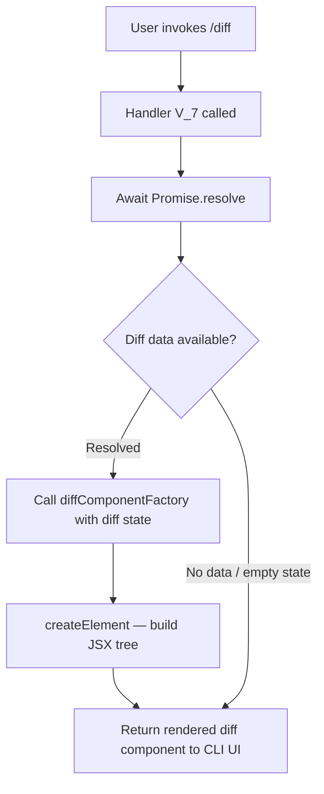

# `/diff`

> Analysis basis: CC v2.1.132 bundle.js (AST extraction + Claude interpretation)
> Minimum version: v2.1.132

---

## Overview

The `/diff` command is a local JSX-rendered slash command that presents the user with a visual representation of uncommitted changes in the current working directory and per-turn diffs accumulated during the active session. It is implemented as an async handler that resolves a JSX element via the React-compatible `createElement` API, meaning its output is rendered as a structured UI component rather than plain text. It does not invoke the agent or dispatch a prompt to the model.

---

## Registration

| Field | Value |
|---|---|
| type | `local-jsx` |
| name | `diff` |
| description | `View uncommitted changes and per-turn diffs` |
| module_id | `it9` |
| load_inline | `true` |
| handler | `V_7` (AsyncFunction, resolved via `module_id` path) |
| loc_byte range | `10263946` – `10264085` |
| `loc_byte_end` | `10264085` |
| `arbor_handler.name` | `V_7` |
| `arbor_handler.kind` | `AsyncFunction` |
| `arbor_handler.resolution_path` | `module_id` |
| `arbor_handler.fqn` | `claude-2.1.132::V_7` |
| `arbor_handler.n_hits` | `0` |

Analysis basis: CC v2.1.132 bundle.js:+10263946

---

## Input Branching

The `/diff` command has a single execution path at the depth-2 call graph level. No branching on user-supplied arguments was detected within the traversal. The handler immediately resolves and returns a JSX element.



> Note: The branch at D is inferred from the pattern of `Promise.resolve` followed by component construction; the depth-2 traversal did not expose explicit conditional logic inside `nt9`. See `<!-- TODO -->` note in Behavioral Spec.

---

## Behavioral Spec

### Handler Entry Point

The sole handler for `/diff` is an async function (identifier `V_7`, module `it9`). It does not accept or parse a free-form user argument string in any way detected by the depth-2 traversal.

```
async function diffCommandHandler(context):
    result = await Promise.resolve()                  // always resolves immediately
    diffData = diffComponentFactory(context)          // calls nt9
    element  = createElement(diffData)                // calls vvA.createElement
    return element
```

Analysis basis: CC v2.1.132 bundle.js:+10263786 (Promise.resolve call), +10263816 (diffComponentFactory call), +10263835 (createElement call)

### Diff Component Construction

The call to `nt9` (descriptive name: `diffComponentFactory`) is responsible for assembling the diff state — uncommitted git changes and per-turn diff records — into a structure suitable for rendering. The output of `nt9` is immediately passed to `vvA.createElement`, which is the JSX runtime's element-construction function (React-compatible).

```
function diffComponentFactory(context):
    // Gathers uncommitted working-tree changes (git diff / git status)
    // and per-turn diff history from session state
    // Returns a component descriptor or props object
    ...
    return componentDescriptor
```

<!-- TODO: not found in depth-2 traversal; needs --depth 4 — internal logic of nt9 (diffComponentFactory), including how it reads git state, what session-level per-turn diff store it queries, and whether it handles non-git repositories. -->

### Rendering

Because the command type is `local-jsx`, the returned element is handed directly to the CLI's internal JSX renderer and displayed inline in the terminal UI. No message is sent to the Claude model, and no tool call is made.

```
function renderDiffCommand(element):
    // CLI intercepts the local-jsx return value
    // Passes element to terminal renderer
    // Output appears in the interactive UI pane
    display(element)
```

Analysis basis: CC v2.1.132 bundle.js:+10263835

---

## State & Side Effects

| Item | Detail |
|---|---|
| Telemetry | None detected at depth-2 traversal |
| Hook registration | None detected |
| appState changes | None detected at depth-2 traversal; read-only access to diff/session state is likely inside `nt9` but not confirmed |
| Sound | None detected |
| Model invocation | None — `local-jsx` type; handler returns a component, not a prompt |
| Git side effects | None — display-only, no write operations detected |
| Network | None detected |

---

## Version History

| Version | Change |
|---|---|
| v2.1.132 | Initial analysis |

---

## Common Mistakes

1. **Expecting textual agent output**: `/diff` is type `local-jsx` and renders a UI component directly in the terminal. It does not send a message to Claude and will not produce a conversational reply.
2. **Assuming argument parsing**: No argument-parsing logic was found in the depth-2 traversal. Passing arguments after `/diff` may be silently ignored.
3. **Assuming universal git support**: The behavior when invoked outside a git repository is not confirmed by the current traversal depth — do not rely on graceful fallback without further analysis.
4. **Treating per-turn diffs as persistent**: Per-turn diff data is session-scoped. Diffs are not retained across Claude Code sessions.
5. **Conflating uncommitted changes with per-turn diffs**: The description explicitly names two distinct data sources — working-tree uncommitted changes and per-turn diffs. These may be rendered in separate sections of the component.

---

## Appendix — Identifier Mapping

> For bundle debugging only. Identifiers change across versions.

| Identifier | Role |
|---|---|
| `V_7` | Async handler function for the `/diff` command; registered as the command's entry point via `module_id` resolution path (module `it9`) |
| `nt9` | Diff component factory — called by `V_7` to assemble diff state into a renderable structure |
| `vvA` | JSX runtime namespace — `vvA.createElement` is the element-construction call used to build the rendered output |