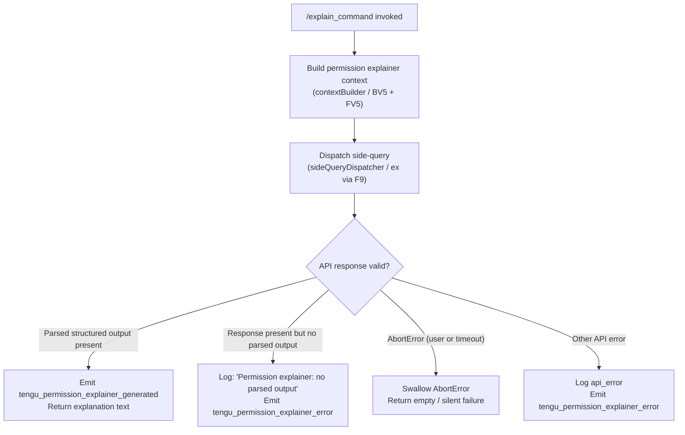

# `/explain_command`

> Analysis basis: CC v2.1.153 bundle.js (AST extraction + Claude interpretation)
> Minimum version: v2.1.153

---

## Overview

`/explain_command` is an internal tool-type command that generates a human-readable explanation of why a given permission or tool call is being requested. It dispatches a focused side-query to the Claude API using a purpose-built `permission_explainer` context, returns structured output, and emits telemetry for both successful generation and failure cases.

---

## Registration

| Field | Value |
|---|---|
| type | `tool` |
| name | `explain_command` |
| description | `null` |
| loc_byte | `13845230` |
| loc_byte_end | `13845266` |
| loc_line | `11564` |
| arbor_handler.name | `RMK` |
| arbor_handler.fqn | `claude-2.1.153::RMK` |
| arbor_handler.kind | `AsyncFunction` |
| arbor_handler.resolution_path | `direct` |
| arbor_handler.n_hits | `1` |

Analysis basis: CC v2.1.153 bundle.js:+13845230

---

## Input Branching

The handler exhibits four distinct observable paths based on the outcome of the API side-query:



Analysis basis: CC v2.1.153 bundle.js:+13845713 (success telemetry), +13845925 (error telemetry), +13846060 (no-parsed-output literal), +13846383 (AbortError literal), +13846454 (api_error literal)

---

## Behavioral Spec

### 1. Handler Entry — `permissionExplainerHandler` (RMK)

The top-level async function is resolved directly (Arbor `resolution_path: direct`) at byte offset 13845230.

```
async function permissionExplainerHandler(toolInput):
    startTime = Date.now()                        // +13844949

    // Step 1: build a short conversation summary for context
    contextSummary = buildConversationContext(toolInput)   // BV5 +13844970

    // Step 2: select and format relevant recent messages
    filteredMessages = filterAndFormatMessages(toolInput)  // FV5 +13844988

    // Step 3: compose and dispatch the explainer query
    result = await dispatchExplainerQuery(               // F9  +13845135
                 contextSummary,
                 filteredMessages,
                 sideQueryRunner)                        // ex  +13845148

    // Step 4: branch on result
    if result has structured parsed output:
        emit("tengu_permission_explainer_generated")     // +13845713
        return result.explanation

    if result is present but lacks parsed output:
        log("Permission explainer: no parsed output in response")  // +13846060
        emit("tengu_permission_explainer_error")                   // +13845925
        return null

    if error is AbortError:                              // +13846383
        // silent; treat as cancellation
        return null

    else:
        emit("tengu_permission_explainer_error", {type: "api_error"})  // +13846454
        return null
```

Analysis basis: CC v2.1.153 bundle.js:+13844925 (HKA call), +13844970 (BV5), +13844988 (FV5), +13845135 (F9), +13845148 (ex)

---

### 2. Conversation Context Builder — `buildConversationContext` (BV5)

Produces a compact textual summary of the current session state to anchor the explainer prompt.

```
function buildConversationContext(input):
    // Stringify key session metadata (RH → JSON.stringify at +183108)
    serialised = jsonStringify(input.sessionMeta)

    // Coerce to string with a cap of 2 recent entries (+13844445 value:2)
    // Limit sampling window to last 1000 ms of activity (+13844489 value:1000)
    contextString = String(serialised)

    return contextString
```

Analysis basis: CC v2.1.153 bundle.js:+13844435 (RH), +13844445 (constant 2), +13844461 (String coercion), +13844489 (constant 1000)

---

### 3. Message Filter & Formatter — `filterAndFormatMessages` (FV5)

Selects the most relevant assistant messages from recent history, trims them, and assembles a compact context string.

```
function filterAndFormatMessages(input):
    // Keep only assistant-role messages (+13844524 value:"assistant")
    assistantMessages = input.messages.filter(m => m.role == "assistant")

    // Reverse to prioritise most-recent first
    assistantMessages.reverse()                  // +13844569

    // Take at most 3 messages (+13844544 value:3)
    selected = assistantMessages.slice(0, 3)     // +13844712

    // Extract first "text" content block (+13844627 value:"text")
    textBlocks = selected.map(m => firstTextBlock(m))

    // Truncate each block with "..." suffix (+13844725 value:"...")
    truncated = textBlocks.map(t => truncateText(t))

    // Prepend the permission_explainer label (+13845288 value:"permission_explainer")
    truncated.unshift("permission_explainer")    // +13844733

    return truncated.join("\n")                  // +13844766
```

Analysis basis: CC v2.1.153 bundle.js:+13844501 (H.filter), +13844524 ("assistant"), +13844544 (3), +13844569 (A.reverse), +13844627 ("text"), +13844712 (M.slice), +13844725 ("..."), +13844733 (q.unshift), +13844766 (q.join)

---

### 4. Side-Query Dispatcher — `sideQueryRunner` (ex)

Sends a purpose-built API request labelled `"side_query"` (+13103592) to the inference endpoint. This re-uses the shared request infrastructure (`Rp`) that handles OAuth token resolution, proxy auth, streaming, and retry.

```
async function sideQueryRunner(messages, config):
    // Tag this call as a side_query in telemetry (+13103592)
    requestContext = { queryType: "side_query" }

    // Compute a deterministic hash of message content for dedup (+13058311 via mAA)
    requestHash = sha256(messages)               // hash alg: "sha256" +13058326

    // Delegate to core API pipeline (Rp)
    response = await coreApiPipeline({
        messages,
        config,
        context: requestContext,
        maxAge: "1h"                             // cache control +13104442
    })

    // Conditionally add cache_control header (+13105534)
    if config.promptCache:
        addHeader("cache_control", ...)

    // Record timing
    emit("tengu_api_success", { elapsed: Date.now() - startTime })  // +13105043

    return response
```

Analysis basis: CC v2.1.153 bundle.js:+13103560 (Rp call), +13103592 ("side_query"), +13103641 (X), +13103677 (Cp), +13103686 (Boolean), +13103698 (eZH), +13103744 (uj5), +13103753 (mAA), +13104125 (ur6), +13105015 (Date.now), +13105043 (tengu_api_success), +13105449 (cj6), +13105467 (Ud)

---

### 5. Config & Permissions Loader — `configAndPermissionsLoader` (HKA → b6)

Before the handler dispatches, it loads the active configuration (including the current permission set) via the shared config loader `b6`. This includes reading config from disk, backing up on migration, and resolving watch state.

```
function loadConfigWithPermissions():
    // Guard: config must be accessible before use
    // Error if accessed too early: "Config accessed before allowed." (+3206099)
    validateConfigAccessAllowed()

    raw = fs.readFileSync(configPath, "utf-8")  // +3206155, +3206182
    parsed = JSON.parse(raw)                     // U6 +183848

    // Strip leading prefix if present (Pb +1094026)
    if parsed startsWith prefix:
        parsed = parsed.slice(prefixLen)

    // Detect status flags
    status = resolveStatus(parsed)               // N +203678
    // Status values observed: "unknown","local","migrated","native",
    //   "installed","disabled","enabled","no_permissions",
    //   "global","not_configured"               // +3201809..3202015

    // Set up file-watch for live reload (jq7 +3203124)
    watchConfigFile(configPath, onConfigChange)

    return { parsed, status }
```

Analysis basis: CC v2.1.153 bundle.js:+13844801 (b6 call from HKA), +3202981 (B6), +3203014 (CO_), +3206099 ("Config accessed before allowed."), +3206155 (readFileSync), +3206182 ("utf-8"), +183848 (JSON.parse)

---

### 6. Permission Status Resolver — `resolvePermissionStatus` (N)

Maps raw config data to a symbolic permission status string.

```
function resolvePermissionStatus(rawConfig):
    level = rawConfig.level?.toUpperCase()       // +203780
    trimmed = rawConfig.value?.trim()            // +203803

    if level includes special marker:            // +203718
        return applyStatusTransform(level)       // RH +203736

    return normaliseStatus(trimmed)              // GS +203819, ixH +203825
    // Possible output values: "debug","enabled","disabled",
    //   "no_permissions","not_configured","global"
```

Analysis basis: CC v2.1.153 bundle.js:+203678 (C16), +203696 (chK), +203718 (H.includes), +203736 (RH), +203780 (_.toUpperCase), +203800 (j4), +203803 (H.trim), +203819 (GS), +203825 (ixH), +203839 (ihK)

---

## State & Side Effects

| Item | Detail |
|---|---|
| Telemetry — success | `tengu_permission_explainer_generated` (bundle.js:+13845713) |
| Telemetry — error | `tengu_permission_explainer_error` (bundle.js:+13845925) |
| Telemetry — API success | `tengu_api_success` (bundle.js:+13105043) |
| Telemetry — config parse error | `tengu_config_parse_error` (bundle.js:+3206730) |
| Telemetry — OAuth token refresh | `tengu_oauth_token_refresh_*` family (bundle.js:+2957443 … +2958989) |
| Telemetry — stream watchdog | `tengu_stream_watchdog_default_on`, `tengu_byte_watchdog_fired_late` |
| Telemetry — background dispatch | `tengu_bg_dispatch_sigkill_escalate`, `tengu_bg_dispatch_low_mem`, `tengu_bg_spare_*`, `tengu_bg_attach_*` |
| Side-query label | Requests tagged `"side_query"` in request context (bundle.js:+13103592) |
| Config watch | File watch registered for live config reload via `jq7` (bundle.js:+3203124); unregistered on teardown (+3202817) |
| Cache control | Optional `cache_control` header appended to API request when prompt cache is active (bundle.js:+13105534) |
| appState changes | None directly observed in depth-2 traversal |
| Sound | None observed |
| Hook registration | `H9` calls `q3A.register` (bundle.js:+58450) during config watch setup |

---

## Version History

| Version | Change |
|---|---|
| v2.1.153 | Initial analysis |

---

## Common Mistakes

1. **Treating `/explain_command` as an interactive chat command.** It is registered as type `tool`, not `prompt`. It is invoked programmatically (e.g., from a permission UI flow) and returns structured data, not a conversational reply.
2. **Expecting output when the model returns no parsed structure.** If the side-query response lacks a recognised structured block, the handler logs a warning and returns `null` silently. The caller must handle a `null` result.
3. **Confusing the `permission_explainer` context label with a user-visible slash command.** The string `"permission_explainer"` (bundle.js:+13845288) is an internal query-type marker prepended to the formatted message list, not a command name.
4. **Assuming the command is cancellable without consequence.** AbortErrors are swallowed silently (bundle.js:+13846383), so aborting mid-flight produces no user-visible feedback or error telemetry.
5. **Forgetting that config must be fully loaded before invocation.** The guard `"Config accessed before allowed."` (bundle.js:+3206099) will throw if the command is called before the configuration subsystem has initialised.

---

## Appendix — Identifier Mapping

> For bundle debugging only. Identifiers change across versions.

| Identifier | Role |
|---|---|
| `RMK` | Main async handler for `explain_command` (`permissionExplainerHandler`) |
| `HKA` | Config-and-permissions pre-loader, called first from RMK |
| `b6` | Core config loader (reads file, parses, sets up watch) |
| `B6` | Config path resolver / base directory helper |
| `CO_` | Config object constructor / factory |
| `EzH` | Low-level config file reader with backup and migration logic |
| `UUq` | Directory scanner used during config migration |
| `UO_` | Backup directory path builder |
| `jq7` | Config file-watch setup and teardown coordinator |
| `H9` | Watch hook registrar (calls `q3A.register`) |
| `si` | Watch callback / change-event handler |
| `N` | Permission status resolver (`resolvePermissionStatus`) |
| `BV5` | Conversation context builder (`buildConversationContext`) |
| `RH` | JSON serialiser wrapper (calls `JSON.stringify`) |
| `FV5` | Message filter and formatter (`filterAndFormatMessages`) |
| `F9` | Explainer query composer, calls side-query runner |
| `Pe` | Prompt assembly helper used inside F9 |
| `ag` | Argument/option processor for prompt composition |
| `L1` | Model name normaliser (handles aliases: opusplan, sonnet, haiku, opus, best) |
| `Kb4` | Additional prompt option handler |
| `qX` | Query executor wrapper inside F9 |
| `M0` | Model configuration resolver |
| `GA` | Provider capability mapper |
| `Ze` | Max-plan tier resolver |
| `zOH` | Team-plan tier resolver |
| `CBH` | Enterprise-plan tier resolver |
| `TZ` | Model tier selector |
| `EP` | First-party endpoint builder |
| `m3` | Provider type checker (anthropicAws, gateway) |
| `IA` | Provider-enum validator (bedrock, foundry, mantle, vertex) |
| `$3` | Supplementary provider config composer |
| `WN` | Fallback model/provider composer |
| `ex` | Side-query runner (`sideQueryRunner`) |
| `Rp` | Core API pipeline (auth, headers, streaming, retry) |
| `sD` | Async-local store accessor for session context |
| `Lt4` | Header field splitter and trimmer |
| `N9` | DOH (DNS-over-HTTPS) resolver helper |
| `ci` | OAuth context store accessor |
| `br6` | OAuth store reader |
| `y6` | Fetch wrapper (`Fv`) |
| `M9_` | URL encoder for API path segments |
| `xH` | String coercion utility |
| `JO` | OAuth token check orchestrator |
| `cf_` | OAuth token refresh lock manager |
| `z3q` | Boolean coercion helper |
| `Hw` | Authentication credential assembler |
| `UK` | Auth-header builder |
| `RP` | Request-options composer |
| `FO` | Provider-flag injector |
| `cJ` | Connection/session config accessor |
| `m$` | Credential resolver (API key, OAuth, WIF) |
| `JO6` | GgH-delegating auth fallback |
| `GgH` | Generic header builder |
| `C$` | Cached credential store |
| `qt4` | Request timeout and connection configurator |
| `jgH` | In-flight request tracker with timestamps |
| `S_` | Session-state accessor |
| `ad6` | Proxy auth helper executor |
| `HTH` | Proxy auth string builder |
| `gnA` | Proxy auth validator |
| `bX4` | Numeric timeout parser |
| `lk` | Logger instance |
| `zP` | Proxy logger helper |
| `$t4` | HTTP request dispatcher (streaming, UUID, headers) |
| `Ot4` | Response header inspector |
| `ft4` | Response stream initialiser |
| `hf_` | Response body max-size calculator |
| `Mt4` | Streaming reader with watchdog timers |
| `oD` | Model-ID normaliser |
| `en6` | Model-ID prefix stripper |
| `vh4` | Model-ID prefix checker |
| `tn6` | Case-insensitive model-name matcher |
| `Nz` | Network/proxy configuration resolver |
| `gg` | URL scheme and port classifier |
| `vpH` | Proxy URL parser |
| `KH_` | IP-address / hostname classifier for proxy bypass |
| `fH_` | Proxy bypass rule evaluator |
| `Kt4` | Retry-and-backoff coordinator |
| `le6` | Per-attempt request executor |
| `Qv` | Retry policy evaluator |
| `lWH` | Environment variable MCP server finder |
| `bq` | OAuth endpoint validator |
| `XOH` | Gateway JWT refresh handler |
| `Ax4` | Token refresh HTTP poster |
| `ku8` | Timestamp utility |
| `MO6` | Response header case-normaliser |
| `LzH` | SDK log prefix router |
| `yH` | Error logger with stack capture |
| `Cm5` | Supervisor identity verifier |
| `h` | Away-summary focus/blur tracker |
| `I` | Away-summary generation controller |
| `l2` | Sub-agent credential resolver |
| `cBH` | WIF (Workload Identity Federation) token exchanger |
| `Yo6` | WIF credential fetcher |
| `SH` | Feature-flag success recorder (`tengu_feature_ok`) |
| `uH` | Feature-flag failure recorder (`tengu_feature_bad`) |
| `Mx4` | WIF response inclusion checker |
| `G` | Remote-control / keyboard event dispatcher |
| `j0` | User-settings accessor |
| `Y` | PTY session lifecycle manager |
| `X` | Daemon IPC socket handler |
| `NM` | Socket end-and-flush helper |
| `jm5` | Daemon message router (ping, nudge, dispatch, attach, kill, resize, etc.) |
| `Jm5` | Daemon message type constants |
| `dO` | Background-service label emitter |
| `yTK` | Daemon keepalive timer |
| `r8` | Promise-based timer with abort |
| `P` | Repaint orchestrator |
| `_0` | Working-directory resolver |
| `u3` | Realpath normaliser |
| `V3H` | Transcript file reader |
| `Dm5` | Terminal dimension calculator |
| `wm5` | Worker spawn and lifecycle manager |
| `bK` | Socket path builder |
| `MS6` | Socket write helper |
| `T` | Terminal renderer |
| `EH` | String error code wrapper |
| `eZH` | Model-generation classifier |
| `B9` | Model family tagger |
| `tj` | Model-name string normaliser |
| `VP` | Model-name replacement utility |
| `cS` | Provider classifier |
| `uj5` | Message finder (user / assistant) |
| `mAA` | SHA-256 request hasher |
| `ur6` | Request context builder |
| `c1` | String coercion helper |
| `I88` | Provider-specific injection helper |
| `WIH` | Prompt-cache configuration applier |
| `T6` | Cache-version store manager |
| `wHH` | Cache header builder |
| `O88` | Cache-set deduplication tracker |
| `Mm8` | Cache file-size estimator |
| `gG` | HIPAA flag injector |
| `uf_` | HIPAA provider validator |
| `tZH` | HIPAA flag builder |
| `Ffq` | Restricted-region list checker |
| `_H8` | Temperature / sampling config builder |
| `TP` | Tool-list formatter |
| `RYH` | Response parser / result extractor |
| `up` | Session workspace initialiser |
| `K8` | Project config loader |
| `d7` | Response unwrapper (calls Hw and b6) |
| `XfH` | Elapsed-time formatter |
| `cj6` | Cache-control writer (cL9 + dj6) |
| `cL9` | Cache invalidation checker |
| `iv7` | Cache hit evaluator |
| `Ud` | Subagent / thread-type resolver |
| `nv7` | Agent prefix classifier |
| `M78` | Custom-agent name extractor |
| `eW_` | Agent name slicer |
| `N6H` | Thread-type string matcher |
| `_96` | Trailing cleanup / finaliser |
| `g9` | MCP tool name validator (checks `mcp_tool` prefix) |
| `e6` | Error reporter helper |

---

Note: index built via Arbor fallback; some signals (telemetry, literals) may be missing — see arbor-fallback.js.