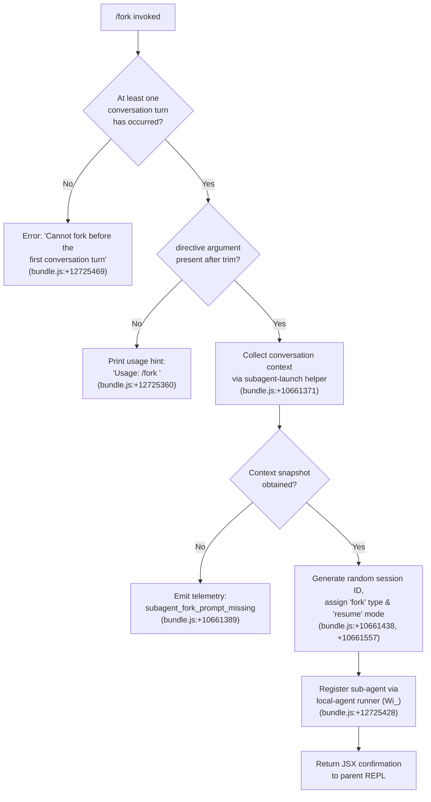

# `/fork`

> Analysis basis: CC v2.1.153 bundle.js (AST extraction + Claude interpretation)
> Minimum version: v2.1.153

---

## Overview

`/fork` spawns a background agent that inherits the full current conversation context and is given a new user-supplied directive. The parent session continues uninterrupted while the child agent executes autonomously as a local sub-agent process. The command validates that at least one conversation turn has already occurred before proceeding.

---

## Registration

| Field | Value |
|---|---|
| type | `local-jsx` |
| name | `fork` |
| description | `Spawn a background agent that inherits the full conversation` |
| argumentHint | `<directive>` |
| module_id | `tt1` |
| load_inline | `true` |
| loc_byte | `12725732` |
| loc_byte_end | `12725928` |
| loc_line | `9988` |
| arbor_handler.name | `iz5` |
| arbor_handler.kind | `AsyncFunction` |
| arbor_handler.resolution_path | `module_id` |
| arbor_handler.fqn | `claude-2.1.153::iz5` |
| arbor_handler.n_hits | `0` |

Analysis basis: CC v2.1.153 bundle.js:+12725732

---

## Input Branching

Four distinct paths are present in the handler (usage-error guard, pre-turn guard, missing-directive guard, and successful fork path), so a Mermaid flowchart is used.



---

## Behavioral Spec

### Handler Entry Point (`iz5`)

The Arbor-resolved handler is the async function `iz5`.

```
async function forkCommandHandler(userInput, appState):
    directive = userInput.trim()                 // +12725336

    if no prior assistant messages in conversation:
        return error("Cannot fork before the first conversation turn")   // +12725469

    if directive is empty:
        print("Usage: /fork <directive>")        // +12725360
        return

    // System message injection uses "system" role literal
    // +12725400
    systemContext = buildSystemContext(appState)

    launchSubagent(directive, systemContext, appState)   // +12725428
```

Analysis basis: CC v2.1.153 bundle.js:+12725336

---

### Conversation Context Capture (`Wi_`)

```
async function captureContextForFork(appState):
    // Snapshot the live REPL message list
    contexts = getReplContexts(appState)          // +10661478
    messages = slice last 50/49 entries           // +10661623, +10661636

    // Conversation history is serialised for the child; up to
    // depth-3 message-type filtering occurs (tool_use, tool_result,
    // assistant, user roles) — +9361742, +9361901, +9362412, +9362434

    if no snapshot available:
        emitTelemetry("subagent_fork_prompt_missing")  // +10661389
        return null

    sessionId = generateHexRandomBytes(8)         // +6630476, +6630488
    timestamp  = Date.now()                       // +10661680

    return ForkContext {
        type:      "fork",     // +10661438
        mode:      "resume",   // +10661557
        sessionId: sessionId,
        messages:  messages,
        timestamp: timestamp,
    }
```

Analysis basis: CC v2.1.153 bundle.js:+10661371

---

### Sub-agent Registration and Launch (`ReH` → `phH`)

```
async function registerAndLaunchSubagent(forkCtx, directive, appState):
    // Creates a local_agent record with status "pending" → "running"
    // +12903056, +10210376, +10210331

    agentRecord = {
        type:    "local_agent",        // +10210331
        subtype: "general-purpose",    // +10210450
        status:  "pending",
    }

    // Filesystem artefacts
    mkdir(agentDir)                    // via LAA, +12899708
    createTranscriptFile()             // via T3/ksH, +12899761
    symlink(forkContextRef)            // +12902026, literal "fork-context-ref" +12832536

    // AbortController wired for parent-initiated cancellation
    controller = new AbortController() // Ry, +10210309

    // Agent worker loop
    registerWorkerLoop(agentRecord, directive, controller)  // K.register, +10210642
    agentRecord.status = "running"

    emitTelemetry("subagent_launch")   // via Wi_ context, +10661371
```

Analysis basis: CC v2.1.153 bundle.js:+10210326

---

### System Prompt Assembly (`ET` + helpers)

The child agent's system prompt is assembled from multiple feature slices. Key slices observed in the call graph:

```
function buildChildSystemPrompt(appState, forkCtx):
    parts = []

    // Core identity block (SAA / xH)       +13037808
    parts.append(coreIdentityBlock())

    // Plugin/tool list (s08)                +13037944
    parts.append(buildPluginList(appState))

    // Memory sections (bz6)
    //   - auto memory prompt               +3291428
    //   - team memory (if enabled)         +3291629, +3291655
    //   - T97.buildCombinedMemoryPrompt    +3292259
    parts.append(buildMemorySection(appState))

    // Environment info (lw5 / cw5)
    //   - git-worktree notice if applicable +13040118
    //   - env header                        +13041920
    parts.append(buildEnvInfo(appState))

    // Background-session instruction (iw5)
    //   output_style = "bg-session"         +13038435
    //   Instructs agent: edit files directly,
    //   do not call EnterWorktree            +13044692
    parts.append(backgroundSessionInstructions())

    // Language/locale slice (ET → language) +13038370
    // Context-management / brief slice      +13038489, +13038528
    // Reproduce-verify workflow slice       +13038582

    return joinPromptParts(parts)
```

Analysis basis: CC v2.1.153 bundle.js:+13037808

---

### Worker Supervisor Loop (`WrH`)

The worker supervisor handles the background agent's lifecycle after launch. It enforces timeout and stall detection.

```
async function workerSupervisorLoop(agentRecord, directive, controller):
    maxWaitMs   = 600000   // 10 minutes, +6713137
    stallCheck  = 10       // +6713132
    progressPct = 0.1      // +6714467

    startTime = Date.now()

    loop:
        status = await pollAgentStatus(agentRecord)  // EP6, +6714612

        if status == "complete":
            emitTelemetry("subagent_complete")   // +6714265
            updateParentState(agentRecord)
            break

        if stallDetected():
            emitTelemetry("subagent_stall_timeout")  // +6714285
            controller.abort()
            break

        if userKillRequested():
            emitTelemetry("user_kill_async")     // +6716126
            controller.abort()
            break

        if errorOccurred():
            emitTelemetry("subagent_async_errored")  // +6716397
            break

        sleep(progressInterval)

    finalizeAgentRecord(agentRecord)
    emitTelemetry("subagent_complete")
```

Analysis basis: CC v2.1.153 bundle.js:+6713071

---

### Safety Classifier Gate (`Uf8` / `PP6`)

Before the child agent result is surfaced to the parent, a safety handoff classifier runs:

```
function safetyClassifierGate(agentOutput):
    verdict = runAutoModeClassifier(agentOutput)  // PP6, +6711429

    if verdict == "unavailable":
        // Classifier unavailable — warn user but allow output
        // Literal: "Note: The safety classifier was unavailable…"
        // +6712292
        emitWarning(classifierUnavailableMessage)
        emitTelemetry("auto_mode_decision")       // +6711770
        return ALLOWED_WITH_WARNING

    if verdict == "blocked":
        emitTelemetry("auto_mode_decision")
        return BLOCKED

    return ALLOWED
```

Analysis basis: CC v2.1.153 bundle.js:+6711429

---

## State & Side Effects

| Item | Detail |
|---|---|
| Telemetry: subagent_launch | Emitted in `Wi_` on successful fork initiation (bundle.js:+10661371) |
| Telemetry: subagent_fork_prompt_missing | Emitted when context snapshot cannot be obtained (bundle.js:+10661389) |
| Telemetry: subagent_complete | Emitted when child agent finishes normally (bundle.js:+6714265) |
| Telemetry: subagent_stall_timeout | Emitted when child agent stalls beyond watchdog threshold (bundle.js:+6714285) |
| Telemetry: user_kill_async | Emitted when user kills the background agent (bundle.js:+6716126) |
| Telemetry: subagent_async_errored | Emitted on child agent error (bundle.js:+6716397) |
| Telemetry: auto_mode_decision | Emitted by safety classifier on child output review (bundle.js:+6711770) |
| Telemetry: tengu_forked_agent_default_turns_exceeded | Emitted if child agent exceeds default turn cap (bundle.js:+10637343) |
| Telemetry: tengu_agent_tool_completed | Emitted when a tool inside the child agent completes (bundle.js:+6710127) |
| Telemetry: tengu_agent_tool_terminated | Emitted when a tool inside the child agent is terminated (bundle.js:+6715956) |
| Filesystem | Creates agent directory, transcript `.jsonl` file, `.meta.json`, and `fork-context-ref` symlink under the CC session store |
| appState changes | New sub-agent record added to the agent registry with `type="local_agent"`, `subtype="general-purpose"` |
| AbortController | Registered to the parent's signal chain; parent SIGINT propagates to child |
| Hook registration | `K.register` called to enrol the worker in the supervisor loop (bundle.js:+10210642) |
| Sound / UI | JSX confirmation element returned to parent REPL; parent session continues running |
| Max background wait | 600 000 ms (10 minutes) hard timeout on child agent (bundle.js:+6713137) |

---

## Version History

| Version | Change |
|---|---|
| v2.1.153 | Initial analysis |

---

## Common Mistakes

1. **Running `/fork` before any conversation turn** — The command guards against this and returns the hard error `"Cannot fork before the first conversation turn"` (bundle.js:+12725469). Send at least one message to the assistant before forking.
2. **Omitting the `<directive>` argument** — Without an argument the command prints the usage hint `"Usage: /fork <directive>"` and does nothing (bundle.js:+12725360). The directive is required.
3. **Expecting the parent session to block** — The fork is non-blocking; the parent REPL returns immediately. Use the agent panel or task-notification system to monitor the child.
4. **Assuming the child shares the working directory state dynamically** — The child receives a frozen snapshot of the conversation at fork time. Subsequent parent-side file edits are not visible to the child unless explicitly communicated.
5. **Killing the parent session expecting a clean child shutdown** — The child's `AbortController` is wired to the parent's abort signal; abruptly terminating the parent process may leave the child in an unclean state depending on OS signal delivery timing.

---

## Appendix — Identifier Mapping

> For bundle debugging only. Identifiers change across versions.

| Identifier | Role |
|---|---|
| `iz5` | Top-level `/fork` command handler (AsyncFunction; Arbor FQN `claude-2.1.153::iz5`) |
| `Wi_` | Sub-agent launch coordinator — captures conversation context, generates session ID, initiates fork |
| `lQL` | Conversation snapshot builder — reads REPL contexts and assembles message list for child |
| `T_` | Tool-permission resolver for child agent (allowed_tools / disallowed_tools) |
| `pZ8` | Allowed-tools policy helper |
| `UZ8` | Disallowed-tools policy helper |
| `ET` | Child system-prompt assembly orchestrator |
| `SAA` | Core identity block builder |
| `Iw5` | Model selection slice (default: `claude-opus-4-7`) |
| `kw5` | Model configuration slice |
| `xAA` | Output-style section builder |
| `Hj5` | Output-style wrapper |
| `Uw5` | Tool-listing / SDK slice builder |
| `bz6` | Memory section builder (auto + team memory) |
| `lw5` | Environment info (static) slice |
| `cw5` | Environment info (simple / worktree) slice |
| `iw5` | Background-session instructions slice |
| `rw5` | Reproduce-verify-workflow slice |
| `aw5` | Brief-mode slice |
| `ew5` | Focus slice |
| `gw5` | Environment metadata slice |
| `hw5` | Heron-brook slice |
| `hE9` | Attachment / image context slice |
| `bw5` | Context-management slice |
| `xw5` | Task / doing-tasks slice |
| `mw5` | Tool-use guidance slice |
| `Bw5` | Tone-and-style slice |
| `uBq` | Memory-prompt combiner helper |
| `$zH` | API provider / auth context builder |
| `Fu` | Agent memory loader (system prompt injection for child) |
| `ReH` | Sub-agent registration and filesystem setup entry point |
| `phH` | Sub-agent filesystem artefact creator (mkdir, transcript, symlink) |
| `qy8` | Active-session set manager (add / delete on start/end) |
| `LAA` | Agent directory creator |
| `T3` | Transcript-file path builder |
| `NtH` | Transcript file opener |
| `D2` | Agent record timestamp stamper |
| `Ry` | AbortController wrapper for child agent |
| `R1` | AbortSignal max-listener setter |
| `WrH` | Worker supervisor loop — polls status, enforces timeouts, handles kill |
| `EP6` | Per-turn agent-state poller |
| `I0` | Streaming turn executor inside child agent |
| `Z8` | UUID / session-ID generator for sub-messages |
| `N51` | Agent-state updater |
| `ZP6` | Sub-agent progress recorder |
| `U7H` | Sub-agent speculation aborter |
| `Uf8` | Safety-classifier handoff gate |
| `PP6` | Auto-mode classifier implementation |
| `hN9` | Classifier initialiser |
| `uf8` | Sub-agent completion handler and telemetry emitter |
| `pf8` | Post-completion task-notification helper |
| `YrH` | Task-progress recorder |
| `F7H` | Agent-state updater on completion |
| `Bf8` | Agent-state updater on failure |
| `DjH` | DSH dispatcher |
| `DSH` | Decision-support helper (tool classification) |
| `fh` | Main REPL session runner (parent-side orchestration loop) |
| `jQL` | Parent-side query loop (model call, tool execution) |
| `Bu` | Parent agent bootstrapper |
| `v6` | Per-turn query executor (streaming, tool dispatch, compaction) |
| `uX` | Hook execution engine |
| `A5H` | Sub-agent start hook emitter |
| `mo` | Tool-call fan-out and deduplication |
| `kW8` | MCP tool-permission gate |
| `yW8` | Agent-state setter for child sessions |
| `RZ6` | Remote / subagent invocation dispatcher |
| `H7` | Remote agent configuration builder |
| `dy` | Cryptographic random-bytes generator |
| `sg` | Async-local-storage runner (context propagation) |
| `sD` | Async-local-storage store reader |
| `tg` | OpenTelemetry tracing context helper |
| `T6` | Telemetry event emitter (core) |
| `SH` | Console/log sink |
| `uH` | Utility helper (c wrapper) |
| `xH` | String coercion utility |
| `EH` | String conversion helper |
| `RH` | JSON serialiser wrapper |
| `N` | Logger / notification dispatcher |
| `yH` | Error-logging helper |
| `qE` | Environment-variable reader |
| `bo` | Model-string parser |
| `L1` | Model alias normaliser |
| `Wp` | Model family classifier |
| `EP` | Model endpoint builder |
| `B9` | Model capability checker |
| `vv9` | Model version validator |
| `Vv9` | Model validation orchestrator |
| `PZ1` | Conversation-slice trimmer |
| `f08` | Message-history serialiser |
| `rvL` | Role filter (removes non-assistant entries) |
| `ovL` | Role filter (removes non-user entries) |
| `ivL` | Tool-use block filter |
| `avL` | Tool-result block filter |
| `eM1` | Block-type classifier |
| `KF_` | Fork-context-ref resolver |
| `h4` | Agent metadata reader |
| `F_H` | Fork-snapshot loader |
| `ASH` | Snapshot filter / validator |
| `SZ6` | Transcript-file writer |
| `ne1` | Transcript storage initialiser |
| `h6` | Bridge/remote-session connector for child |
| `MH` | MCP message handler |
| `nqA` | Bridge REPL v2 transport |
| `oH` | Bridge connection event handler |
| `f6` | Bridge shutdown scheduler |
| `K6` | CWD / environment packager for child |
| `tv9` | OpenTelemetry span starter for subagent.spawn |
| `LjH` | Tracing context setter |
| `Qy` | Active-span accessor |
| `JIH` | Span status setter |
| `ev9` | Span attribute setter and ender |
| `MjH` | Tracing context restorer |
| `jW` | Shared utility (referenced from both parent and child paths) |
| `aK` | Fv-wrapper (utility) |
| `Fv` | Core primitive (utility base) |
| `pwH` | Post-launch state flusher |
| `jj6` | Session-store helper |
| `ZZ` | Model-plan selector |
| `Pe` | Model-plan entry builder |
| `TZ` | Model-plan tier builder |
| `WN` | Model-plan tier builder (variant) |
| `G0` | Tool-origin resolver |
| `NX` | Error-message formatter |
| `W4` | Predicate utility |
| `qL` | Sort comparator |
| `GK` | Dependency-graph walker (reactive state) |
| `jQL` | Query loop (alias; same as parent query loop) |
| `EM8` | Sub-agent exit-event manager |
| `lZ_` | Tool-schema mapper |
| `gNH` | Backoff calculator |
| `SG` | Model-alias / sub-model selector |
| `LV` | Token-budget parser |
| `lW` | Lightweight logger |
| `YY1` | MCP permission-cache manager |
| `Qc` | MCP tool filter |
| `a6H` | MCP tool validator |
| `dF` | Deferred-tools flag reader |
| `vE6` | MCP connection checker |
| `Zv9` | Tool-set diff tracker |
| `xVL` | Full MCP tool-list assembler |
| `ax` | MCP enterprise config loader |
| `Oc` | MCP project config loader |
| `Z7H` | Tool-search / deferred-tools orchestrator |
| `fI` | Tool-search standard-mode handler |
| `W7H` | Tool-search model-string handler |
| `FhH` | Tool-availability checker |
| `tg_` | Deferred-tools pool manager |
| `mVL` | Child system-prompt getter |
| `hZ6` | Background-session system-prompt builder |
| `pVL` | Prompt-command expander for child |
| `keH` | Prompt-command validator |
| `L9` | Prompt-command name extractor |
| `yhH` | Prompt-command resolver |
| `z2` | Prompt-command finder |
| `z8` | Prompt-command registry |
| `YX` | Permission-check helper |
| `S8` | Permission resolver |
| `yKH` | Permission-set checker |
| `Tv9` | MCP monitor updater |
| `YIH` | MCP monitor flush helper |
| `OI` | MCP monitor accessor |
| `DIH` | Span-ID cleanup helper |
| `AF_` | MCP cache-entry cleanup helper |
| `OE9` | bU (deferred set) cleanup helper |
| `HIH` | Hook-output persistence helper |
| `Ac` | claude-desktop detection helper |
| `pH` | Session-hook runner |
| `Hp_` | Hook-result serialiser |
| `V7H` | Todo-list updater |
| `wd7` | Todo finder |
| `GJ` | Todo-list accessor |
| `qF_` | Session-cleanup finaliser |
| `V51` | Task-progress reader |
| `mX` | Task-progress field accessor |
| `wSH` | Task-progress timestamp helper |
| `uVL` | Unused-variable cleanup (lint helper) |
| `DD` | Display-diff helper |

---

Note: index built via Arbor fallback; some signals (telemetry, literals) may be missing — see arbor-fallback.js.