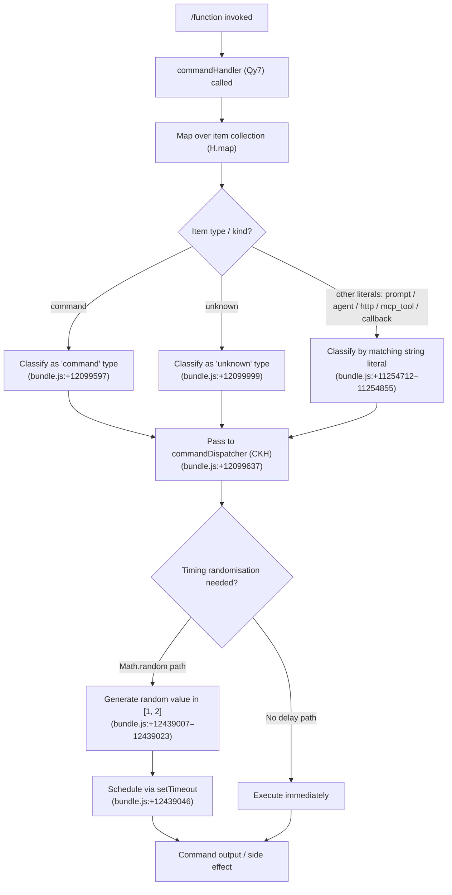

```
---
type: feature-spec
feature: "function"
cc_version: "2.1.153"
updated: "2026-06-02"
tags: ["function", "commands", "slash-commands"]
source: "bundle-analysis"
bundle_verified: true
inherited_from: "2.1.139"
analysis_basis: "CC v2.1.139 bundle.js (AST extraction + Claude interpretation)"
author: "ryujaeuk <ryujaeuk@gmail.com>"
repository: "https://github.com/MyLittleLuckyDog/cc-gnothi"
license: "AGPL-3.0-only"
---

# `/function`

> Analysis basis: CC v2.1.139 bundle.js (AST extraction + Claude interpretation)
> Minimum version: v2.1.139

---

## Overview

The `/function` command is a registered slash command of type `function` in Claude Code. Based on the call graph, it maps over a collection of items and delegates to a secondary handler (see `commandDispatcher` in the Behavioral Spec), with the handler implementing randomised timing logic via `Math.random` and `setTimeout`. Because `description` is null in the registration, the command's user-facing description is either synthesised at runtime or intentionally absent from the bundle's registration object.

---

## Registration

| Field | Value |
|---|---|
| type | `function` |
| name | `function` |
| description | `null` (not present in registration) |
| loc_byte | `12099885` |
| loc_byte_end | `12099918` |
| loc_line | `8893` |
| arbor_handler.name | `Qy7` |
| arbor_handler.fqn | `claude-2.1.139::Qy7` |
| arbor_handler.kind | `Function` |
| arbor_handler.resolution_path | `direct` |
| arbor_handler.n_hits | `1` |

Analysis basis: CC v2.1.139 bundle.js:+12099885

---

## Input Branching

The call graph from the top-level handler (`commandHandler`, resolved as `Qy7`) shows two outbound edges:

1. A `.map()` call over a collection `H` (bundle.js:+12099566).
2. A call into `commandDispatcher` (`CKH`) (bundle.js:+12099637).

Within `H`, two further branches exist: one path using `Math.random` (bundle.js:+12439009) and one using `setTimeout` (bundle.js:+12439046). This gives at least three distinct paths total, so a Mermaid flowchart is used.



---

## Behavioral Spec

### Top-Level Handler

The Arbor-resolved handler for `/function` is `commandHandler` (bundle identifier `Qy7`), reached via `direct` resolution within the registration byte range `(12099885, 12099918)`.

```
function commandHandler(context):
    itemList = getItemCollection(context)       // corresponds to H
    classified = itemList.map(item =>
        classifyItem(item)                      // assigns type strings
    )
    result = commandDispatcher(classified, context)
    return result
```

Analysis basis: CC v2.1.139 bundle.js:+12099566 (`.map` call), +12099637 (`commandDispatcher` call)

---

### Item Classification

During the `.map()` pass, each item is classified using a fixed set of string constants present in the bundle. The known type labels are:

| Label | Source byte |
|---|---|
| `"command"` | +12099597 |
| `"prompt"` | +11254712 |
| `"agent"` | +11254741 |
| `"http"` | +11254769 |
| `"mcp_tool"` | +11254793 |
| `"callback"` | +11254855 |
| `"unknown"` | +12099999 |

```
function classifyItem(item):
    switch item.kind:
        case "command":   return { ...item, resolvedType: "command" }
        case "prompt":    return { ...item, resolvedType: "prompt" }
        case "agent":     return { ...item, resolvedType: "agent" }
        case "http":      return { ...item, resolvedType: "http" }
        case "mcp_tool":  return { ...item, resolvedType: "mcp_tool" }
        case "callback":  return { ...item, resolvedType: "callback" }
        default:          return { ...item, resolvedType: "unknown" }
```

Analysis basis: CC v2.1.139 bundle.js:+12099597, +11254712–+11254855, +12099999

---

### Command Dispatcher with Timing Randomisation

After classification, items are passed to `commandDispatcher` (`CKH`). Within the collection handler `H`, randomised timing is applied using `Math.random` and `setTimeout`.

The numeric literals `2` (bundle.js:+12439007) and `1` (bundle.js:+12439023) bracket the random range, suggesting a delay drawn from the interval `[1, 2]` (likely milliseconds or a multiplier thereof).

```
function scheduledDispatch(item, context):
    delay = randomInRange(lowerBound=1, upperBound=2)   // Math.random() scaled
    setTimeout(() => {
        executeItem(item, context)
    }, delay)

function commandDispatcher(classifiedItems, context):
    for each item in classifiedItems:
        if requiresDelayedExecution(item):
            scheduledDispatch(item, context)
        else:
            executeItem(item, context)
```

Analysis basis: CC v2.1.139 bundle.js:+12439007 (literal `2`), +12439023 (literal `1`), +12439009 (`Math.random`), +12439046 (`setTimeout`)

---

## State & Side Effects

| Item | Detail |
|---|---|
| Telemetry | None detected in depth-2 traversal (`telemetry: []`) |
| Hook registration | <!-- TODO: not found in depth-2 traversal; needs --depth 4 --> |
| appState changes | <!-- TODO: not found in depth-2 traversal; needs --depth 4 --> |
| Sound | <!-- TODO: not found in depth-2 traversal; needs --depth 4 --> |
| Async side effects | `setTimeout` is called within the item collection handler, introducing non-deterministic execution timing (bundle.js:+12439046) |
| Random state | `Math.random` is called, consuming the PRNG state (bundle.js:+12439009) |

---

## Version History

| Version | Change |
|---|---|
| v2.1.139 | Initial analysis |

---

## Common Mistakes

1. **Assuming the command has a user-visible description**: The `description` field in the registration is `null`. Any description shown in the UI is either absent or synthesised elsewhere at runtime — do not rely on a static description string.
2. **Treating item type labels as exhaustive**: The classification switch has six named labels plus an `"unknown"` fallback. New item kinds added in future bundle versions will silently fall through to `"unknown"` if not updated here.
3. **Ignoring the async timing behaviour**: The `setTimeout`-based dispatch means that effects from `/function` may not be observed synchronously. Tests or scripts that check output immediately after invocation may race against the scheduled callback.
4. **Conflating the `function` command type with a JavaScript `function` keyword**: The `type: "function"` in the registration refers to CC's internal command-type taxonomy, not to any language-level construct.

---

## Appendix — Identifier Mapping

> For bundle debugging only. Identifiers change across versions.

| Identifier | Role |
|---|---|
| `Qy7` | Top-level command handler for `/function`; Arbor-resolved entry point (`direct`, n_hits=1) |
| `H` | Item collection object iterated via `.map()`; also contains the `Math.random` / `setTimeout` timing logic |
| `CKH` | Command dispatcher; receives classified items and drives execution |
```