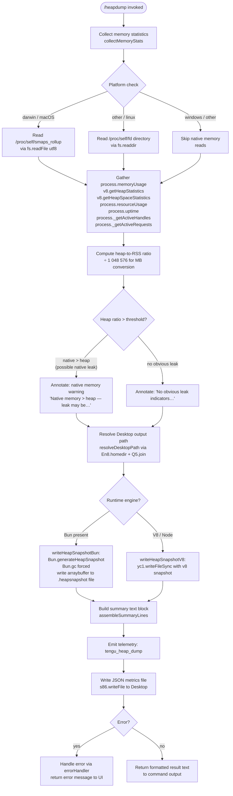

# `/heapdump`

> Analysis basis: CC v2.1.153 bundle.js (AST extraction + Claude interpretation)
> Minimum version: v2.1.153

---

## Overview

`/heapdump` is a hidden developer/diagnostic command that captures a full JavaScript heap snapshot and a rich set of runtime memory metrics, then writes both to `~/Desktop`. It is intended for debugging memory leaks and high-memory conditions inside the Claude Code process itself; it is not a user-facing productivity feature.

---

## Registration

| Field | Value |
|---|---|
| type | `local` |
| name | `heapdump` |
| description | `Dump the JS heap to ~/Desktop` |
| supportsNonInteractive | `true` |
| isHidden | `true` |
| module_id | `Rc1` |
| load_inline | `true` |
| loc_byte | `12252154` |
| loc_byte_end | `12252317` |
| arbor_handler.name | `J75` |
| arbor_handler.fqn | `claude-2.1.153::J75` |
| arbor_handler.kind | `AsyncFunction` |
| arbor_handler.resolution_path | `module_id` |
| arbor_handler.n_hits | `0` |

Analysis basis: CC v2.1.153 bundle.js:+12252154

---

## Input Branching

The command has more than three distinct execution paths based on runtime state (Bun vs V8 engine, platform/OS, heap-to-native memory ratio, and error handling), so a Mermaid flowchart is used.



Analysis basis: CC v2.1.153 bundle.js:+12249661, +12249685, +12248232, +12250133, +12250723

---

## Behavioral Spec

### Handler Entry Point — `commandHandler` (J75)

```
async function commandHandler(args):
    lines = []
    result = await dumpHeapCore(args)
    lines.push(result summary lines)
    return lines.join(newline)
```

Analysis basis: CC v2.1.153 bundle.js:+12251023, +12251142, +12251169, +12251291

### Core Dump Orchestrator — `dumpHeapCore` (hc1)

```
async function dumpHeapCore(args):
    // 1. Initialise output path
    desktopPath = resolveDesktopPath()          // En8.homedir + "Desktop"

    // 2. Collect memory snapshot
    memStats = collectMemoryStats()             // w75

    // 3. Resolve log-level / manual trigger context
    context = { source: "manual", code: 0 }    // literals at +12249661, +12249672

    // 4. Build output file path
    outputPath = GHA.join(desktopPath, timestamp_filename)

    // 5. Write heap snapshot file
    writeHeapSnapshot(outputPath)              // j75

    // 6. Write JSON metrics sidecar
    s86.writeFile(outputPath + ".json",
                  RH(memStats),               // JSON.stringify
                  { mode: 0o600 })            // octal 384 at +12250168

    // 7. Emit telemetry
    emit("tengu_heap_dump")                   // +12250275

    // 8. Format summary for display
    summaryLines = buildSummaryLines(memStats, outputPath)

    // 9. Return result object
    return formatResult(summaryLines)
```

Analysis basis: CC v2.1.153 bundle.js:+12249744, +12249786, +12249981, +12250090, +12250133, +12250149, +12250224, +12250273, +12250444

### Memory Statistics Collector — `collectMemoryStats` (w75)

```
function collectMemoryStats():
    stats = {}

    // JS heap from V8/Bun
    stats.memoryUsage        = process.memoryUsage()          // +12247186
    stats.heapStatistics     = v8Module.getHeapStatistics()   // +12247210  (HI8 = v8/bun:jsc)
    stats.resourceUsage      = process.resourceUsage()        // +12247236
    stats.uptime             = process.uptime()               // +12247262
    stats.heapSpaceStats     = v8Module.getHeapSpaceStatistics() // +12247287

    // Active handle / request counts
    stats.activeHandles      = process._getActiveHandles()    // +12247329
    stats.activeRequests     = process._getActiveRequests()   // +12247366

    // Linux: open file-descriptor count via /proc/self/fd
    if platform supports /proc:
        fdList = s86.readdir("/proc/self/fd")                 // +12247417, +12247429

    // Linux: smaps rollup for native RSS breakdown
    if /proc/self/smaps_rollup exists:
        smaps = s86.readFile("/proc/self/smaps_rollup", "utf8") // +12247492, +12247518

    // Bun JSC introspection when available (module "bun:jsc")
    if bun:jsc importable:
        jscStats = require("bun:jsc").getStats()              // +12247577

    // Rolling process-pool stats (connection pool T / subprocess pool P)
    poolStats = gatherPoolStats()                             // T at +12247590, P.push at +12247771

    // Compute RSS to heap ratio; express in MB (÷ 1 048 576)             // +12247723
    // Uptime window: 3600 s cap used for rate calculations               // +12247718
    rssRatio = stats.memoryUsage.rss / stats.memoryUsage.heapUsed

    // Threshold: native > heap ratio > 100 %                             // +12247870
    if rssRatio > 1.0 * 100:
        stats.warning = "Native memory > heap — leak may be in native addons (node-pty, sharp, etc.)"
                                                              // +12247956
    else:
        stats.advisory = "No obvious leak indicators. Check heap snapshot for retained objects."
                                                              // +12249075

    // Format RSS as fixed-decimal MB string (X.toFixed)                  // +12248079
    stats.rssMB = (stats.memoryUsage.rss / 1048576).toFixed(1)

    // Platform-specific label
    if process.platform == "darwin":                          // +12249229
        stats.platformLabel = "macos"                         // +12248810

    return stats
```

Analysis basis: CC v2.1.153 bundle.js:+12247186, +12247210, +12247236, +12247262, +12247287, +12247329, +12247366, +12247417, +12247479, +12247577, +12247718, +12247723, +12247870, +12247956, +12248079, +12249075

### Heap Snapshot Writer — `writeHeapSnapshot` (j75)

```
function writeHeapSnapshot(outputPath):
    if typeof Bun !== "undefined":
        // Bun path: generate structured snapshot then force GC
        snapshot = Bun.generateHeapSnapshot("v8", "arraybuffer")
                                                  // +12250723, +12250748, +12250753
        yc1.writeFileSync(outputPath + ".heapsnapshot", snapshot)
                                                  // +12250703
        Bun.gc(/* synchronous */ true)            // +12250780
    else:
        // V8 / Node path: write via v8.writeHeapSnapshot or equivalent
        yc1.writeFileSync(outputPath + ".heapsnapshot", v8HeapBuffer)
```

Analysis basis: CC v2.1.153 bundle.js:+12250703, +12250723, +12250748, +12250753, +12250780

### Desktop Path Resolver — `resolveDesktopPath` (fEA)

```
function resolveDesktopPath():
    home = En8.homedir()                       // os.homedir()   +12014652
    desktopDir = Q5.join(home, "Desktop")      // path.join      +12014688, "Desktop" at +12014698

    // WSL / Windows Subsystem for Linux fallback:
    // If path begins with /mnt/c/Users check for Public/Default/All Users exclusion
    if desktopDir.includes("/mnt/c/Users"):    // +12014920
        // skip system accounts: Public, Default, Default User, All Users
        // +12014964, +12014983, +12015003, +12015028
        // replace with resolved Windows desktop path
        desktopDir = q.replace(resolvedWindowsPath)  // +12014828

    // Ensure directory exists
    B6(desktopDir)                             // mkdir-p helper  +12014865

    return desktopDir
```

Analysis basis: CC v2.1.153 bundle.js:+12249981, +1014652, +1014688, +1014698, +1014828, +1014865, +1014920

### Summary Lines Assembler — `assembleSummaryLines` (X75)

```
function assembleSummaryLines(memStats, outputPath):
    lines = []

    // Guidance line always included
    lines.push("Open the .heapsnapshot in Chrome DevTools → Memory → Load to inspect retainers.")
                                                    // +12251179

    // Memory classification line
    jsHeapMB  = (heapUsed / 1048576)
    rssMB     = (rss      / 1048576)
    maxVal    = Math.max(jsHeapMB, rssMB)           // +12251398

    if jsHeapMB >= rssMB * threshold:
        lines.push("— most memory is JS heap (inspect the .heapsnapshot)")
                                                    // +12251466
    else:
        lines.push("— most memory is native (NOT in the .heapsnapshot)")
                                                    // +12251526

    // Leak indicator
    if noLeakIndicators:
        lines.push("  (no obvious leak indicators)")// +12251663

    // Byte formatting: width 8 columns             // +12251798
    // Internal t86 helper used for table formatting // +12251710

    return lines
```

Analysis basis: CC v2.1.153 bundle.js:+12251179, +12251398, +12251466, +12251526, +12251663, +12251710, +12251798

### Output Format — Result Object (J75 tail)

The handler collects the assembled lines into an array and joins them with newlines, returning a plain-`text` result object (literal `"text"` at bundle.js:+12251055). The `auto-1.5GB` label (bundle.js:+12250341) appears in the metrics JSON output as a memory-cap annotation.

Analysis basis: CC v2.1.153 bundle.js:+12251055, +12250341, +12251291

---

## State & Side Effects

| Item | Detail |
|---|---|
| Telemetry | `tengu_heap_dump` (bundle.js:+12250275) — fired once per invocation after files are written. Additional background-dispatch events (`tengu_bg_dispatch_sigkill_escalate`, `tengu_bg_dispatch_low_mem`, `tengu_bg_spare_enable/claim/claim_fail`, `tengu_bg_proto_mismatch`, `tengu_bg_dispatch_stale_drop`, `tengu_bg_attach*`) are from pool-management helpers reachable via the call graph but not specific to this command. |
| File writes | `.heapsnapshot` binary/JSON file written to `~/Desktop` (mode `0o600`, i.e. owner-read/write only — bundle.js:+12250168) |
| File writes | JSON sidecar with full `memStats` object written to same Desktop directory via `s86.writeFile` (bundle.js:+12250133) |
| GC side-effect | `Bun.gc(true)` forced synchronously after snapshot capture on Bun runtime (bundle.js:+12250780) |
| appState changes | None observed in depth-2 traversal |
| Hook registration | None observed in depth-2 traversal |
| Sound | None observed in depth-2 traversal |
| Visibility | `isHidden: true` — does not appear in `/help` listing |
| Non-interactive | `supportsNonInteractive: true` — can be invoked in CI / pipe mode |

---

## Version History

| Version | Change |
|---|---|
| v2.1.153 | Initial analysis |

---

## Common Mistakes

1. **Expecting output elsewhere than `~/Desktop`**: The destination is hard-coded to the user's Desktop directory (or the WSL equivalent). Running in a headless server environment where `~/Desktop` does not exist will cause `resolveDesktopPath` to attempt `mkdir -p`; if that also fails the command errors out.
2. **Confusing the two output files**: The command writes both a `.heapsnapshot` (Chrome DevTools–compatible) and a `.json` sidecar. The sidecar contains numeric metrics; the heap graph is only in the `.heapsnapshot`.
3. **Misreading the native-vs-heap warning**: The "Native memory > heap" warning (bundle.js:+12247956) is a heuristic based on the RSS/heapUsed ratio exceeding 100 %. It can be triggered by normal native module usage and does not definitively confirm a leak.
4. **Running outside Bun and expecting `bun:jsc` stats**: The `bun:jsc` introspection path is conditional; on a standard Node.js runtime those fields will be absent from the JSON sidecar.
5. **Invoking in a restricted environment**: The command reads `/proc/self/fd` and `/proc/self/smaps_rollup` on Linux. Container environments with a restricted `/proc` mount may produce partial stats without raising an error.

---

## Appendix — Identifier Mapping

> For bundle debugging only. Identifiers change across versions.

| Identifier | Role |
|---|---|
| `J75` | Async command handler entry point (`commandHandler`) — Arbor-resolved handler for `/heapdump` |
| `hc1` | Core heap-dump orchestrator (`dumpHeapCore`) |
| `w75` | Memory statistics collector (`collectMemoryStats`) |
| `j75` | Heap snapshot writer (`writeHeapSnapshot`) — Bun vs V8 branching |
| `X75` | Summary lines assembler (`assembleSummaryLines`) |
| `fEA` | Desktop path resolver (`resolveDesktopPath`) |
| `y6` | Filesystem utility (path/fs helper, called from `collectMemoryStats` and `dumpHeapCore`) |
| `Fv` | Lower-level filesystem primitive called by `y6` |
| `n6` | Platform/OS utility helper |
| `N` | Logging / debug output helper (called from `dumpHeapCore`) |
| `RH` | JSON serialisation wrapper (`JSON.stringify` delegate) |
| `T` | Connection/process pool statistics aggregator |
| `yV6` | Pool statistics sub-helper (called by `T`) |
| `mC8` | Pool entry management helper |
| `P` | Subprocess/MCP pool manager |
| `yH` | Pool connection state machine |
| `l_` | Error constructor/wrapper |
| `X` | IPC channel / subprocess handle |
| `J` | IPC message buffer |
| `w` | Background session / daemon manager |
| `NM` | IPC stream end/flush handler |
| `jm5` | IPC message dispatcher / protocol handler |
| `EH` | String coercion helper |
| `chK` | Debug log sink helper |
| `L3A` | Log channel initialiser |
| `H` | Random/timer utility (also used as generic map/set in some call sites) |
| `_` | Generic string/array utility |
| `j4` | Path-sanitisation / redaction helper |
| `pOA` | Path mapping helper (called by `j4`) |
| `q` | File-path / unlink utility |
| `A` | String lower-case / lookup utility |
| `ixH` | Stdio write helper |
| `NOA` | Raw handle writer (called by `ixH`) |
| `ihK` | Append-log / rolling-file writer |
| `GxH` | Debounced flush helper (called by `ihK`) |
| `xfH` | Log-rotation helper |
| `B6` | Directory ensure (`mkdir -p` wrapper) |
| `E16` | File-handle wrapper |
| `lOA` | Log-file path builder |
| `cOA` | Log-file rotation / rename helper |
| `nhK` | Append-file write worker (bound, called by `ihK`) |
| `H9` | Signal/hook registration helper |
| `K` | Subprocess list formatter |
| `L` | Promise queue / task set |
| `M` | Async resource close helper |
| `c` | Generic callback / continuation |
| `Wz` | UI message formatter |
| `t86` | Column/table formatter (used in summary output) |