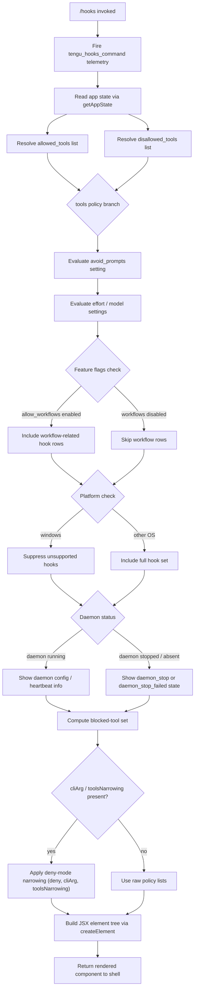

# `/hooks`

> Analysis basis: CC v2.1.153 bundle.js (AST extraction + Claude interpretation)
> Minimum version: v2.1.153

---

## Overview

The `/hooks` command renders a read-only JSX view of the current hook configurations that govern tool events (allowed tools, disallowed tools, avoid-prompts, and related policy settings). It is a `local-jsx` command that resolves immediately without an agent round-trip, delegating its rendering work to an async handler (`mK5`) that reads application state, computes the effective hook policy, and returns a React element tree.

---

## Registration

| Field | Value |
|---|---|
| type | `local-jsx` |
| name | `hooks` |
| description | `View hook configurations for tool events` |
| immediate | `true` |
| module_id | `GQ1` |
| load_inline | `true` |
| loc_byte | `12144918` |
| loc_byte_end | `12145068` |
| loc_line | `9084` |
| arbor_handler.name | `mK5` |
| arbor_handler.fqn | `claude-2.1.153::mK5` |
| arbor_handler.kind | `AsyncFunction` |
| arbor_handler.resolution_path | `module_id` |
| arbor_handler.n_hits | `0` |

Analysis basis: CC v2.1.153 bundle.js:+12144918

---

## Input Branching

The handler exhibits more than three distinct execution paths based on tool-policy state, daemon state, feature flags, and platform conditions. A Mermaid flowchart is used below.



---

## Behavioral Spec

### 1. Handler Entry and Telemetry (`mK5`)

```
async function hooksCommandHandler(context):
    fireEvent("tengu_hooks_command")          // loc_byte 12144718
    appState = await readAppState()           // via getAppState
    hookConfig = computeHookConfiguration(appState)
    element = buildJSXView(hookConfig)
    return element
```

Analysis basis: CC v2.1.153 bundle.js:+12144716 – +12144788

### 2. App State Reading (`readAppState` / `T_`)

The handler first calls the app-state accessor. Within that accessor:
- It reads the `allowed_tools` key from stored settings (literal: `"allowed_tools"`, bundle.js:+10638573).
- It reads the `disallowed_tools` key (literal: `"disallowed_tools"`, bundle.js:+10638628).
- It reads the `avoid_prompts` key (literal: `"avoid_prompts"`, bundle.js:+10638689).
- It reads `effort` (bundle.js:+10638791) and `model` (bundle.js:+10638804) policy fields.

```
function readAppState():
    state = H.getAppState()
    allowedTools  = state["allowed_tools"]
    disallowedTools = state["disallowed_tools"]
    avoidPrompts  = state["avoid_prompts"]
    effort        = state["effort"]
    model         = state["model"]
    return { allowedTools, disallowedTools, avoidPrompts, effort, model }
```

Analysis basis: CC v2.1.153 bundle.js:+10638465 – +10638649

### 3. Hook Configuration Computation (`zv` / buildHookView)

After state is read, the view-builder function (`zv`) assembles the visual representation. It calls a chain of sub-routines:

```
function buildHookView(appState):
    // Resolve boolean-style toggles
    yesOnValues = ["yes", "on"]    // bundle.js:+26948, +26954
    noOffValues  = ["no",  "off"]  // bundle.js:+27099, +27104

    // Categorise hook source: cli or remote
    source = determinSource(appState)  // "cli" | "remote"  bundle.js:+4694798/+4694809

    // Feature-flag checks
    workflowsAllowed = checkFeatureFlag("allow_workflows")   // bundle.js:+4097132
    feedbackAllowed  = checkFeatureFlag("allow_product_feedback") // bundle.js:+4096201

    // Collect tool-narrowing information
    toolNarrowingInfo = resolveToolNarrowing(appState)
    // narrowing modes: "deny", "cliArg", "toolsNarrowing"  bundle.js:+10352320/+10352906/+10352927

    // Daemon status
    daemonStatus = readDaemonStatus()  // reads daemon.status.json bundle.js:+12389569

    // Platform guard
    if platform == "windows":        // bundle.js:+4799032
        filterUnsupportedHooks()

    // Build ordered list of displayable hook rows
    rows = []
    rows.push(renderAllowedToolsRow(appState.allowedTools))
    rows.push(renderDisallowedToolsRow(appState.disallowedTools))
    rows.push(renderAvoidPromptsRow(appState.avoidPrompts))
    if workflowsAllowed:
        rows.push(renderWorkflowRow())

    // Overlay blocked-tool set
    blockedTools = computeBlockedSet(appState)  // literal "blocked" bundle.js:+9578744

    return createElement(HooksView, { rows, daemonStatus, blockedTools })
```

Analysis basis: CC v2.1.153 bundle.js:+9579338 – +9579705

### 4. Tool-Narrowing Resolution (`Q_H` / resolveToolNarrowing)

```
function resolveToolNarrowing(appState):
    filtered = appState.tools.filter(t => isRelevant(t))
    // AE6 applies G5H (flatMap over tool sources) and Fl_ (permission check)
    // G5H uses _Z8.flatMap + BO for source expansion   bundle.js:+10352243
    // Fl_ calls Pr8, NL6, xS for permission predicates bundle.js:+10352580
    narrowed = applyDenyPolicy(filtered)   // "deny" mode  bundle.js:+10352320
    return narrowed
```

Analysis basis: CC v2.1.153 bundle.js:+9578683 – +9578698

### 5. Daemon Status Integration (`z2H` / readDaemonStatus)

```
function readDaemonStatus():
    try:
        data = readFile("daemon.status.json")  // bundle.js:+12389569
        if data == null or error == "ENOENT":  // bundle.js:+12572992
            return { status: "stopped" }       // bundle.js:+15422170
    catch e:
        return { status: "daemon_stop_failed" } // bundle.js:+15422298

    parsed = JSON.parse(data)
    sessionInfo = parsed["background session"]  // bundle.js:+15422213
    return { status: "running", session: sessionInfo }
```

Analysis basis: CC v2.1.153 bundle.js:+12572959 – +12573293

### 6. Daemon Lifecycle Interaction (`Y` / daemonLifecycleManager)

When the daemon is found to be running, the hooks view interacts with daemon control:
- Uses `supervisor` literal (bundle.js:+15400194) to identify daemon process role.
- Emits `heartbeat` signals to the daemon (literal: `"heartbeat"`, bundle.js:+15399415).
- Can trigger `E.stop`, `E.updateConfig`, `E.start` in sequence for config reload.
- Fires `tengu_daemon_config_reload` on successful reload (bundle.js:+15400987).
- On failure paths, fires `tengu_daemon_control` (bundle.js:+15422336) with `daemon_stop` or `daemon_stop_failed`.
- Daemon operations use `Promise.race` + `Promise.all` with a 500 ms timeout (value `500`, bundle.js:+15417474).

```
async function manageDaemonConfig(daemonHandle):
    try:
        await daemonHandle.stop()
        await daemonHandle.updateConfig(newConfig)
        await daemonHandle.start()
        fireEvent("tengu_daemon_config_reload")
    catch:
        result = await Promise.race([
            Promise.all([shutdownGracefully()]),
            timeout(500)           // bundle.js:+15417474
        ])
        if result == "abort":
            process.exit()
```

Analysis basis: CC v2.1.153 bundle.js:+15400591 – +15400987

### 7. Feature Flag Evaluation (`pN` / evaluateFeatureFlags)

```
function evaluateFeatureFlags(appState):
    // Tier checks: firstParty, enterprise, team, pro
    // bundle.js:+4095652, +4095925, +4095960, +4097800
    tier = resolveTier(appState)

    // Traffic category: essential-traffic  bundle.js:+969315
    trafficClass = resolveTrafficClass(appState)

    workflowsEnabled = checkFlag("allow_workflows", tier)  // bundle.js:+4097132
    if workflowsEnabled:
        fireEvent("tengu_workflows_enabled")               // bundle.js:+4097555

    // SDK context: sdk-ts, sdk-py, sdk-cli, local-agent
    // bundle.js:+5223810/+5223824/+5223838/+5223853
    sdkContext = detectSDKContext()

    // Agent teams arg  bundle.js:+5351343
    agentTeams = parseArg("--agent-teams")
    if agentTeams:
        fireEvent("tengu_amber_flint")                     // bundle.js:+5351455

    return { workflowsEnabled, sdkContext, tier }
```

Analysis basis: CC v2.1.153 bundle.js:+4097110 – +4097217

### 8. Hook Permission Matrix (`fI` / buildHookPermissions)

```
function buildHookPermissions(appState):
    // Execution modes: standard, tst, tst-auto
    // bundle.js:+9947937, +9948016, +9948066
    mode = resolveExecutionMode(appState)

    // TST threshold: 100  bundle.js:+9948029
    if mode == "tst" and confidence < 100:
        useReducedPermissions()

    // Provider context: bedrock, foundry, anthropicAws, mantle, vertex
    // bundle.js:+2042433/+2042483/+2042539/+2042593/+2042641
    provider = detectProvider(appState)

    if provider == "vertex":
        // Disable tool-search optimistic mode
        // "[ToolSearch:optimistic] disabled: Vertex AI..."  bundle.js:+9948951
        disableToolSearch()

    // API endpoint check
    if endpoint includes "api.anthropic.com":   // bundle.js:+2043324
        useStandardAPIPath()

    return buildPermissionMatrix(mode, provider)
```

Analysis basis: CC v2.1.153 bundle.js:+9948415 – +9948607

### 9. JSX Element Construction (`mK5` terminal)

```
function buildJSXView(hookConfig):
    // Uses te_.createElement  bundle.js:+12144788
    return createElement(
        HooksDisplayComponent,
        {
            allowedTools:    hookConfig.allowedTools,
            disallowedTools: hookConfig.disallowedTools,
            avoidPrompts:    hookConfig.avoidPrompts,
            effort:          hookConfig.effort,
            model:           hookConfig.model,
            daemonStatus:    hookConfig.daemonStatus,
            blockedTools:    hookConfig.blockedTools,
        }
    )
```

Analysis basis: CC v2.1.153 bundle.js:+12144758 – +12144788

---

## State & Side Effects

| Item | Detail |
|---|---|
| Telemetry: `tengu_hooks_command` | Fired at handler entry (bundle.js:+12144718) |
| Telemetry: `tengu_slate_harbor` | Fired during hook-source determination (bundle.js:+4694828) |
| Telemetry: `tengu_daemon_config_reload` | Fired on successful daemon config reload (bundle.js:+15400987) |
| Telemetry: `tengu_workflows_enabled` | Fired when workflow feature flag is active (bundle.js:+4097555) |
| Telemetry: `tengu_cobalt_ridge` | Fired during platform/tool resolution (bundle.js:+4799126) |
| Telemetry: `tengu_feature_ok` | Fired when a feature check passes (bundle.js:+965124) |
| Telemetry: `tengu_feature_bad` | Fired when a feature check fails (bundle.js:+965182) |
| Telemetry: `tengu_daemon_control` | Fired on daemon stop/start lifecycle events (bundle.js:+15422336) |
| Telemetry: `tengu_amber_flint` | Fired when `--agent-teams` argument is detected (bundle.js:+5351455) |
| appState changes | Read-only; `/hooks` does not mutate app state directly |
| Daemon side effect | May reload daemon config (`E.stop` → `E.updateConfig` → `E.start`) if triggered by state delta |
| Daemon file read | Reads `daemon.status.json` from the local filesystem (bundle.js:+12389569) |
| Hook registration | `immediate: true` — no agent turn is consumed; output is rendered inline |
| Sound | None detected in depth-2 traversal |
| Timeout | 500 ms race timeout for daemon shutdown operations (bundle.js:+15417474) |
| Random / timer | `Math.random` + `setTimeout` used in app-state jitter path (bundle.js:+13359476/+13359513) |

---

## Version History

| Version | Change |
|---|---|
| v2.1.153 | Initial analysis |

---

## Common Mistakes

1. **Expecting editable output** — `/hooks` is display-only (`local-jsx`, `immediate: true`). It does not accept arguments to modify hook policy; use the project or user settings files for configuration changes.
2. **Confusing tool-narrowing modes** — the three modes `deny`, `cliArg`, and `toolsNarrowing` are independently evaluated; a tool blocked by `cliArg` will still appear in the disallowed list even if `deny` mode is not active.
3. **Assuming Vertex AI supports all hooks** — the tool-search optimistic feature is automatically disabled on Vertex AI provider (bundle.js:+9948951); the hooks view will reflect this as a reduced permission set.
4. **Windows platform omissions** — some hook types are filtered on `windows` platform (bundle.js:+4799032); the displayed set is not the same as on macOS/Linux.
5. **Expecting real-time daemon state** — daemon status is read from `daemon.status.json` at command invocation time; it reflects the last-written snapshot, not a live socket query.
6. **Missing workflow rows** — if the `allow_workflows` feature flag is not enabled for the current tier, workflow-related hook rows are silently omitted from the view.

---

## Appendix — Identifier Mapping

> For bundle debugging only. Identifiers change across versions.

| Identifier | Role |
|---|---|
| `mK5` | Main async handler for `/hooks` command (arbor_handler) |
| `c` | Telemetry / event-firing utility |
| `T_` | App-state reader; extracts tool policy fields |
| `H` | App-state object / event-emitter host |
| `pZ8` | `allowed_tools` extractor sub-routine |
| `sA` | Low-level settings accessor |
| `UZ8` | `disallowed_tools` extractor sub-routine |
| `zv` | Hook-view builder; orchestrates JSX assembly |
| `xH` | String-coercion / normalisation utility |
| `G0` | Hook-source classifier (`cli` vs `remote`) |
| `WQ` | Hook-source helper |
| `c1` | String-coercion helper (variant) |
| `T6` | Hook-registration / deduplication logic |
| `Dz6` | Hook dedup set initialiser |
| `wz6` | Hook set membership checker |
| `wHH` | Hook entry formatter |
| `O88` | Hook registration with dedup tracking |
| `b6` | Hook-record builder (Date.now stamping) |
| `Y` | Daemon lifecycle manager |
| `z2H` | Daemon status file reader |
| `r9` | Async-storage store accessor |
| `J8` | File-existence checker |
| `X8A` | JSON parse helper for daemon status |
| `EH` | Error-message string builder |
| `K` | Tool-list formatter (padEnd / map) |
| `q` | File-system write/close/add/delete handle |
| `ya1` | Column-width calculator for hook display |
| `M` | Session/connection manager |
| `A` | Connection object (toLowerCase path) |
| `L` | Subscription lifecycle manager |
| `G` | Input event interceptor (preventDefault) |
| `b` | Raw keyboard/input event |
| `j0` | User-settings path resolver |
| `E` | Daemon control interface (stop/updateConfig/start) |
| `oTK` | Heartbeat sender |
| `JHH` | Heartbeat payload builder |
| `V` | Secondary daemon handle |
| `Dg_` | React hook wrapper (r\$1 + W\_) |
| `W_` | Module-loader / ESM interop helper |
| `iS6` | Bound module initialiser |
| `pN` | Feature-flag evaluator |
| `g98` | Flag-lookup helper |
| `uE` | Flag-value resolver |
| `X9` | Feature-gate checker |
| `bH9` | kD6 bootstrap helper |
| `TR` | Tier resolver (firstParty/enterprise/team) |
| `_1` | Traffic-class resolver |
| `JKH` | Permission string formatter |
| `kD6` | Feature-gate dispatcher |
| `$X_` | Workflow feature handler |
| `Uj7` | Workflow config builder |
| `pj7` | Workflow flag reader |
| `Q_H` | Tool-narrowing orchestrator |
| `AE6` | Tool-source aggregator |
| `G5H` | FlatMap-based tool-source expander |
| `Fl_` | Permission predicate chain |
| `IW1` | Final permission integrator |
| `wg_` | Platform-specific hook filter |
| `xR` | Platform-detection helper |
| `tK` | Windows-guard for hook types |
| `z` | Daemon-event array builder |
| `SH` | `daemon_stop` event constructor |
| `uH` | `daemon_stop_failed` event constructor |
| `Dy` | Daemon-control event dispatcher |
| `tb` | Event queue pusher |
| `TEH` | Event-type formatter |
| `JO_` | Daemon shutdown emitter (randomUUID) |
| `wm` | Daemon shutdown race (Promise.race / Promise.all) |
| `VQ` | Graceful-shutdown initiator |
| `yQ` | Timeout-clear utility |
| `r8` | Timed-abort promise factory |
| `Ua` | Hook-view component (top-level JSX node) |
| `NX` | SDK-context classifier |
| `Mw` | SDK string formatter |
| `ceH` | Hook-blocked indicator |
| `x9` | Agent-teams argument parser |
| `Bb7` | Agent-teams value extractor |
| `aIL` | First animation-frame hook (y\$1 + W\_) |
| `sIL` | Second animation-frame hook (x\$1 + W\_) |
| `fI` | Hook-permission matrix builder |
| `Pd_` | Execution-mode resolver (standard/tst/tst-auto) |
| `N` | Debug/log formatter |
| `IA` | Provider detector (bedrock/foundry/vertex…) |
| `A5` | Provider-string normaliser |
| `W4` | Tool-search feature flag checker |
| `O` | Feature-isEnabled wrapper |
| `N8` | Feature-registry lookup |
| `$` | Tool-list with `includes` check |
| `Ar1` | Daemon status JSON writer |
| `Zi` | Timestamp formatter |
| `dI6` | Status-file path builder (`daemon.status.json`) |
| `RH` | JSON.stringify wrapper |

---

Note: index built via Arbor fallback; some signals (telemetry, literals) may be missing — see arbor-fallback.js.