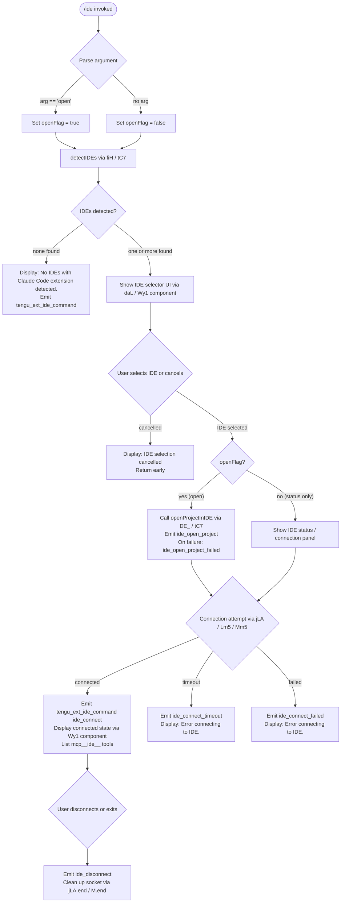

# `/ide`

> Analysis basis: CC v2.1.153 bundle.js (AST extraction + Claude interpretation)
> Minimum version: v2.1.153

---

## Overview

The `/ide` command manages IDE integrations for Claude Code, allowing users to detect connected IDEs (VS Code, Cursor, Windsurf, JetBrains family), open projects within those IDEs, and monitor the live connection status of IDE extensions. It is an interactive, JSX-rendered (`local-jsx`) command that accepts an optional `open` subcommand argument and drives a React-style UI component that shows connection state, lists detected IDEs, and emits telemetry for each major step of the IDE lifecycle.

---

## Registration

| Field | Value |
|---|---|
| type | `local-jsx` |
| name | `ide` |
| description | `Manage IDE integrations and show status` |
| argumentHint | `[open]` |
| module_id | `Gy1` |
| load_inline | `true` |
| loc_byte | `11266638` |
| loc_byte_end | `11266794` |
| loc_line | `7837` |
| arbor_handler.name | `daL` |
| arbor_handler.fqn | `claude-2.1.153::daL` |
| arbor_handler.kind | `AsyncFunction` |
| arbor_handler.resolution_path | `module_id` |
| arbor_handler.n_hits | `0` |

Analysis basis: CC v2.1.153 bundle.js:+11266638

---

## Input Branching

Four distinct logical paths exist depending on whether IDEs are detected, which IDE the user selects, whether the `open` subcommand is provided, and whether the connection succeeds. A Mermaid flowchart is therefore used.



Analysis basis: CC v2.1.153 bundle.js:+11262752, +11262860, +11262912, +11263107, +11264857, +11264944, +11265051

---

## Behavioral Spec

### 1. Command Entry Point — `ideCommandHandler` (`daL`)

The Arbor-resolved handler is `daL` (AsyncFunction, resolved via `module_id` path).

```
async function ideCommandHandler(args, appState):
    emit telemetry("tengu_ext_ide_command", ...)       # always first
    openFlag = (args[0] == "open")                     # literal "open" @+11262860

    detectedIDEs = await detectIDEsWithExtension()     # calls fiH

    if detectedIDEs.length == 0:
        display("No IDEs with Claude Code extension detected.")  # @+11262969
        return

    selectedIDE = await showIDESelector(detectedIDEs)  # renders Wy1 JSX component

    if selectedIDE == null:
        display("No IDE selected.")                     # @+11263107
        return

    if openFlag:
        result = await openProjectInIDE(selectedIDE)   # calls DE_
        if result.error:
            emit("ide_open_project_failed", ...)
            display(result.errorMessage)
            return
        emit("ide_open_project", {type: worktreeOrProject})

    await connectToIDE(selectedIDE)                    # calls jLA / Lm5
```

Analysis basis: CC v2.1.153 bundle.js:+11262752

---

### 2. IDE Detection — `detectIDEsWithExtension` (`fiH`)

Scans the local system for running IDE processes that have the Claude Code extension active.

```
async function detectIDEsWithExtension():
    portCandidates = gatherPortCandidates()            # parseInt, O_ @+5288633

    # resolve IDE config directories per platform
    ideDirs = await resolveIDEDirectories()            # calls A58 → lC7
    # lC7 checks homedir, ".claude" subdir @+5286517
    # special WSL path: "/mnt/c/Users" @+5286724
    # skips: "Public", "Default", "Default User", "All Users" @+5286818..5286882

    results = await Promise.all(portCandidates.map(scanPort))   # @+5288696

    # on Linux: runs ps-grep for known IDEs @+5293509
    # grep pattern includes: code|cursor|windsurf|idea|pycharm|webstorm|...

    detected = []
    for each result in results:
        ideType = classifyIDE(result)                  # calls IX
        if ideType identified:
            detected.push({type: ideType, port, path})

    if detected.length > 0:
        emit("ide_detect", ...)                        # @+5289976
    else:
        emit("ide_detect_failed", ...)                 # @+5290040

    return detected
```

**Known IDE types surfaced in literals:**
- `"vscode"` (bundle.js:+11263167)
- `"cursor"` (bundle.js:+11263208)
- `"windsurf"` (bundle.js:+11263249)
- `"jetbrains"` (bundle.js:+5285083)
- The detection label `"IDE"` (bundle.js:+5294329)

Analysis basis: CC v2.1.153 bundle.js:+11262912, +5288633, +5289976

---

### 3. IDE Classification — `classifyIDEFromProcess` (`IX`)

```
function classifyIDEFromProcess(processEntry):
    lower = processEntry.toLowerCase()                 # @+5294384
    name  = path.basename(processEntry)               # @+5294442
    # checks known name patterns via VNH lookup table
    # returns IDE type string or null
```

Analysis basis: CC v2.1.153 bundle.js:+5294384

---

### 4. Open Project in IDE — `openProjectInIDE` (`DE_` → `tC7`)

```
async function openProjectInIDE(selectedIDE):
    # tC7 builds the open-project command object
    # resolves worktree vs. project path @+11263341 / @+11263352
    # uses zP → jGH to dispatch the open request to the IDE extension over the
    # local IPC channel (SSE or WebSocket)
    # connection transports: "sse-ide" @+11260739, "ws-ide" @+11260759

    result = await dispatchOpenCommand(selectedIDE, projectPath)
    if result.failed:
        return {error: true, errorMessage: result.message}
    return {error: false}
```

Analysis basis: CC v2.1.153 bundle.js:+11263837, +5294021, +11260739

---

### 5. IDE Connection — `connectToIDE` (`jLA`)

Establishes a persistent socket connection to the IDE extension daemon.

```
async function connectToIDE(selectedIDE):
    # attempt to claim a background session via MF.claim @+15366766
    claimResult = await sendClaimFrame()               # Km5 → MF.buildClaimFrame @+15367223
    if claimFailed:
        emit("tengu_bg_sendclaim_failed", ...)         # @+15366922

    # connect via Unix socket (nC8.connect) @+15367069
    socket = await nC8.connect(socketPath)
    socket.on("data",  handleIncomingData)
    socket.once("kill", handleKill)                    # literal @+15367149
    socket.write(buildClaimFrame())                    # RB encodes frame @+10727688

    # timeout: 5000 ms @+15367343
    # on ECONNREFUSED @+15367491 → retry via Lm5 retry loop
    # on timeout → emit("ide_connect_timeout") @+11265051
    # on success → emit("ide_connect") @+11264857
    # on failure → emit("ide_connect_failed") @+11264944

    socket.end()                                       # @+15367173
```

Analysis basis: CC v2.1.153 bundle.js:+15366766, +15367069, +15367343

---

### 6. Status Display Component — `ideStatusComponent` (`Wy1`)

A React/Ink JSX component rendered to the terminal.

```
function ideStatusComponent(props):
    [connectionState, setConnectionState] = useState("pending")  # @+11264813
    appState = useAppState()                           # w6 / AA hooks @+11264660
    ideRef  = useRef(null)
    
    useEffect(() => {
        # watches IDE connection state changes
        # transitions: pending → connecting → connected / failed / timeout
    }, [deps])

    if connectionState == "pending":
        display(spinner + "Connecting to " + ideName)  # literal @+11265887

    if connectionState == "connected":
        # list mcp__ide__ prefixed tools @+11265447
        # show disconnect button
        # emit("ide_disconnect") on cleanup @+11265550

    if connectionState in ["failed", "timeout"]:
        display("Error connecting to IDE.")            # @+11265169
        display("restart your IDE")                    # @+11263972

    # "ws:" prefix check for WebSocket transport @+11265667
    # "dynamic" label for dynamically-resolved connection @+11265784
```

Analysis basis: CC v2.1.153 bundle.js:+11264640, +11265169, +11265447

---

### 7. Fuzzy IDE Path Resolution — `resolveIDEDirectories` (`A58` / `lC7`)

```
async function resolveIDEDirectories():
    baseDirs = [os.homedir()]                          # Xw9.homedir @+5286503
    # appends ".claude" subdir @+5286517
    # WSL branch: checks "/mnt/c/Users" @+5286724
    # filters out system accounts: Public, Default, Default User, All Users

    for each dir in baseDirs:
        stat = fs.statSync(dir)
        if stat.isDirectory() or stat.isSymbolicLink():  # @+5286760 / @+5286778
            resolved = fs.realpathSync(dir)              # jw9.realpath @+5287179
            if not seen.has(resolved):
                seen.add(resolved)
                results.push(resolved)

    return results
```

Uses a `.lock` sentinel file (literal `".lock"` at bundle.js:+5285297) to prevent concurrent access.

Analysis basis: CC v2.1.153 bundle.js:+5285187, +5286503

---

### 8. Connection Truncation Display — `formatIDEList` (`lo_`)

When more than a threshold number of IDEs are found, the list is truncated for display.

```
function formatIDEList(ideList, maxVisible):
    # Math.floor applied to index @+11266200
    # A.normalize("NFC") for path normalisation @+11266225, literal @+11266237
    # q.map to build display strings @+11266246
    # D.normalize for secondary path @+11266264
    # w.startsWith check for prefix filtering @+11266286
    # w.slice / D.slice for truncation @+11266312 / @+11266371
    # separator: ", " @+11266394
    # overflow marker: ", …" @+11266408

    visible = ideList.slice(0, maxVisible)
    suffix  = ideList.length > maxVisible ? ", …" : ""
    return visible.map(formatEntry).join(", ") + suffix
```

Analysis basis: CC v2.1.153 bundle.js:+11266132, +11266200, +11266394

---

## State & Side Effects

| Item | Detail |
|---|---|
| Telemetry — `tengu_ext_ide_command` | Fired at handler entry; records command invocation (bundle.js:+11262754) |
| Telemetry — `ide_detect` | Fired when one or more IDEs are detected (bundle.js:+5289976) |
| Telemetry — `ide_detect_failed` | Fired when no IDEs are detected (bundle.js:+5290040) |
| Telemetry — `ide_open_project` | Fired on successful project open; payload includes `worktree`/`project` type (bundle.js:+11263307) |
| Telemetry — `ide_open_project_failed` | Fired when project open fails (bundle.js:+11263414) |
| Telemetry — `ide_connect` | Fired on successful IDE socket connection (bundle.js:+11264857) |
| Telemetry — `ide_connect_failed` | Fired on connection failure (bundle.js:+11264944) |
| Telemetry — `ide_connect_timeout` | Fired when connection attempt times out (bundle.js:+11265051) |
| Telemetry — `ide_disconnect` | Fired when IDE connection is torn down (bundle.js:+11265550) |
| Telemetry — `tengu_bg_sendclaim_failed` | Fired when the background-session claim frame cannot be sent (bundle.js:+15366922) |
| Telemetry — `tengu_bg_roster_parse_failed` | Fired when the background session roster JSON is malformed (bundle.js:+11195565) |
| IPC transport registration | Registers `"sse-ide"` and `"ws-ide"` transports for IDE extension communication (bundle.js:+11260739, +11260759) |
| MCP tool registration | On successful connection, `mcp__ide__`-prefixed tools become available (bundle.js:+11265447) |
| Socket lifecycle | Opens a Unix domain socket via `nC8.connect`; writes claim frame; calls `socket.end()` on cleanup; `socket.once("kill", …)` for graceful teardown |
| AppState changes | Connection state transitions (`pending` → `connected` / `failed` / `timeout`) are written into app state via `useSetAppState` / `w6` hook |
| Background daemon interaction | May interact with the background daemon spare-pool (`tengu_bg_spare_*`) if a background session is involved |
| File system | Reads IDE config directories; uses `.lock` sentinels; resolves symlinks via `fs.realpathSync`; WSL path scanning under `/mnt/c/Users` |
| Sound | None detected in depth-2 traversal |

---

## Version History

| Version | Change |
|---|---|
| v2.1.153 | Initial analysis |

---

## Common Mistakes

1. **Running `/ide` before installing the Claude Code extension in your IDE.** Detection (`fiH`) scans running processes and config directories; if the extension is not installed and active, detection returns empty and the command exits with "No IDEs with Claude Code extension detected."

2. **Using `/ide open` when no project is open in the IDE.** The `open` subcommand attempts to resolve a `worktree` or `project` path; if neither is resolvable, `ide_open_project_failed` is emitted and an error is displayed.

3. **Expecting instant connection on slow machines.** The connection attempt has a hard 5000 ms timeout (bundle.js:+15367343). On a loaded system the timeout fires before the socket is ready, emitting `ide_connect_timeout` and showing "Error connecting to IDE." The suggested recovery is to restart the IDE (literal: "restart your IDE", bundle.js:+11263972).

4. **Assuming JetBrains IDEs behave identically to VS Code/Cursor/Windsurf.** JetBrains detection follows a separate `appcode`/`jetbrains` branch (bundle.js:+5285083, +5293883) and may require different extension installation steps.

5. **Running `/ide` inside a WSL terminal while the IDE is on the Windows host.** The WSL path `/mnt/c/Users` is scanned (bundle.js:+5286724), but system accounts (`Public`, `Default`, `Default User`, `All Users`) are explicitly skipped; ensure your Windows user profile directory is accessible from WSL.

---

## Appendix — Identifier Mapping

> For bundle debugging only. Identifiers change across versions.

| Identifier | Role |
|---|---|
| `daL` | Main async handler for `/ide` command (Arbor-resolved entry point) |
| `lo_` | IDE list formatter / truncation helper |
| `fiH` | IDE detection orchestrator (scans ports, processes, config dirs) |
| `A58` | IDE directory resolver (top-level, calls `lC7`) |
| `lC7` | Per-platform IDE config directory walker |
| `dC7` | Port/process scanner helper (calls `f9_`) |
| `f9_` | Low-level process query executor (sh -c, parseInt, isNaN) |
| `IX` | IDE type classifier from process name / path |
| `DE_` | Open-project-in-IDE dispatcher (calls `tC7`) |
| `tC7` | IPC command builder for IDE open/control operations |
| `zP` | IPC transport dispatcher (calls `jGH`) |
| `jGH` | Low-level IPC request handler / promise orchestrator |
| `Wy1` | JSX status display component for IDE connection UI |
| `w6` | AppState hook (wraps `useSyncExternalStore`) |
| `AA` | Secondary AppState context accessor |
| `v5` | Context + ref + memo hook bundle for display component |
| `BI` | Cleanup / disposal helper for IDE connection |
| `jLA` | IDE socket connection manager (claim + connect + write) |
| `Lm5` | Connection retry / timeout orchestrator (5000 ms timeout) |
| `Mm5` | Low-level socket connect + once/end wrapper |
| `Km5` | Claim-frame builder (calls `MF.buildClaimFrame`) |
| `RB` | Binary frame encoder (Buffer.allocUnsafe, writeUInt32BE, writeUInt8) |
| `S6` | App-state reader utility |
| `aU6` | Store accessor (calls `oU6.getStore`) |
| `O_` | State setter / dispatcher |
| `Fv` | State update applier |
| `E8` | IDE-open helper (calls `G_`, `S6`) |
| `G_` | Generic async command executor |
| `Ff` | Utility called at command entry (pre-detection setup) |
| `Vo` | Post-selection UI helper |
| `paL` | IDE list panel component |
| `Pw9` | Process kill helper (`process.kill`) |
| `qw9` | Path/port match helper (H.match) |
| `D` | Daemon / background-session manager (large orchestrator) |
| `wLA` | Background spare-PTY spawner (`Bun.spawn`, `--bg-pty-host`) |
| `wk8` | macOS memory check helper |
| `T6` | IDE connection state normaliser / socket tracker |
| `O88` | Socket registry lookup / registration |
| `XO_` | New socket entry creator (randomUUID, event emit) |
| `ZO_` | Socket event handler dispatcher |
| `b6` | Config file watcher and socket lifecycle manager |
| `EzH` | Config file reader/writer (readFileSync, copyFileSync, mkdirSync) |
| `jq7` | File-watch registration helper (`T88.watchFile`) |
| `ZLA` | Background session lifecycle manager (roster, spawn, retire) |
| `jm5` | Daemon protocol message router (ping/nudge/yield/lease/attach/resize) |
| `X` | PTY stream wrapper (buffer concat, subarray, kill, resize) |
| `NM` | Stream end/write helper |
| `wm5` | Session phase controller (running/kill/adopt) |
| `Dm5` | Attach-stall detector (`tengu_bg_attach_stall_ms`) |
| `yTK` | Timeout / keepalive scheduler |
| `P` | Repaint orchestrator (mC8, Vh, Uu) |
| `MS6` | Snapshot write helper (H.destroy, H.write) |
| `TD6` | Pins file reader (BP.readFile, pins.json) |
| `Nj7` | Job directory scanner (BP.readdir, BP.readFile) |
| `EH9` | Job directory initialiser (BP.mkdir, QO, RH) |
| `p66` | Roster file reader/writer (iI1, BB, VoL) |
| `BB` | Roster JSON parser and validator |
| `VoL` | Roster file atomic writer (QO, RH) |
| `o9` | Job state file reader (BP.stat, BP.readFile, VYH cache) |
| `i5` | Job state writer (QO, FP.join, RH) |
| `_j` | Active-job sentinel checker (ZV → QVH) |
| `QO` | Atomic file writer (randomBytes, writeFile, rename) |
| `bK` | Job path builder (FP.join, tG) |
| `tv6` | Auth socket path builder |
| `Go_` | Base socket directory resolver |
| `UB` | PTY-pid socket path builder |
| `u66` | PTY socket path builder |
| `x5H` | PTY-pid path helper (V$.join, LRH) |
| `Ch` | PTY-host connection builder (V$.join, LRH, H.split) |
| `LRH` | Socket path resolver (V$.join, qRH) |
| `QI1` | Spare socket path builder |
| `Zl` | Spare directory path resolver |
| `dI1` | Alternative spare path builder |
| `R` | Daemon supervisor process manager (tTK, Wz, N, yH, Cm5) |
| `tTK` | Realpath + stat resolver for daemon binary |
| `Cm5` | Daemon binary version checker (h28) |
| `h28` | Version array path builder (LZ6.join, K_H) |
| `z` | Daemon write / stop helper (SH, uH, Dy, wm) |
| `Dy` | Event queue push helper (tb, EQ.push, TEH, JO_) |
| `wm` | Shutdown race (Promise.race, Promise.all, VQ, yQ, r8, process.exit) |
| `w` | Main daemon connection loop (get, kill, setTimeout, T6, jLA, ZLA) |
| `Y` | Connection map manager (z2H, ya1, M.get, G.stop, E.start) |
| `z2H` | Connection entry builder (r9, J8, X8A, EH, v9, J8A) |
| `ya1` | Connection metrics aggregator (Object.keys, Math.max, Gz) |
| `G` | Remote-control-at-startup handler |
| `oTK` | Heartbeat scheduler (JHH) |
| `Ar1` | Daemon status writer (Zi, Date.now, r9, dI6, RH) |
| `dI6` | Status file path builder (_r1.join, d8) |
| `Zi` | Status format helper (v1H) |
| `B` | Session retire helper (UH.filter, QH.has) |
| `UH` | Session filter (cf, u6.filter, qH.has, Y8.indexOf) |
| `qH` | Session state predicate (t, YH, E, I) |
| `Y8` | Session index builder (OH, _H.push, bH) |
| `QH` | Orphaned-permission checker |
| `N` | Log/output formatter (C16, chK, H.includes, RH, j4, GS, ixH, ihK) |
| `chK` | Log level classifier (Ek, dhK, L3A) |
| `ihK` | Log file writer (GxH, xfH, nhK, H9, Buffer.byteLength) |
| `GxH` | Debounced flush scheduler (clearTimeout, setTimeout, setImmediate) |
| `nhK` | Append-log file chunk writer (Zk.mkdir, Zk.appendFile, cOA) |
| `cOA` | Log file rotation helper (Zk.stat, Zk.rename, Zk.unlink) |
| `xfH` | Log file path builder (gOA, $0H.join, d8, y6) |
| `H9` | Signal handler registrar (q3A.register) |
| `yH` | Output stream writer (l_, xH, _1, GH4, mmH.push, an.logError) |
| `SH` | Stdout helper (c) |
| `uH` | Stderr helper (c) |
| `l_` | Error string coercer (Error, String) |
| `_1` | Output queue flusher (fZA) |
| `GH4` | Circular buffer shift/push (cU6.shift, cU6.push) |
| `j4` | Path redaction helper (pOA, H.replace, q.at, A.lastIndexOf, A.slice) |
| `pOA` | Redaction map builder (UhK.map) |
| `ixH` | Output write helper (NOA) |
| `E8` | IDE-open command wrapper (G_, S6) |
| `Ff` | Pre-detection initialiser |
| `MiH` | IDE menu / selector display helper |
| `HE` | IDE type label formatter |
| `e6` | Error display helper (c) |
| `iAA` | Background session roster initialiser (sAH.mkdir, sAH.writeFile) |
| `Lm5` | Connection retry loop with 5000 ms timeout and ECONNREFUSED handling |
| `r8` | Generic retry-with-timeout utility (K, Error, q, setTimeout, clearTimeout) |
| `EH` | String coercer (String) |
| `b$` | J8 wrapper |
| `X8` | Error code extractor (J8) |
| `RH` | JSON serialiser (JSON.stringify) |
| `U6` | JSON parser (JSON.parse) |
| `c` | Core output / render primitive |
| `Wz` | Environment/platform detector |
| `f` | Tool registry accessor (YSH, EWK, L.get, N, L.values) |
| `I` | Away-summary rate-limit guard (N, Date.now, o28, XS5) |
| `s` | Voice toggle silence timeout handler |
| `a` | Voice focus silence timeout handler |
| `x` | Supervisor idle-exit timer (clearTimeout, setTimeout, z.write) |
| `g` | React-ink render root (B, $) |
| `l` | HH filter helper |
| `r` | Passthrough stream (w, d) |
| `d` | Stream destructor (_h8) |
| `T` | Terminal context builder (yV6, mC8) |
| `m` | Deferred write flusher (clearTimeout, $.write) |
| `b` | Background flag holder |
| `V` | Supervisor start helper |
| `S` | Transient session marker |