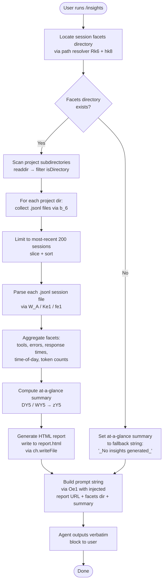

# `/insights`

> Analysis basis: CC v2.1.153 bundle.js (AST extraction + Claude interpretation)
> Minimum version: v2.1.153

---

## Overview

The `/insights` command generates a shareable HTML usage-report by aggregating data from the user's Claude Code session history (stored as `.jsonl` facet files), then instructs the agent to deliver a fixed confirmation message pointing to the generated report file. The report covers session activity, tool usage patterns, response times, and time-of-day breakdowns. The command follows a `prompt` dispatch pattern: after report generation, the handler builds a prompt string that the agent outputs verbatim.

---

## Registration

| Field | Value |
|---|---|
| type | `prompt` |
| name | `insights` |
| description | `Generate a report analyzing your Claude Code sessions` |
| loc_byte | `12800289` |
| loc_byte_end | `12801593` |
| loc_line | `10886` |
| handler_method | `getPromptForCommand` |
| handler_method_start | `12800463` |
| handler_method_end | `12801592` |
| prompt_body.length | `513` characters |
| prompt_body.trace | `call→Oe1(...) (1 literals)` |
| arbor_handler.name | `getPromptForCommand` |
| arbor_handler.kind | `Method` |
| arbor_handler.fqn | `claude-2.1.153::getPromptForCommand` |
| arbor_handler.resolution_path | `direct` |
| arbor_handler.n_hits | `1` |

Analysis basis: CC v2.1.153 bundle.js:+12800289

---

## Input Branching

The command exhibits 4+ distinct paths: data-collection phase (directory scan → file read → data aggregation), report-generation phase (HTML file write), prompt-construction phase (at-a-glance summary computed, prompt assembled), and fallback path when no data is found. A Mermaid flowchart is required.



Analysis basis: CC v2.1.153 bundle.js:+12800469

---

## Behavioral Spec

### Phase 1 — Path Resolution

```
function resolveInsightsPaths(baseDir):
    usageDataPath  = pathJoin(baseDir, "usage-data")   // literal "usage-data" +12726284
    sessionMetaPath = pathJoin(baseDir, "session-meta") // literal "session-meta" +12726380
    facetsPath     = pathJoin(baseDir, "facets")        // literal "facets" +12726334
    return { usageDataPath, sessionMetaPath, facetsPath }
```

Analysis basis: CC v2.1.153 bundle.js:+12726271

---

### Phase 2 — Session File Discovery (`TY5` / `b_6`)

```
async function discoverSessionFiles(facetsDir):
    entries = await readdir(facetsDir)
    projectDirs = entries.filter(e => e.isDirectory())   // +12787027

    allFiles = []
    for dir of projectDirs:
        files = await collectJsonlFiles(dir)             // b_6 +12787117
        allFiles.push(...files)

    // Sort newest-first, then cap
    allFiles.sort(byTimestampDescending)                 // +12787263
    return allFiles.slice(0, 200)                        // limit 200 +12787356
```

**`collectJsonlFiles` sub-routine (`b_6`):**

```
async function collectJsonlFiles(dir):
    entries = await readdir(dir)
    jsonlEntries = entries.filter(e => e.isFile() && hasExtension(e, ".jsonl"))
                                                        // ".jsonl" +12870923
    result = []
    for entry of jsonlEntries:
        stat = await stat(pathJoin(dir, entry.name))
        result.push({ path, mtime: stat.mtimeMs })
    return result
```

Analysis basis: CC v2.1.153 bundle.js:+12786940, +12870817

---

### Phase 3 — Session Parsing (`W_A` / `Ke1`)

```
function parseSessionFile(rawJsonlContent):
    lines = rawJsonlContent.split("\n")
    events = lines
        .filter(line => line.trim().length > 0)
        .map(line => JSON.parse(line))                  // U6 +183848

    sessionData = {
        messages:      [],
        toolUses:      [],
        errors:        [],
        responseTimes: [],
        tokenCounts:   [],
        timestamps:    [],
    }

    for event of events:
        classify event by type field:
            "assistant"  → extract tool_use blocks, response timing
            "user"       → extract timestamps
            "system"     → skip or store session metadata

        // Classify tool errors by message substring:
        if toolResult contains "exit code"       → category "Command Failed"
        if toolResult contains "rejected"        → category "User Rejected"
        if toolResult contains "string to replace not found"
                                                 → category "Edit Failed"
        if toolResult contains "modified since read"
                                                 → category "File Changed"
        if toolResult contains "exceeds maximum" / "too large"
                                                 → category "File Too Large"
        if toolResult contains "file not found" / "does not exist"
                                                 → category "File Not Found"
        // Tool categories tracked:
        //   WebSearch, WebFetch, Edit, Write, git commit, git push, Other
        //   literals at +12726977, +12727001, +12727108, +12727120,
        //              +12727364, +12727396, +12727912

    return sessionData
```

Analysis basis: CC v2.1.153 bundle.js:+12729054, +12727980

---

### Phase 4 — Data Aggregation and Statistical Computation (`fe1` / `Me1`)

```
function aggregateSessionData(sessionDataList):
    totals = {
        sessions:        sessionDataList.length,
        messages:        0,
        toolUses:        {},    // tool name → count
        errors:          {},    // error category → count
        responseTimes:   [],
        hourBuckets:     {},    // hour-of-day → count
        tokenBuckets:    {},
    }

    for session of sessionDataList:
        totals.messages += session.messages.length
        merge session.toolUses into totals.toolUses
        merge session.errors   into totals.errors
        append session.responseTimes to totals.responseTimes

        for timestamp of session.timestamps:
            hour = new Date(timestamp).getHours()
            increment totals.hourBuckets[hour]

    // Compute median response time (sort + at midpoint)  // +12738013
    sortedTimes = totals.responseTimes.sort(ascending)
    median = sortedTimes.at(Math.floor(sortedTimes.length / 2))  // +12738122

    // Compute percentiles
    p95 = sortedTimes.at(Math.floor(sortedTimes.length * 0.95))

    // Session-length bucketing for response time histogram:
    // Buckets: "2-10s", "10-30s", "30s-1m", "1-2m", "2-5m", "5-15m", ">15m"
    // literals at +12743502 … +12743562
    // Thresholds include 120s, 900s  // +12743722, +12743804

    // Time-of-day grouping:
    // "Morning (6-12)"   hours 7,11        // +12744350
    // "Afternoon (12-18)" hours 12-17      // +12744397
    // "Evening (18-24)"  hours 18-23       // +12744451
    // "Night (0-6)"      hours 0-4         // +12744503

    return totals
```

Analysis basis: CC v2.1.153 bundle.js:+12736120, +12738169

---

### Phase 5 — HTML Report Generation (`WY5` / `DY5`)

```
async function generateHtmlReport(aggregated, outputDir):
    // Ensure output directory exists
    await mkdir(outputDir, { recursive: true })

    // Build date-stamped filename
    now = new Date()
    timestamp = pad(now.getFullYear()) + pad(now.getMonth()+1) + ...
    filename = "report.html"                              // +12789589

    // HTML template construction (WY5):
    //   - Escapes HTML entities: &amp; &lt; &gt; &quot; &apos;
    //     // +4692131, +4692155, +4692178, +4692229, +4692254
    //   - Applies inline styles with color palette:
    //       "#2563eb" (blue)    // +12781167
    //       "#0891b2" (cyan)    // +12781305
    //       "#10b981" (green)   // +12781477
    //       "#8b5cf6" (purple)  // +12781620
    //       "#dc2626" (red)     // +12784883
    //       "#16a34a" (green2)  // +12785132
    //       "#eab308" (yellow)  // +12785625
    //   - Empty-state guards: "<p class=\"empty\">No data</p>"  // +12742993
    //   - Renders bold via "<strong>$1</strong>"  // +12745208
    //   - Response time chart, tool usage chart, error breakdown
    //   - Max chart scale: Math.max over values  // +12743030

    html = buildHtmlString(aggregated)

    await writeFile(pathJoin(outputDir, filename), html, "utf-8")
    return { reportPath: pathJoin(outputDir, filename), reportUrl: fileUrl }
```

Analysis basis: CC v2.1.153 bundle.js:+12789330, +12745136

---

### Phase 6 — At-a-Glance Summary Computation (`DY5` / `Ae1`)

```
function computeAtAGlanceSummary(aggregated):
    // Summarises key metrics into a compact multi-line string
    // that is injected into the prompt body (for agent context only)
    // Key label: "at_a_glance"  // +12740529

    if aggregated.sessions == 0:
        return "_No insights generated_"   // +12801360

    lines = [
        "Sessions: " + aggregated.sessions,
        "Messages: " + aggregated.messages,
        "Top tool: " + topTool(aggregated.toolUses),
        "Median response: " + formatDuration(aggregated.medianResponseTime),
        ... // additional summary lines
    ]
    return lines.join("\n")
```

Analysis basis: CC v2.1.153 bundle.js:+12739913, +12801360

---

### Phase 7 — Prompt Construction and Dispatch (`getPromptForCommand` / `Oe1`)

```
async function getPromptForCommand(context):
    // Step 1: collect session files
    files = await discoverSessionFiles(facetsDir)       // TY5

    // Step 2: parse & aggregate (parallel, up to 200 files)
    sessionDataList = await Promise.all(
        files.slice(0, 200).map(f => parseSessionFile(f))
    )

    // Step 3: generate HTML report
    { reportPath, reportUrl } = await generateHtmlReport(aggregated, outputDir)

    // Step 4: compute at-a-glance
    summary = computeAtAGlanceSummary(aggregated)

    // Step 5: build prompt string via Oe1
    //   Prompt injects: full insights data, reportUrl, htmlFilePath,
    //   facetsDir, summary (agent-only context)
    //   Then instructs the agent to output the <message>…</message> block
    //   verbatim, which reads: "Your shareable insights report is ready: ..."
    //   followed by "Want to dig into any section or try one of the suggestions?"
    //   Prompt length: 513 characters  // +12800289

    // Step 6: round token math
    tokenCount = Math.round(...)                         // +12800850

    return buildPrompt(summary, reportUrl, reportPath, facetsDir)  // Oe1 +12801495
```

The handler is registered as an `ObjectMethod` named `getPromptForCommand`, resolved via `direct` path in the Arbor symbol graph (n_hits: 1).

Analysis basis: CC v2.1.153 bundle.js:+12800463, +12801495

---

### Session Limit and Concurrency Constants

| Constant | Value | Location |
|---|---|---|
| Maximum sessions analysed | `200` | bundle.js:+12787356 |
| Batch slice minimum | `50` | bundle.js:+12787351 |
| Session JSON parse token limit | `4096` | bundle.js:+12734233 |
| Report HTML max content size | `8192` | bundle.js:+12742671 |
| Parallel parse concurrency guard | `Promise.all` over slice | bundle.js:+12787428 |
| Session TTL threshold (ms) | `1800000` (30 min) | bundle.js:+12734757 |

---

## State & Side Effects

| Item | Detail |
|---|---|
| Telemetry | No `tengu_*` events found directly in the `/insights` handler path (depth ≤ 2 from `__handler_insights`). Transitive telemetry emitted by shared subsystems is listed in the table below. |
| File system writes | Creates/overwrites `report.html` in the facets output directory via `ch.writeFile` (bundle.js:+12789617) |
| File system reads | Reads all `.jsonl` session files from the facets subdirectory tree via `ch.readdir` / `n4.readdir` / `n4.stat` |
| Directory creation | `ch.mkdir` with `recursive: true` at bundle.js:+12789330 |
| Agent prompt injection | The assembled prompt (513 chars) is returned from `getPromptForCommand` and dispatched as a `prompt`-type command |
| appState changes | None observed in depth-2 traversal |
| Sound | None observed |
| Hook registration | None observed in depth-2 traversal |

**Transitive telemetry events reached via shared subsystem calls (not directly fired by `/insights`):**

| Event | Subsystem | Location |
|---|---|---|
| `tengu_transcript_phantom_parent` | Session chain walker | bundle.js:+12856735 |
| `tengu_transcript_parent_cycle` | Session chain walker | bundle.js:+12860314 |
| `tengu_chain_parent_cycle` | Chain linker | bundle.js:+12838212 |
| `tengu_chain_timestamp_fallback` | Chain linker | bundle.js:+12838361 |
| `tengu_chain_parallel_tr_recovered` | Chain linker | bundle.js:+12840227 |
| `tengu_relink_walk_broken` | Session relinker | bundle.js:+12836443 |

---

## Version History

| Version | Change |
|---|---|
| v2.1.153 | Initial analysis — `prompt`-type command with `getPromptForCommand` handler; HTML report written to facets output directory |

---

## Common Mistakes

1. **Running `/insights` in a workspace with no prior sessions** — the facets directory may not exist or may contain zero `.jsonl` files. The command handles this gracefully by setting the at-a-glance summary to `_No insights generated_` and still returning the `<message>` block, but the report will contain empty-state placeholders.

2. **Expecting the agent to elaborate spontaneously** — the `getPromptForCommand` handler instructs the agent to output the `<message>` block *verbatim* and not omit any line. The final question ("Want to dig into any section…") is part of the scripted output, not a free-form agent offer. Users should follow up with an explicit question to get further analysis.

3. **Assuming real-time data** — the report reflects `.jsonl` files already persisted to the facets directory. Any session activity occurring concurrently with the `/insights` invocation may not be included.

4. **Expecting more than 200 sessions** — the handler caps analysis at 200 most-recent session files (bundle.js:+12787356). Older sessions are silently excluded from the report.

5. **Confusing the `reportUrl` with a remote URL** — the report URL is a local `file://` URI pointing to the generated `report.html`. It is not uploaded to any remote service.

6. **Confusing the at-a-glance summary with visible output** — the prompt explicitly marks the summary as "for your context only — the user has not seen any output yet". The user's first visible output is the scripted `<message>` block, not the summary.

---

## Appendix — Identifier Mapping

> For bundle debugging only. Identifiers change across versions.

| Identifier | Role |
|---|---|
| `__handler_insights` | Synthetic BFS entry point for the `/insights` command handler |
| `$e1` | Main insights data-collection and report orchestration function |
| `TY5` | Session file discovery: reads facets directory, filters project subdirs, sorts and caps results |
| `Kc` | Path-join helper used inside directory scanner (joins project/session subdirectory paths) |
| `b_6` | `.jsonl` file collector within a single project directory; stats each file for mtime |
| `xo` | File extension test helper (checks `.jsonl` suffix) |
| `N` | String normalization / language classification helper (called during event parsing) |
| `$Y5` | Reads the session-meta JSON file from a given session path |
| `X_A` | Resolves the base path for session metadata |
| `Rk6` | Resolves the `usage-data` subdirectory path |
| `Le1` | JSON parse error guard for session-meta reads |
| `U6` | Safe `JSON.parse` wrapper |
| `YSH` | MCP server connection manager (reached transitively via MCP subsystem) |
| `O8H` | MCP server configuration builder |
| `nV` | MCP server name/version resolver |
| `RuL` | MCP connection state tracker |
| `Af8` | MCP reconnect scheduler |
| `Hf8` | MCP connection quality keeper |
| `f8` | MCP debug logger |
| `ud_` | MCP OAuth flow initiator |
| `md_` | MCP OAuth callback handler |
| `aX1` | MCP connection batcher |
| `bd_` | MCP transport error handler |
| `MN_` | MCP capability filter |
| `EWK` | MCP server update applier |
| `mT8` | MCP server name resolver |
| `BI` | MCP server cleanup helper |
| `Ar1` | Session activity recorder |
| `Qb5` | MCP server reconciler (start/stop servers based on config delta) |
| `Lf8` | MCP server filter (checks known-server sets) |
| `r8` | Timeout/abort controller helper |
| `pH6` | MCP server ready-state checker |
| `Sk8` | Session state aggregator: collects all per-session Maps and produces unified snapshot |
| `S_H` | Session state store: Map-of-Maps for all tracked session facets |
| `UY5` | Session UUID generator |
| `m` | Debounce/flush timer map |
| `DC` | Session data classifier |
| `SOA` | Structured output accumulator (nested array/object builder) |
| `GJ` | Session group joiner |
| `zD5` | Binary JSONL reader (low-level sync file I/O with buffer operations) |
| `YD5` | Binary file header reader |
| `pe1` | Session relinker: walks parent-UUID chains to reconnect orphaned sessions |
| `OD5` | Binary diff/delta decoder for session files |
| `EGH` | Environment/platform detection helper |
| `_9` | Permission error classifier |
| `yH` | Error logger with MCP debug channel |
| `HH` | Voice recording session manager |
| `dLH` | Chain linker: builds ordered message chains from UUID parent references |
| `tY5` | Chain NaN/validity checker |
| `eY5` | Chain deduplicator and sorter |
| `aY5` | Chain queue processor |
| `HHK` | Chain index builder: maps UUIDs to positions |
| `mtH` | Session map transformer |
| `B_A` | Session text normalizer (strips compactSummary markers, replaceAll) |
| `fI6` | Content-block formatter (handles `isCompactSummary`, `text`, `command-args` types) |
| `g_A` | Attachment type guard (image/document classifier) |
| `HD5` | Attachment trim/array validator |
| `_D5` | Attachment content-type checker |
| `gk8` | Session get/set cache helper |
| `Qk8` | Session value iterator (Array.from + Map.values) |
| `HY5` | NaN guard for session numeric fields |
| `W_A` | Session event parser: top-level JSONL line → structured event object |
| `Ke1` | Per-event classifier: tool-use categorization, error pattern matching, timestamp extraction |
| `Sk6` | Session skip/filter predicate |
| `ez5` | File extension extractor (path.extname) |
| `VwH` | Diff computation helper (Uw9.diff) |
| `Q4` | String index-of helper |
| `P_A` | Supplementary event parser |
| `OY5` | Session output writer: mkdir + writeFile for per-session data |
| `RH` | JSON serializer (JSON.stringify wrapper) |
| `MY5` | Session cache reader: readFile → JSON.parse → optional unlink |
| `hk8` | Resolves the `facets` subdirectory base path |
| `ze1` | File-not-found error guard |
| `zY5` | Insights data aggregation and report pipeline orchestrator |
| `LY5` | Parallel session batch processor |
| `AY5` | Single session data extractor (calls W_A, accumulates results) |
| `XXH` | Report package builder (calls rG8 for content hashing, BRH for assembly) |
| `TK` | Template key resolver |
| `rG8` | Report content hasher and file writer (sha1 hash, UUID, mkdir, writeFile) |
| `Z8` | Report UUID generator |
| `BRH` | Report assembler (Td_, D8K, Error boundary) |
| `nG` | Report section renderer |
| `qe1` | Report URL builder |
| `TZ` | URL template resolver |
| `jK` | Message filter for report inclusion |
| `l_` | Error string builder (Error + String coercion) |
| `fY5` | Facets file writer: mkdir + writeFile for facet JSON |
| `ZY5` | Report metadata extractor (Object.keys traversal) |
| `fe1` | Full session statistics compiler: sorts, reduces, computes medians and percentiles |
| `C_6` | Object.entries mapper for session stats |
| `L9` | String slice helper for session field extraction |
| `Me1` | Statistical accumulator: median, percentile, set/map bucketing |
| `DY5` | At-a-glance summary generator: aggregates across all sessions, calls Ae1 per session |
| `Ae1` | Per-session summary extractor (calls XXH for report fragment, TK for keys) |
| `oz5` | Summary URL builder |
| `WY5` | HTML report string builder: full HTML template, chart rendering, CSS color palette |
| `I5` | HTML entity escaper (calls z5) |
| `z5` | String replaceAll for HTML entity encoding |
| `yk8` | HTML text segment escaper (wraps I5) |
| `PY5` | HTML report RH-serializer (JSON.stringify for embedded data) |
| `GMH` | Chart bar renderer: Object.entries → max-normalized bar widths |
| `JY5` | Chart scale computer (Math.max over Object.values) |
| `XY5` | Tool usage chart row builder |
| `Oe1` | Prompt body template function: receives insights data + paths + summary, returns 513-char prompt string |