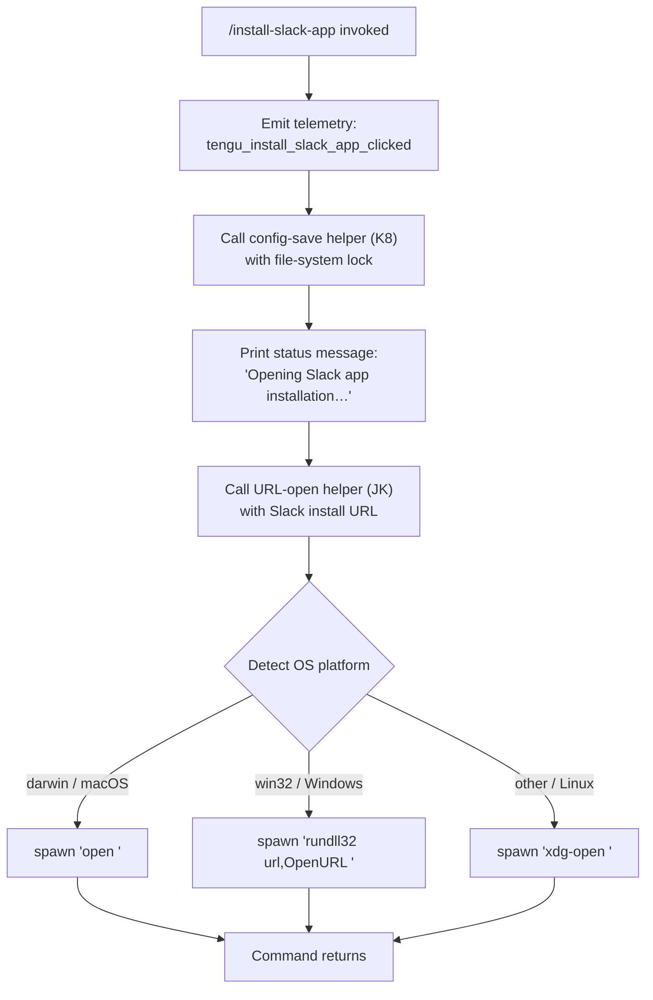

# `/install-slack-app`

> Analysis basis: CC v2.1.153 bundle.js (AST extraction + Claude interpretation)
> Minimum version: v2.1.153

---

## Overview

`/install-slack-app` is a local CLI command that opens the Claude Slack application installation page in the user's default system browser. The command fires a telemetry event, displays a brief status message, and then delegates to a platform-aware URL opener to launch the browser. It accepts no user-supplied arguments and does not enter an interactive agent loop.

---

## Registration

| Field | Value |
|---|---|
| type | `local` |
| name | `install-slack-app` |
| description | Install the Claude Slack app |
| loc_byte | `11353653` |
| loc_byte_end | `11353839` |
| loc_line | `8469` |
| supportsNonInteractive | `false` |
| module_id | `Ch1` |
| load_inline | `true` |
| arbor_handler.name | `YsL` |
| arbor_handler.fqn | `claude-2.1.153::YsL` |
| arbor_handler.kind | `AsyncFunction` |
| arbor_handler.resolution_path | `module_id` |
| arbor_handler.n_hits | `0` |

Analysis basis: CC v2.1.153 bundle.js:+11353653

---

## Input Branching

The command has no user-provided input to branch on; however, the URL-opener helper (`JK`) branches on the detected operating system (macOS / Windows / Linux) and optionally on the URL scheme. Three distinct OS paths exist, so a flowchart is used.



---

## Behavioral Spec

### Top-level handler — `installSlackAppHandler` (bundle ident: `YsL`)

The handler is an `AsyncFunction` resolved via the `module_id` → `Ch1` path by the Arbor symbol graph.

```
async function installSlackAppHandler(context):
    emitTelemetry("tengu_install_slack_app_clicked")   // +11353259
    await saveGlobalConfig(context)                    // K8, +11353297
    printText("Opening Slack app installation page in browser…")  // +11353405
    await openURL(slackInstallURL)                     // JK, +11353372
    return
```

Analysis basis: CC v2.1.153 bundle.js:+11353257

---

### Config-save with file-system lock — `saveGlobalConfig` (bundle ident: `K8`)

Called immediately after the telemetry event. Acquires a file-system lock before writing the global config and handles concurrent-instance contention.

```
async function saveGlobalConfig(context):
    acquire fileLock (pO_, +3201149)
    if lock wait exceeds threshold:
        emitTelemetry("tengu_config_lock_contention")   // +3204155
        log("error", "Lock acquisition took longer than expected…") // +3204066
    read current on-disk config via configReader (EzH, +3201330)
    if cached auth is present but re-read config is missing auth:
        emitTelemetry("tengu_config_auth_loss_prevented")  // +3204634
        log warning (saveGlobalConfig fallback message)    // +3201356
        abort write to prevent auth wipe
    perform atomic write via atomicWrite (mO_, +3201596)
    release fileLock
```

Analysis basis: CC v2.1.153 bundle.js:+3201149

---

### File-system lock acquisition — `acquireFileLock` (bundle ident: `pO_`)

```
async function acquireFileLock(lockPath):
    compute lockDir = path.dirname(lockPath)            // AD.dirname, +3203861
    ensure lockDir exists: fs.mkdirSync(recursive)      // L.mkdirSync, +3203882
    record startTime = Date.now()                       // +3203927
    loop:
        attempt to acquire lock via lockWriter (r3q, +3203940)
        if success: break
        if elapsed > threshold:
            emitTelemetry("tengu_config_lock_contention")
            log "Lock acquisition took longer…"         // +3204066
            break
    on completion (finally):
        release temp files (L.finally → M.finally)      // +15391270
```

Analysis basis: CC v2.1.153 bundle.js:+3201149

---

### Config reader with backup — `readConfigWithBackup` (bundle ident: `EzH`)

```
function readConfigWithBackup(configPath):
    if configPath absent:
        throw Error("Config accessed before allowed.")  // +3206099
    raw = fs.readFileSync(configPath, "utf-8")          // +3206155 / +3206182
    parsed = jsonParse(raw)                             // U6 → JSON.parse, +183848
    strip BOM if present (Pb, +3206205)
    if parse fails:
        emitTelemetry("tengu_config_parse_error")       // +3206730
        attempt restore from backup directory "backups" // +3205667
        copy backup via fs.copyFileSync                 // +3207238
    return parsed config object
```

Note: backup filenames starting with `.backup.` are recognised at +3204952.

Analysis basis: CC v2.1.153 bundle.js:+3201330

---

### Atomic file writer — `atomicWrite` (bundle ident: `mO_`)

```
function atomicWrite(targetPath, content):
    dir = path.dirname(targetPath)                      // AD.dirname, +3203697
    generate temp path (TG, +3203735)
    serialize content to JSON (RH → JSON.stringify, +3203747)
    write to temp path with mode 0o600 (384 decimal)    // c76, +3203765 / +3205367
    rename temp → target atomically
    if stale-write guard triggered:
        emitTelemetry("tengu_config_stale_write")       // +3204291
```

Analysis basis: CC v2.1.153 bundle.js:+3201596

---

### URL opener — `openURLInBrowser` (bundle ident: `JK`)

```
async function openURLInBrowser(url):
    validate url scheme is "http:" or "https:"          // $c7, +6578807 / +6578829
    if scheme invalid: throw Error                      // +6578757
    detect platform = process.platform                  // hD, +6579057
    match platform:
        "darwin"  → spawnCommand("open", [url])         // +6579116 / +6579290
        "win32"   → spawnCommand("rundll32", ["url,OpenURL", url])  // +6579132 / +6579216
        default   → spawnCommand("xdg-open", [url])     // +6579297
    await spawn completion (E8, +6579165)
```

Analysis basis: CC v2.1.153 bundle.js:+6579044

---

### Process spawner — `spawnProcess` (bundle ident: `E8`)

```
async function spawnProcess(cmd, args):
    resolve execution context (S6, +1048579)
    retrieve ambient store (aU6 → oU6.getStore, +975109)
    build child-process options (G_, +1048468)
    loop up to 10 retries (+1048413):
        spawn child via MF.spawn
        collect stdout/stderr (jGH, +1048974)
        on success: return output
        on retriable error: wait and retry
    if all retries exhausted: throw
```

Analysis basis: CC v2.1.153 bundle.js:+6579165

---

### Background session / spare-worker subsystem (reached via call graph)

Several telemetry events in the call graph relate to a background-session manager (`w`) invoked indirectly through the process-spawn path:

- `tengu_bg_dispatch_sigkill_escalate` (+15386200): emitted when a background worker does not respond to SIGTERM and is escalated to SIGKILL after 30 s (+15386155) / 15 s (+15386166) timeouts.
- `tengu_bg_dispatch_low_mem` (+15386779): emitted when free memory falls below the 1024 MB threshold (+15386673).
- `tengu_bg_spare_enable` (+15387474), `tengu_bg_spare_claim` (+15387595), `tengu_bg_spare_claim_fail` (+15387858), `tengu_bg_spare_spawn` (+15385893): lifecycle events for the spare background-worker pool.
- `tengu_bg_dispatch_sigkill_escalate` also notes the "exec" mode string (+15387084) and daemon session-create label (+15386510).

These events are triggered by the general-purpose background worker subsystem and are not specific to `/install-slack-app` itself; they appear because the same spawner is shared across commands.

Analysis basis: CC v2.1.153 bundle.js:+15386200

---

## State & Side Effects

| Item | Detail |
|---|---|
| Telemetry — primary | `tengu_install_slack_app_clicked` (+11353259) — fired on every invocation |
| Telemetry — config lock | `tengu_config_lock_contention` (+3204155) — lock wait exceeded threshold |
| Telemetry — stale write | `tengu_config_stale_write` (+3204291) — on-disk config newer than cache |
| Telemetry — parse error | `tengu_config_parse_error` (+3206730) — config JSON is malformed |
| Telemetry — auth guard | `tengu_config_auth_loss_prevented` (+3204634) — auth-wipe prevention triggered |
| Telemetry — bg worker | `tengu_bg_spare_spawn/claim/claim_fail/enable` (various) — spare worker lifecycle |
| Telemetry — bg memory | `tengu_bg_dispatch_low_mem` (+15386779) — low free-memory warning |
| Telemetry — SIGKILL | `tengu_bg_dispatch_sigkill_escalate` (+15386200) — unresponsive worker killed |
| stdout output | Prints `"Opening Slack app installation page in browser…"` (+11353405) as a `text`-type message (+11353392) |
| Browser launch | Opens the Slack install URL in the default system browser (no URL quoted — © Anthropic PBC) |
| File-system write | May update `~/.claude.json` via the config-save path if in-memory config differs from disk |
| Config backups | Backup files stored in a `backups/` subdirectory (+3205667); named with `.backup.` prefix (+3204952) |
| Temp file cleanup | Lock temp files cleaned up in a `finally` block (+15391270) |
| Non-interactive support | `supportsNonInteractive: false` — command is not available in non-interactive mode |
| appState changes | <!-- TODO: not found in depth-2 traversal; needs --depth 4 --> |
| Sound | <!-- TODO: not found in depth-2 traversal; needs --depth 4 --> |
| Hook registration | <!-- TODO: not found in depth-2 traversal; needs --depth 4 --> |

---

## Version History

| Version | Change |
|---|---|
| v2.1.153 | Initial analysis |

---

## Common Mistakes

1. **Running in non-interactive mode**: `supportsNonInteractive` is `false`. Invoking `/install-slack-app` from a script or pipe where no TTY is present will be rejected before the handler runs.
2. **Expecting a return value or agent response**: The command opens a browser tab and exits. It does not start an agent session or return structured data — any downstream code waiting for agent output will hang.
3. **Assuming the URL is configurable**: The Slack installation URL is a hard-coded constant in the bundle resolved inside `YsL`; there is no CLI flag or environment variable to override it.
4. **Conflating config-save side effects with the command's purpose**: The config-save path (`K8`) is a shared utility. Auth-loss guard warnings (see `tengu_config_auth_loss_prevented`) that appear in logs after running this command originate from the config layer, not from the Slack installation step itself.
5. **Interpreting background-worker telemetry as Slack-related**: Events such as `tengu_bg_spare_spawn` are emitted by the shared process-spawner subsystem and indicate background worker pool activity, not failures of the Slack install command.

---

## Appendix — Identifier Mapping

> For bundle debugging only. Identifiers change across versions.

| Identifier | Role |
|---|---|
| `YsL` | Top-level handler for `/install-slack-app` (AsyncFunction) |
| `c` | Logger / console-output utility |
| `K8` | `saveGlobalConfig` — writes global config with file-system lock |
| `pO_` | `acquireFileLock` — file-system lock acquisition loop |
| `_` | Low-level filesystem abstraction layer |
| `B6` | Path-existence / filesystem-check helper |
| `L` | Filesystem wrapper (mkdirSync, statSync, copyFileSync, etc.) |
| `q` | Secondary filesystem wrapper (readFileSync, mkdirSync, copyFileSync, etc.) |
| `M` | Promise / async resource manager (close, finally) |
| `r3q` | Lock-write helper (attempts atomic lock file creation) |
| `x9_` | Lock-state reader |
| `N` | HTTP request dispatcher |
| `chK` | HTTP encoding / content-type handler |
| `H` | Retry / jitter scheduler (Math.random + setTimeout) |
| `RH` | JSON serialiser (wraps JSON.stringify) |
| `j4` | HTTP response body parser / header extractor |
| `ixH` | HTTP normalisation utility |
| `ihK` | HTTP multipart / stream writer |
| `J8` | Generic error factory / throw helper |
| `EzH` | `readConfigWithBackup` — reads and validates config JSON |
| `U6` | JSON parse wrapper (wraps JSON.parse) |
| `Pb` | BOM-strip / string prefix normaliser |
| `UUq` | Config backup directory scanner |
| `UO_` | Backup path builder (path.join + timestamp) |
| `w` | Background worker / daemon session manager |
| `Wz6` | Config stale-write guard |
| `A` | Case-normalisation utility (toLowerCase) |
| `V` | Versioned config field accessor |
| `P` | MCP server connection manager |
| `mC8` | MCP transport factory |
| `yH` | MCP server loader / initialiser |
| `l_` | Error wrapping / coercion utility |
| `E` | Config entry array manager |
| `c76` | `atomicWriteFile` — atomic file write with rename |
| `O` | Symbolic-link stat helper |
| `X8` | ELOOP / ENOTDIR error classifier |
| `fQH` | Config field formatter |
| `pUq` | Config entry enumerator (Object.entries) |
| `$QH` | Config timestamp recorder (Date.now) |
| `mO_` | `atomicWrite` — serialise + temp-write + rename for config |
| `JK` | `openURLInBrowser` — platform-aware URL opener |
| `$c7` | URL scheme validator (http/https guard) |
| `hD` | Platform detector (process.platform) |
| `E8` | `spawnProcess` — child-process spawner with retry |
| `G_` | Spawn option builder / environment constructor |
| `jGH` | Child-process I/O collector (stdout/stderr streams) |
| `D` | Background session dispatcher |
| `r84` | Spawn result formatter (String coercion) |
| `Wz` | Spawn timeout controller |
| `S6` | Ambient async-context resolver |
| `aU6` | AsyncLocalStorage store accessor |
| `O_` | Fallback context provider (`Fv`) |

---

Note: index built via Arbor fallback; some signals (telemetry, literals) may be missing — see arbor-fallback.js.