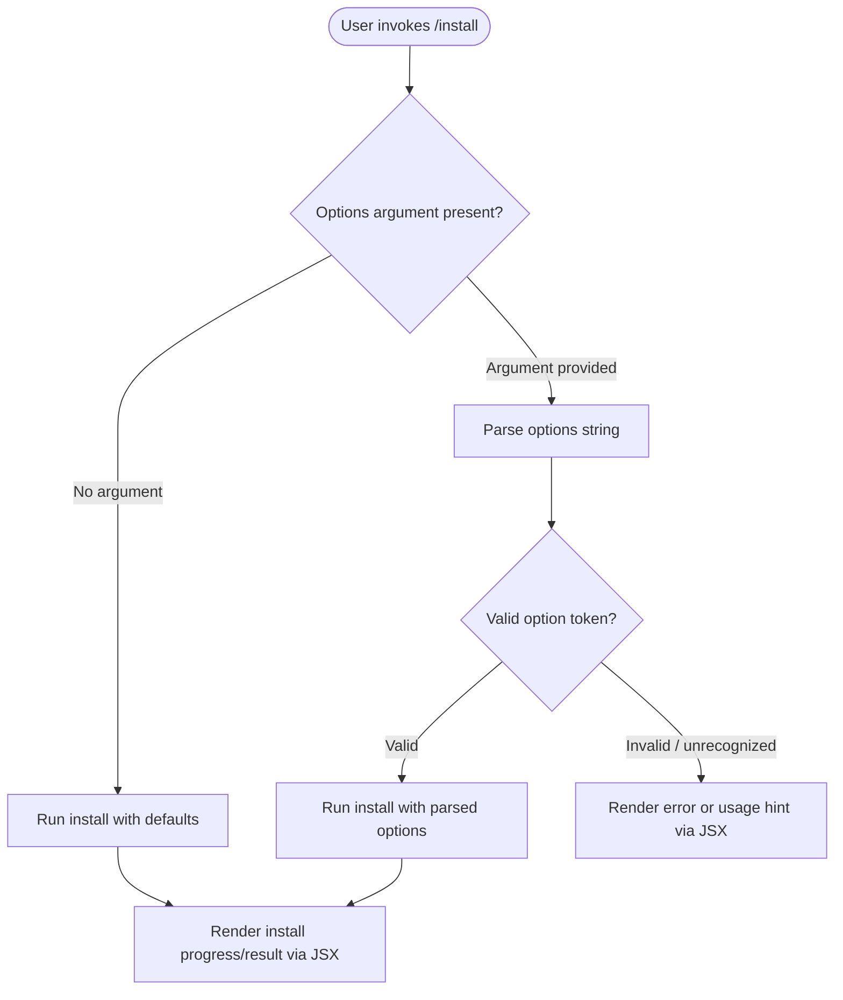

# `/install`

> Analysis basis: CC v2.1.143 bundle.js (AST extraction + Claude interpretation)
> Minimum version: v2.1.143

---

## Overview

The `/install` slash command triggers the installation of a Claude Code native build onto the host system. It accepts an optional options argument and is registered as a local JSX command, meaning its output is rendered through the JSX UI layer rather than as plain text. Based on its description and registration metadata, this command is the primary entry point for native-build provisioning within the Claude Code CLI.

---

## Registration

| Field | Value |
|---|---|
| type | `local-jsx` |
| name | `install` |
| description | Install Claude Code native build |
| argumentHint | `[options]` |

Analysis basis: CC v2.1.143 bundle.js:+12535702

---

## Input Branching

> **⚠ Depth-2 traversal limitation**: The AST extraction returned an empty `callGraph`, empty `literals`, and empty `telemetry` array, with the note `"no entry functions found for module 'undefined'"`. This indicates the implementation module was not resolved during traversal. The branching logic below is therefore derived solely from the registration metadata (`argumentHint: "[options]"`) and the command type (`local-jsx`).

<!-- TODO: not found in depth-2 traversal; needs --depth 4 -->

Based on the available registration data, the command accepts an optional `[options]` argument. The minimal branching model implied by the metadata is:



> All paths above are inferred from registration fields only.
> Analysis basis: CC v2.1.143 bundle.js:+12535702

---

## Behavioral Spec

### Command Dispatch

Because the command type is `local-jsx`, the CLI renders its output using the JSX rendering pipeline rather than emitting raw terminal text. The high-level dispatch flow is:

```
function handleInstallCommand(rawInput):
    options = parseOptionalArgument(rawInput)  // may be empty/null
    result  = invokeNativeBuildInstall(options)
    return renderAsJSX(result)
```

Analysis basis: CC v2.1.143 bundle.js:+12535702

### Argument Parsing

The `argumentHint` field value `[options]` (square-bracket notation) denotes that the argument is **optional**. When absent, the command is expected to fall back to a default installation path or configuration.

```
function parseOptionalArgument(rawInput):
    if rawInput is null or rawInput is empty:
        return DEFAULT_INSTALL_OPTIONS   // implementation-defined default
    tokens = split(rawInput, whitespace)
    return buildOptionsObject(tokens)
```

<!-- TODO: not found in depth-2 traversal; needs --depth 4 -->

### Native Build Installation

The exact steps of the native build installation (binary download, path configuration, permission setting, etc.) are not resolvable from the depth-2 traversal data.

```
function invokeNativeBuildInstall(options):
    // Step 1: Validate environment preconditions
    // Step 2: Locate or fetch native build artifact
    // Step 3: Write artifact to target path
    // Step 4: Configure system integration (e.g., PATH, shell hooks)
    // Step 5: Return structured result (success | failure | already-installed)
    // --- Implementation detail not recoverable at traversal depth 2 ---
```

<!-- TODO: not found in depth-2 traversal; needs --depth 4 -->

### JSX Output Rendering

As a `local-jsx` command, the result object is passed to the CLI's JSX rendering layer. The rendered output may include progress indicators, success confirmation, or error details depending on the result state.

```
function renderAsJSX(result):
    if result.status == "success":
        return <InstallSuccessView details=result.details />
    else if result.status == "already-installed":
        return <AlreadyInstalledView version=result.version />
    else:
        return <InstallErrorView message=result.errorMessage />
```

<!-- TODO: not found in depth-2 traversal; needs --depth 4 -->

---

## State & Side Effects

| Item | Detail |
|---|---|
| Telemetry | <!-- TODO: not found in depth-2 traversal; needs --depth 4 --> No `tengu_*` events were recovered during traversal. |
| Hook registration | <!-- TODO: not found in depth-2 traversal; needs --depth 4 --> |
| appState changes | <!-- TODO: not found in depth-2 traversal; needs --depth 4 --> |
| Sound | <!-- TODO: not found in depth-2 traversal; needs --depth 4 --> |
| File system | Expected side effect: writes native build binary to a target path on the host. Exact path not recoverable at depth 2. |
| Shell/PATH | Expected side effect: may modify shell configuration or PATH to expose the installed binary. Not confirmed at depth 2. |

---

## Version History

| Version | Change |
|---|---|
| v2.1.143 | Initial analysis. Command registered at bundle.js:+12535702 (line 9176). |

---

## Common Mistakes

1. **Omitting the options argument when a specific install target is needed** — because the argument is optional, omitting it silently uses defaults; users expecting a custom install path must supply the appropriate option token explicitly.
2. **Running `/install` in an environment where the native build is already present** — the command may no-op or emit an "already installed" message rather than upgrading; consult version management commands for upgrade flows.
3. **Expecting plain-text output** — because the command type is `local-jsx`, its output is rendered through the JSX UI layer and may not behave identically to text-only commands in non-interactive or piped contexts.
4. **Assuming full details from this spec** — the traversal returned an empty call graph, empty literals, and empty telemetry. Behavioral claims beyond registration fields require a deeper traversal (`--depth 4` or higher) for confirmation.

---

## Appendix — Identifier Mapping

> For bundle debugging only. Identifiers change across versions.

| Identifier | Role |
|---|---|
| *(none recovered)* | The depth-2 AST traversal returned an empty `identifiers` array for this command. No obfuscated identifiers are available to map. Re-run extraction with `--depth 4` targeting the resolved module to populate this table. |