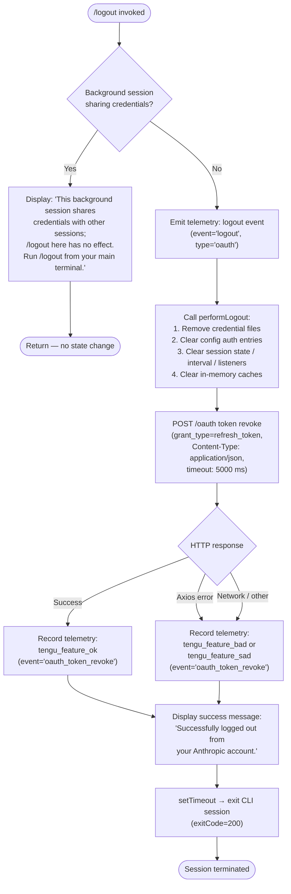

# `/logout`

> Analysis basis: CC v2.1.153 bundle.js (AST extraction + Claude interpretation)
> Minimum version: v2.1.153

---

## Overview

The `/logout` command signs the user out of their Anthropic account by revoking the active OAuth token via the Anthropic API, clearing all in-memory credential caches, removing on-disk credential files, and then terminating the CLI session with a success message. If invoked from a background session that shares credentials with a primary terminal session, the command is a no-op and instead displays an informational message directing the user to run `/logout` from their main terminal.

---

## Registration

| Field | Value |
|---|---|
| type | `local-jsx` |
| name | `logout` |
| description | Sign out from your Anthropic account |
| loc_byte | `11302120` |
| loc_byte_end | `11302308` |
| loc_line | `8321` |
| module_id | `Sd9` |
| load_inline | `true` |
| arbor_handler.name | `e5L` |
| arbor_handler.fqn | `claude-2.1.153::e5L` |
| arbor_handler.kind | `AsyncFunction` |
| arbor_handler.resolution_path | `module_id` |
| arbor_handler.n_hits | `0` |

Analysis basis: CC v2.1.153 bundle.js:+11302120

---

## Input Branching

The command has 3+ distinct execution paths (background-session guard, OAuth token revocation success, and OAuth token revocation failure), so a Mermaid flowchart is used.



Analysis basis: CC v2.1.153 bundle.js:+7694500, +7695836, +7696035, +7696098, +7696130

---

## Behavioral Spec

### 1. Background-Session Guard

Before performing any logout action the handler checks whether the current process is a background (`bg`) or daemon/daemon-worker session that shares OAuth credentials with a parent terminal session.

```
function isSharedCredentialBackgroundSession(sessionType):
    if sessionType in {"bg", "daemon", "daemon-worker"}:
        return true
    return false

function handleLogout(context):
    if isSharedCredentialBackgroundSession(context.sessionType):
        display("This background session shares credentials …")
        return          // no further action
    performFullLogout(context)
```

Session-type string constants observed: `"bg"` (bundle.js:+2196664), `"daemon"` (bundle.js:+2196674), `"daemon-worker"` (bundle.js:+2196688).

Analysis basis: CC v2.1.153 bundle.js:+7695836

---

### 2. Telemetry Emission Before Logout

Immediately after the background-session guard passes, the handler records a structured telemetry event tagging the logout action and its authentication type.

```
function emitLogoutTelemetry():
    recordEvent({
        event: "logout",
        authType: "oauth"
    })
```

String constants: `"logout"` (bundle.js:+7695749), `"oauth"` (bundle.js:+7695780).

Analysis basis: CC v2.1.153 bundle.js:+7695726, +7695749, +7695780

---

### 3. Core Logout — Credential and State Teardown (`performLogout`)

The main logout routine (`rW6` in the bundle, called from the `e5L` handler) carries out a multi-step teardown sequence.

```
async function performLogout(appState):

    // Step 1 — remove primary credential file (unlinkSync)
    removeCredentialFile()                      // q → VTK.unlinkSync

    // Step 2 — clear auth fields from persisted config (N9 → DOH)
    clearAuthFromConfig()

    // Step 3 — tear down session state (iW6)
    teardownSessionState():
        FP6()                                   // flush pending writes
        XgH()                                   // clear cross-session ref
        clearInMemoryCache()                    // AH8 → zIq.clear
        DzH()                                   // additional state reset
        stopNetworkListeners()                  // VEH:
            stopHeartbeatInterval()             //   HQH → VO_ → clearInterval
            process.removeListener(...)         //   HQH → process.removeListener
            process.off(...)                    //   HQH → process.off
            clearStateMaps()                    //   WzH, $88, zz6, PO_, vQ → .clear
            emitShutdownEvent()                 //   egH.emit
            flushLogs()                         //   lG, yH

    // Step 4 — remove MCP socket / lock files (ek9, zI_)
    removeMCPFiles():
        unlinkSocketFile()                      // ek9 → CIH.unlink
        unlinkLockFile()                        // zI_ → uP6.unlink

    // Step 5 — determine API endpoint (IA → checks bedrock/foundry/vertex/mantle/firstParty)
    endpoint = resolveApiEndpoint(appState)

    // Step 6 — POST token revoke (QK → _$q → g__)
    await revokeOAuthToken(endpoint, refreshToken)

    // Step 7 — save updated config (K8 → pO_ / mO_)
    await saveGlobalConfig(appState)

    // Step 8 — mutate app state to clear auth (K.mutate)
    appState.mutate({ auth: null })

    // Step 9 — log any errors encountered (yH → an.logError)
    logErrors()

    // Step 10 — delete residual state key (K.delete)
    appState.delete("subscription-switch")      // literal bundle.js:+7695352

    // Step 11 — emit telemetry (SH, event="oauth_logout")
    recordTelemetry("oauth_logout")             // bundle.js:+7695507
```

Analysis basis: CC v2.1.153 bundle.js:+7694591, +7694621, +7694642, +7694646, +7694658, +7694678, +7694705, +7694745, +7694800, +7694880, +7694895, +7694923, +7695078, +7695097, +7695108, +7695130, +7695504

---

### 4. OAuth Token Revocation (`g__`)

The token revocation sub-step sends an HTTP POST to the Anthropic OAuth endpoint carrying the stored refresh token.

```
async function revokeOAuthToken(endpoint, refreshToken):
    try:
        response = await httpClient.post(endpoint, {
            grant_type: "refresh_token",          // bundle.js:+2053705
            token:      refreshToken
        }, {
            headers: { "Content-Type": "application/json" },   // +2053760, +2053775
            timeout: 5000                          // ms, bundle.js:+2053803
        })
        recordTelemetry("oauth_token_revoke",     // bundle.js:+2053813
                         category="network")       // +2053937
        return OK
    catch AxiosError:
        if httpClient.isAxiosError(error):
            classifyError(error)                   // e6 / SH path
        recordTelemetry("tengu_feature_bad"/"tengu_feature_sad")
```

Timeout constant: 5000 ms (bundle.js:+2053803).
Telemetry event string: `"oauth_token_revoke"` (bundle.js:+2053813).

Analysis basis: CC v2.1.153 bundle.js:+2053645, +2053656, +2053705, +2053760, +2053775, +2053803, +2053813, +2053850, +2053982

---

### 5. Credential File Removal (`removeCredentialFile` and `removeMCPFiles`)

```
function removeCredentialFile():
    // Synchronous unlink of the primary auth credential file
    fs.unlinkSync(credentialFilePath)           // q → VTK.unlinkSync (+15364512)

function removeMCPFiles():
    // Async unlink of MCP Unix socket (ek9 → CIH.unlink, +6795076)
    await fs.unlink(mcpSocketPath)

    // Resolve and unlink lock file ($I_ → clearTimeout, uP6.unlink)
    clearTimeout(lockTimeout)                   // +6751086
    await fs.unlink(lockFilePath)               // zI_ → uP6.unlink (+6755177)
```

Analysis basis: CC v2.1.153 bundle.js:+15364512, +6795076, +6751086, +6755177

---

### 6. Success Display and Session Exit (`e5L` post-logout)

After `performLogout` resolves, the handler renders a JSX success element and schedules process exit.

```
async function logoutHandler(context):
    // ... (guard + performLogout above) ...

    render(createElement("system", null,
        "Successfully logged out from your Anthropic account."))
    // bundle.js:+7696035, +7695988

    setTimeout(() => exitProcess(200), /* brief delay */)
    // bundle.js:+7696098, exitCode constant +7696130
```

The exit timeout is a short delay (exit code value `200` found at bundle.js:+7696130) to allow the JSX output to flush before the process terminates.

Analysis basis: CC v2.1.153 bundle.js:+7695799, +7695834, +7696010, +7696035, +7696098, +7696114, +7696130

---

### 7. Config Persistence During Logout (`K8` / `saveGlobalConfig`)

The global configuration is rewritten to disk after credentials are cleared, with a safety check that prevents accidentally wiping the `auth` block if the on-disk file was mutated concurrently.

```
function saveGlobalConfig(config):
    acquireFileLock()                           // pO_ → lock acquisition
    reRead = readConfigFromDisk()
    if reRead.auth is present but cache.auth is null:
        // Safety guard — refuse to wipe auth; log warning
        log("saveGlobalConfig fallback: re-read config is missing auth …")
        // bundle.js:+3201356
        emit("tengu_config_auth_loss_prevented")
        return
    writeConfigToDisk(config)                   // mO_ → c76 → atomic rename
    releaseLock()
```

Lock contention warning string: `"Lock acquisition took longer than expected …"` (bundle.js:+3204066).
Auth-loss safety string: `"saveGlobalConfig fallback: re-read config is missing auth …"` (bundle.js:+3201356).

Analysis basis: CC v2.1.153 bundle.js:+3201149, +3201265, +3201330, +3201356, +3203697

---

## State & Side Effects

| Item | Detail |
|---|---|
| Telemetry — `tengu_feature_ok` | Emitted on successful OAuth token revocation path (bundle.js:+965124) |
| Telemetry — `tengu_feature_bad` | Emitted when token revocation encounters a classified error (bundle.js:+965182) |
| Telemetry — `tengu_feature_sad` | Emitted on secondary error path during token revocation (bundle.js:+965259) |
| Telemetry — `tengu_config_lock_contention` | Emitted if config file lock is contended during credential write-back (bundle.js:+3204155) |
| Telemetry — `tengu_config_stale_write` | Emitted if a stale config write is detected (bundle.js:+3204291) |
| Telemetry — `tengu_config_parse_error` | Emitted if the config file cannot be parsed during re-read (bundle.js:+3206730) |
| Telemetry — `tengu_config_auth_loss_prevented` | Emitted when the safety guard prevents accidentally wiping auth credentials (bundle.js:+3204634) |
| Telemetry — `tengu_daemon_config_reload` | Emitted when daemon receives config reload signal (bundle.js:+15400987) |
| Telemetry — `tengu_startup_perf` | Emitted from startup-profiling path reached during session teardown (bundle.js:+214224) |
| Telemetry — `tengu_scroll_summary` | Emitted as part of session-end summary flush (bundle.js:+5317981) |
| Telemetry — `tengu_pewter_brook` | Emitted during UI teardown / display-mode detection (bundle.js:+3371435) |
| Telemetry — `tengu_cache_eviction_hint` | Emitted during session-end cache eviction bookkeeping (bundle.js:+5319014) |
| Credential file removal | Synchronous unlink of primary auth credential file via `VTK.unlinkSync` (bundle.js:+15364512) |
| MCP socket removal | Async unlink of MCP Unix socket via `CIH.unlink` (bundle.js:+6795076) |
| Lock file removal | Async unlink of process lock file via `uP6.unlink` (bundle.js:+6755177) |
| In-memory cache clear | `zIq.clear()` removes all cached credential data (bundle.js:+2936039) |
| State-map clears | `WzH`, `$88`, `zz6`, `PO_`, `vQ` all cleared (bundle.js:+3184789–+3184837) |
| Process event listeners removed | `process.removeListener` and `process.off` called (bundle.js:+3185364, +3184670) |
| Interval cleared | `clearInterval` stops the heartbeat interval (bundle.js:+3185329) |
| Shutdown event emitted | `egH.emit` fires the internal shutdown event (bundle.js:+3184542) |
| App-state mutation | `K.mutate({ auth: null })` clears authentication from reactive app state (bundle.js:+7694923) |
| App-state key deletion | `K.delete("subscription-switch")` removes the subscription-switch flag (bundle.js:+7695097, +7695352) |
| Config file rewritten | Global config persisted to disk without auth fields via atomic rename (bundle.js:+3201596) |
| Process exit | `process.exit(200)` called after a short `setTimeout` delay (bundle.js:+7696098, +7696130) |
| Sound | None observed in depth-2 traversal |

---

## Version History

| Version | Change |
|---|---|
| v2.1.153 | Initial analysis |

---

## Common Mistakes

1. **Running `/logout` in a background or daemon session**: The command explicitly detects `bg`, `daemon`, and `daemon-worker` session types and displays an informational no-op message rather than performing the logout. Users must run `/logout` from their primary interactive terminal to actually sign out.

2. **Expecting instant sign-out without network access**: The OAuth token revocation step makes an outbound HTTP POST with a 5-second timeout. On slow or absent network connections, revocation may time out or fail — however the local credential files and in-memory caches are cleared regardless of whether the server-side revocation succeeds.

3. **Assuming the session stays alive after `/logout`**: The handler unconditionally calls `process.exit` (with a short delay) after displaying the success message. Any unsaved work in the current session is lost.

4. **Concurrent Claude Code instances interfering with config write-back**: The safety guard that prevents `auth` data loss (triggered when the on-disk file differs from the in-memory cache) can fire when another Claude Code process has modified `~/.claude.json` concurrently. The logout will complete locally but may log a warning and emit `tengu_config_auth_loss_prevented`.

5. **Confusing `/logout` with provider-level sign-out**: The command revokes the Anthropic OAuth token. API-key based configurations (Bedrock, Vertex, Foundry, Mantle) use different authentication paths; the endpoint is resolved per provider (`"bedrock"`, `"foundry"`, `"vertex"`, `"mantle"`, `"firstParty"` — bundle.js:+2042433–+2042650) and the revocation call may behave differently or be skipped entirely for non-OAuth providers.

---

## Appendix — Identifier Mapping

> For bundle debugging only. Identifiers change across versions.

| Identifier | Role |
|---|---|
| `e5L` | Main async logout handler (Arbor-resolved, `AsyncFunction`, `claude-2.1.153::e5L`) |
| `rW6` | Core `performLogout` routine — orchestrates all teardown steps |
| `q` | Credential file remover — calls `VTK.unlinkSync` |
| `N9` | Auth-config clearer — calls `DOH` to remove auth from persisted config |
| `DOH` | Low-level config auth field deletion helper |
| `iW6` | Session-state teardown coordinator |
| `FP6` | Pending-write flusher |
| `XgH` | Cross-session reference clearer |
| `AH8` | In-memory credential cache clearer — calls `zIq.clear` |
| `DzH` | Additional session-state reset helper |
| `VEH` | Network-listener / interval stopper |
| `wHH` | Internal helper called by `VEH` (process event management) |
| `xH` | String-coercion / identity utility |
| `tb` | Config-read helper called by `wHH` |
| `HQH` | Interval and process-listener cleanup — clears `WzH`, `$88`, `zz6`, `PO_`, `vQ` |
| `VO_` | `clearInterval` + `process.removeListener` wrapper |
| `yH` | Log/error flusher; also called from `VEH` |
| `l_` | Low-level error formatter |
| `_1` | Essential-traffic queue helper |
| `GH4` | Queue rotation helper (`cU6.shift` / `cU6.push`) |
| `ek9` | MCP socket file remover — calls `CIH.unlink` |
| `_y9` | MCP path resolver helper |
| `uI_` | MCP socket path builder (`qkA`) |
| `SL6` | Path join helper for socket paths (`AkA.join`) |
| `zI_` | Lock file remover — calls `uP6.unlink` |
| `$I_` | Lock timeout clearer — calls `clearTimeout`; calls `YI_` |
| `YI_` | Lock state cleanup helper |
| `T4H` | Lock condition checker (`A.some`, `_.includes`, `XgH`) |
| `XcH` | Lock file path resolver (`CH9.join`) |
| `IA` | API provider type resolver (bedrock / foundry / vertex / mantle / firstParty) |
| `QK` | Credential-store accessor |
| `_$q` | Secure storage read/write/delete dispatcher |
| `H` | Secure storage backend (primary) |
| `_` | Secure storage backend (fallback) |
| `hTH` | Secure storage read-with-retry helper |
| `rb4` | Async-local-store credential resolver |
| `SH` | Telemetry emission helper (`tengu_feature_ok` path) |
| `c` | Base telemetry recorder |
| `e6` | Telemetry emission helper (`tengu_feature_sad` path) |
| `uH` | Telemetry emission helper (`tengu_feature_bad` path) |
| `L` | Async file I/O wrapper (read/delete/add to tracked set) |
| `M` | Database/file handle manager (open/close) |
| `A` | Lower-level I/O abstraction |
| `g__` | OAuth token revocation HTTP caller — POSTs to revoke endpoint |
| `bq` | OAuth endpoint URL builder |
| `eGA` | Environment / build-mode detector |
| `zeK` | OAuth URL selector (local / staging / prod) |
| `N` | HTTP request helper (wraps Axios with logging) |
| `chK` | HTTP client constructor helper |
| `L3A` | Network interceptor setup (`cIK`, `lIK`) |
| `RH` | JSON.stringify wrapper for request logging |
| `j4` | Header sanitizer — redacts sensitive values (`"[REDACTED]"`) |
| `pOA` | Header map builder |
| `ixH` | File-write logger helper |
| `NOA` | Low-level write logger |
| `ihK` | Debug log file writer (appends to log file) |
| `GxH` | Buffered output / batching helper |
| `xfH` | Log file path resolver |
| `B6` | `fs.mkdirSync` / directory creation helper |
| `E16` | Error-code classifier (`EISDIR`, etc.) |
| `lOA` | Log path join helper |
| `cOA` | Log file rotation helper (`Zk.rename`, `Zk.unlink`) |
| `nhK` | Log append-with-rotation handler |
| `H9` | Signal / drain registrar (`q3A.register`) |
| `ft` | <!-- TODO: not found in depth-2 traversal; needs --depth 4 --> |
| `M3_` | Config snapshot / lock manager (calls `TIq`, `K8`) |
| `TIq` | Config path resolver and reader |
| `P9q` | Config file path builder (NFC normalize, sha256 hash) |
| `XN` | Config hash / path deriver |
| `zP` | Config schema validator |
| `HV` | User-info lookup (`Ji6.userInfo`) |
| `EH` | String coercion utility |
| `K8` | Global config read/write controller |
| `pO_` | Config file write with backup rotation and lock |
| `r3q` | Config object merger (`Object.assign`) |
| `J8` | Error class / typed-error factory |
| `EzH` | Config file reader with backup support |
| `Wz6` | Config schema migration helper |
| `UO_` | Backup directory path resolver (`AD.join`) |
| `V` | <!-- TODO: not found in depth-2 traversal; needs --depth 4 --> |
| `P` | Process/connection manager (`mC8`, `Vh`, `Uu`, `yH`) |
| `E` | Renderer lifecycle controller (stop/updateConfig/start) |
| `c76` | Atomic file writer (temp-file + rename + fchmod + fsync) |
| `fQH` | Config field extractor helper |
| `pUq` | Config entries iterator (`Object.entries`) |
| `$QH` | Config timestamp stamper (`Date.now`) |
| `mO_` | Global config writer — calls `c76` for atomic write |
| `$o6` | Config delta/diff helper |
| `K` | Reactive app-state store (`.mutate`, `.delete`, `.map`) |
| `BWH` | App-state batch-write helper |
| `LnH` | Session metadata emitter (calls `rW` and `L4`) |
| `rW` | Error type tagger (`EH`) |
| `L4` | OTEL metric event emitter (`Au8`, `nvH`, `A.emit`) |
| `Au8` | OTEL metric builder |
| `nvH` | OTEL attribute assembler (user.id, session.id, app.version, etc.) |
| `up` | Session-ID generator (`BUq.randomBytes`, 32 bytes) |
| `y6` | Environment variable reader (`Fv`) |
| `z78` | OTEL string coercer (`xH`) |
| `Y3H` | Feature-flag checker (`FrK.has`) |
| `d7` | Metric transport helper (`Hw`, `b6`) |
| `nL9` | OTEL span helpers (`sv7`, `av7`) |
| `O78` | OTEL resource builder (`C$`, `UWH`, `ov7`, `Object.freeze`) |
| `N96` | OTEL sequence counter |
| `kK` | Session-exit / cleanup orchestrator (calls `K9`) |
| `K9` | Full session-teardown runner (unmount UI, drain I/O, race exit timeout) |
| `pNH` | UI unmount helper (`NwH.writeSync`, `H.unmount`) |
| `$R` | Cursor / terminal-state restorer |
| `lA8` | Terminal write helper (`Sr.writeSync`, escape sequences) |
| `IE_` | Final status line writer (path info, dim styling) |
| `KZ` | Terminal capability detector |
| `sC` | Screen-size helper |
| `ZX6` | Executable path resolver (`ED.join`, `q.statSync`) |
| `G3` | Display path formatter (`y6`, `h4`) |
| `Lj9` | Path escape helper (replaces `\\` and `"`) |
| `kE_` | Hard-exit helper (`process.exit`, `process.kill(SIGKILL)`) |
| `TxH` | I/O drain trigger (`q3A.drain`) |
| `Y` | Render-loop supervisor (stop/updateConfig/start renderers) |
| `z2H` | Render-frame builder |
| `ya1` | Layout / sizing calculator (`Math.max`, `Gz`) |
| `G` | Input event interceptor (`b.preventDefault`, `j0`) |
| `oTK` | Heartbeat emitter (`JHH`) |
| `B16` | Startup-profiling reporter (`qU8`, `fzA`) |
| `qU8` | Profiling data aggregator |
| `fzA` | Profiling file writer (`Rb6.dirname`, `B6`, `f0H`, `qzA`) |
| `D58` | Scroll-summary reporter (`KZ`, `Kj9`, `qj9`, `$q`) |
| `Kj9` | Scroll-summary formatter |
| `qj9` | Scroll-metric calculator (`Date.now`, `Math.max`, `Math.round`) |
| `$q` | Display-mode / fullscreen detector |
| `eq6` | Cache-eviction hint recorder |
| `w58` | Parallel async-task runner (`Promise.all`, `Promise.race`) |
| `r8` | Abortable timeout promise factory |

---

Note: index built via Arbor fallback; some signals (telemetry, literals) may be missing — see arbor-fallback.js.