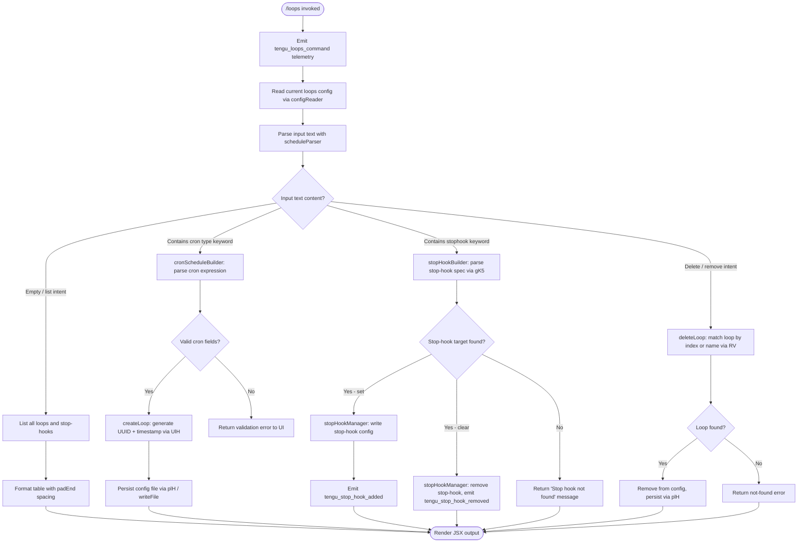

# `/loops`

> Analysis basis: CC v2.1.153 bundle.js (AST extraction + Claude interpretation)
> Minimum version: v2.1.153

---

## Overview

The `/loops` command provides a management interface for recurring loops (cron-scheduled tasks) and stop-hooks within Claude Code. It allows users to list active loops and stop-hooks, create new ones with cron expressions or human-readable schedules, and delete existing ones. The command renders an interactive JSX-based UI and dispatches sub-operations through the application's state management layer.

---

## Registration

| Field | Value |
|---|---|
| type | `local-jsx` |
| name | `loops` |
| description | `List, create, and delete recurring loops and stop-hooks` |
| loc_byte | `12154441` |
| loc_byte_end | `12154623` |
| loc_line | `9084` |
| immediate | `true` |
| module_id | `kQ1` |
| load_inline | `true` |
| arbor_handler.name | `QK5` |
| arbor_handler.fqn | `claude-2.1.153::QK5` |
| arbor_handler.kind | `AsyncFunction` |
| arbor_handler.resolution_path | `module_id` |
| arbor_handler.n_hits | `0` |

Analysis basis: CC v2.1.153 bundle.js:+12154441

---

## Input Branching

The command parses the user's input text to determine which of four distinct operations to perform: list, create-cron, create-stophook, or delete. There are 4+ distinguishable paths, so a Mermaid flowchart is used.



Analysis basis: CC v2.1.153 bundle.js:+12153396, +12153444, +12153527, +12153948, +12154046, +12154134

---

## Behavioral Spec

### 1. Entry Point and Telemetry Emission

The handler `QK5` (referred to here as `loopsCommandHandler`) is an `AsyncFunction` resolved via `module_id` path from module `kQ1`.

```
async function loopsCommandHandler(context):
    emit telemetry("tengu_loops_command")        // bundle.js:+12153398
    config = await readLoopsConfig(context)       // calls configReader (k6H → mvH)
    loopsList = await loadLoopEntries(config)     // calls loopEntryLoader (q66)
    appState = context.getAppState()             // bundle.js:+12153448
    inputText = context.input                    // raw user input string
    ...
```

Analysis basis: CC v2.1.153 bundle.js:+12153396, +12153398, +12153436, +12153444, +12153448

---

### 2. Configuration File Reader

`configReader` (`k6H` → `mvH`) reads the loops configuration from disk.

```
async function configReader(context):
    basePath = pathJoiner(configDir)              // F4H → I48.join
    raw = await fs.readFile(basePath, "utf-8")   // encoding: "utf-8" (bundle.js:+4774318)
    if read fails with ENOENT/EACCES/EPERM/ENOTDIR/ELOOP/EROFS:
        return empty config                       // error codes: bundle.js:+174122..174191
    parsed = parseConfigLines(raw)               // _9 → J8
    validated = validateEntries(parsed)          // yH → l_
    return validated
```

Analysis basis: CC v2.1.153 bundle.js:+4774271, +4774290, +4774301, +4774340, +4774362

---

### 3. Schedule Parser (Cron Expression Handling)

`scheduleParser` (`eN` → `qE7`) converts human-readable text or raw cron expressions into a structured schedule object. It handles both cron-type (`"cron"`) and named-interval patterns.

```
function scheduleParser(inputText):
    trimmed = inputText.trim()                    // bundle.js:+4770891
    parts = splitScheduleTokens(trimmed)          // qE7 → H.split (bundle.js:+4770311)
    for each part:
        matched = part.match(cronPattern)         // L.match (bundle.js:+4770331)
        if matched:
            value = parseInt(matched, 10)         // bundle.js:+4770376
            validatedSet.add(value)              // K.add (bundle.js:+4770437)
    // numeric bounds enforced in field parsing:
    // minutes: 0-59, hours: 0-23, days: 1-31 (bundle.js:+12153129,+12153163,+12153234,+12153287)
    // "Every minute" label maps to minute-level schedule (bundle.js:+4772182)
    // "Every hour" label maps to hour-level schedule (bundle.js:+4772399)
    result = Array.from(validatedSet)            // bundle.js:+4770839
    return result
```

Named schedule constants:
- `"Every minute"` — minute-granularity schedule (bundle.js:+4772182)
- `"Every hour"` — hour-granularity schedule (bundle.js:+4772399)
- Range notation `"1-5"` is recognized (bundle.js:+4773106)

Analysis basis: CC v2.1.153 bundle.js:+4770311, +4770331, +4770376, +4770437, +4770839, +4772182, +4772399

---

### 4. Stop-Hook Builder and Parser

`stopHookBuilder` (`gK5`) parses stop-hook arguments from the input text, validating interval values against mathematical limits.

```
function stopHookBuilder(inputText):
    matched = inputText.match(stopHookPattern)   // H.match (bundle.js:+12152984)
    if no match:
        return null
    rawValue = parseInt(matched[1])              // bundle.js:+12153021
    clamped = Math.max(rawValue, ...)            // bundle.js:+12153106
    rounded = Math.ceil(clamped)                 // bundle.js:+12153117
    final = Math.round(rounded)                  // bundle.js:+12153190
    // scheduleParser also called here for sub-expression (bundle.js:+12153354)
    return { type: "stophook", interval: final }
```

Numeric bounds inferred from literals:
- Minute field max: 60 (bundle.js:+12153129)
- Minute field cap: 59 (bundle.js:+12153163)
- Hour field max: 23 (bundle.js:+12153234)
- Day field max: 31 (bundle.js:+12153287)

Analysis basis: CC v2.1.153 bundle.js:+12152984, +12153021, +12153106, +12153117, +12153190, +12153354

---

### 5. Loop Entry Creator

`loopEntryCreator` (`UlH`) creates a new loop record with a generated identifier and timestamp.

```
async function loopEntryCreator(context, scheduleSpec):
    id = crypto.randomUUID()                     // z49.randomUUID (bundle.js:+4775618)
    createdAt = Date.now()                       // bundle.js:+4775680
    entry = buildLoopEntry(scheduleSpec, id, createdAt)  // gWH (bundle.js:+4775726)
    await configFileWriter(entry)                // mvH (bundle.js:+4775770)
    entryList.push(entry)                        // f.push (bundle.js:+4775783)
    await stateUpdater(context, entry)           // y6 (bundle.js:+4775815)
    summary = textSummarizer(entry)              // Zi (bundle.js:+4775864)
    await persistLoop(entry)                     // plH (bundle.js:+4775877)
    return summary
```

The `.claude` directory is used as the base path for loop config files (bundle.js:+4775459).

Analysis basis: CC v2.1.153 bundle.js:+4775618, +4775680, +4775726, +4775770, +4775783, +4775815, +4775864, +4775877

---

### 6. Loop Persistence Writer

`loopPersister` (`plH`) writes the loop configuration files to disk.

```
async function loopPersister(entries, context):
    dirPath = pathJoiner(configDir, ".claude")   // I48.join (bundle.js:+4775448)
    await fs.mkdir(dirPath, { recursive: true }) // N48.mkdir (bundle.js:+4775438)
    serialized = entries.map(serializeEntry)     // H.map (bundle.js:+4775499)
    await fs.writeFile(targetPath, serialized)   // N48.writeFile (bundle.js:+4775535)
    pathResult = pathResolver(dirPath)           // F4H (bundle.js:+4775549)
    checksum = hashResult(serialized)            // RH (bundle.js:+4775556)
    return { path: pathResult, checksum }
```

Analysis basis: CC v2.1.153 bundle.js:+4775427, +4775438, +4775448, +4775499, +4775535, +4775549, +4775556

---

### 7. Loop Deletion Handler

`loopDeleter` (`RV`) locates and removes a loop by its positional index or human-readable name from the configuration.

```
async function loopDeleter(inputText, loopsList):
    trimmed = inputText.trim()                   // bundle.js:+4772062
    matched = trimmed.match(indexPattern)        // K.match (bundle.js:+4772203)
    if matched:
        index = parseInt(matched[1])             // bundle.js:+4772238
    else:
        // name match fallback via string comparison
        ...
    // weekday matching uses UTC day methods:
    // J.getUTCDay, J.setUTCDate, J.getUTCDate, J.setUTCHours, J.getDay
    // (bundle.js:+4772939, +4772958, +4772971, +4772989, +4773018)
    target = loopsList[index]
    if not found:
        return error
    removeFromConfig(target)
    await persistConfig()
    return { removed: target.id }
```

Analysis basis: CC v2.1.153 bundle.js:+4772062, +4772203, +4772238, +4772436, +4772841, +4772939

---

### 8. Stop-Hook Set / Clear Operations

`stopHookManager` (`K66`) orchestrates setting or clearing a stop-hook, updating application state and emitting telemetry.

```
async function stopHookManager(context, hookSpec):
    featureGate = checkGate("hooks_gate")        // Sn_ (bundle.js:+10500332)
    trustGate = checkGate("trust_gate")          // bundle.js:+10500386

    if hookSpec is set operation:
        appState = context.getAppState()         // bundle.js:+10500521
        timestamp = Date.now()                   // bundle.js:+10500685
        goalStatus = buildGoalStatus(hookSpec)   // pw (bundle.js:+10500710)
        context.setAppState(newState)            // bundle.js:+10500723
        context.applyMessageOp("append", ...)    // bundle.js:+10500765
        msgId = generateMessageId()              // $G1 → LG1.randomUUID (bundle.js:+10500807)
        emit telemetry("tengu_stop_hook_added")  // bundle.js:+10500822
        return "Stop hook set"                   // bundle.js:+12154158

    if hookSpec is clear operation:
        if hook not found in config:
            return "Stop hook not found"         // bundle.js:+12153840
        removeHook(hookSpec)
        emit telemetry("tengu_stop_hook_removed") // bundle.js:+10501190
        return "Stop hook cleared"               // bundle.js:+12153862
```

Analysis basis: CC v2.1.153 bundle.js:+10500297, +10500332, +10500386, +10500521, +10500685, +10500710, +10500723, +10500765, +10500807, +10500822, +10501190, +12153840, +12153862, +12154158

---

### 9. Listing and Formatting

`loopListFormatter` (`q66` → `FJH`) builds a display table of current loops.

```
function loopListFormatter(loopsList):
    columnWidths = computeColumnWidths(loopsList) // K.set (bundle.js:+8735799)
    rows = loopsList.map(entry => formatRow(entry)) // cA1 → H.map (bundle.js:+8735568)
    for each row:
        padded = row.padEnd(columnWidth, "  ")   // M.padEnd, two-space pad (bundle.js:+15410242, +15410263)
    output.push(formattedRows)                   // A.push (bundle.js:+10500260)
    return output
```

The listing distinguishes between loop type `"cron"` (bundle.js:+12153494) and type `"stophook"` (bundle.js:+12153580), and classifies entries as `"system"` (bundle.js:+12153729) where applicable.

Analysis basis: CC v2.1.153 bundle.js:+8735568, +8735799, +10500136, +10500260, +12153494, +12153580, +12153729

---

### 10. JSX Rendering

The handler calls `HHA.createElement` (bundle.js:+12154201) to render its output as a JSX component. The result is composed from multiple sub-components (`L`, `M`) assembled at the top level of `loopsCommandHandler`.

Analysis basis: CC v2.1.153 bundle.js:+12154201, +12154251, +12154275

---

### 11. Loop Entry Loader with MCP Session Integration

`loopEntryLoader` (`I6H`) merges loop config entries with running background session state and MCP server information.

```
async function loopEntryLoader(config, context):
    hasEntry = checkConfigPresence(config)        // Ot → _.has (bundle.js:+51371)
    rawEntries = await configReader(config)       // mvH (bundle.js:+4775997)
    filtered = rawEntries.filter(isValid)         // q.filter (bundle.js:+4776006)
    activeSet = getActiveSet(context)             // A.has (bundle.js:+4776021)
    persisted = await loopPersister(filtered)     // plH (bundle.js:+4776070)
    return { entries: persisted, activeSet }
```

Analysis basis: CC v2.1.153 bundle.js:+4775948, +4775997, +4776006, +4776021, +4776070

---

## State & Side Effects

| Item | Detail |
|---|---|
| Telemetry: `tengu_loops_command` | Fired on every `/loops` invocation (bundle.js:+12153398) |
| Telemetry: `tengu_stop_hook_added` | Fired when a stop-hook is successfully registered (bundle.js:+10500822) |
| Telemetry: `tengu_stop_hook_removed` | Fired when a stop-hook is cleared (bundle.js:+10501190) |
| Telemetry: `tengu_feature_ok` | Fired on successful feature flag gate pass (bundle.js:+965124) |
| Telemetry: `tengu_feature_bad` | Fired on feature flag gate failure (bundle.js:+965182) |
| Telemetry: `tengu_feature_sad` | Fired on feature flag gate error path (bundle.js:+965259) |
| Telemetry: `tengu_bg_dispatch_sigkill_escalate` | Fired during background session SIGKILL escalation (bundle.js:+15386200) |
| Telemetry: `tengu_daemon_control` | Fired on daemon control operations (bundle.js:+15422336) |
| Telemetry: `tengu_bg_low_mem_mb` | Fired when background session detects low memory on macOS (bundle.js:+12668289) |
| Telemetry: `tengu_bg_dispatch_low_mem` | Fired when background dispatch is suppressed due to low memory (bundle.js:+15386779) |
| Telemetry: `tengu_bg_spare_enable` | Fired when background spare pool is enabled (bundle.js:+15387474) |
| Telemetry: `tengu_bg_sendclaim_failed` | Fired when background session claim send fails (bundle.js:+15366922) |
| Telemetry: `tengu_daemon_config_reload` | Fired when daemon config is reloaded (bundle.js:+15400987) |
| Telemetry: `tengu_bg_spare_claim` | Fired when a spare background session is claimed (bundle.js:+15387595) |
| Telemetry: `tengu_bg_spare_spawn` | Fired when a spare background session is spawned (bundle.js:+15385893) |
| Telemetry: `tengu_bg_spare_claim_fail` | Fired when a spare claim fails (bundle.js:+15387858) |
| Telemetry: `tengu_daemon_yield` | Fired when daemon yields to a foreground/service daemon (bundle.js:+15405181) |
| File writes | Loop configs written to `.claude/` directory via `fs.writeFile` (bundle.js:+4775438, +4775535) |
| appState changes | `setAppState`, `applyMessageOp("append", ...)` called on stop-hook set; `goal_status` and `goal` fields updated (bundle.js:+10500723, +10500765, +10501221, +10501349) |
| UUID generation | `crypto.randomUUID()` used for new loop IDs and message IDs (bundle.js:+4775618, +10500807) |
| Hook registration | Stop-hooks registered/cleared via `K66`; feature-gated by `hooks_gate` and `trust_gate` (bundle.js:+10500332, +10500386) |
| Sound | <!-- TODO: not found in depth-2 traversal; needs --depth 4 --> |
| Background daemon interaction | `loopDeleter` and `loopEntryLoader` interact with background session manager (`w`, `D`, `ZLA`) for daemon-level stop and restart (bundle.js:+15386082, +15391261) |
| Daemon stop signals | Uses `SIGKILL` (bundle.js:+15386248) and `SIGTERM` (bundle.js:+15367160) for process management |
| Timeout: send-claim | 5000 ms timeout on claim send (bundle.js:+15367343) |
| Timeout: daemon restart | 2000 ms delay before daemon restart attempt (bundle.js:+15385826) |
| Timeout: session idle | 300000 ms (5 minutes) idle timeout for background sessions (bundle.js:+15392964) |
| Spare session PTY args | `--bg-pty-host`, terminal size 200×50 (bundle.js:+15365645, +15365663, +15365669) |

---

## Version History

| Version | Change |
|---|---|
| v2.1.153 | Initial analysis |

---

## Common Mistakes

1. **Omitting cron type prefix**: The parser distinguishes `"cron"` (bundle.js:+12153494) from `"stophook"` (bundle.js:+12153580) entries. Providing a cron expression without identifying context may be parsed as a stop-hook or fail validation.

2. **Out-of-range cron fields**: Minutes must be 0–59, hours 0–23, and days 1–31. Values outside these bounds are clamped or rejected by `stopHookBuilder` and `scheduleParser` (bundle.js:+12153129, +12153163, +12153234, +12153287).

3. **Expecting synchronous output for creation**: The command is `immediate: true` (bundle.js:+12154441) but loop creation involves async file I/O. The JSX response is rendered only after config persistence completes.

4. **Attempting to clear a non-existent stop-hook**: Returns the literal message `"Stop hook not found"` (bundle.js:+12153840) rather than silently succeeding. Ensure the hook identifier matches an existing entry.

5. **Confusing loop index with loop name**: The delete path (`loopDeleter` / `RV`) matches by numeric index first (bundle.js:+4772203) and falls back to name. Providing a name that is also a valid integer may yield unexpected matches.

6. **Missing hooks_gate feature flag**: Stop-hook creation is gated behind `hooks_gate` and `trust_gate` (bundle.js:+10500332, +10500386). In environments where these flags are disabled, set/clear operations will not proceed.

---

## Appendix — Identifier Mapping

> For bundle debugging only. Identifiers change across versions.

| Identifier | Role |
|---|---|
| `QK5` | Main loops command handler (AsyncFunction, arbor_handler) |
| `c` | Core utility / context accessor |
| `k6H` | Config loader orchestrator |
| `mvH` | Config file reader (reads loop config from disk) |
| `B6` | Base path resolver |
| `F4H` | Path joiner / resolver |
| `aK` | Config directory accessor |
| `_9` | Config line parser |
| `J8` | JSON/line deserializer |
| `yH` | Entry validator |
| `l_` | Error type classifier |
| `xH` | String coercer |
| `_1` | Validation sub-routine |
| `GH4` | Queue rotation helper (shift/push) |
| `N` | Network/API request dispatcher |
| `chK` | API call wrapper |
| `H` | Generic host/context object |
| `RH` | JSON stringifier wrapper |
| `j4` | Path/string manipulation utility |
| `ixH` | Input transformer |
| `ihK` | File inclusion handler |
| `eN` | Schedule text parser entry point |
| `qE7` | Cron token splitter and field extractor |
| `A` | Generic array accumulator / lowercase converter |
| `L` | Generic list/map structure |
| `q` | Generic set/queue structure |
| `M` | Generic map/process handle |
| `wG` | App-state writer helper |
| `Fv` | Feature flag gate checker |
| `q66` | Loop list formatter / table builder |
| `FJH` | Column width calculator |
| `K` | Column map / key store |
| `cA1` | Row mapper |
| `y6` | App-state updater |
| `RV` | Loop deletion handler |
| `w` | Background session worker/process manager |
| `R` | Process runner / daemon supervisor |
| `tTK` | Realpath/stat resolver |
| `Wz` | Warning logger |
| `Cm5` | Process heartbeat monitor |
| `z` | Daemon write channel |
| `uH` | Feature-bad reporter |
| `SH` | Feature-ok reporter |
| `wk8` | Low-memory checker (macOS) |
| `T6` | Background task scheduler |
| `TD6` | Pins/config JSON reader |
| `iJ_` | Pins path builder |
| `U6` | JSON parser wrapper |
| `X8` | Error normalizer |
| `Nj7` | Directory-based config reader |
| `B` | Background session registry |
| `UH` | Session filter / MCP prefix handler |
| `QH` | Permission orphan checker |
| `jLA` | Spare session claim sender |
| `iAA` | Session init / mkdir + writeFile |
| `Lm5` | Claim timeout manager |
| `Km5` | Claim frame builder |
| `b$` | JSON/error serializer |
| `EH` | String error formatter |
| `RB` | Binary message framer (Buffer operations) |
| `ZLA` | Full loop/session lifecycle manager |
| `bK` | Loop file path builder |
| `o9` | Loop state/order resolver |
| `_j` | Active state setter |
| `i5` | Hash/checksum writer |
| `p66` | Async promise timer / VoL dispatcher |
| `x5H` | Windows path joiner |
| `Ch` | Split-based path handler |
| `UB` | Unix path builder |
| `tv6` | Directory creator (mkdir + Go_) |
| `Y` | Daemon config reloader / session updater |
| `D` | Daemon restart / spawn orchestrator |
| `$` | Disposable resource handle |
| `wLA` | Background spare process spawner (Bun.spawn) |
| `S` | Disposable session wrapper |
| `j` | Running session iterator (kill helper) |
| `y` | Transient session / yield handler |
| `J` | UTC date calculator for weekly schedules |
| `I6H` | Loop entry loader with MCP integration |
| `Ot` | Config presence checker |
| `plH` | Loop persistence writer |
| `L66` | Stop-hook add operation handler |
| `$G1` | UUID-based message ID generator |
| `gK5` | Stop-hook argument parser |
| `UlH` | Loop entry creator |
| `gWH` | Loop entry struct builder |
| `f` | MCP server session manager |
| `YSH` | MCP server connection handler |
| `O8H` | MCP server config builder |
| `nV` | MCP tool name resolver |
| `e8` | MCP event emitter |
| `yV6` | MCP version negotiator |
| `RuL` | MCP retry/backoff handler |
| `Af8` | MCP auth token accessor |
| `Hf8` | MCP capability checker |
| `f8` | MCP debug logger |
| `ud_` | MCP OAuth flow initiator |
| `md_` | MCP callback URL handler |
| `aX1` | MCP connection retry handler |
| `bd_` | MCP auth state checker |
| `MN_` | MCP inclusion filter |
| `PL` | MCP error logger |
| `nX1` | MCP reconnect orchestrator |
| `hV6` | MCP header version parser |
| `mc_` | MCP protocol version parser |
| `EWK` | MCP update applier |
| `mT8` | MCP message serializer |
| `BI` | MCP cleanup handler |
| `Qb5` | MCP server reconciler |
| `Lf8` | MCP tool capability checker (has-checker) |
| `r8` | Generic timeout/retry wrapper |
| `pH6` | MCP message hash/checksum |
| `Zi` | Text summarizer for loop entries |
| `v1H` | Text trimmer with slice |
| `pt` | Text pipe/slice handler |
| `K66` | Stop-hook set/clear manager |
| `Sn_` | Feature gate evaluator (hooks_gate, trust_gate) |
| `Fp` | Policy settings reader |
| `S8` | Settings resolver |
| `qD` | Trust-level resolver |
| `S_` | Gate result serializer |
| `EL` | Gate expression evaluator |
| `zq7` | Gate condition parser |
| `e6` | Gate error reporter |
| `pw` | Goal-status builder |