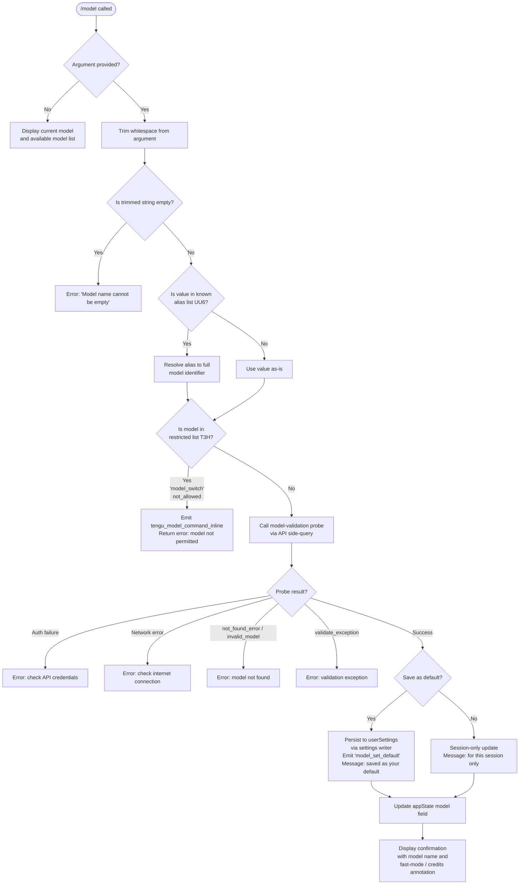

# `/model`

> Analysis basis: CC v2.1.153 bundle.js (AST extraction + Claude interpretation)
> Minimum version: v2.1.153

---

## Overview

The `/model` command allows users to switch the AI model used by Claude Code within an active session or persistently as the new default. It accepts a model name (or alias) as its argument, validates the model against the user's account entitlements, performs a live API probe to confirm the model exists and is accessible, then updates application state and optionally persists the selection to user settings.

---

## Registration

| Field | Value |
|---|---|
| type | `local` |
| name | `model` |
| description | Set the AI model for Claude Code |
| argumentHint | `<model>` |
| supportsNonInteractive | `true` |
| module_id | `Sn1` |
| load_inline | `true` |
| loc_byte | `12343830` |
| loc_byte_end | `12344004` |
| loc_line | `9235` |
| arbor_handler.name | `aL5` |
| arbor_handler.fqn | `claude-2.1.153::aL5` |
| arbor_handler.kind | `AsyncFunction` |
| arbor_handler.resolution_path | `module_id` |
| arbor_handler.n_hits | `0` |

Analysis basis: CC v2.1.153 bundle.js:+12343830

---

## Input Branching

The command has more than three distinct execution paths based on the input argument and account state. A Mermaid flowchart is used below.



Analysis basis: CC v2.1.153 bundle.js:+12335449, +12335465, +12335552, +12335605, +12335672, +12296717, +12296754, +12297453, +12297555, +12297674, +12299177, +12300012

---

## Behavioral Spec

### 1. Handler Entry — `modelCommandHandler` (`aL5`)

The Arbor-resolved handler `aL5` is an `AsyncFunction` reached via `module_id` resolution through module `Sn1`.

```
async function modelCommandHandler(argument, context):
    raw = argument.H.trim()                         // bundle.js:+12335449
    if raw is empty:
        return error("Model name cannot be empty")  // bundle.js:+12296754

    if knownAliasList.includes(raw):                // bundle.js:+12335465
        resolved = resolveAlias(raw)
    else:
        resolved = raw

    appState = context.getAppState()                // bundle.js:+12335488

    if restrictedModelList.includes(resolved):      // bundle.js:+12335552
        emitTelemetry("tengu_model_command_inline") // bundle.js:+12335607
        return error("model_switch / not_allowed")  // bundle.js:+12298515, +12298530

    validationResult = await validateModelViaAPI(   // bundle.js:+12335532
        resolved, appState)

    if validationResult.ok:
        await applyModelSelection(                  // bundle.js:+12335672
            resolved, appState, context)
    else:
        return error(validationResult.message)
```

Analysis basis: CC v2.1.153 bundle.js:+12335449

---

### 2. Alias Resolution — `resolveAlias` (`_f6` / `L1`)

Model aliases map short friendly names to full canonical model strings. Known aliases found in literals:

| Alias | Description / Resolution |
|---|---|
| `sonnet` | Latest Sonnet model (bundle.js:+2187588) |
| `haiku` | Latest Haiku model (bundle.js:+2187627) |
| `opus` | Latest Opus model (bundle.js:+2187666) |
| `best` | Best available model (bundle.js:+2187703) |
| `opusplan` | Opus in plan mode, else Sonnet (bundle.js:+2186105, +2186122) |
| `[1m]` suffix | Extended 1M-context variant (bundle.js:+2187573) |

```
function resolveAlias(alias):
    normalized = alias.trim().toLowerCase()         // bundle.js:+2187451, +2187462
    normalized = applyReplace(normalized)           // bundle.js:+2187490
    candidate  = lookupInAliasTable(normalized)     // bundle.js:+2187526
    if candidate includes plan-mode token:
        return selectOpusPlanOrSonnet(candidate)    // bundle.js:+2186105
    return buildFullModelId(candidate)              // bundle.js:+2187565
```

Analysis basis: CC v2.1.153 bundle.js:+2186162, +2187451

---

### 3. Model List Display — `buildModelList` (`mHA` / `ag`)

When no argument is supplied, or to populate the interactive selector, the handler builds a structured list of available models.

```
function buildModelList(appState):
    rawList  = getAvailableModels()                 // bundle.js:+12298499
    filtered = rawList
        .map(m => m.toLowerCase())                  // bundle.js:+2181617
        .filter(m => m.trim())                      // bundle.js:+2181628
        .filter(m => m.trim())                      // bundle.js:+2181654
        .filter(m => NOT m.startsWith("anthropic.") // bundle.js:+2181693
                     OR NOT m in excludedSet)       // bundle.js:+2181708

    sorted = sortByPreference(filtered)             // bundle.js:+2181737
    padded = filtered.map(m => m.padEnd(40))        // bundle.js:+15412234 (width=40)

    for model in sorted:
        tier  = determineTier(model, appState)      // bundle.js:+2181851
        label = buildLabel(model, tier)             // bundle.js:+2181886
        append(label)
    return sorted
```

Column padding width: 40 characters (bundle.js:+15412234)

Analysis basis: CC v2.1.153 bundle.js:+12298499, +2181540

---

### 4. Account-Tier Filtering (`M0`, `GA`, `Ze`, `zOH`, `CBH`)

Models are filtered and annotated based on account subscription tier. Known tier literals:

| Tier key | Value (bundle.js offset) |
|---|---|
| `max` | bundle.js:+2960105 |
| `team` | bundle.js:+2960176 |
| `default_claude_max_5x` | bundle.js:+2960191 |
| `enterprise` | bundle.js:+2960286 |
| `enterprise_usage_based` | bundle.js:+2960308 |
| `firstParty` | bundle.js:+2186313 |

```
function filterByAccountTier(modelList, accountInfo):
    tier = accountInfo.subscriptionTier
    if tier == "max":
        return filterMax(modelList)             // bundle.js:+2960098
    if tier in ["team", "default_claude_max_5x"]:
        return filterTeam(modelList)            // bundle.js:+2960184
    if tier in ["enterprise", "enterprise_usage_based"]:
        return filterEnterprise(modelList)      // bundle.js:+2960300
    return defaultFilter(modelList)             // bundle.js:+12298475
```

Analysis basis: CC v2.1.153 bundle.js:+2184394

---

### 5. API Validation Probe — `modelValidationProbe` (`LI8` / `ex`)

Before accepting the model, a lightweight API call confirms the model is reachable and authorized for this account.

```
async function modelValidationProbe(modelId, appState):
    if modelId is empty:
        return {ok: false, reason: "Model name cannot be empty"} // bundle.js:+12296754

    modelLower = modelId.toLowerCase()                           // bundle.js:+12296877
    if modelLower in managedAllowlist:                           // bundle.js:+12296896
        skipProbe = true

    if probeCache.has(modelId):                                  // bundle.js:+12296998
        return probeCache.get(modelId)

    request = buildSideQueryRequest(                             // bundle.js:+12297043
        type: "side_query",                                      // bundle.js:+13103592
        model: modelId,
        messages: [{role:"user", content:"Hi"}],                 // bundle.js:+12297162
        max_tokens: 1024,                                        // bundle.js:+13103408
        cache_control: "ephemeral"                               // bundle.js:+12297187
    )

    response = await globalThis.fetch(endpoint, request)         // bundle.js:+13103645

    if response is auth error:
        return {ok:false, reason: "Authentication failed..."}    // bundle.js:+12297453
    if response is network error:
        return {ok:false, reason: "Network error..."}            // bundle.js:+12297555
    if response.error.type == "not_found_error":                 // bundle.js:+12297674
        return {ok:false, reason: "model: " + modelId}          // bundle.js:+12297756
    if response indicates invalid_model:                         // bundle.js:+12299177
        return {ok:false, reason: "invalid_model"}
    if response indicates validate_exception:                    // bundle.js:+12299274
        return {ok:false, reason: "validate_exception"}

    probeCache.set(modelId, {ok:true})                           // bundle.js:+12297206
    return {ok:true}
```

Analysis basis: CC v2.1.153 bundle.js:+12296717, +12297043

---

### 6. Extended-Context (1M) Availability Checks (`OL5`, `zL5`, `$L5`)

Two specific 1M-context variants have explicit availability guards:

**Opus 1M unavailability:**
- Error code: `opus_1m_unavailable` (bundle.js:+12298677)
- Error message references: `"Opus with 1M context is not available for your account. Learn more: https://code.claude.com/docs/en/model-config#extended-context-with-1m"` (bundle.js:+12298715)

**Sonnet 1M unavailability:**
- Triggered for aliases `sonnet[1m]` (bundle.js:+12300550) and `sonnet-4-6[1m]` (bundle.js:+12300576)
- Error code: `sonnet_1m_unavailable` (bundle.js:+12298894)
- Error message references: `"Sonnet 4.6 with 1M context is not available for your account. Learn more: https://code.claude.com/docs/en/model-config#extended-context-with-1m"` (bundle.js:+12298934)

```
function check1MContextAvailability(modelAlias, accountInfo):
    if modelAlias matches opus-1m pattern:
        if NOT accountInfo.hasOpus1MEntitlement:
            return error("opus_1m_unavailable")     // bundle.js:+12298677
    if modelAlias in ["sonnet[1m]", "sonnet-4-6[1m]"]:
        if NOT accountInfo.hasSonnet1MEntitlement:
            return error("sonnet_1m_unavailable")   // bundle.js:+12298894
    return ok
```

Analysis basis: CC v2.1.153 bundle.js:+12298645, +12298862

---

### 7. Model Application & Confirmation — `applyModelSelection` (`pHA`)

Once validated, the handler applies the new model to application state and optionally persists it.

```
async function applyModelSelection(modelId, appState, context):
    // Determine if saving as default (e.g., non-interactive flag or user confirms)
    saveAsDefault = context.shouldPersist

    if saveAsDefault:
        writeSettingToFile(                         // bundle.js:+12300059
            settingsPath,
            key: "model",
            value: modelId
        )
        // Settings file: .claude/settings.json     // bundle.js:+1216444, +1216454
        suffix = " and saved as your default for new sessions"  // bundle.js:+12299654
        emitTelemetry("model_set_default")          // bundle.js:+12300012
    else:
        suffix = " for this session only"           // bundle.js:+12299700

    appState.model = modelId                        // bundle.js:+12335488

    annotation = buildAnnotation(modelId, appState)
    // e.g. " · Fast mode ON"                       // bundle.js:+12299818
    // e.g. " · Draws from usage credits"           // bundle.js:+12299869
    // e.g. " · Fast mode OFF"                      // bundle.js:+12299915

    displayConfirmation(
        bold(modelId) + annotation + suffix         // bundle.js:+12299635
    )

    if managedSettingsActive:
        displayNote("Managed settings")             // bundle.js:+12300221
```

Analysis basis: CC v2.1.153 bundle.js:+12299459, +12299507

---

### 8. Settings Persistence — `settingsWriter` (`g_`)

The settings writer handles multi-layer settings files.

```
function writeModelToSettings(settingsLayer, modelId):
    layers = ["policySettings", "flagSettings",     // bundle.js:+1225290, +1225312
              "userSettings", "projectSettings",    // bundle.js:+1225936, +1226051
              "localSettings"]                      // bundle.js:+1226074
    targetFile = resolveSettingsFile(settingsLayer)
    // Files: settings.json, settings.local.json    // bundle.js:+1216454, +1216516
    content = readFile(targetFile, encoding:"utf-8")// bundle.js:+1225988
    updated = mergeOrSet(content, "model", modelId)
    writeFile(targetFile, updated)
    emitEvent(GpH, "write_ineffective" or "already_tracked"
              or "gitignore_global_rule")           // bundle.js:+1226202, +1226246, +1226343
```

Analysis basis: CC v2.1.153 bundle.js:+1225352

---

### 9. Opus Plan Mode — `opusPlanSelector` (`aD`, `qPH`)

The special `opusplan` alias selects Opus when the session is in plan mode, otherwise Sonnet.

```
function resolveOpusPlanAlias(appState):
    if appState.isInPlanMode:
        candidate = selectOpusVariant(appState)     // checks opus-4-6, opus-4-7
        // opus-4-6: bundle.js:+2174278
        // opus-4-7: bundle.js:+2174332
        if candidate.active:                        // bundle.js:+2174833
            return candidate
    // Fallback: sonnet-4-6                         // bundle.js:+10802197
    return "sonnet-4-6"
```

Analysis basis: CC v2.1.153 bundle.js:+2174202, +2186105, +2186122

---

### 10. API Side-Query Telemetry & Retry (`ex`)

The validation probe uses a side-query mechanism with retry logic.

```
async function sideQueryWithRetry(request):
    startTime = performance.now()                   // bundle.js:+13104635
    attempt = 0
    while attempt < MAX_ATTEMPTS:
        delay = Math.random() * 2 - 1               // bundle.js:+13359476 (value 2), +13359490 (value 1)
        await setTimeout(delay)                     // bundle.js:+13359513
        response = await globalThis.fetch(...)      // bundle.js:+13103645
        if success:
            emitTelemetry("tengu_api_success")      // bundle.js:+13105043
            cacheDuration = "1h"                    // bundle.js:+13104442
            return response
        if featureFlag == "disabled":               // bundle.js:+13104337
            break
        attempt++
    // Token limit: 1024                            // bundle.js:+13103408
    // Max tokens capped: Math.min(..., Math.max(...)) // bundle.js:+13104400, +13105317
```

Analysis basis: CC v2.1.153 bundle.js:+13103560, +13103645

---

## State & Side Effects

| Item | Detail |
|---|---|
| Telemetry: `tengu_model_command_inline` | Fired when a model switch is blocked by the restriction list (bundle.js:+12335607) |
| Telemetry: `tengu_feature_bad` | Fired on feature-flag or capability check failure (bundle.js:+965182) |
| Telemetry: `tengu_api_success` | Fired on successful API validation probe (bundle.js:+13105043) |
| Telemetry: `tengu_feature_ok` | Fired on feature-flag or capability check success (bundle.js:+965124) |
| Telemetry domain: `model_switch / not_allowed` | Emitted internally when restricted model is requested (bundle.js:+12298515, +12298530) |
| Telemetry domain: `model_set_default` | Emitted when model is persisted as default (bundle.js:+12300012) |
| Telemetry domain: `model_validation` | Emitted during model validation flow (bundle.js:+12297093) |
| Telemetry domain: `invalid_model` | Emitted when probe rejects a model name (bundle.js:+12299177) |
| Telemetry domain: `validate_exception` | Emitted on validation exception (bundle.js:+12299274) |
| Telemetry domain: `opus_1m_unavailable` | Emitted when Opus 1M is not entitled (bundle.js:+12298677) |
| Telemetry domain: `sonnet_1m_unavailable` | Emitted when Sonnet 1M is not entitled (bundle.js:+12298894) |
| appState changes | `appState.model` is updated to the validated model string (bundle.js:+12335488) |
| Settings file (user default) | Written to `.claude/settings.json` when save-as-default path is taken (bundle.js:+1216444, +1216454) |
| Settings file (local) | `.claude/settings.local.json` may also be consulted (bundle.js:+1216516) |
| Probe cache | Validation results stored in an in-memory cache (`ul1`) keyed by model id; cache TTL approximately `1h` (bundle.js:+12296998, +12297206, +13104442) |
| API side-query | A minimal `Hi` message is sent with `max_tokens: 1024` and `cache_control: ephemeral` to probe model availability (bundle.js:+12297128, +12297162, +12297187, +13103408) |
| Sound | <!-- TODO: not found in depth-2 traversal; needs --depth 4 --> |
| Hook registration | <!-- TODO: not found in depth-2 traversal; needs --depth 4 --> |

---

## Version History

| Version | Change |
|---|---|
| v2.1.153 | Initial analysis |

---

## Common Mistakes

1. **Using a bare model name not in the alias list and not a full Anthropic model ID** — The validation probe will return `not_found_error` or `invalid_model`. Always use a full model identifier (e.g., a versioned `claude-*` string) or a supported alias (`sonnet`, `haiku`, `opus`, `best`, `opusplan`).

2. **Expecting the new model to persist across sessions without a confirmation** — The command applies the model for the current session only unless the save-as-default path is taken. In non-interactive mode (`supportsNonInteractive: true`) the persistence behavior may differ from interactive mode.

3. **Requesting a 1M-context model on an account without the entitlement** — Both `opus[1m]` and `sonnet[1m]` / `sonnet-4-6[1m]` have explicit entitlement guards. The error message includes a documentation URL; the user must upgrade or check account settings.

4. **Passing an empty string or whitespace-only argument** — The handler trims the argument before checking for emptiness, so a blank argument always returns the error `"Model name cannot be empty"` rather than falling through to alias resolution.

5. **Assuming a model switch succeeds silently when the model is in the restricted list** — The restriction check runs before the API probe. A blocked model emits `tengu_model_command_inline` telemetry and returns an error without making any network call.

6. **Editing `settings.local.json` manually expecting it to override policy settings** — The settings layer hierarchy (`policySettings` → `flagSettings` → `userSettings` → `projectSettings` → `localSettings`) means managed/policy settings take precedence. A "Managed settings" notice is shown when the effective value is locked by a higher layer.

---

## Appendix — Identifier Mapping

> For bundle debugging only. Identifiers change across versions.

| Identifier | Role |
|---|---|
| `aL5` | Main model command handler (`AsyncFunction`); Arbor-resolved entry point |
| `H` | Input argument object / string holder; carries `.trim()` and `Math.random` / `setTimeout` at depth 2 |
| `_` | AppState accessor / general utility reference |
| `fI8` | Intermediate dispatcher calling `Bh` and returning appState |
| `Bh` | Model-state bridge; calls `_f6` and `M0` |
| `_f6` | Alias table lookup; calls `TY` and `L1` |
| `TY` | Alias table builder (`OOH`) |
| `L1` | Model ID normalizer (trim, toLowerCase, replace, alias resolution steps) |
| `M0` | Account/tier model-list factory; calls `GA`, `Ze`, `zOH`, `CBH`, `TZ`, `EP`, `m3`, `IA`, `$3`, `WN` |
| `GA` | First-party tier model builder; calls `Hw`, `yb`, `dq` |
| `Ze` | Max-tier filter; calls `A1` |
| `zOH` | Team-tier filter; calls `A1`, `PQ`; associated with `default_claude_max_5x` |
| `CBH` | Enterprise-tier filter; calls `A1`, `ZIq`; associated with `enterprise_usage_based` |
| `TZ` | Shared model-set constructor; calls `m3`, `$3` |
| `EP` | Extended plan model builder; calls `E1H`, `V1H`, `IA`, `GA`, `A1` |
| `m3` | Provider type discriminator (anthropicAws, gateway); calls `IA` |
| `IA` | Backend type resolver (bedrock, foundry, mantle, vertex); calls `xH` |
| `$3` | Model set finalizer; calls `$xH`, `Ih4`, `tqq`, `_i6`, `IA` |
| `WN` | Weighted model selector; calls `m3`, `$3` |
| `c` | Feature-flag / capability checker |
| `ml1` | Model-list orchestrator; calls `mHA` and `pHA` |
| `mHA` | Main model availability engine; calls `ag`, `uH`, `OL5`, `zL5`, `$L5`, `LI8`, `EH` |
| `ag` | Model list builder and formatter; maps, trims, filters, sorts models |
| `A` | Model name array / string helper (toLowerCase, map) |
| `f` | Cache/store accessor (get, values); fetches model metadata |
| `K` | Display formatter (map, padEnd); pads model names to width 40 |
| `q` | Model exclusion/include list; also calls `VTK.unlinkSync` at depth 2 |
| `Ai6` | Model attribute extractor; calls `o_`, `Object.entries` |
| `hBH` | Model access-flag checker; calls `Ab4.includes` |
| `q3q` | Model sort-index finder; calls `hBH`, `A.indexOf` |
| `qb4` | Model label builder; calls `H.includes`, `G1H`, `L1` |
| `G1H` | Display-group classifier; calls `W1H.includes` |
| `Kb4` | Extended model label builder; calls `G1H`, `L1`, `A3q`, `_.startsWith` |
| `uH` | Feature-flag gate for model list; calls `c` |
| `OL5` | Opus-1M availability checker; calls `H.toLowerCase`, `X8H`, `EP`, `_.includes` |
| `X8H` | Model capability lookup; calls `E1H`, `GA`, `gI9` |
| `zL5` | Sonnet-1M availability checker; calls `H.toLowerCase`, `Q7H`, `_.includes` |
| `Q7H` | Model capability lookup (Sonnet path); calls `E1H`, `GA`, `gI9` |
| `$L5` | Basic model allowlist checker; calls `W1H.includes`, `H.toLowerCase` |
| `LI8` | Model validation probe orchestrator; calls `ag`, `ex`, `ML5`; manages cache `ul1` |
| `ex` | API side-query executor; calls `globalThis.fetch`, handles retry and telemetry |
| `ML5` | Probe response parser; calls `fL5`, `String` |
| `EH` | Error message stringifier; calls `String` |
| `pHA` | Model selection application handler; calls `hI6`, `SH`, `Bh`, `yK`, `fOH`, `aD`, `qPH`, `EP`, `UHA` |
| `hI6` | Default-model persistence helper; calls `g_`, `SH` |
| `g_` | Settings file writer; reads/writes `.claude/settings.json` and `settings.local.json` |
| `SH` | Display output helper; calls `c` |
| `yK` | Model display name formatter; calls `IA`, `xH` |
| `xH` | String coercion utility; calls `String` |
| `fOH` | Fast-mode annotation builder |
| `aD` | Opus-plan mode resolver; calls `yK`, `M0`, `L1`, `Wi`, `q.includes` |
| `Wi` | Model version comparator; calls `xH` |
| `qPH` | Credits/tier annotation builder; calls `GA`, `L1`, `qX`, `q.includes`, `Wi`, `f0` |
| `qX` | Model-tier cross-checker; calls `L1`, `M0` |
| `f0` | Additional model attribute resolver; calls `E1H` |
| `UHA` | Confirmation display builder; calls `SGH`, `S8`, `Tb`, `j6.dim`, `j6.bold`, `Gi` |
| `SGH` | Managed-settings notice builder; calls `uk`, `S8` |
| `S8` | Settings path resolver; calls `RF6`, `Ng` |
| `Tb` | Path join helper; calls `fN.join` |
| `Gi` | Model display decorator; calls `G1H`, `TY`, `L1` |

---

Note: index built via Arbor fallback; some signals (telemetry, literals) may be missing — see arbor-fallback.js.