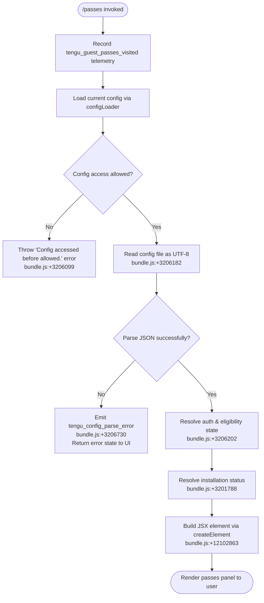

# `/passes`

> Analysis basis: CC v2.1.153 bundle.js (AST extraction + Claude interpretation)
> Minimum version: v2.1.153

---

## Overview

`/passes` is a local-JSX command that presents the user with a UI panel for sharing a free week of Claude Code with friends (a "guest pass" flow). On invocation it records a telemetry visit event, resolves the current authenticated state via the config system, and then renders a React element containing the passes UI. It does not send a prompt to the AI agent; all logic is handled inline as a JSX-rendering handler.

---

## Registration

| Field | Value |
|---|---|
| type | `local-jsx` |
| name | `passes` |
| description | Share a free week of Claude Code with friends |
| loc_byte | `12102991` |
| loc_byte_end | `12103313` |
| loc_line | `8986` |
| isHidden | `null` (not hidden) |
| module_id | `gg1` |
| load_inline | `true` |
| arbor_handler.name | `TK5` |
| arbor_handler.fqn | `claude-2.1.153::TK5` |
| arbor_handler.kind | `AsyncFunction` |
| arbor_handler.resolution_path | `module_id` |
| arbor_handler.n_hits | `2` |

Analysis basis: CC v2.1.153 bundle.js:+12102991

---

## Input Branching

The command has three meaningful paths based on what the handler discovers at invocation time: (1) the handler fires, records telemetry, and succeeds in rendering a passes panel; (2) configuration access fails or is not yet allowed; (3) the config read succeeds but auth/state signals indicate an ineligible session. Three distinct branches → Mermaid flowchart required.



---

## Behavioral Spec

### Top-Level Handler (`TK5` — passesCommandHandler)

```
async function passesCommandHandler(context):
    emit telemetry("tengu_guest_passes_visited")      // bundle.js:+12102814

    authState   = await resolveAuthAndSession(context)  // calls bv8 → d7 → Hw
    configStore = await loadConfigStore(context)         // calls K8 → pO_ → EzH

    passesElement = createElement(PassesPanel, {
        authState,
        configStore
    })                                                   // bundle.js:+12102863

    return passesElement
```

Analysis basis: CC v2.1.153 bundle.js:+12102674, +12102708, +12102714, +12102812, +12102863

---

### Config Loading and Locking (`K8` — configStoreLoader, `pO_` — saveConfigWithLock)

```
async function configStoreLoader(context):
    homedir       = path.dirname(configPath)             // bundle.js:+3201149
    fs.mkdirSync(homedir, {recursive: true})             // bundle.js:+3203882

    lockResult = acquireConfigLock()                     // uses r3q / x9_
    if lockResult.contentionDetected:
        emit telemetry("tengu_config_lock_contention")   // bundle.js:+3204155
        log warning("Lock acquisition took longer than expected…") // bundle.js:+3204066

    rawConfig  = fs.statSync(configPath)                 // bundle.js:+3204231
    configData = parseAndNormalizeConfig(rawConfig)

    if staleWriteDetected:
        emit telemetry("tengu_config_stale_write")       // bundle.js:+3204291

    if authLossPrevented:
        emit telemetry("tengu_config_auth_loss_prevented") // bundle.js:+3204634
        log warning("saveConfigWithLock: re-read config is missing auth…") // bundle.js:+3204482

    backupCount = listBackups(configDir)                  // bundle.js:+3204751
    if backupCount > 5:                                   // bundle.js:+3205085
        pruneOldestBackup()                               // uses L.unlinkSync, bundle.js:+3205203

    return configData
```

Analysis basis: CC v2.1.153 bundle.js:+3201149, +3203882, +3204066, +3204155, +3204231, +3204482, +3204634, +3205085, +3205203

---

### Config File Reader (`EzH` — configFileReader)

```
function configFileReader(configPath):
    if not configAccessAllowed():
        throw new Error("Config accessed before allowed.")  // bundle.js:+3206099

    rawText = fs.readFileSync(configPath, "utf-8")          // bundle.js:+3206155, +3206182

    try:
        parsed = JSON.parse(rawText)                         // bundle.js:+183848 (via U6)
    catch parseError:
        emit telemetry("tengu_config_parse_error")           // bundle.js:+3206730
        log("error", parseError)                             // bundle.js:+3206650
        return defaultConfig

    normalized = normalizeApiKeyPrefix(parsed)               // calls Pb; strips prefix via .slice()
    // bundle.js:+3206205, +1094026, +1094049

    if parsed.code === "ENOENT":                             // bundle.js:+3206329
        return defaultConfig

    fileStats = fs.statSync(configPath)                      // bundle.js:+3206690
    backupDir = path.join(configDir, "backups")              // bundle.js:+3205667
    fs.mkdirSync(backupDir, {recursive: true})               // bundle.js:+3206909

    backupEntries = fs.readdirStringSync(backupDir)          // bundle.js:+3206967
    if entry.startsWith(".backup."):                         // bundle.js:+3207002 (via w.startsWith)
        // skip or process legacy backup

    destPath = path.join(backupDir, path.basename(configPath)) + "." + Date.now()
    // bundle.js:+3207121, +3207220
    fs.copyFileSync(configPath, destPath)                    // bundle.js:+3207238

    return parsed
```

Analysis basis: CC v2.1.153 bundle.js:+3206093, +3206099, +3206155, +3206182, +3206202, +3206329, +3206690, +3206730, +3206909, +3206967, +3207121, +3207220, +3207238

---

### Auth / Session Resolution (`bv8` / `d7` / `Hw` — authSessionResolver)

```
async function authSessionResolver(context):
    // Hw resolves auth source
    authSource = resolveAuthSource(context)              // bundle.js:+2959631

    if authSource is "firstParty":                       // bundle.js:+2042717
        credentialKind = "ANTHROPIC_API_KEY"             // bundle.js:+2942830
    else if authSource is "apiKeyHelper":                // bundle.js:+2942924
        credentialKind = "apiKeyHelper"
    else if credentialKind is "none":                    // bundle.js:+2942963
        throw new Error("ANTHROPIC_API_KEY, CLAUDE_CODE_OAUTH_TOKEN, or WIF env vars … required")
        // bundle.js:+2943258

    sessionInfo = buildSessionInfo(credentialKind)       // calls RP → Oi6, UK, GgH, Pi, IN, xH
    return sessionInfo
```

Analysis basis: CC v2.1.153 bundle.js:+2940811, +2940909, +2941016, +2942830, +2942924, +2942963, +2943258, +2959631

---

### Installation Status Resolution (`K8` — installationStatusMapper)

The handler maps installation status to one of several typed string constants:

| Status Token | Meaning |
|---|---|
| `"unknown"` | Status not yet determined (bundle.js:+3201809) |
| `"local"` | Local install (bundle.js:+3201884) |
| `"migrated"` | Previously migrated install (bundle.js:+3201871) |
| `"native"` | Native package install (bundle.js:+3201916) |
| `"installed"` | Generic installed state (bundle.js:+3201902) |
| `"disabled"` | Feature disabled (bundle.js:+3201935) |
| `"enabled"` | Feature enabled (bundle.js:+3201961) |
| `"no_permissions"` | Insufficient permissions (bundle.js:+3201975) |
| `"not_configured"` | Not yet configured (bundle.js:+3201996) |
| `"global"` | Global config scope (bundle.js:+3202015) |

Analysis basis: CC v2.1.153 bundle.js:+3201788–3202015

---

### File-Watching / Config Change Detection (`jq7` — configFileWatcher)

```
function configFileWatcher(configPath, onChange):
    cG = getConfigVersion()                              // bundle.js:+3202482
    fs.watchFile(configPath, callback)                   // bundle.js:+3202487

    callback(curr, prev):
        if curr.mtime !== prev.mtime:                    // "mtime changed" bundle.js:+15405581
            newData = reloadConfig()                     // calls Pb, CO_, si
            H9.register(newData)                         // bundle.js:+3202804, +58450

    onDispose:
        fs.unwatchFile(configPath)                       // bundle.js:+3202817
```

Analysis basis: CC v2.1.153 bundle.js:+3202482, +3202487, +3202569, +3202804, +3202817

---

### Backup Pruning (`UUq` — backupPruner)

```
function backupPruner(configDir):
    backupDir = buildBackupDir(configDir)                // calls UO_ → path.join + d8
    entries   = fs.readdirStringSync(backupDir)          // bundle.js:+3205740

    for entry in entries:
        if entry.startsWith(".backup."):                 // bundle.js:+3205775
            fullPath = path.join(backupDir, entry)       // bundle.js:+3205831
            parentDir = path.dirname(fullPath)           // bundle.js:+3205857
            stats = fs.statSync(fullPath)                // bundle.js:+3206016
            // collect for pruning comparison

    sorted = sortByMtime(entries)
    while sorted.length > MAX_BACKUPS:                   // MAX_BACKUPS = 5, bundle.js:+3205085
        oldest = sorted.shift()
        fs.unlinkSync(oldest)                            // bundle.js:+3205203 (via L.unlinkSync)
```

Analysis basis: CC v2.1.153 bundle.js:+3205700, +3205707, +3205724, +3205740, +3205775, +3205831, +3205857, +3206016

---

### Atomic Config Write (`c76` — atomicConfigWriter)

```
function atomicConfigWriter(configPath, data):
    if fs.lstatSync(configPath).isSymbolicLink():        // bundle.js:+1010848, +1010866
        target = fs.readlinkSync(configPath)             // bundle.js:+1010451
        resolved = path.isAbsolute(target)
            ? target
            : path.resolve(path.dirname(configPath), target)  // bundle.js:+1010471, +1010501

    randomSuffix = crypto.randomBytes(6).toString("hex") // bundle.js:+1011080, +1011096, +1011108
    tempPath = configPath + "." + randomSuffix

    fd = fs.openSync(tempPath, flags)                    // bundle.js:+1010610
    try:
        fs.writeFileSync(fd, JSON.stringify(data))       // bundle.js:+1011516
        originalMode = fs.statSync(configPath).mode      // bundle.js:+1011145
        fs.fchmodSync(fd, originalMode)                  // bundle.js:+1011574
        // log: "Applied original permissions to temp file"  // bundle.js:+1011595
        fs.fsyncSync(fd)                                 // bundle.js:+1011640
    finally:
        fs.closeSync(fd)                                 // bundle.js:+1010597

    fs.renameSync(tempPath, configPath)                  // bundle.js:+1011768
    // on failure:
    //   fs.unlinkSync(tempPath)                         // bundle.js:+1011925
```

Analysis basis: CC v2.1.153 bundle.js:+1010451, +1010471, +1010597, +1010610, +1010848, +1010866, +1011080, +1011108, +1011516, +1011574, +1011595, +1011640, +1011768, +1011925

---

## State & Side Effects

| Item | Detail |
|---|---|
| Telemetry | `tengu_guest_passes_visited` (bundle.js:+12102814) — fired on every `/passes` invocation |
| Telemetry | `tengu_config_parse_error` (bundle.js:+3206730) — config JSON failed to parse |
| Telemetry | `tengu_config_lock_contention` (bundle.js:+3204155) — lock acquisition slow |
| Telemetry | `tengu_config_stale_write` (bundle.js:+3204291) — stale write detected |
| Telemetry | `tengu_config_auth_loss_prevented` (bundle.js:+3204634) — refused write to avoid losing auth |
| Telemetry | `tengu_feature_ok` (bundle.js:+965124) — feature flag check passed |
| Telemetry | `tengu_feature_bad` (bundle.js:+965182) — feature flag check failed |
| Telemetry | `tengu_bg_*` events (bundle.js:+15386200, +15386779, +15387474, +15387595, +15385893, +15387858) — background session lifecycle, fired indirectly through shared session infrastructure |
| File I/O | Reads `~/.claude.json` (UTF-8) on every invocation; creates `backups/` subdirectory; copies config snapshot with `Date.now()` suffix |
| Config backup | Keeps at most 5 backup files (bundle.js:+3205085); oldest pruned via `unlinkSync` |
| Atomic write | Config written via temp file + `fsync` + `rename` pattern to prevent corruption |
| File watch | `fs.watchFile` registered on config path during handler lifetime; unwatched on dispose (bundle.js:+3202487, +3202817) |
| appState changes | Renders a JSX `PassesPanel` element into the CLI UI; no direct appState mutation observed at depth ≤ 2 |
| Sound | None observed |
| Hook registration | `H9.register` called when config file mtime changes (bundle.js:+3202804, +58450) |

---

## Version History

| Version | Change |
|---|---|
| v2.1.153 | Initial analysis |

---

## Common Mistakes

1. **Invoking `/passes` before authentication is configured** — the handler calls `configFileReader` which throws `"Config accessed before allowed."` (bundle.js:+3206099) if the config subsystem has not been initialized; ensure Claude Code has completed its initial auth flow first.
2. **Expecting the AI agent to respond** — `/passes` is a `local-jsx` command; it renders a React panel directly and never sends a prompt to the model. No AI-generated text will appear.
3. **Assuming instant eligibility after account creation** — the handler reads the live `~/.claude.json` state, so guest-pass eligibility reflects the server-side grant state at the time of invocation; retrying immediately after signup may still show an ineligible state until the config is refreshed.
4. **Confusing backup accumulation** — the command prunes backups to a maximum of 5 entries (bundle.js:+3205085); do not manually add files to `~/.claude/backups/` with a `.backup.` prefix as they will be subject to the same pruning logic.
5. **Running in a locked config environment** — if another Claude Code instance holds the config lock, `/passes` will log a contention warning and emit `tengu_config_lock_contention` but will still proceed; two simultaneous invocations may race on the backup copy step.

---

## Appendix — Identifier Mapping

> For bundle debugging only. Identifiers change across versions.

| Identifier | Role |
|---|---|
| `TK5` | Top-level passes command handler (AsyncFunction; `arbor_handler`) |
| `b6` | Config read/watch orchestrator |
| `B6` | Config base-path resolver |
| `CO_` | Config observer / subscriber |
| `EzH` | Config file reader (reads, parses, backs up config JSON) |
| `U6` | JSON parse wrapper |
| `Pb` | API-key prefix normalizer (startsWith / slice) |
| `H` | Random/timer utility (Math.random, setTimeout) |
| `_` | Filesystem abstraction (readdirStringSync, statSync) |
| `J8` | Logger / journal utility |
| `UUq` | Backup pruner |
| `UO_` | Backup directory path builder (path.join + d8) |
| `f` | Feature-flag checker (YSH, EWK, L.get, N, L.values, $, Qb5) |
| `$` | Config map / registry (startsWith, Ar1) |
| `N` | HTTP/API request builder (C16, chK, RH, j4, GS, ixH, ihK) |
| `chK` | Request header assembler (Ek, dhK, L3A) |
| `RH` | JSON serializer (JSON.stringify) |
| `j4` | URL/path formatter (pOA, H.replace, q.at, A.lastIndexOf, A.slice) |
| `ixH` | Network error normalizer (NOA) |
| `ihK` | Config upload handler (GxH, xfH, $0H.dirname, Ek, B6, E16, lOA, cOA, Buffer.byteLength, iOA, Vb6.then, nhK.bind, H9) |
| `c` | Generic utility / helper |
| `w` | Background subprocess / daemon manager (A.get, R.kill, setTimeout, H, uH, SH, ELA.freemem, wk8, TD6, yH, B, T6, jLA, ZLA, L, D, J8, S.dispose, MF.spawn) |
| `A` | Process map (M.toLowerCase, set, values) |
| `R` | Child process wrapper (tTK, Wz, N, yH, Cm5, z.write) |
| `uH` | Feature-bad reporter (c) |
| `SH` | Feature-ok reporter (c) |
| `wk8` | Low-memory threshold checker (n6, T6) |
| `TD6` | Session roster file reader (BP.readFile, iJ_, U6, Array.isArray, _.filter, X8, Nj7) |
| `yH` | Error logger (l_, xH, _1, GH4, mmH.push, an.logError) |
| `B` | Background session retired-session filter (UH.filter, QH.has) |
| `T6` | Session state machine (Dz6, wz6, wHH, WzH.has, O88, zz6.add, vQ.has, vQ.get, b6) |
| `jLA` | Background session connector (MF.claim, iAA, Lm5, Km5, c, b$, EH, N, nC8.connect, M.on, M.once, M.write, RB, M.end) |
| `ZLA` | Background session lifecycle manager (q.add, M.finally, q.delete, K, bK, L, pY.rm, yH, o9, _j, i5, p66, n6, pY.unlink, x5H, Ch, UB, tv6, _.rosterEntry, A, setTimeout, Y.get, Y.delete, H.delete) |
| `L` | Session cleanup helper (q.add, M.finally, q.delete) |
| `D` | Background session loop / daemon respawn (T6, $.dispose, wk8, ELA.freemem, n6, wLA, Date.now, c, Wz, N, J8, yH) |
| `S` | Disposable session resource |
| `jq7` | Config file watcher (cG, T88.watchFile, B6, v9, Pb, CO_, si, H9, T88.unwatchFile) |
| `si` | Config change subscriber |
| `H9` | Hook/event registrar (q3A.register) |
| `bv8` | Auth pre-loader (d7, b6) |
| `d7` | Session bootstrapper (Hw, b6) |
| `Hw` | Auth source resolver (UK, RP, FO, TA, cJ, m$, JO6, GgH) |
| `UK` | Credential reader (xH) |
| `RP` | Auth provider dispatcher (Oi6, UK, GgH, Pi, IN, xH) |
| `FO` | First-party auth handler (IA) |
| `cJ` | OAuth token helper |
| `m$` | Auth orchestrator (UK, IN, wO6, cJ, DxH, xH, yM6, RP, Error, b6, lS, TgH) |
| `JO6` | Auth fallback handler (GgH) |
| `GgH` | Credential builder (xH, D3H) |
| `K8` | Config store loader / installation status mapper (pO_, cG, H, fQH, pUq, $QH, N, EzH, Wz6, c, mO_) |
| `pO_` | Save-config-with-lock implementation (_, AD.dirname, B6, L.mkdirSync, Date.now, r3q, N, c, cG, L.statSync, J8, EzH, Wz6, A, TG, RH, AD.basename, UO_, L.readdirStringSync, V.startsWith, Number, P.split, Number.isNaN, AD.join, L.copyFileSync, E.slice, L.unlinkSync, c76, M) |
| `r3q` | Lock acquisition wrapper (x9_, Object.assign) |
| `x9_` | Lock primitive (i3q) |
| `Wz6` | Config version comparator |
| `V` | Config path string (startsWith) |
| `P` | MCP connection manager (mC8, Vh, Uu, Promise.all, LAH, yd, yH, l_) |
| `mC8` | MCP transport factory |
| `l_` | Error coercer (Error, String) |
| `E` | Config entries array (slice) |
| `c76` | Atomic file writer (B6, q.readlinkSync, Q5.isAbsolute, Q5.resolve, Q5.dirname, N, Nf.closeSync, Nf.openSync, J8, q.lstatSync, O.isSymbolicLink, X8, Zn8.randomBytes, q.statSync, M.toString, Nf.writeFileSync, Nf.fchmodSync, Nf.fsyncSync, q.renameSync, q.unlinkSync) |
| `O` | Filesystem stat result wrapper (N8) |
| `X8` | Error code extractor (J8) |
| `M` | Socket/stream handle (A.close, q.close, L) |
| `fQH` | Config feature-flag reader |
| `pUq` | Config entries iterator (Object.entries) |
| `$QH` | Config timestamp checker (Date.now) |
| `mO_` | Global config save fallback (AD.dirname, B6, TG, RH, c76) |

---

Note: index built via Arbor fallback; some signals (telemetry, literals) may be missing — see arbor-fallback.js.