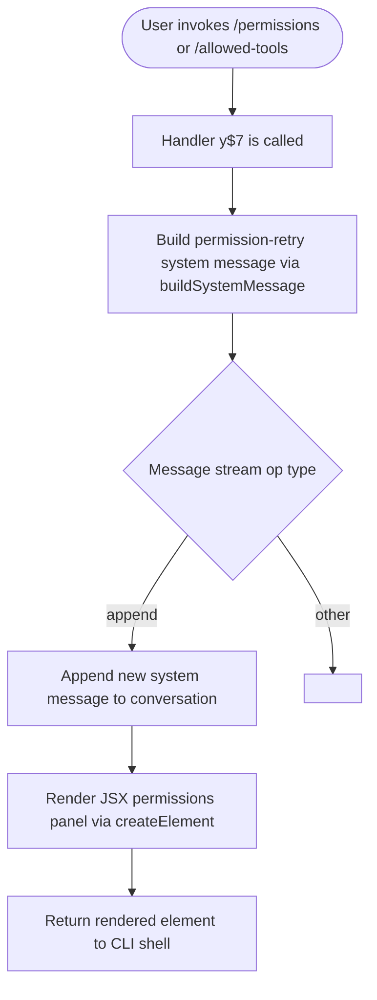

# `/permissions`

> Analysis basis: CC v2.1.132 bundle.js (AST extraction + Claude interpretation)
> Minimum version: v2.1.132

---

## Overview

The `/permissions` command (also accessible as `/allowed-tools`) provides an interactive JSX-rendered interface for managing the allow and deny lists that govern which tools Claude Code may invoke during a session. It is implemented as a `local-jsx` type command, meaning it returns a rendered React element rather than plain text, and it injects a synthetic system message carrying permission-retry context into the conversation message stream.

---

## Registration

| Field | Value |
|---|---|
| type | `local-jsx` |
| name | `permissions` |
| aliases | `allowed-tools` |
| description | `Manage allow & deny tool permission rules` |
| module_id | `x5q` |
| load_inline | `true` |
| handler | `y$7` (AsyncFunction, resolved via `module_id` path) |
| loc_byte span | `11101871` – `11102041` |
| `loc_byte_end` | `11102041` |
| `arbor_handler.name` | `y$7` |
| `arbor_handler.kind` | `AsyncFunction` |
| `arbor_handler.resolution_path` | `module_id` |
| `arbor_handler.fqn` | `claude-2.1.132::y$7` |
| `arbor_handler.n_hits` | `0` |

Analysis basis: CC v2.1.132 bundle.js:+11101871

---

## Input Branching

The command takes no structured sub-command arguments at the registration level; all branching is determined inside the handler at runtime based on conversation state and the message-op type.



Analysis basis: CC v2.1.132 bundle.js:+11101689, +11101742, +11101765

---

## Behavioral Spec

### Handler Entry Point

The async handler `y$7` is the sole entry point for this command, resolved through the `module_id` path (`x5q`). It is an `AsyncFunction`.

```
async function permissionsCommandHandler(context):
    // 1. Build a system message describing permission-retry state
    systemMsg = buildPermissionRetryMessage(context)

    // 2. Inject the message into the conversation stream
    applyMessageOperation(stream, op="append", message=systemMsg)

    // 3. Construct and return the JSX permissions management panel
    element = createElement(PermissionsPanel, props)
    return element
```

Analysis basis: CC v2.1.132 bundle.js:+11101689, +11101742, +11101765, +11101784

---

### System Message Construction (`buildPermissionRetryMessage`)

This helper (minified identifier `mi9`) constructs a synthetic conversation message of role `"system"` with subtype `"permission_retry"`. It generates a fresh UUID as the message ID and joins any listed tool names or permission entries into a comma-separated string.

```
function buildPermissionRetryMessage(permissionEntries):
    id = crypto.randomUUID()          // unique message identity
    joined = permissionEntries.join(", ")   // comma-space separated list

    message = {
        role:    "system",
        subtype: "permission_retry",
        id:      id,
        content: joined,
        level:   "info"
    }
    return message
```

Key string constants used:

| Constant | Purpose | loc_byte |
|---|---|---|
| `"system"` | Message role | +9734720 |
| `"permission_retry"` | Message subtype | +9734737 |
| `", "` | Join separator for permission entries | +9734782 |
| `"info"` | Message severity level | +9734807 |
| `"append"` | Message stream operation | +11101765 |

Analysis basis: CC v2.1.132 bundle.js:+9734720, +9734737, +9734775, +9734782, +9734807, +9734864

---

### Message Stream Operation

After building the system message, the handler calls `applyMessageOp` (via the `A` module) with operation type `"append"`, inserting the constructed system message at the tail of the current conversation message list rather than replacing any existing message.

```
function applyMessageOperation(messageStream, op, message):
    if op == "append":
        messageStream.push(message)
    // other ops: <!-- TODO: not found in depth-2 traversal; needs --depth 4 -->
```

Analysis basis: CC v2.1.132 bundle.js:+11101742, +11101765

---

### JSX Rendering

The handler calls `createElement` (via `BhA.createElement`) to instantiate the permissions management UI panel. Because the command type is `local-jsx`, the returned element is handed directly to the CLI shell's rendering layer rather than being serialized as text.

```
function renderPermissionsPanel(props):
    return createElement(PermissionsPanel, props)
    // PermissionsPanel: interactive allow/deny rule manager
```

Analysis basis: CC v2.1.132 bundle.js:+11101689

---

### UUID Generation Helper (`H`)

The `H` identifier is a utility reachable from `buildPermissionRetryMessage` that provides randomness support. It calls `Math.random` with a numeric constant `2` and schedules deferred work via `setTimeout` with a constant of `1`. This pattern is consistent with a lightweight UUID/nonce generation or entropy-seeding helper used as a fallback alongside `crypto.randomUUID`.

```
function entropyHelper():
    value = Math.random() * 2     // random float in [0, 2)
    setTimeout(callback, 1)       // deferred micro-task, 1 ms delay
```

Numeric constants:

| Value | loc_byte | Likely role |
|---|---|---|
| `2` | +12264283 | `Math.random` multiplier or bit-width factor |
| `1` | +12264299 | `setTimeout` delay in milliseconds |

Analysis basis: CC v2.1.132 bundle.js:+12264283, +12264285, +12264299, +12264322

---

## State & Side Effects

| Item | Detail |
|---|---|
| Telemetry | None detected in depth-2 traversal (telemetry array is empty) |
| Message stream mutation | Appends a new `system` / `permission_retry` message to the active conversation via `"append"` op (bundle.js:+11101742, +11101765) |
| UUID generation | Calls `crypto.randomUUID()` per invocation to assign a unique ID to the injected system message (bundle.js:+9734864) |
| JSX element returned | A `local-jsx` element (permissions management panel) is returned to the shell renderer (bundle.js:+11101689) |
| Hook registration | <!-- TODO: not found in depth-2 traversal; needs --depth 4 --> |
| appState changes | <!-- TODO: not found in depth-2 traversal; needs --depth 4 --> |
| Sound | <!-- TODO: not found in depth-2 traversal; needs --depth 4 --> |

---

## Version History

| Version | Change |
|---|---|
| v2.1.132 | Initial analysis — `local-jsx` handler `y$7`, alias `allowed-tools`, `permission_retry` system message injection, JSX permissions panel rendering |

---

## Common Mistakes

1. **Invoking via alias confusion** — The command is registered under both `/permissions` and `/allowed-tools`. Both aliases trigger the same handler (`y$7`); there is no behavioral difference between them.
2. **Expecting plain-text output** — Because the type is `local-jsx`, the command renders a React element. Piping or scripting against its output as if it were text will not work as expected.
3. **Assuming telemetry is emitted** — No `tengu_*` telemetry events were found in the depth-2 traversal. Do not rely on telemetry hooks to observe permission changes triggered by this command.
4. **Treating the injected message as user-visible** — The `permission_retry` system message appended to the stream has role `"system"` and level `"info"`; it is not rendered as a normal chat turn and is not directly visible to the user in the conversation history.
5. **Confusing the entropy helper `H` with UUID generation** — `crypto.randomUUID()` (via `SG.randomUUID`) is the primary message-ID generator. The `H` helper using `Math.random` + `setTimeout` is an auxiliary entropy/scheduling utility, not the canonical UUID source.

---

## Appendix — Identifier Mapping

> For bundle debugging only. Identifiers change across versions.

| Identifier | Role |
|---|---|
| `y$7` | Main async handler for `/permissions` command (AsyncFunction, resolved via `module_id` `x5q`) |
| `mi9` | System message builder — constructs the `permission_retry` message object with UUID and joined content |
| `A` | Message-stream module — exposes `applyMessageOp` used to append the system message |
| `H` | Entropy / scheduling helper — calls `Math.random` and `setTimeout`; reachable from `mi9` |