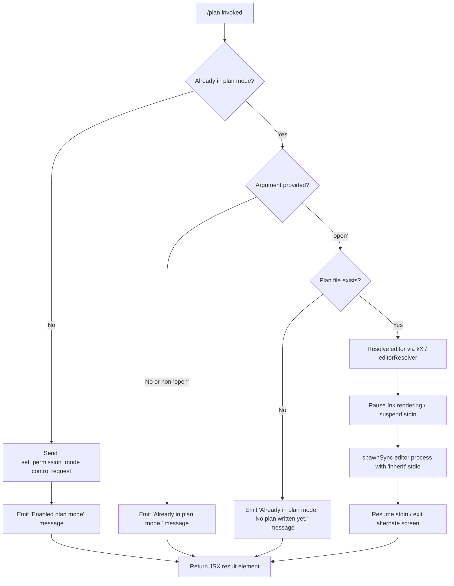

# `/plan`

> Analysis basis: CC v2.1.152 bundle.js (AST extraction + Claude interpretation)
> Minimum version: v2.1.152

---

## Overview

The `/plan` command enables **plan mode** for the current Claude Code session, or opens an existing session plan for viewing/editing in an external editor. When the session is already in plan mode, the command provides feedback about the current state and optionally launches the plan document in the configured editor via `open`. The command operates by sending a `set_permission_mode` control request and managing plan file I/O through async file-system helpers.

---

## Registration

| Field | Value |
|---|---|
| type | `local-jsx` |
| name | `plan` |
| description | `Enable plan mode or view the current session plan` |
| argumentHint | `[open\|<description>]` |
| module_id | `_F1` |
| load_inline | `true` |
| loc_byte | `12109412` |
| loc_byte_end | `12109611` |
| loc_line | `10050` |
| arbor_handler.name | `K95` |
| arbor_handler.fqn | `claude-2.1.152::K95` |
| arbor_handler.kind | `AsyncFunction` |
| arbor_handler.resolution_path | `module_id` |
| arbor_handler.n_hits | `0` |

Analysis basis: CC v2.1.152 bundle.js:+12109412

---

## Input Branching

The handler exhibits four distinct paths based on the current mode state and the argument provided, so a Mermaid flowchart is used.



Analysis basis: CC v2.1.152 bundle.js:+12108494, +12108562, +12108590, +12108811, +12108970

---

## Behavioral Spec

### 1. Handler Entry — `planCommandHandler` (`K95`)

```
async function planCommandHandler(args, appState):
    sessionMode   = getCurrentMode(appState)        // via os / modeReader
    permMode      = getPermissionMode(appState)      // via MyH / permissionModeReader
    trimmedArg    = args.trim()                      // bundle.js:+12108792

    if sessionMode != "plan":
        sendControlRequest("set_permission_mode", ...)  // bundle.js:+12108494, +12108524
        return renderResult("Enabled plan mode")        // bundle.js:+12108562

    if trimmedArg == "open":                            // bundle.js:+12108811
        planFilePath = resolvePlanFilePath(appState)    // via $86 / planFileResolver
        if planFilePath does not exist:
            return renderResult("Already in plan mode. No plan written yet.")
                                                        // bundle.js:+12108970
        editorCmd = resolveEditor(appState)             // via kX / editorResolver
        openPlanInEditor(planFilePath, editorCmd)       // via mB / editorLauncher
        return renderResult(...)

    return renderResult("Already in plan mode.")        // bundle.js:+12108590
```

Analysis basis: CC v2.1.152 bundle.js:+12108410

---

### 2. Permission Mode Control Request — `sendControlRequest`

```
function sendPermissionModeRequest(targetMode, controlChannel):
    // targetMode is "plan" (the string constant at +12108351)
    // controlChannel is the active f.sendControlRequest handle
    payload = { type: "set_permission_mode", mode: targetMode }
    controlChannel.sendControlRequest(payload)          // bundle.js:+12108494
```

The literal string `"set_permission_mode"` is confirmed at bundle.js:+12108524.
The literal string `"plan"` is confirmed at bundle.js:+12108351.
The literal string `"ccr"` (control-channel role tag) is confirmed at bundle.js:+12108337.

---

### 3. Permission Mode Reader — `permissionModeReader` (`MyH`)

```
function permissionModeReader(appState):
    // Reads structured permission/mode state from appState
    // Delegates to:
    //   - modeBlockResolver (Bc_)  — resolves current block state
    //   - modeEventTypeResolver (ET) — determines event type
    //   - settingsLayerReader (li8) — reads layered settings
    //   - toolAllowanceBuilder (_l) — builds tool allow/deny lists
    //   - permissionRulesUpdater (z5H) — maps permission rules
    //   - N — notification/logging helper
    return { mode, rules, toolList }
```

Analysis basis: CC v2.1.152 bundle.js:+12108410

---

### 4. Plan File Resolver — `planFileResolver` (`$86`)

```
function planFileResolver(appState):
    basePath = getProjectRoot(appState)   // via $fH / projectRootHelper
    filePath = pathJoin(basePath, y6(...))  // via y6 / pathBuilder
    return filePath
```

The file path construction relies on `y6` (pathBuilder), confirmed at bundle.js:+12108874 and +12896439.

---

### 5. Editor Launcher — `editorLauncher` (`mB`)

```
async function editorLauncher(filePath, appState):
    inkInstance = getInkInstance(appState)      // via Q6
    if inkInstance is null:
        throw Error("Ink instance not found - cannot pause rendering")
                                               // bundle.js:+11265218

    inkInstance.enterAlternateScreen()         // bundle.js:+11265371
    inkInstance.pause()                        // bundle.js:+11265401
    inkInstance.suspendStdin()                 // bundle.js:+11265411

    editorBinary = resolveEditorBinary(appState)   // via kX / editorResolver
    args = buildEditorArgs(filePath)               // splits + slices
    result = spawnSync(editorBinary, args, { stdio: "inherit" })
                                               // bundle.js:+11265493, +11265525

    // Read back file contents after editor exits
    contents = readFileSync(filePath, "utf-8") // bundle.js:+11265795, +12896685

    inkInstance.exitAlternateScreen()          // bundle.js:+11265873
    inkInstance.resumeStdin()                  // bundle.js:+11265902
    inkInstance.resume()                       // bundle.js:+11265918

    return contents
```

Analysis basis: CC v2.1.152 bundle.js:+12109071

---

### 6. Editor Binary Resolver — `editorResolver` (`kX`)

```
function editorResolver(appState):
    editorSetting = getEditorSetting(appState).toLowerCase()   // bundle.js:+5294263

    if editorSetting == "ide":                                 // bundle.js:+5294208
        return ideEditorPath(appState)  // via wNH / ideEditorHelper
    else:
        baseName = path.basename(editorSetting)                // bundle.js:+5294321
        fullPath  = resolveL9(baseName)                        // via L9 / pathLookup
        return fullPath
```

Analysis basis: CC v2.1.152 bundle.js:+12109164

---

### 7. Conversation / Transcript Logger — `transcriptLogger` (`bf`)

```
function transcriptLogger(event, appState):
    // Processes permission mode change events
    if event.type == "setMode":                         // bundle.js:+4646389
        if mode == "bypassPermissions" and modeNotAvailable:
            log("Ignoring permission update: setMode 'bypassPermissions' rejected"
                + " — mode is not available ...")      // bundle.js:+4646477
            return

    // Applies rule mutations:
    //   "addRules"        → appends to allow/deny/ask rule sets  (+4646753)
    //   "replaceRules"    → replaces rule sets                    (+4647101)
    //   "removeRules"     → removes matching rules                (+4647758)
    //   "addDirectories"  → extends allowed directory list        (+4647412)
    //   "removeDirectories" → removes directory entries          (+4648142)

    // Rule categories observed:
    //   "allow"  → alwaysAllowRules   (+4646938, +4646946)
    //   "deny"   → alwaysDenyRules    (+4646978, +4646985)
    //   (default) → alwaysAskRules    (+4647003)

    updateAppState(appState, newRules)
```

Analysis basis: CC v2.1.152 bundle.js:+12108407

---

### 8. Settings Layer Reader — `settingsLayerReader` (`li8` → `x8`)

```
function settingsLayerReader():
    // Reads four named configuration layers in priority order:
    //   "policySettings"  // bundle.js:+1225793
    //   "flagSettings"    // bundle.js:+1225843
    //   "userSettings"    // bundle.js:+1225891
    //   "localSettings"   // bundle.js:+1225939
    return mergedSettings
```

Analysis basis: CC v2.1.152 bundle.js:+10408254

---

### 9. JSX Output Renderer — `outputRenderer` (`JQ9`)

```
function outputRenderer(message, appState):
    // Renders the result message as a JSX/Ink element
    // Uses coH (inkOutputComponent) to attach a data listener  (+7695084, +7695089)
    // Uses np (notificationPresenter) for styled output        (+7695148)
    // Strips ANSI codes via Q5 (Bun.stripANSI)               (+3759538)
    // Renders via JE.createElement (React/Ink createElement)  (+12109189)
    return <OutputComponent message={message} />
```

Analysis basis: CC v2.1.152 bundle.js:+12109185, +12109189

---

## State & Side Effects

| Item | Detail |
|---|---|
| Telemetry | None detected in depth-2 traversal (`telemetry: []`) |
| Permission mode change | Sends `set_permission_mode` control request when not already in plan mode (bundle.js:+12108494, +12108524) |
| Plan mode string | Uses literal `"plan"` as the target mode value (bundle.js:+12108351) |
| appState changes | Permission mode updated via `transcriptLogger` (`bf`); rule sets (`alwaysAllowRules`, `alwaysDenyRules`, `alwaysAskRules`) may be mutated |
| File I/O | Plan file read via `readFileSync` with `"utf-8"` encoding after editor exits (bundle.js:+11265795, +12896685) |
| File write | Transcript / append-file path via `YyK` (`Yk.appendFile`) at bundle.js:+202394 |
| File rotation | Rotation/rename logic via `W$A` (`Yk.rename`, `Yk.unlink`); `.txt` suffix used (bundle.js:+202039) |
| Buffer limit | `Buffer.byteLength` checked at bundle.js:+202789, +202487 (rotation threshold) |
| Ink rendering | Ink instance paused (`enterAlternateScreen`, `pause`, `suspendStdin`) before editor launch; resumed after (bundle.js:+11265371–11265918) |
| Hook registration | `tq` registers via `CMA.register` at bundle.js:+58661 |
| stdio mode | Editor subprocess spawned with `"inherit"` stdio (bundle.js:+11265525) |
| bypassPermissions guard | Mode change silently rejected with log message if `disableBypassPermissionsMode` is set (bundle.js:+4646477) |
| Sound | Not detected |

---

## Version History

| Version | Change |
|---|---|
| v2.1.152 | Initial analysis |

---

## Common Mistakes

1. **Invoking `/plan open` before any plan exists** — The command will emit `"Already in plan mode. No plan written yet."` (bundle.js:+12108970) and exit without opening an editor. Write at least one plan entry first.

2. **Expecting `/plan` to toggle plan mode off** — The command only *enables* plan mode. There is no observed toggle-off path in the handler; once plan mode is active, `/plan` without `open` simply reports `"Already in plan mode."` (bundle.js:+12108590).

3. **Using `/plan` in a session with `disableBypassPermissionsMode` expecting `bypassPermissions`** — The `bypassPermissions` mode change will be silently rejected with a log warning (bundle.js:+4646477). The plan mode itself (`"plan"`) is a distinct mode and is not blocked by this guard.

4. **Assuming the editor opens synchronously in the terminal** — The command suspends Ink rendering and uses `spawnSync` with `inherit` stdio (bundle.js:+11265493, +11265525), so the full terminal is handed to the editor. Re-entry into Claude Code only happens after the editor process exits.

5. **Relying on telemetry events from `/plan`** — No `tengu_*` telemetry events were found in the depth-2 call graph for this command. Do not instrument dashboards expecting plan-specific telemetry in this version.

---

## Appendix — Identifier Mapping

> For bundle debugging only. Identifiers change across versions.

| Identifier | Role |
|---|---|
| `K95` | Main plan command handler (AsyncFunction; arbor_handler entry point) |
| `q` | File unlink / deletion helper (delegates to `d0K.unlinkSync`) |
| `z$` | Mode/state query helper (delegates to `NWH`) |
| `NWH` | Internal mode state resolver |
| `os` | Current session mode reader |
| `K` | List/map utility (pad and map operations) |
| `L` | Collection helper (add/delete/finally chaining) |
| `M` | Stream/connection manager (open/close/toLowerCase) |
| `A` | Generic data structure accessor (lastIndexOf/slice/set) |
| `bf` | Transcript/permission event logger |
| `N` | Notification / debug logger |
| `OyK` | Locale/output formatter |
| `xMA` | Cross-platform string normalizer (delegates to `zNK`, `YNK`) |
| `H` | Generic string/buffer variable (context-dependent) |
| `CH` | JSON serialization helper (`JSON.stringify` wrapper) |
| `_` | Utility / array helper (toUpperCase, includes, statSync) |
| `j4` | Path/string fragment processor |
| `Y$A` | Rule mapping helper (`qyK.map`) |
| `VxH` | File write orchestrator (delegates to `e3A`) |
| `e3A` | Raw file write helper (`H.write`) |
| `DyK` | Transcript file I/O coordinator (append, rotate, mkdir) |
| `obH` | Batched output buffer / debounce writer |
| `cqH` | Chunked write helper (`J$A`, `cWH.join`) |
| `Q6` | Ink instance accessor |
| `Q96` | Transcript rotate trigger (delegates to `L8`) |
| `G$A` | Path join + `y6` helper for transcript dir |
| `W$A` | File rotation logic (`Yk.stat`, `Yk.rename`, `Yk.unlink`) |
| `YyK` | Append-file writer (`Yk.mkdir`, `Yk.appendFile`) |
| `tq` | Hook registration helper (`CMA.register`) |
| `qf` | String sanitizer (delegates to `d84` / `H.replaceAll`) |
| `d84` | String replaceAll wrapper |
| `MyH` | Permission mode state reader (composite) |
| `Bc_` | Mode block resolver (delegates to `Zg`, `ET`, `li8`) |
| `Zg` | Sub-resolver for mode block state |
| `ET` | Mode event type resolver (`xc_`, `cFH`, `g9`) |
| `xc_` | Internal state transition helper (`GA`) |
| `cFH` | API provider check (`P9`, `yA`, `_.includes`) |
| `g9` | Rendering guard helper (`He`, `H1`, `_X`) |
| `li8` | Settings layer reader (policy/flag/user/local) |
| `x8` | Settings accessor (`BB6`, `Tg`) |
| `th` | Theme/display helper |
| `z5H` | Permission rules mapper (`Object.entries`, `bf`, `K.map`) |
| `_l` | Tool allowance builder (processes allow/deny lists) |
| `Nz` | Rule text normalizer (`l84`, `uE`, `n84`, `H.substring`, `c84`) |
| `l84` | Rule pre-processor |
| `uE` | `Object.hasOwn` wrapper |
| `n84` | Rule suffix handler |
| `c84` | Rule string replacer (`H.replaceAll`) |
| `Sc_` | Tool entry builder (`X21`, `hc_`, `A.push`, `q.match`) |
| `X21` | Tool descriptor fields builder (`T21`, `Z21`, `E21`) |
| `hc_` | Relative path resolver for tool entries (`W21.relative`, `b6`) |
| `N21` | Session tool permission map updater (`omL`, `q.get/set`, `f.push`, `bf`) |
| `omL` | Session include-list checker (`PS.includes`) |
| `f` | Tool permission store (get/values/push helpers) |
| `$86` | Plan file path resolver (delegates to `$fH`, `y6`) |
| `$fH` | Project root helper |
| `y6` | Path builder (delegates to `pv`) |
| `pv` | Low-level path join primitive |
| `ME` | Editor launch orchestrator (delegates to `LE`, `Q6`, `j8`, `hH`) |
| `LE` | Plan file read helper (`KXH`, `y6`, `HF.join`, `az`) |
| `KXH` | File existence / content reader (`y6`, `$fH`, `q.get/set`, `az`, `P$_`, `ygH`, `T68`, `Q6`) |
| `P$_` | String split helper (`H.split`) |
| `ygH` | Regex builder helper (`RO6`) |
| `T68` | Pattern match helper (`RO6`) |
| `j8` | File read wrapper (delegates to `L8`) |
| `L8` | Low-level sync file reader |
| `hH` | Error / log router (`n_`, `uH`, `V1`, `UtK`, `YmH.push`, `Cn.logError`) |
| `n_` | Error constructor wrapper (`Error`, `String`) |
| `uH` | String coercion helper (`String`) |
| `V1` | Log entry formatter (`mGA`) |
| `mGA` | Message formatter (`uH`) |
| `UtK` | Rolling log buffer manager (`tp6.shift`, `tp6.push`) |
| `mB` | Editor launcher (Ink pause/resume, `spawnSync`, file read) |
| `du` | Working directory resolver (`gJ`, `jrL`) |
| `gJ` | CWD getter |
| `XrL` | Editor path lookup (`Tr_`) |
| `Tr_` | Binary name resolver (`OE8.basename`, `L9`, `zrL.find`, `_.includes`) |
| `L9` | String index/slice helper (`H.indexOf`, `H.slice`) |
| `kX` | Editor binary resolver (lowercase, basename, IDE branch, `wNH`) |
| `JQ9` | JSX output renderer (`coH`, `Q5`) |
| `coH` | Ink output component builder (`K.on`, `M.toString`, `np`, `g8H.createElement`) |
| `np` | Notification presenter (`hD_`, `gD_`, `gKH`) |
| `gD_` | React element creator (`Xiq.createElement`) |
| `gKH` | Styled output helper (`uH`, `aQH`) |
| `Q5` | ANSI strip utility (`Bun.stripANSI`) |

---

Note: index built via Arbor fallback; some signals (telemetry, literals) may be missing — see arbor-fallback.js.