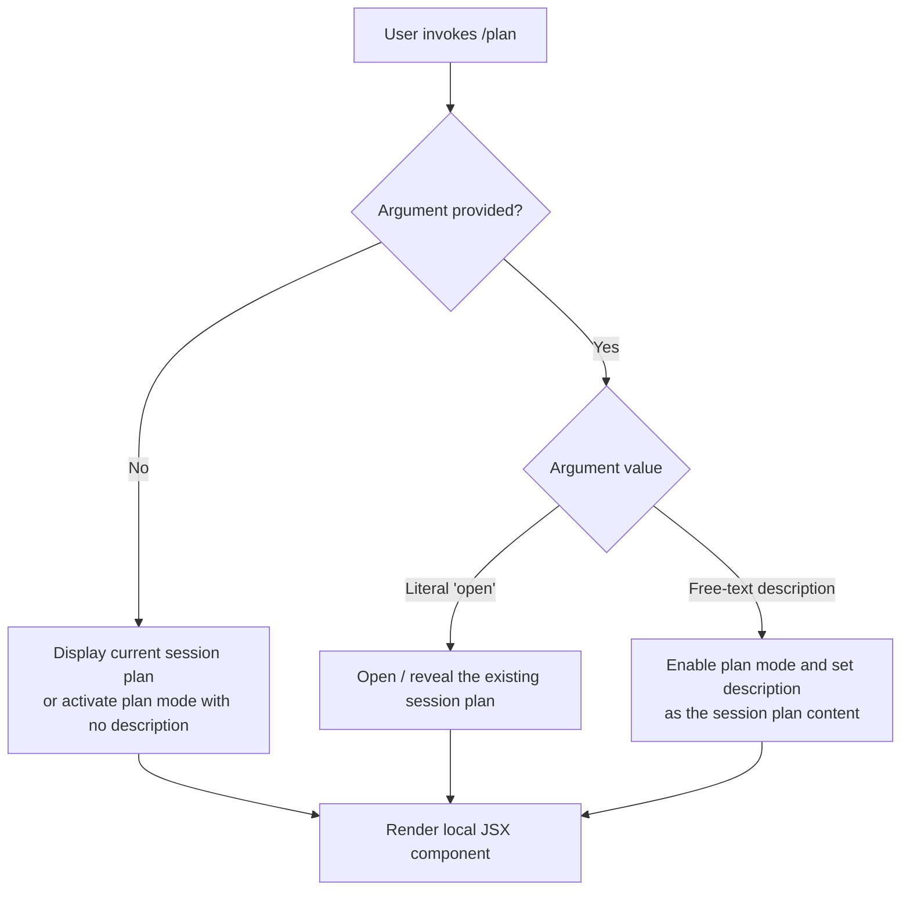

# `/plan`

> Analysis basis: CC v2.1.144 bundle.js (AST extraction + Claude interpretation)
> Minimum version: v2.1.144

---

## Overview

The `/plan` command enables **plan mode** for the current Claude Code session, or allows the user to view the session's current plan. When invoked, it either activates a structured planning workflow or opens the existing plan for inspection, depending on the argument supplied. The command is registered as a local JSX command, indicating it renders interactive UI components within the CLI.

---

## Registration

| Field | Value |
|---|---|
| type | `local-jsx` |
| name | `plan` |
| description | `Enable plan mode or view the current session plan` |
| argumentHint | `[open\|<description>]` |
| module\_id | `EWq` |

Analysis basis: CC v2.1.144 bundle.js:+11442188

---

## Input Branching

The `argumentHint` value `[open|<description>]` specifies two distinct argument forms, implying at least three execution paths: no argument, the literal keyword `open`, and a free-text description string. The flowchart below models the expected branching logic inferred from the registration data.



Analysis basis: CC v2.1.144 bundle.js:+11442188 (argumentHint field)

> **Note:** The call graph, literals, and telemetry arrays returned empty for module `EWq` at depth ≤ 2. The branching detail above is derived solely from the `argumentHint` registration field. Deeper implementation specifics are not verifiable from this extraction.

---

## Behavioral Spec

### Plan Mode Activation

The `/plan` command is classified as `local-jsx`, meaning its output is rendered as a JSX component directly in the CLI interface rather than being passed to the model as a text prompt.

```
function handlePlanCommand(rawArgument):
    trimmed = trim(rawArgument)

    if trimmed is empty:
        return renderPlanView(mode = "default")

    if trimmed equals "open":
        return renderPlanView(mode = "open")

    // Free-text description path
    return renderPlanView(mode = "set", description = trimmed)

function renderPlanView(mode, description = null):
    // Render local JSX component appropriate to mode
    return JSXComponent(mode, description)
```

Analysis basis: CC v2.1.144 bundle.js:+11442188

<!-- TODO: not found in depth-2 traversal; needs --depth 4 -->
Internal implementation of `renderPlanView`, state mutations applied to the session plan object, and any inter-component communication are not recoverable from the current extraction depth.

### Argument: `open`

When the argument is the literal string `open`, the command is expected to surface the current session plan to the user — for example, expanding a collapsed plan panel or navigating to the plan view — without modifying plan content.

Analysis basis: CC v2.1.144 bundle.js:+11442188 (argumentHint field)

### Argument: `<description>`

When the argument is any string other than `open`, the command treats the input as a plan description and uses it to populate or update the session plan. This enables plan mode and associates the provided text with the active session.

Analysis basis: CC v2.1.144 bundle.js:+11442188 (argumentHint field)

---

## State & Side Effects

| Item | Detail |
|---|---|
| Telemetry | <!-- TODO: not found in depth-2 traversal; needs --depth 4 --> No `tengu_*` events found in depth-2 extraction for module `EWq` |
| Hook registration | <!-- TODO: not found in depth-2 traversal; needs --depth 4 --> |
| appState changes | <!-- TODO: not found in depth-2 traversal; needs --depth 4 --> |
| Sound | <!-- TODO: not found in depth-2 traversal; needs --depth 4 --> |
| Render type | `local-jsx` — command output is rendered as a JSX component within the CLI, not forwarded to the model |

---

## Version History

| Version | Change |
|---|---|
| v2.1.144 | Initial analysis; registration confirmed at bundle.js:+11442188 |

---

## Common Mistakes

1. **Passing `open` as a plan description**: Because `open` is a reserved keyword argument for this command, using it as a plan description text will trigger the view-open path rather than setting a plan with the word "open" as content. Choose a different description string if that is the intent.
2. **Expecting model output**: Because the command type is `local-jsx`, invoking `/plan` does not produce a model-generated response. The result is a locally rendered UI component. Users expecting conversational output from the model will not receive one.
3. **Assuming plan persistence across sessions**: The registration description refers to "the current session plan," implying plan state is scoped to the active session. Closing and reopening Claude Code may not preserve plan content. <!-- TODO: not found in depth-2 traversal; needs --depth 4 — persistence mechanism unconfirmed -->
4. **Omitting the argument when intending to set a plan**: Invoking `/plan` with no argument does not set a new plan description; it defaults to viewing or activating plan mode without content. Provide a description string to set plan content.

---

## Appendix — Identifier Mapping

> For bundle debugging only. Identifiers change across versions.

| Identifier | Role |
|---|---|
| `EWq` | Module ID for the `/plan` command implementation (not an obfuscated function name; recorded here for bundle lookup reference) |

> No obfuscated function identifiers (`mw8`-style) were returned by the depth-2 AST traversal for module `EWq`. The identifiers array was empty in the source extraction. <!-- TODO: not found in depth-2 traversal; needs --depth 4 -->