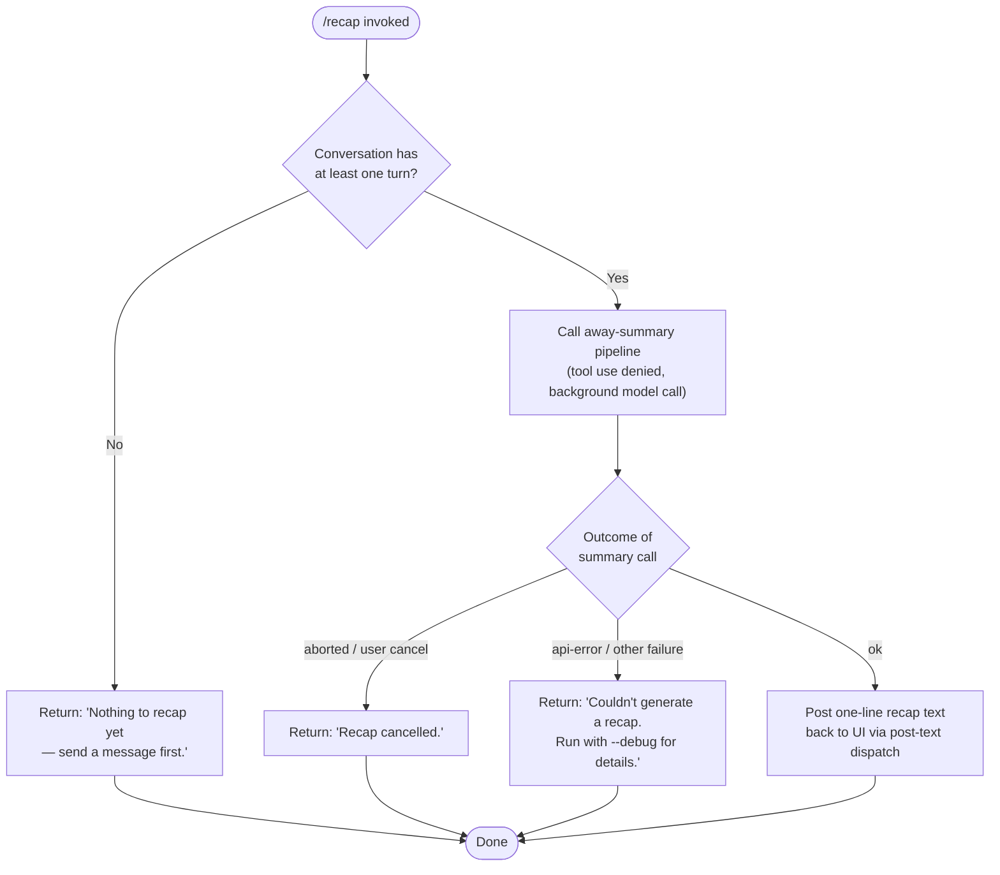

# `/recap`

> Analysis basis: CC v2.1.153 bundle.js (AST extraction + Claude interpretation)
> Minimum version: v2.1.153

---

## Overview

The `/recap` command triggers an immediate, on-demand generation of a one-line session summary that would otherwise be produced automatically at the end of a session. It invokes the same away-summary pipeline used by background session management, dispatching a constrained model call that is forbidden from using tools, and posts the resulting text back to the UI as a post-text response. If the conversation has no turns yet, or if the summary request is aborted or fails, the command emits a short human-readable error message instead.

---

## Registration

| Field | Value |
|---|---|
| type | `local` |
| name | `recap` |
| description | `Generate a one-line session recap now` |
| loc_byte | `12615047` |
| loc_byte_end | `12615263` |
| loc_line | `9767` |
| supportsNonInteractive | `false` |
| thinClientDispatch | `post-text` |
| load_inline | `true` |
| load_ident | `B$5` |
| arbor_handler.name | `B$5` |
| arbor_handler.fqn | `claude-2.1.153::B$5` |
| arbor_handler.kind | `AsyncFunction` |
| arbor_handler.resolution_path | `load_ident` |
| arbor_handler.n_hits | `0` |

Analysis basis: CC v2.1.153 bundle.js:+12615047

---

## Input Branching

The handler has four distinct outcome paths depending on session state and the result of the away-summary call. A Mermaid flowchart is used to capture all branches.



Analysis basis: CC v2.1.153 bundle.js:+12614797 (nothing-to-recap literal), +12614889 (cancelled literal), +12614947 (failure literal), +5350360 (away_summary path), +5350654 (ok path)

---

## Behavioral Spec

### Top-level handler (`B$5`)

The handler is an `AsyncFunction` resolved via the `load_ident` inline shape (`load: () => Promise.resolve({ call: B$5 })`). It is the sole entry point for `/recap`.

```
async function recapCommandHandler(context):
    // Guard: session must have at least one completed turn
    if conversationHistory is empty or has no turns:
        return postText("Nothing to recap yet — send a message first.")

    // Delegate to the away-summary pipeline
    result = await awaySummaryPipeline(context, { allowTools: false })

    match result.status:
        "aborted":
            return postText("Recap cancelled.")
        "api-error" | "other":
            return postText("Couldn't generate a recap. Run with --debug for details.")
        "ok":
            return postText(result.summaryLine)
```

Analysis basis: CC v2.1.153 bundle.js:+12614655 (B$5 → G58 call edge), +12614797, +12614889, +12614947

---

### Away-summary pipeline (`G58`)

`G58` is the shared away-summary orchestrator used both by `/recap` and by the automatic end-of-session summary path. `/recap` calls it synchronously from the command handler.

```
async function awaySummaryPipeline(context, options):
    // Precondition check: requires CacheSafeParams saved from the last turn
    params = getCacheSafeParams(context)
    if params is null:
        log.debug("[awaySummary] no CacheSafeParams saved, skipping")
        return { status: "no-turn" }

    // Register abort listener so user Ctrl-C cancels the recap
    abortController = new AbortController()
    context.signal.addEventListener("abort", () => abortController.abort())

    // Dispatch the model query via the standard query pipeline (queryPipeline)
    // Tool use is explicitly denied for this call
    queryResult = await queryPipeline(params, {
        threadLabel: "away_summary",
        allowTools: false,          // "Away summary cannot use tools"
        signal: abortController.signal,
    })

    match queryResult:
        { status: "aborted" } → return { status: "aborted" }
        { status: "api-error" } → return { status: "api-error" }
        { status: "ok", text } → return { status: "ok", summaryLine: text }
```

Analysis basis: CC v2.1.153 bundle.js:+5349965 (G58 → H8H), +5349984 (G58 → N / CacheSafeParams check), +5349986 ("no CacheSafeParams saved, skipping" literal), +5350044 ("no-turn" literal), +5350100 ("abort" listener), +5350292 ("Away summary cannot use tools" literal), +5350360 ("away_summary" label literal), +5350504 ("aborted" literal), +5350593 ("api-error" literal), +5350654 ("ok" literal)

---

### Tool-deny guard (`denyToolUseGuard`)

Within the away-summary call, a deny filter ensures that any tool-use request issued by the model is rejected outright before execution. This is a hard constraint: the summary model turn must be text-only.

```
function denyToolUseGuard(toolRequest):
    // All tool calls are unconditionally refused during a recap/away-summary turn
    return { action: "deny", reason: "Away summary cannot use tools" }
```

Analysis basis: CC v2.1.153 bundle.js:+5350277 ("deny" literal), +5350292 ("Away summary cannot use tools" literal)

---

### Query pipeline entry (`queryPipeline` / `jQL`)

`jQL` is the main agentic query function reached from `I0` (the query entry coordinator) via `Bu`. For `/recap`, the pipeline is invoked with the away-summary parameters and tool use blocked. Key internal stages visible in the call graph:

```
async function queryPipeline(params, options):
    // Lifecycle: emit command_lifecycle / started
    emit("command_lifecycle", { status: "started" })

    // Setup phase
    emit("query_setup_start")
    prepareRequestContext(params)          // includes model selection, compaction checks
    emit("query_setup_end")

    // API streaming loop
    emit("query_api_loop_start")
    loop:
        emit("query_api_streaming_start")
        stream = callModel(params, options)
        processStreamEvents(stream)        // handles message_delta, tool_use, etc.
        emit("query_api_streaming_end")

        if stopConditionMet:
            break

    // Result assembly
    return assembleResult(stream)
```

Analysis basis: CC v2.1.153 bundle.js:+10595070 ("query_fn_entry"), +10597865 ("query_setup_start"), +10598097 ("query_setup_end"), +10598928 ("query_api_loop_start"), +10599011 ("query_api_streaming_start"), +10603140 ("query_api_streaming_end"), +10615732 ("command_lifecycle"), +10615771 ("started")

---

### Session transcript formatter (`sessionTranscriptFormatter` / `j4`)

Before sending to the model, the conversation history is formatted into a compact transcript. This function is reached from the CacheSafeParams preparation path (`N` → `j4`).

```
function formatSessionTranscript(messages):
    // Build a condensed representation of the conversation
    // Speaker labels are upper-cased  (e.g. "USER", "ASSISTANT")
    lines = []
    for message in messages:
        speaker = message.role.toUpperCase()
        body = summarizeContent(message.content)   // strips tool internals
        // Redacts sensitive values using the "[REDACTED]" sentinel
        body = redactSensitiveValues(body)
        lines.append(speaker + ": " + body)
    return lines.join("\n")
```

Analysis basis: CC v2.1.153 bundle.js:+203780 (`_.toUpperCase`), +203800 (`j4` call), +195779 ("[REDACTED]" literal), +195700 (`pOA` map helper)

---

### Transcript persistence (`transcriptPersistence` / `ihK`)

After the model responds, the recap text (along with the session transcript) is appended to a persistent log file. This is the same mechanism used for general session logging.

```
async function persistTranscript(sessionDir, content, options):
    targetDir = path.dirname(sessionDir)
    ensureDirectoryExists(targetDir)    // mkdir -p

    // Rotate file if it has grown beyond the size threshold
    currentPath = buildFilePath(sessionDir)
    if fileExists(currentPath):
        stat = await fs.stat(currentPath)
        if stat size triggers rotation:
            rotatedPath = currentPath + ".txt" if needed
            // Rename or unlink old file, then re-create
            await fs.rename(currentPath, rotatedPath)

    byteLen = Buffer.byteLength(content)
    await fs.appendFile(currentPath, content)

    // Register file with the cleanup registry
    registerCleanupHook(currentPath)
```

Analysis basis: CC v2.1.153 bundle.js:+203199 (`$0H.dirname`), +203229 (`Ek`), +203244 (`B6`), +203319 (`E16`), +203368 (`cOA` stat/rotate), +203374 (`Buffer.byteLength`), +202520 (`Zk.stat`), +202613 (`H.endsWith`), +202624 (".txt" literal), +202676 (`Zk.rename`), +202716 (`Zk.unlink`), +202920 (`Zk.mkdir`), +202979 (`Zk.appendFile`)

---

### Background session dispatcher (`backgroundSessionDispatcher` / `G58` → `I0`)

`I0` is the coordinator that manages background agent execution contexts. For `/recap` it is responsible for wiring the away-summary into the correct agent thread.

```
async function backgroundSessionCoordinator(context, params):
    startTime = Date.now()

    // Initialize agent session (appState read/write)
    agentSession = await initializeAgentSession(context)   // yW8
    agentSession.setAppState(...)

    // Assign a random UUID for correlation
    correlationId = crypto.randomUUID()

    // Build the filtered message list for the model call
    filteredMessages = buildMessageList(params)             // F_H / ASH

    // Invoke the main query pipeline
    result = await queryPipeline(filteredMessages, { label: "main" })

    // Dispatch result back through post-text channel
    dispatchResult(result)
```

Analysis basis: CC v2.1.153 bundle.js:+10635808 (`Date.now`), +10633352 (`H.getAppState`), +10634132 (`H.setAppState`), +10635203 (`lT1.randomUUID`), +10636120 ("main" literal), +10636187 (`F_H`), +10636207 (`N`), +10636763 (`D.push`)

---

## State & Side Effects

| Item | Detail |
|---|---|
| Telemetry — query lifecycle | `tengu_auto_compact_rapid_refill_breaker`, `tengu_auto_compact_succeeded`, `tengu_ptl_surfaced_to_user`, `tengu_refusal_fallback_triggered`, `tengu_orphaned_messages_tombstoned`, `tengu_model_fallback_triggered`, `tengu_query_error`, `tengu_model_response_keyword_detected`, `tengu_malformed_tool_use_response`, `tengu_stop_hook_block_count`, `tengu_streaming_tool_execution_used`, `tengu_streaming_tool_execution_not_used`, `tengu_loop_dynamic_wakeup_ends_turn`, `tengu_post_autocompact_turn`, `tengu_query_before_attachments`, `tengu_query_after_attachments`, `tengu_mcp_tools_refreshed_mid_turn` |
| Telemetry — background daemon | `tengu_bg_spare_enable`, `tengu_bg_low_mem_mb`, `tengu_bg_spare_spawn`, `tengu_bg_dispatch_sigkill_escalate`, `tengu_bg_dispatch_low_mem`, `tengu_bg_spare_claim`, `tengu_bg_spare_claim_fail`, `tengu_bg_proto_mismatch`, `tengu_bg_dispatch_stale_drop`, `tengu_bg_attach_legacy_autorespawn`, `tengu_bg_attach`, `tengu_bg_attach_stall_gave_up`, `tengu_bg_attach_stall_respawn`, `tengu_bg_attach_kick`, `tengu_bg_dispatch_stale_drop` |
| Telemetry — forked/agent queries | `tengu_forked_agent_default_turns_exceeded`, `tengu_fork_agent_query` |
| Telemetry — feature flags | `tengu_feature_ok`, `tengu_feature_bad` |
| Hook registration | Cleanup hook registered via `H9` → `q3A.register` for transcript log files (bundle.js:+58450) |
| appState changes | `getAppState` / `setAppState` called on the agent session context (`yW8`); `Object.assign` used to merge updated state (bundle.js:+10634132, +10634231) |
| File I/O side effects | Transcript appended via `fs.appendFile`; optional file rotation via `fs.rename` / `fs.unlink`; directory created via `fs.mkdir` (bundle.js:+202920, +202979, +202676, +202716) |
| Tool use | Unconditionally blocked for the recap model call; any tool request is denied with the message `"Away summary cannot use tools"` (bundle.js:+5350292) |
| Sound | <!-- TODO: not found in depth-2 traversal; needs --depth 4 --> |
| Non-interactive | Not supported (`supportsNonInteractive: false`) |
| thinClientDispatch | `post-text` — the result text is dispatched back to the UI layer as a text post, not rendered inline |

---

## Version History

| Version | Change |
|---|---|
| v2.1.153 | Initial analysis |

---

## Common Mistakes

1. **Running `/recap` before sending any message.** The command guards against an empty conversation and will immediately return `"Nothing to recap yet — send a message first."` — no model call is made.
2. **Expecting tool use to work during recap.** The away-summary pipeline unconditionally denies all tool calls. If you need the model to inspect files before summarising, you must do so in a regular turn first.
3. **Expecting `/recap` in non-interactive mode.** `supportsNonInteractive: false` means the command cannot be called from CI pipelines or `--print` mode; it is only available in an interactive REPL session.
4. **Interpreting the failure message as a network error.** `"Couldn't generate a recap. Run with --debug for details."` covers all non-abort failures (API errors, model errors, etc.). Use `--debug` to obtain the specific error code.
5. **Confusing `/recap` with `/compact`.** `/recap` only generates a read-only one-line summary; it does not compact or truncate the conversation context.

---

## Appendix — Identifier Mapping

> For bundle debugging only. Identifiers change across versions.

| Identifier | Role |
|---|---|
| `B$5` | Top-level recap command handler (AsyncFunction; Arbor handler for `/recap`) |
| `G58` | Away-summary pipeline orchestrator |
| `H8H` | CacheSafeParams retrieval helper |
| `N` | Session context / message-list preparation coordinator |
| `chK` | Conversation history accessor / formatter helper |
| `L3A` | Inner helper called by conversation history accessor |
| `RH` | JSON serialiser helper (`JSON.stringify` wrapper) |
| `j4` | Session transcript formatter (speaker labels, redaction) |
| `pOA` | Message content map helper (called by transcript formatter) |
| `ixH` | Transcript write dispatcher |
| `NOA` | Low-level write helper (`H.write` wrapper) |
| `ihK` | Transcript persistence handler (stat, rotate, append, register) |
| `GxH` | Debounced write-flush helper (uses `clearTimeout`/`setTimeout`/`setImmediate`) |
| `xfH` | Path-join / content-assembly helper for transcript persistence |
| `B6` | Directory resolution helper |
| `E16` | Error classifier (EISDIR guard) |
| `lOA` | Log file path builder (`path.join` + `y6`) |
| `cOA` | File rotation helper (`stat`, `rename`, `unlink`) |
| `nhK` | Append-and-rotate loop (bound via `.bind`) |
| `H9` | Cleanup hook registration gateway (`q3A.register`) |
| `I0` | Background session / query coordinator |
| `yW8` | Agent session initialiser (reads/writes appState, assigns UUID) |
| `Ry` | Agent abort / signal wiring helper |
| `c4H` | Conversation state load/dump helper |
| `IYH` | Agent initialisation sub-step |
| `PL9` | Agent initialisation sub-step |
| `M` | Connection close helper (closes streams) |
| `HZ8` | Post-init configuration step |
| `dy` | Random-bytes generator (`crypto.randomBytes`) |
| `hW8` | Query context builder |
| `F_H` | Message filter / preparation for model call |
| `h4` | Hook lookup helper |
| `ASH` | Message list assembler (filters by provider "ant") |
| `Bu` | Query dispatcher (routes to `jQL` and `EM8`) |
| `jQL` | Main agentic query pipeline (streaming, tool loop, compaction) |
| `EM8` | Subagent / forked-agent exit handler |
| `SH` | Feature-flag "ok" reporter |
| `uH` | Feature-flag "bad" reporter |
| `cV6` | Tool-use summary / notification dispatcher |
| `zAH` | Additional query context helper |
| `BZ8` | Query result post-processor |
| `aW1` | Notification dispatch helper |
| `D` | Background daemon process manager |
| `T6` | Daemon event-queue pusher |
| `wk8` | Memory-aware spare-slot manager |
| `wLA` | Background spare PTY spawner (Bun.spawn) |
| `Wz` | Daemon state helper |
| `J8` | Error-kind classifier |
| `yH` | Error logger (`an.logError`) |
| `V7H` | In-progress session finder / filter |
| `GJ` | Session list helper |
| `wd7` | Single-session finder (`H.find`) |
| `L` | Pending-promise tracker (add/delete/finally) |
| `NQL` | Forked-agent turn limiter |
| `Z8` | UUID-keyed request context (uses `jv.randomUUID`) |
| `X` | IPC channel handler (Buffer concat, data events) |
| `NM` | Stream end / JSON writer helper |
| `jm5` | PTY session message dispatcher (large multiplex handler) |
| `EH` | String coercion helper |
| `Sj9` | Result flat-mapper for post-text dispatch |
| `_` | Generic utility / string helper |
| `q` | File-path or process helper (uses `VTK.unlinkSync`) |
| `A` | String/path helper (uses `M.toLowerCase`) |