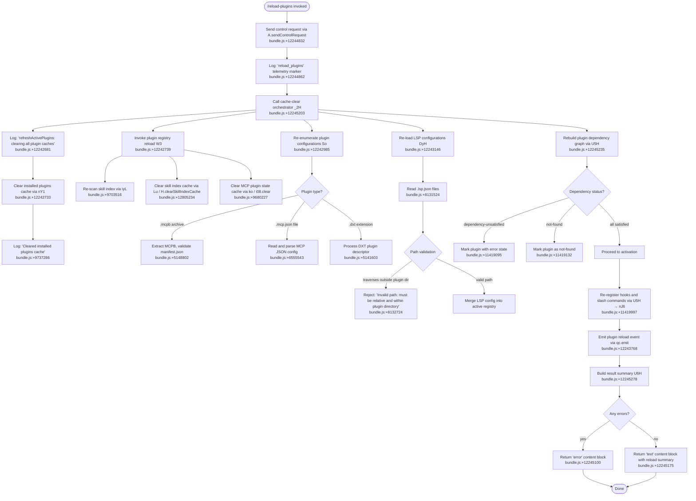

# `/reload-plugins`

> Analysis basis: CC v2.1.153 bundle.js (AST extraction + Claude interpretation)
> Minimum version: v2.1.153

---

## Overview

`/reload-plugins` forces an in-session refresh of all loaded plugins (MCP servers, skills, agents, and LSP servers) without requiring a full CLI restart. It works by sending a control request to the active session process, clearing every plugin-related cache, re-scanning plugin registries from disk, and re-registering all plugin-derived slash commands and hooks. The command is specifically designed for interactive sessions and is not available in non-interactive (headless) mode.

---

## Registration

| Field | Value |
|---|---|
| type | `local` |
| name | `reload-plugins` |
| description | `Activate pending plugin changes in the current session` |
| supportsNonInteractive | `false` |
| thinClientDispatch | `"control-request"` |
| module_id | `Gc1` |
| load_inline | `true` |
| loc_byte | `12245773` |
| loc_byte_end | `12245992` |
| loc_line | `9199` |
| arbor_handler.name | `f75` |
| arbor_handler.fqn | `claude-2.1.153::f75` |
| arbor_handler.kind | `AsyncFunction` |
| arbor_handler.resolution_path | `module_id` |
| arbor_handler.n_hits | `0` |

Analysis basis: CC v2.1.153 bundle.js:+12245773

---

## Input Branching

The command handler (`f75`) involves more than three distinct execution paths: a control-request dispatch path, a multi-phase cache-clearing path, LSP manager teardown, plugin re-enumeration, hook re-registration, and result reporting. A Mermaid flowchart is used.



---

## Behavioral Spec

### 1. Entry Point and Control-Request Dispatch

The Arbor-resolved handler `f75` (an `AsyncFunction`) is the command's top-level entry point. Upon invocation it immediately calls the low-level IPC helper `g3` (which invokes `dWH`) to signal the host session process via a control request. The literal `"ccr"` (bundle.js:+12244813) identifies the control-request class. The telemetry marker `"reload_plugins"` (bundle.js:+12244862) is emitted to record that a reload was requested.

```
async function reloadPluginsHandler(context):
    sendControlRequest(controlRequestClass="ccr")           // bundle.js:+12244813
    emitTelemetryMarker("reload_plugins")                   // bundle.js:+12244862
    results = await refreshAllPluginCaches(context)         // bundle.js:+12245203
    pluginSummary = buildResultSummary(results)             // bundle.js:+12245278
    if results.hasErrors:
        return contentBlock(type="error", ...)              // bundle.js:+12245100
    else:
        return contentBlock(type="text", summary=pluginSummary) // bundle.js:+12245175
```

Analysis basis: CC v2.1.153 bundle.js:+12244795, +12244832

---

### 2. Cache-Clearing Orchestrator (`_2H`)

`_2H` is the main orchestration function that coordinates all cache-clearing, re-scanning, and re-registration phases. It begins by logging the debug message `"refreshActivePlugins: clearing all plugin caches"` (bundle.js:+12242681) and then fans out to several sub-operations via `Promise.all` (bundle.js:+12242788).

```
async function refreshAllPluginCaches(context):
    logDebug("refreshActivePlugins: clearing all plugin caches")  // bundle.js:+12242681

    await Promise.all([
        clearInstalledPluginsCache(context),    // nY1, bundle.js:+12242733
        reloadPluginRegistry(context),          // W3,  bundle.js:+12242739
        loadExtraPluginConfig(context),         // pN9, bundle.js:+12242744
        loadAdditionalState(context),           // Oj,  bundle.js:+12242762
        loadNamespaceState(context),            // Na9, bundle.js:+12242767
    ])

    pluginList = collectActivePlugins(context)  // K.map, bundle.js:+12242900
    lspConfigs = loadLspConfigurations(context) // DyH,  bundle.js:+12243146
    pluginMap  = buildPluginMap(pluginList)     // $.reduce, bundle.js:+12243215

    filteredAdded   = filterNewPlugins(pluginList, pluginMap)    // L75, bundle.js:+12243338
    filteredRemoved = filterRemovedPlugins(pluginList, pluginMap)// M75, bundle.js:+12243371

    activatePlugins(filteredAdded, context)     // FJ8, bundle.js:+12243497
    deactivatePlugins(filteredRemoved, context) // A8H, bundle.js:+12243522

    logPluginErrors(context)                    // yH,  bundle.js:+12243542
    emitReloadEvent(context)                    // qc.emit, bundle.js:+12243768
```

Analysis basis: CC v2.1.153 bundle.js:+12242679

---

### 3. Plugin Registry Reload (`W3`)

`W3` coordinates three parallel registry refresh operations: skill-index reload (`iyL`), skill-cache clear (`sR`), query-cache clear (`eJ6`), plugin-state reset (`rZ_`), and MCP plugin-state flush (`ko`).

```
async function reloadPluginRegistry(context):
    await reloadSkillIndex(context)             // iyL,  bundle.js:+9703516
    await clearSkillIndexCache(context)         // sR → Lu → H.clearSkillIndexCache
                                                //          bundle.js:+12805234
    logDebug("Cleared installed plugins cache") // bundle.js:+9737286
    await clearQueryCache(context)              // eJ6,  bundle.js:+9703527
    await resetPluginState(context)             // rZ_,  bundle.js:+9703533
    clearMcpPluginStateMap()                    // ko → i08.clear, bundle.js:+9680227
```

Analysis basis: CC v2.1.153 bundle.js:+9703516–9703539

---

### 4. Plugin Configuration Re-enumeration (`So`)

`So` scans all active plugin sources, determines the plugin type from file-extension signals, and loads the appropriate configuration. The recognized extension markers are `".mcpb"` (bundle.js:+5141582), `".dxt"` (bundle.js:+5141603), and `".mcp.json"` (bundle.js:+6554843).

```
async function enumeratePluginConfigurations(context):
    pluginPaths = resolvePluginSourcePaths(context)   // r48, bundle.js:+6554292

    for path in pluginPaths:
        if path.endsWith(".mcpb"):
            config = await loadMcpbPlugin(path)       // BJ6, bundle.js:+5147424
        else if path.endsWith(".mcp.json"):
            config = await loadMcpJsonPlugin(path)    // cv_, bundle.js:+6554832
        else if path.endsWith(".dxt"):
            config = await loadDxtPlugin(path)        // YV9, bundle.js:+6554988
        else:
            logWarn("unrecognized plugin type")       // bundle.js:+6554541

        pluginConfigs.push(config)

    return await Promise.all(pluginConfigs)           // bundle.js:+6555106
```

Analysis basis: CC v2.1.153 bundle.js:+6554292, +5141582, +5141603, +6554843

---

### 5. MCPB Archive Handling (`BJ6`)

For `.mcpb` archives, the loader extracts the archive, validates presence of `"manifest.json"` (bundle.js:+5147617), computes an MD5 hash (bundle.js:+5148454) for change-detection, reads the manifest, and generates MCP server configuration. If extraction fails or the manifest is absent the loader emits the error tag `"No manifest.json found in MCPB file"` (bundle.js:+5148913) and aborts.

```
async function loadMcpbPlugin(archivePath):
    logInfo("Extracting MCPB archive...")          // bundle.js:+5148802
    extracted = await extractMcpb(archivePath)
    manifest  = extracted.find("manifest.json")   // bundle.js:+5147617
    if not manifest:
        throw Error("No manifest.json found in MCPB file") // bundle.js:+5148913

    hash = md5(manifestBytes)[:8]                 // bundle.js:+5148454, +5148497
    logInfo("Generating MCP server configuration...") // bundle.js:+5149710
    return buildServerConfig(manifest, hash)
```

Analysis basis: CC v2.1.153 bundle.js:+5147617, +5148454, +5148802, +5148913

---

### 6. LSP Configuration Loader (`DyH`)

`DyH` reads `".lsp.json"` files (bundle.js:+8131524) from each plugin directory and merges them into the active LSP registry. Path validation (`pDL`) ensures every referenced file is relative and does not escape the plugin root (error message at bundle.js:+8132724). Invalid JSON causes the tag `"lsp-config-invalid"` (bundle.js:+8131794) to be emitted.

```
async function loadLspConfigurations(context):
    for pluginDir in context.pluginDirectories:
        lspFile = join(pluginDir, ".lsp.json")    // bundle.js:+8131524
        try:
            raw = await readFile(lspFile)
            parsed = parseJson(raw)               // U6, bundle.js:+8131579
            validateLspPaths(parsed)              // pDL, bundle.js:+8131353
            lspRegistry.merge(parsed)
        except ParseError:
            emitWarning("lsp-config-invalid")     // bundle.js:+8131794
        except PathEscapeError:
            emitWarning("Invalid path: must be relative and within plugin directory")
                                                  // bundle.js:+8132724
```

Analysis basis: CC v2.1.153 bundle.js:+8131524, +8131794, +8132724

---

### 7. Plugin Dependency Graph Rebuild (`U5H`)

After all configurations are loaded, `U5H` rebuilds the dependency graph for all active plugins. Each plugin is checked for satisfied dependencies. Plugins whose dependencies are missing receive the status `"dependency-unsatisfied"` (bundle.js:+11419095); plugins whose required packages cannot be located receive `"not-found"` (bundle.js:+11419132). Resolution failure of the dependency graph itself produces `"dependency-resolution"` (bundle.js:+11420107).

```
function rebuildDependencyGraph(pluginList, context):
    for plugin in pluginList:
        depStatus = checkDependencies(plugin, context) // nJ6, bundle.js:+11419997
        if depStatus == "unsatisfied":
            plugin.errorCode = "dependency-unsatisfied" // bundle.js:+11419095
        else if depStatus == "not-found":
            plugin.errorCode = "not-found"             // bundle.js:+11419132
        else if depStatus == "resolution-failed":
            plugin.errorCode = "dependency-resolution" // bundle.js:+11420107
        else:
            plugin.status = "ready"

    return pluginList
```

Analysis basis: CC v2.1.153 bundle.js:+11419095, +11419132, +11420107

---

### 8. Plugin Installer / Re-activator (`nJ6`)

`nJ6` is the deepest activation helper, called for each plugin that passes dependency checks. It validates installation scope (rejecting `"managed"` scope installs with `"Cannot install plugins to managed scope"` at bundle.js:+4916138), resolves the canonical plugin source path (`cJ6`, bundle.js:+5165634), updates the plugin registry map (`O.set`, bundle.js:+5164104), re-spawns any plugin MCP server processes (`P.set`, bundle.js:+5164457), registers hooks (`W.add`, bundle.js:+5164864), emits `plugin_installed` telemetry (bundle.js:+5169584), and enqueues plugin result notifications (`qH.push`, bundle.js:+5166365).

```
async function activateSinglePlugin(plugin, context):
    if plugin.scope == "managed":
        throw Error("Cannot install plugins to managed scope") // bundle.js:+4916138

    canonicalPath = resolvePluginSourcePath(plugin)  // cJ6, bundle.js:+5165634
    pluginRegistry.set(plugin.id, plugin)            // O.set, bundle.js:+5164104
    serverProcess = spawnOrReuseServer(plugin)       // P.set, bundle.js:+5164457
    hookRegistry.add(plugin.hooks)                   // W.add, bundle.js:+5164864
    emitTelemetry("plugin_installed", {              // bundle.js:+5169584
        "plugin.name":             plugin.name,      // bundle.js:+5169611
        "plugin.version":          plugin.version,   // bundle.js:+5169651
        "marketplace.name":        plugin.marketplace,// bundle.js:+5169689
        "marketplace.is_official": plugin.isOfficial,// bundle.js:+5169711
        "install.trigger":         "reload-plugins", // bundle.js:+5169754
    })
    notificationQueue.push(plugin)                   // qH.push, bundle.js:+5166365
```

Analysis basis: CC v2.1.153 bundle.js:+4916138, +5164104, +5164457, +5164864, +5169584

---

### 9. Result Summary Builder (`U6H`)

After all plugins have been processed, `U6H` assembles the human-readable summary returned to the CLI. It maps over the results list (bundle.js:+12245278), formats plugin names with `QA` (bundle.js:+4954843), and truncates to a maximum of 5 entries (bundle.js:+4954828) using `q.slice` (bundle.js:+4954885) with the remainder indicated by `N8` (bundle.js:+4954937).

```
function buildResultSummary(results):
    MAX_SHOWN = 5                                 // bundle.js:+4954828
    lines = results.map(r => formatPluginLine(r)) // bundle.js:+4954832
    if lines.length > MAX_SHOWN:
        lines = lines.slice(0, MAX_SHOWN)         // bundle.js:+4954885
        lines.append(summarizeRemainder(results)) // N8, bundle.js:+4954937
    return lines.join(", ")                       // bundle.js:+4954869
```

Analysis basis: CC v2.1.153 bundle.js:+12245278, +4954828

---

## State & Side Effects

| Item | Detail |
|---|---|
| Telemetry — reload marker | `"reload_plugins"` string literal used as an internal event tag (bundle.js:+12244862) |
| Telemetry — plugin installed | `plugin_installed` event with `plugin.name`, `plugin.version`, `marketplace.name`, `marketplace.is_official`, `install.trigger` (bundle.js:+5169584) |
| Telemetry — feature lifecycle | `tengu_feature_ok` (bundle.js:+965124), `tengu_feature_bad` (bundle.js:+965182), `tengu_feature_sad` (bundle.js:+965259) |
| Telemetry — daemon control | `tengu_daemon_control` (bundle.js:+15422336) reachable via transport layer |
| Telemetry — background dispatch | `tengu_bg_dispatch_sigkill_escalate`, `tengu_bg_dispatch_low_mem`, `tengu_bg_spare_enable`, `tengu_bg_spare_claim`, `tengu_bg_spare_claim_fail` — reachable through deep call graph during server process management |
| Cache cleared — installed plugins | In-memory installed-plugins registry flushed via `nY1` (bundle.js:+12242733); log entry `"Cleared installed plugins cache"` (bundle.js:+9737286) |
| Cache cleared — skill index | `H.clearSkillIndexCache` called (bundle.js:+12805234); `eo_` helper invoked |
| Cache cleared — MCP plugin state | `i08.clear()` called (bundle.js:+9680227) |
| Cache cleared — RR6 / Ox8 | Two additional caches cleared via `Xz` (bundle.js:+26612, +26624) during settings reload chain |
| Hook re-registration | Plugin hooks re-added to `hookRegistry` via `W.add` (bundle.js:+5164864) |
| Slash commands | Plugin-derived slash commands re-registered via `H9 → q3A.register` (bundle.js:+58450) |
| MCP server processes | Existing server connections closed and new ones spawned/adopted via `P.set` (bundle.js:+5164457); connection states cycle through `"connected"` (bundle.js:+15244431) and `"failed"` (bundle.js:+15244560) |
| LSP server processes | LSP manager state refreshed; `"lsp-manager"` tag used for tracking (bundle.js:+12244183) |
| Event emitted | `qc.emit` fires a plugin-reload event notifying subscribed UI components (bundle.js:+12243768) |
| appState changes | Plugin map (`O.set`), plugin process map (`P.set`), and notification queue (`qH.push`) are all mutated |
| Non-interactive guard | `supportsNonInteractive: false` — command is silently unavailable in headless/pipe mode |
| thin-client dispatch | `thinClientDispatch: "control-request"` — in thin-client deployments the command is forwarded as a control request rather than executed locally |
| Sound | None observed in traversal |

---

## Version History

| Version | Change |
|---|---|
| v2.1.153 | Initial analysis |

---

## Common Mistakes

1. **Running in non-interactive mode**: `/reload-plugins` sets `supportsNonInteractive: false`. Invoking it in a headless or piped session will not execute the handler; use an interactive terminal session.

2. **Expecting immediate MCP server reconnection**: The command clears all plugin state and re-spawns servers asynchronously. If a plugin MCP server takes time to restart, its status will briefly appear as `"failed"` before reaching `"connected"`. Wait for the reconnection cycle to complete.

3. **Modifying plugins while the reload is in flight**: Because `/reload-plugins` uses `Promise.all` for parallel cache clearing, modifying plugin config files mid-reload can result in a partially-stale state. Make all file changes before invoking the command.

4. **Assuming managed-scope plugins can be refreshed**: Plugins installed in `"managed"` scope will cause activation to abort with `"Cannot install plugins to managed scope"`. Only `"user"` and `"project"` scope plugins are reloadable.

5. **Ignoring the LSP config validation error**: If a `.lsp.json` file contains paths that escape the plugin root directory, the LSP portion of the reload will be silently skipped with a `"lsp-config-invalid"` warning. Check that all LSP config paths are relative.

6. **Expecting `/reload-plugins` to install new plugins from disk**: The command activates already-configured plugins; it does not discover and install brand-new plugins that have never been registered. New plugins must be added through the plugin management workflow first.

---

## Appendix — Identifier Mapping

> For bundle debugging only. Identifiers change across versions.

| Identifier | Role |
|---|---|
| `f75` | Top-level async handler for `/reload-plugins` (Arbor-resolved, `AsyncFunction`) |
| `g3` | Low-level control-request sender; calls `dWH` |
| `dWH` | IPC transport primitive for control requests |
| `Rl` | Telemetry marker emitter for `"reload_plugins"` |
| `N8` | Remainder summariser used in result truncation |
| `_2H` | Main cache-clearing and re-registration orchestrator |
| `N` | Logger / debug output utility |
| `chK` | Debug-channel helper |
| `L3A` | Secondary logging channel |
| `RH` | JSON serializer helper |
| `j4` | String formatter used in log messages |
| `pOA` | String-map helper |
| `ixH` | Write-log helper |
| `NOA` | Raw write helper |
| `ihK` | Buffered log-file writer |
| `GxH` | Timeout-buffered output flusher |
| `xfH` | Output chunk handler |
| `E16` | File descriptor helper |
| `lOA` | Path builder for log files |
| `cOA` | Log file rotation helper |
| `nhK` | Log file append-and-rotate callback |
| `H9` | Command/hook re-registration dispatcher; calls `q3A.register` |
| `nY1` | Installed-plugins cache clearer |
| `W3` | Plugin registry reload coordinator |
| `iyL` | Skill-index reload function |
| `tZ` | Skill-index base loader |
| `HG8` | Plugin registry helper A |
| `QL8` | Plugin registry helper B |
| `zM8` | Plugin registry helper C |
| `Yv_` | Plugin-root entry enumerator |
| `yH` | Error logger for plugin activation |
| `IL8` | Plugin registry helper D |
| `LQ_` | Plugin registry helper E |
| `RY1` | Plugin registry helper F |
| `sR` | Skill-cache clear coordinator |
| `Lu` | Skill-index cache clear executor; calls `H.clearSkillIndexCache` |
| `NY1` | Skill cache helper |
| `thH` | Skill registry post-clear hook |
| `eJ6` | Query-cache clear helper |
| `rZ_` | Plugin-state reset helper |
| `ko` | MCP plugin-state map flusher; calls `i08.clear` |
| `pN9` | Extra plugin config loader |
| `Na9` | Namespace state loader |
| `O_` | Generic state helper; calls `Fv` |
| `Fv` | State primitive |
| `K` | Plugin list formatter (maps + pads) |
| `So` | Plugin configuration enumerator |
| `r48` | Plugin source path resolver |
| `vU` | Extension-check helper |
| `Pg` | Plugin path grouper |
| `cv_` | `.mcp.json` config loader |
| `X8` | ENOENT/EISDIR error classifier |
| `U6` | JSON parse wrapper |
| `YV9` | DXT plugin descriptor loader |
| `BJ6` | MCPB archive extractor and manifest parser |
| `EH` | String coercion helper |
| `DyH` | LSP configuration loader |
| `UDL` | LSP sub-config processor |
| `pDL` | LSP path escape validator |
| `Ar1` | Telemetry event recorder |
| `Zi` | Telemetry session identifier |
| `r9` | AsyncLocalStorage store getter for telemetry |
| `dI6` | Daemon status path builder |
| `L75` | New-plugin filter |
| `Wc1` | Plugin set membership checker |
| `M75` | Removed-plugin filter |
| `U5H` | Plugin dependency graph rebuilder and activation dispatcher |
| `od` | Plugin manifest reader |
| `TM` | Known-marketplace loader |
| `LG8` | Marketplace config path builder |
| `ovH` | Plugin options validator |
| `S8` | Policy settings extractor |
| `RF6` | Policy record builder |
| `Ng` | Policy checker composite |
| `aZ` | Managed-scope guard |
| `QA` | Plugin source type classifier |
| `oP` | Policy pattern evaluator |
| `xj6` | Host-pattern policy checker |
| `s48` | Policy settings getter |
| `fL9` | Host-pattern matcher |
| `$L9` | Path-pattern matcher |
| `Ev7` | GitHub source policy evaluator |
| `m6H` | Policy settings extractor B |
| `zL9` | Combined pattern policy evaluator |
| `ML9` | Policy resolution helper |
| `L7H` | Marketplace JSON reader |
| `hE6` | Marketplace path resolver |
| `$Q_` | Marketplace schema validator |
| `J8` | ENOENT/EISDIR error thrower |
| `$T` | Plugin config reader orchestrator |
| `RZ_` | Plugin config file reader |
| `psL` | Plugin set existence checker |
| `nJ6` | Single-plugin activator (installs, hooks, spawns MCP server) |
| `MT` | Policy-settings scope helper |
| `bL8` | Plugin source type + policy check |
| `ZL6` | Relative-path prefix checker |
| `S6` | Settings store accessor |
| `aU6` | AsyncLocalStorage settings getter |
| `sZ` | Plugin settings file reader |
| `zQ_` | Plugin settings sync reader |
| `YQ_` | Settings entries iterator |
| `j` | Active process set manager |
| `y` | Process write helper |
| `P` | MCP server connection manager |
| `mC8` | MCP server config helper |
| `l_` | Error string formatter |
| `xx` | Plugin source URL validator |
| `FR` | Plugin URL fetch helper |
| `J78` | Semver validity checker |
| `W` | Hook registry |
| `qL` | Hook queue processor |
| `q59` | Dependency resolution engine |
| `f` | Plugin feature flag store |
| `g_` | Settings file writer |
| `YO` | Settings write pre-validator |
| `lr8` | Settings file atomic writer |
| `$P` | Settings post-write notifier |
| `li8` | Settings write timestamp recorder |
| `hGH` | Settings write helper B |
| `c76` | Atomic file write with temp+rename |
| `Xz` | Dual-cache (RR6 + Ox8) flusher |
| `pB6` | Gitignore-aware settings writer |
| `Tb` | Settings path resolver |
| `SH` | Feature telemetry emitter (ok path) |
| `e6` | Feature telemetry emitter (sad path) |
| `uH` | Feature telemetry emitter (bad path) |
| `Ap` | Settings load orchestrator |
| `cJ6` | Plugin source canonical path resolver |
| `g` | MCP command filter |
| `B` | MCP tool filter |
| `Q` | Plugin result file manager |
| `iv6` | Plugin result file reader |
| `CI1` | Plugin result file unlinker |
| `qH` | Plugin notification queue |
| `t` | Notification dispatcher |
| `YH` | Notification enqueuer |
| `E` | Notification type helper |
| `I` | Away-summary scheduler |
| `l` | Rate-limit filter |
| `HH` | Voice recording session manager |
| `oj6` | Semver range evaluator |
| `WG_` | Semver range normaliser |
| `hL8` | Git-subdir source handler |
| `GY9` | Git fetch helper |
| `SL8` | npm/git tag resolver |
| `LR7` | npm registry query helper |
| `E8` | Shell executor for plugin install |
| `z` | Daemon process manager |
| `w` | Background session manager |
| `lJ6` | Plugin file installer (download + extract + rename) |
| `inH` | Plugin archive handler |
| `uL8` | Plugin local-install helper |
| `SY9` | Plugin staging area helper |
| `n6H` | Plugin content hasher |
| `qI` | Plugin binary type detector |
| `X` | Network transport read handler |
| `G78` | npm install runner |
| `NU` | Plugin unpack helper |
| `DwH` | Plugin post-install binary check |
| `CL8` | Plugin cleanup helper |
| `vZ_` | Plugin version-index updater |
| `h` | Away-summary trigger |
| `CQ` | Away-summary window calculator |
| `V` | Rate-limit token checker |
| `wwK` | Away-summary flag checker |
| `fH` | Process-exit handler queue |
| `r` | Daemon allow-list checker |
| `d` | Daemon status reader |
| `C` | Process write dispatcher |
| `R` | Transient process writer |
| `a` | Voice focus-silence timeout |
| `T` | MCP server process map |
| `YR7` | Plugin re-install helper |
| `b` | Plugin list mapper |
| `xy` | Platform case-sensitivity checker |
| `Y3` | String coercion wrapper |
| `xH` | String primitive converter |
| `L4` | OTEL metrics emitter |
| `Au8` | OTEL attribute builder |
| `nvH` | OTEL span helper |
| `N96` | OTEL entrypoint helper |
| `U6H` | Result summary builder (formats plugin reload output) |