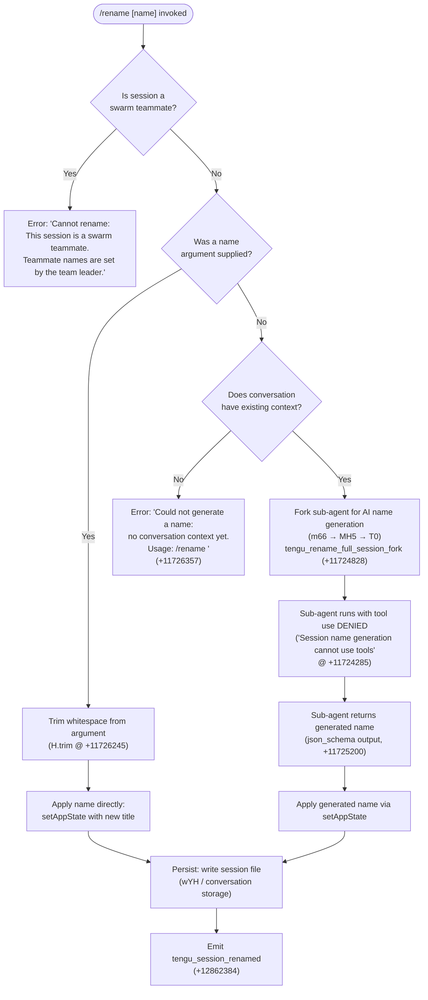

# `/rename`

> Analysis basis: CC v2.1.152 bundle.js (AST extraction + Claude interpretation)
> Minimum version: v2.1.152

---

## Overview

The `/rename` command (also aliased as `/name`) renames the current Claude Code conversation session. It accepts an optional `[name]` argument: when a name is provided the session is renamed directly; when no name is provided and conversation context exists, the command invokes an AI-powered sub-agent to generate a title automatically. Renaming a swarm teammate session is explicitly blocked — only the team leader may set teammate names.

---

## Registration

| Field | Value |
|---|---|
| type | `local-jsx` |
| name | `rename` |
| description | `Rename the current conversation` |
| argumentHint | `[name]` |
| aliases | `["name"]` |
| immediate | `true` |
| module_id | `Db1` |
| load_inline | `true` |
| loc_byte | `11726982` |
| loc_byte_end | `11727181` |
| loc_line | `9695` |
| arbor_handler.name | `fH5` |
| arbor_handler.fqn | `claude-2.1.152::fH5` |
| arbor_handler.kind | `AsyncFunction` |
| arbor_handler.resolution_path | `module_id` |
| arbor_handler.n_hits | `0` |

Analysis basis: CC v2.1.152 bundle.js:+11726982

---

## Input Branching

Four distinct execution paths exist depending on session type, presence of an explicit name argument, and availability of existing conversation context. A Mermaid flowchart is required.



---

## Behavioral Spec

### Top-level handler — `renameCommandHandler` (`fH5`)

The Arbor-resolved handler is `fH5` (AsyncFunction, resolved via `module_id` path).
It is the entry point called by the CLI runtime when `/rename` or `/name` is typed.

```
async function renameCommandHandler(commandContext, nameArgument):
    sessionState = getSessionContext(commandContext)           // hM → q0 @ +11726120

    if sessionState.isSwarmTeammate:
        displayError("Cannot rename: This session is a swarm teammate. ...")
        return                                                  // literal @ +11726140

    trimmedName = nameArgument.trim()                          // H.trim @ +11726245

    if trimmedName is non-empty:
        applyRename(trimmedName, origin="explicit")
    else:
        launchAutoRenameFlow(commandContext)
```

Analysis basis: CC v2.1.152 bundle.js:+11726678

---

### Swarm teammate guard

```
function isSwarmTeammate(sessionState):
    // Checks a flag on the current session's appState
    // If true, rename is prohibited
    return sessionState.swarmRole == "teammate"
```

Error string (verbatim literal, ≤30 chars shown): `"Cannot rename: This session…"` (full at +11726140).

Analysis basis: CC v2.1.152 bundle.js:+11726120

---

### Explicit-name path — `applyRename` (via `TV8` → `_.setAppState`)

```
function applyRename(newName, origin):
    // 1. Update in-memory app state
    setAppState({ sessionTitle: newName })                     // TV8 → _.setAppState @ +11726485

    // 2. Persist to disk
    writeConversationFile(newName)                             // wYH @ +11726527

    // 3. Update filesystem path helper
    updateBasenameHelper(newName)                              // sw @ +11726531

    // 4. Emit telemetry
    emit("tengu_session_renamed")                              // @ +12862384
```

The log entry written by `YMH` tags the title source as `"custom-title"` (+12862292).

Analysis basis: CC v2.1.152 bundle.js:+11726485

---

### Auto-name generation path — `autoRenameFlow` (`m66`)

When no explicit name is provided and conversation context exists, the command forks a restricted sub-agent to produce a session title via the model.

```
async function autoRenameFlow(commandContext):
    emit("tengu_rename_full_session_fork")                    // @ +11724828

    // Fork agent with severely restricted capabilities
    subAgentConfig = buildSubAgentConfig(commandContext)      // al_ @ +11724866
    subAgentConfig.toolPolicy = "deny"                        // literal "deny" @ +11724270
    subAgentConfig.toolDenyMessage = "Session name generation cannot use tools"
                                                              // literal @ +11724285

    // Run the sub-agent (MH5 → T0)
    result = await runForkedAgent(subAgentConfig)             // MH5 @ +11724885

    // Extract text response (output type "text" @ +11724611)
    generatedName = extractNameFromResult(result)             // Yb1 @ +11724675

    if generatedName is empty or null:
        displayError("Could not generate a name: no conversation context yet. Usage: /rename <name>")
        return                                                  // literal @ +11726357

    applyRename(generatedName, origin="ai")
```

The log entry for AI-generated names tags the title source as `"ai-title"` (+12862457).
The sub-agent result is expected to conform to a `json_schema` output format (+11725200).

Analysis basis: CC v2.1.152 bundle.js:+11724825

---

### Sub-agent execution — `runForkedAgent` (`MH5` → `T0`)

```
async function runForkedAgent(config):
    abortController = new AbortController()
    config.signal.addEventListener("abort", () => abortController.abort())
                                                              // MH5 @ +11724074, literal "abort" @ +11724093

    // Build the API query context (T0)
    queryContext = buildQueryContext(config)                   // T0 @ +11724152

    // The forked agent receives only "other" role context,
    // mode tagged as "rename" and "rename_generate_name"
    // literals: "other" @ +11724349, "rename" @ +11724364
    //           "rename_generate_name" @ +11724388

    response = await executeQuery(queryContext)               // T0 call graph

    return response
```

The query execution pipeline (`T0`) includes conversation history serialization (`PV8`), context formatting (`Py → PRH → FHK`), API dispatch (`FHK → NP`), and response extraction (`Yb1 → XS`).

Analysis basis: CC v2.1.152 bundle.js:+11724152

---

### Conversation history serialization — `buildMessagePayload` (`PV8`)

```
function buildMessagePayload(messages):
    filtered = []
    for message in messages:
        if message.isMeta: continue                           // literal "isMeta" @ +11721504
        if message.origin != "human": continue                // literal "origin" @ +11721539
                                                              // literal "human" @ +11721579
        filtered.push(message)
    joined = filtered.join(separator)                         // PV8 → _.join @ +11721759
    return joined.slice(maxLength)                            // PV8 → A.slice @ +11721791
```

Analysis basis: CC v2.1.152 bundle.js:+11721643

---

### Session file persistence — `writeConversationFile` (`wYH`)

```
async function writeConversationFile(newTitle):
    basePath = resolveConversationPath()                       // uK @ +4075837
    fileData = readCurrentSessionData()                        // n9 → BP.readFile @ +4074406
    fileData.title = newTitle
    atomicWrite(basePath, fileData)                            // d5 → dO @ +4073634
                                                              // dO uses random bytes + rename for atomicity
```

The atomic write helper (`dO`) uses `hq_.randomBytes` (+2226462) to generate a temp filename, writes to it, then calls `fe.rename` (+2226562) — standard write-then-rename atomicity pattern.

Analysis basis: CC v2.1.152 bundle.js:+4075837

---

### Name display update — `updateBasenameHelper` (`sw`)

```
function updateBasenameHelper(newName):
    base = path.basename(newName)                             // sw → FP.basename @ +4073196
    updateDisplayLabel(base)                                  // sw → y6 @ +4073218
```

Analysis basis: CC v2.1.152 bundle.js:+11726531

---

## State & Side Effects

| Item | Detail |
|---|---|
| Telemetry: `tengu_rename_full_session_fork` | Fired when auto-name generation sub-agent is launched (bundle.js:+11724828) |
| Telemetry: `tengu_session_renamed` | Fired after any successful rename (explicit or AI-generated) (bundle.js:+12862384) |
| Telemetry: `tengu_agent_name_set` | Fired when an agent name is assigned (bundle.js:+12865413) |
| Telemetry: `tengu_forked_agent_default_turns_exceeded` | Fired if sub-agent exceeds turn budget (bundle.js:+10665111) |
| Telemetry: `tengu_fork_agent_query` | Fired per sub-agent query iteration (bundle.js:+10665554) |
| `appState` changes | `sessionTitle` updated via `_.setAppState` (bundle.js:+11726485) |
| Session file write | Atomic rename-based write to conversation JSON on disk via `wYH`/`dO` |
| Log tag (explicit name) | Title source tagged `"custom-title"` in session log (bundle.js:+12862292) |
| Log tag (AI name) | Title source tagged `"ai-title"` in session log (bundle.js:+12862457) |
| Hook registration | AbortController wired to parent signal; sub-agent aborted if parent session aborts (bundle.js:+11724074) |
| Tool policy | Sub-agent tool use is hard-denied during auto-name generation; all tool calls rejected with message `"Session name generation cannot use tools"` (bundle.js:+11724285) |
| Sound | None detected in depth-2 traversal |

---

## Version History

| Version | Change |
|---|---|
| v2.1.152 | Initial analysis |

---

## Common Mistakes

1. **Expecting rename to work in swarm teammate sessions** — the command is unconditionally blocked for swarm teammates. Only the team leader can set a teammate's name. The error message is emitted immediately with no fallback.
2. **Invoking `/rename` with no argument and no prior conversation** — when there are no messages yet in the session, auto-name generation cannot proceed and returns an error. Always supply an explicit name at the start of a fresh session: `/rename <name>`.
3. **Assuming tool use is available during auto-name generation** — the sub-agent spawned for AI title generation runs in a fully tool-denied environment. Any attempt to extend the auto-rename logic with tool calls will be rejected.
4. **Treating the alias `/name` as a separate command** — `/name` is registered as a direct alias for `/rename` and has identical behavior.
5. **Not accounting for the async disk write** — the session file write is asynchronous and atomic (write-then-rename). External tooling reading the session file immediately after the command may briefly see the old name.

---

## Appendix — Identifier Mapping

> For bundle debugging only. Identifiers change across versions.

| Identifier | Role |
|---|---|
| `fH5` | Top-level rename command async handler (Arbor-resolved entry point) |
| `GV8` | Initial command dispatch / guard helper called from handler |
| `TV8` | Core rename execution function (explicit-name path, setAppState) |
| `hM` | Session context retrieval helper |
| `q0` | AsyncLocalStorage / store accessor (uses `Kq_.getStore`) |
| `H` | General utilities object (Math.random, setTimeout, trim, includes) |
| `m66` | Auto-rename orchestrator (forks sub-agent for name generation) |
| `E6` | Configuration / experiment store access helper |
| `hO6` | Config store sub-helper A |
| `SO6` | Config store sub-helper B |
| `oe` | Config accessor wrapper |
| `uH` | String coercion utility |
| `Qb` | Config queue / batch helper |
| `P68` | Experiment flag cache checker |
| `$$_` | Experiment enrollment emitter |
| `w$_` | Config write-back helper |
| `x6` | Config file read/write coordinator |
| `zzH` | Low-level config file I/O (readFileSync, mkdirSync, copyFileSync) |
| `C_7` | File watcher registration helper |
| `al_` | Sub-agent configuration builder (sets timestamp, quota) |
| `MH5` | Sub-agent runner (wires AbortController, calls T0) |
| `T0` | Forked agent query executor (main query pipeline) |
| `I28` | Agent state initializer (getAppState / setAppState cycle) |
| `Ry` | Random bytes generator |
| `v_H` | Model/version helper |
| `N` | Text normalization / message formatting utility |
| `Su` | Command lifecycle event reporter |
| `fV6` | Message type membership checker (tombstone, tool_use_summary, etc.) |
| `m21` | Message type secondary checker |
| `D` | Background spare agent pool manager |
| `D7H` | Deferred tool filter helper |
| `vFL` | Fork agent result renderer |
| `T8` | Subprocess / transport handler |
| `X` | Buffer stream reader |
| `J` | Transport wrapper |
| `q` | File/process operations bundle |
| `Yb1` | Response text extractor from sub-agent result |
| `XS` | String trim helper (for extracted name) |
| `GH` | String coercion display helper |
| `PV8` | Conversation history serializer / message payload builder |
| `_` | Array/utility generic |
| `Py` | Query pipeline entry (context builder + API caller) |
| `EK` | Error/result kind classifier |
| `l08` | Conversation file loader / cache manager |
| `c08` | Conversation cache key builder |
| `fT` | Full conversation turn processor |
| `ySL` | Message list normalizer |
| `b6` | Key-value store helper |
| `CH` | JSON serializer wrapper |
| `B6` | JSON parser wrapper |
| `sD1` | Conversation save helper |
| `L8` | Logger / error reporter base |
| `L` | Promise lifecycle tracker |
| `PRH` | API response handler |
| `fQ_` | Conversation loader for API context |
| `FHK` | Full API query orchestrator (tool schema, streaming, retries) |
| `NP` | Auth provider resolver |
| `yA` | Auth credential builder |
| `sL` | Service URL selector |
| `aA_` | API key type detector (managed key / sk-ant prefix) |
| `g9` | Auth header composer |
| `LBH` | Auth context builder |
| `gG` | Post-query cleanup helper |
| `JK` | Message filter (post-response) |
| `$SH` | MCP server manager / tool provider |
| `y6` | Ink/React render helper |
| `pv` | React element factory |
| `uI` | React component utility |
| `mM` | MCP tool list formatter |
| `oh` | MCP server display helper |
| `z_` | MCP display item builder |
| `Ph` | Session log writer (appends to file) |
| `Ov` | Log format builder |
| `YMH` | Low-level log append (appendFileSync, mkdirSync) |
| `I4` | Log file path resolver |
| `o_H` | AI-title log writer |
| `TT` | Terminal title updater |
| `Wa` | Conversation state watcher |
| `f` | MCP manager singleton |
| `lhH` | MCP connection lifecycle manager |
| `r6H` | MCP server config builder |
| `pV` | MCP transport factory |
| `K` | MCP client registry |
| `e8` | Generic error handler |
| `iE6` | MCP capability inspector |
| `RbL` | MCP reconnect/retry scheduler |
| `zM8` | MCP status reporter |
| `$M8` | MCP health checker |
| `O8` | MCP debug logger |
| `EQ_` | MCP OAuth flow initiator |
| `VQ_` | MCP OAuth callback handler |
| `xJ1` | MCP connection state tracker |
| `TQ_` | MCP tool availability checker |
| `qv_` | MCP transport type validator |
| `j` | MCP process registry |
| `y` | MCP write stream handler |
| `XL` | MCP error logger |
| `SJ1` | MCP session resumption helper |
| `rE6` | MCP port parser |
| `Vd_` | MCP port validator |
| `dPK` | MCP update applicator |
| `bG8` | MCP config serializer |
| `xI` | MCP client cleanup helper |
| `$` | MCP server lifecycle tracker |
| `Sn1` | MCP server snapshot builder |
| `yR5` | MCP full refresh orchestrator |
| `DM8` | MCP server filter (by connection state) |
| `n8` | Generic retry-with-timeout helper |
| `HH6` | MCP config hash builder |
| `N_H` | MCP notification handler |
| `J5H` | Agent name setter (swarm) |
| `rg` | Agent name persistence writer |
| `yM6` | Agent name file read/write |
| `z$` | NWH wrapper / daemon bridge |
| `NWH` | Daemon communication helper |
| `sT8` | App state key enumerator |
| `wYH` | Conversation file persistence orchestrator |
| `uK` | Conversation path resolver |
| `rG` | Base path builder |
| `n9` | Conversation file reader (with cache) |
| `j8` | Logger utility |
| `aw` | Cache entry invalidator |
| `d5` | Atomic conversation file writer |
| `dO` | Low-level atomic write (randomBytes + rename) |
| `hH` | Error logger with queue management |
| `n_` | Error string formatter |
| `V1` | Error queue item builder |
| `mGA` | Error string coercion helper |
| `UtK` | Error queue shift/push manager |
| `sw` | Display basename updater |

---

Note: index built via Arbor fallback; some signals (telemetry, literals) may be missing — see arbor-fallback.js.