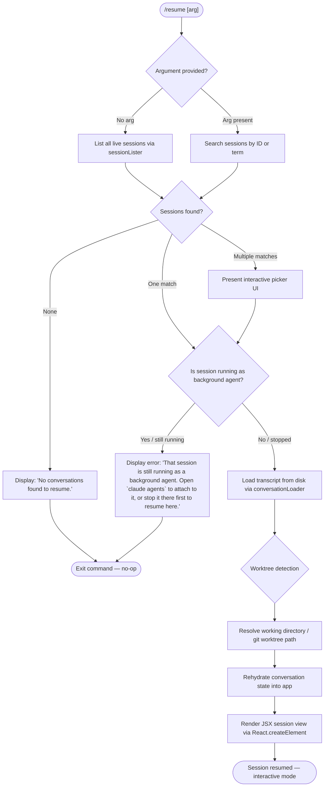

# `/resume`

> Analysis basis: CC v2.1.153 bundle.js (AST extraction + Claude interpretation)
> Minimum version: v2.1.153

---

## Overview

The `/resume` command (also available as `/continue`) restores a previous Claude Code conversation by session ID or fuzzy search term. It loads the stored conversation transcript from disk, validates session state, filters out sessions that are still running as background agents, and then rehydrates the UI with the recovered message history — enabling the user to pick up exactly where they left off.

---

## Registration

| Field | Value |
|---|---|
| type | `local-jsx` |
| name | `resume` |
| description | `Resume a previous conversation` |
| aliases | `["continue"]` |
| argumentHint | `[conversation id or search term]` |
| module_id | `gp1` |
| load_inline | `true` |
| loc_byte | `11860547` |
| loc_byte_end | `11860744` |
| loc_line | `8672` |
| arbor_handler.name | `Xq5` |
| arbor_handler.fqn | `claude-2.1.153::Xq5` |
| arbor_handler.kind | `AsyncFunction` |
| arbor_handler.resolution_path | `module_id` |
| arbor_handler.n_hits | `0` |

Analysis basis: CC v2.1.153 bundle.js:+11860547

---

## Input Branching

The handler has 5+ distinct paths depending on session discovery results and session state; a Mermaid flowchart is used.



Analysis basis: CC v2.1.153 bundle.js:+11859149, +11859584, +11859147, +11859370, +11859435

---

## Behavioral Spec

### 1. Session Discovery (`sessionLister` / `gLH`)

The handler begins by enumerating all available saved sessions.

```
async function sessionLister(context):
    # Immediately resolve a baseline promise
    await Promise.resolve()

    # Enumerate all live daemon sessions
    sessions = await listAllLiveSessions(context)

    # Filter to sessions whose type is "interactive"
    interactiveSessions = sessions.filter(s => s.type === "interactive")

    return interactiveSessions
```

- The string `"interactive"` is the discriminator for resumable sessions.
  (Analysis basis: CC v2.1.153 bundle.js:+8764653)
- `A.listAllLiveSessions` is called at `+8764562`; helper `utH` is called at `+8764540`.

### 2. Argument Filtering and Session Matching (`Xq5` main handler)

```
async function resumeHandler(args, appState):
    searchTerm = args.trim()
    sessions   = await sessionLister(appState)

    if searchTerm is empty:
        candidates = sessions
    else:
        candidates = sessions.filter(s =>
            s.id.includes(searchTerm) OR
            s.title.toLowerCase().includes(searchTerm.toLowerCase())
        )

    if candidates.length === 0:
        display("No conversations found to resume.")
        return

    if candidates.length > 1:
        chosen = await showInteractivePicker(candidates)
    else:
        chosen = candidates[0]

    if isBackgroundAgentRunning(chosen):
        display("That session is still running as a background agent. ...")
        return "skip"

    return loadAndResumeSession(chosen, appState)
```

- "No conversations found to resume." literal: CC v2.1.153 bundle.js:+11859584
- Background-agent guard error literal (first ~30 chars): `"That session is still running…"` — bundle.js:+11859149
- Return value `"skip"` signals the CLI shell to take no further action: bundle.js:+11859352
- Message role `"user"` used when reconstructing synthetic opener message: bundle.js:+11859290

### 3. Worktree Detection (`worktreeResolver` / `yRH`)

Before loading transcript content, the handler resolves the correct working directory, accounting for Git worktrees.

```
function worktreeResolver(sessionRecord, timestamp):
    # Run: git worktree list --porcelain
    rawOutput = spawnSync(["git", "worktree", "list", "--porcelain"])
    lines      = rawOutput.split("\n")

    # Parse each worktree block
    worktrees = lines
        .filter(l => l.startsWith("worktree "))   # prefix length 9
        .map(l => l.slice(9))                      # strip "worktree " prefix

    # Normalize Unicode (NFC) before path comparison
    target = sessionRecord.path.normalize("NFC")

    match = worktrees.find(wt => target.startsWith(wt))
    if match:
        return resolvedMatch

    # Fall back to sorted list for fuzzy comparison
    ranked = worktrees
        .filter(wt => ...)
        .sort((a, b) => a.localeCompare(b))
    return ranked[0] ?? sessionRecord.path
```

- Literals `"worktree"`, `"list"`, `"--porcelain"` at bundle.js:+11856149, +11856160, +11856167
- Prefix `"worktree "` (with trailing space, length 9) at +11856368 / +11856399
- `"NFC"` normalization at +11856412
- `localeCompare` call at +11856586
- `tengu_worktree_detection` telemetry event emitted during this phase: +11856249

### 4. Transcript Loading and History Reconstruction (`conversationLoader` / `cLH`)

```
async function conversationLoader(sessionId, appState):
    rawEntries = await readTranscriptFromDisk(sessionId)

    # Parse each entry; skip records of unsupported types
    messages = []
    for entry in rawEntries:
        if entry.type in ["assistant", "user", "attachment", "system"]:
            messages.push(parseEntry(entry))
        elif entry.type in ["progress", "compact_boundary"]:
            handleMetaRecord(entry)
        # attribution-snapshot, file-history-snapshot etc. update internal maps

    # Deduplicate by UUID; resolve parent-chain links
    chain = buildParentChain(messages)

    # Apply compact-boundary markers; reconstruct summary segments
    return applyCompactBoundaries(chain)
```

- Entry-type literals: `"assistant"` (+12815886), `"attachment"` (+12815908), `"system"` (+12815931), `"progress"` (+12816218), `"uuid"` (+12816230)
- `"compact_boundary"` marker: +10453258
- `"summary"` metadata key: +12857902
- `"last-prompt"` key: +12857969
- `tengu_transcript_phantom_parent` event on broken parent links: +12856735
- `tengu_transcript_parent_cycle` on cycle detection: +12860314

### 5. Session-Metadata Map Population (`sessionStateWriter` / `S_H`)

After the chain is built, a large number of Map entries are populated with session-scoped metadata.

```
function sessionStateWriter(chain, maps):
    maps.summary.set(sessionId, summaryText)
    maps.lastPrompt.set(sessionId, lastPromptText)
    maps.customTitle.set(sessionId, customTitle)
    maps.aiTitle.set(sessionId, aiTitle)
    maps.tag.set(sessionId, tag)
    maps.agentName.set(sessionId, agentName)
    maps.agentColor.set(sessionId, agentColor)
    maps.agentSetting.set(sessionId, agentSetting)
    maps.mode.set(sessionId, mode)
    maps.permissionMode.set(sessionId, permissionMode)
    maps.isolationLatch.set(sessionId, isolationLatch)
    maps.worktreeState.set(sessionId, worktreeState)
    maps.prLink.set(sessionId, prLink)
    maps.bridgeSession.set(sessionId, bridgeSession)
    ...
```

- Key literals: `"summary"` (+12857902), `"last-prompt"` (+12857969), `"custom-title"` (+12858065), `"ai-title"` (+12858143), `"tag"` (+12858213), `"agent-name"` (+12858274), `"agent-color"` (+12858348), `"agent-setting"` (+12858424), `"mode"` (+12858504), `"permission-mode"` (+12858567), `"isolation-latch"` (+12858651), `"worktree-state"` (+12858725), `"pr-link"` (+12858809), `"bridge-session"` (+12858940)

### 6. Completion-Picker and Autocomplete (`completionProvider` / `jl`)

The `/resume` command provides live autocomplete suggestions in the CLI prompt.

```
function completionProvider(partialInput, appState):
    sessions    = worktreeResolver(...)
    allSessions = loadAllSessionHeaders()

    # Lower-case comparison for prefix matching
    query = partialInput.toLowerCase()

    candidates = allSessions
        .filter(s => s.id.includes(query) OR s.title.toLowerCase().includes(query))
        .slice(0, MAX_COMPLETIONS)

    # Deduplicate by caching in a Map keyed by session ID
    seen = new Map()
    for s in candidates:
        if not seen.has(s.id):
            seen.set(s.id, s)

    return Array.from(seen.values())
        .sort((a, b) => b.mtime - a.mtime)   # most-recent first
```

Analysis basis: CC v2.1.153 bundle.js:+12852037, +12852062, +12852162, +12852210, +12852284, +12852310

### 7. Error Rendering (`errorRenderer` / `Up1`)

When an unresolvable error state occurs (e.g., `"sessionNotFound"` or `"multipleMatches"` without user input), the error label is formatted in bold.

```
function errorRenderer(errorCode):
    label = resolveErrorLabel(errorCode)
    return j6.bold(label)
```

- Error-code literals: `"sessionNotFound"` (+11856793), `"multipleMatches"` (+11856864)
- `j6.bold` call at +11856828

### 8. Telemetry Event — Slash-Command Identifiers

Two custom telemetry string constants are written to the app state when the command fires:

- `"slash_command_session_id"` (+11859845) — records the resolved session ID for analytics
- `"slash_command_title"` (+11860069) — records the human-readable title of the resumed session

---

## State & Side Effects

| Item | Detail |
|---|---|
| Telemetry: `tengu_worktree_detection` | Emitted during Git-worktree path resolution (bundle.js:+11856249) |
| Telemetry: `tengu_transcript_phantom_parent` | Emitted when a transcript entry references a non-existent parent UUID (+12856735) |
| Telemetry: `tengu_transcript_parent_cycle` | Emitted when a parent-chain cycle is detected (+12860314) |
| Telemetry: `tengu_chain_parent_cycle` | Chain-level cycle guard (+12838212) |
| Telemetry: `tengu_chain_timestamp_fallback` | Emitted when message timestamp ordering must fall back (+12838361) |
| Telemetry: `tengu_chain_parallel_tr_recovered` | Emitted on parallel-transcript recovery (+12840227) |
| Telemetry: `tengu_relink_walk_broken` | Emitted when the re-link walk encounters a broken node (+12837722) |
| appState changes | Session metadata maps populated: summary, last-prompt, custom-title, ai-title, tag, agent-name, agent-color, agent-setting, mode, permission-mode, isolation-latch, worktree-state, pr-link, bridge-session |
| `slash_command_session_id` | Written to appState when a session is resolved (+11859845) |
| `slash_command_title` | Written to appState with resolved session title (+11860069) |
| Disk reads | Transcript JSONL read synchronously via `lh.openSync` / `lh.readSync` / `lh.closeSync`; see `zD5` call graph |
| React render | `Ew.createElement` called at +11859435 to mount the resumed session JSX |
| Background-agent guard | If target session is a live background agent, command aborts with `"skip"` and displays advisory message |
| No audio/hook side effects | No sound or hook registration found in depth-2 traversal |

---

## Version History

| Version | Change |
|---|---|
| v2.1.153 | Initial analysis |

---

## Common Mistakes

1. **Using `/resume` while the target session is still running as a background agent** — The command will refuse with an explicit advisory error rather than attaching. Use `/agents` to view or stop the background session first.
2. **Providing a search term that matches multiple sessions** — An interactive picker will appear; if the terminal cannot render it (e.g., in a pipe), the command may stall. Provide a more specific ID to avoid ambiguity.
3. **Expecting `/resume` to restore unsaved in-memory state** — The command only reads persisted transcript files from disk. Work that was never flushed to the JSONL transcript will not be recovered.
4. **Forgetting the `/continue` alias** — Both `/resume` and `/continue` invoke the identical handler; either can be used.
5. **Running `/resume` from a different working directory than the original session** — Worktree detection runs automatically, but if the worktree path no longer exists on disk the fallback path may be incorrect, leading to mismatched project context.

---

## Appendix — Identifier Mapping

> For bundle debugging only. Identifiers change across versions.

| Identifier | Role |
|---|---|
| `Xq5` | Main async handler for `/resume` (arbor_handler) |
| `Fp1` | Pre-filter helper; filters session list before passing to `cf` |
| `cf` | Session candidate formatter / converter |
| `gLH` | Session lister — calls `listAllLiveSessions`, returns interactive sessions |
| `yH` | Error/warning logger utility |
| `l_` | Low-level error constructor wrapper |
| `xH` | String coercion utility |
| `_1` | Utility delegating to `fZA` |
| `fZA` | Internal string formatter using `xH` |
| `GH4` | Queue manager (shift/push operations on `cU6`) |
| `EH` | String-to-display helper |
| `yRH` | Worktree detection and path resolution function |
| `G_` | Session-spawn orchestrator; delegates to `jGH` and `D` |
| `jGH` | Child-process manager (spawn, kill, timeout, signals) |
| `JvA` | Process argument builder |
| `Hi8` | Helper using `LvA` |
| `_i8` | Helper using `LvA` and `F84` |
| `qi8` | Helper using `d84` |
| `VVA` | Numeric validation guard (`Number.isFinite`) |
| `n76` | Error factory with `Boolean` coercion |
| `en8` | `Reflect.apply` / `Reflect.defineProperty` proxy wrapper |
| `eVA` | Event-listener registration helper (`H.on`) |
| `EVA` | Timeout/race helper for process operations |
| `vVA` | Process kill + promise-finally helper |
| `TVA` | Process stdio binding |
| `ZVA` | `H.kill` binding |
| `sVA` | Promise.all aggregate for process teardown |
| `a76` | Calls `bn8` — sub-process lifecycle hook |
| `oVA` | Pipe attachment helper (`A.pipe`) |
| `aVA` | Stream add helper (`nVA.default`) |
| `yVA` | `dn8` binding helper |
| `D` | Daemon dispatch / orchestrator |
| `T6` | Session registry lookup with Set/Map operations |
| `wk8` | Memory-check and platform-detect helper (`macos` + `1024` MB threshold) |
| `wLA` | Background-spare daemon spawn routine (`Bun.spawn`) |
| `Wz` | Shared context or config accessor |
| `N` | Log/message formatter with case normalization |
| `J8` | Generic error-throw or abort helper |
| `r84` | String conversion wrapper |
| `O_` | Path or option resolver |
| `Fv` | File-system constant / path primitive |
| `KN8` | Completion provider entry — delegates to `Fk6` |
| `Fk6` | Autocomplete logic: resolves paths, calls `LHK`, `LCH` |
| `LHK` | File-tree walker and completion-list builder |
| `Kc` | Project-dir path joiner (`dwH.join`) |
| `W` | String replacer (calls `qL`) |
| `K` | Column formatter (`padEnd`, `map`) |
| `sA` | Async helper used inside `LHK` |
| `J2H` | Completion-item slicer and pusher |
| `S_A` | Recursive directory reader for completions |
| `Ck6` | Map-based completion cache (get/set/values) |
| `Ez` | String replacer and slicer using `A64` |
| `G` | Keyboard/event handler with `preventDefault` |
| `Y` | Supervisor / MCP config writer |
| `E` | MCP server start/stop/update handle |
| `j` | Process values iterator (kill) |
| `X` | Stream buffer handler with `indexOf` and `subarray` |
| `P` | MCP connection manager (`mC8`, `Vh`, `Uu`) |
| `J` | Stream wrapper delegating to `w` |
| `T` | MCP transport layer (`yV6`, `mC8`) |
| `LCH` | Binary content loader — `Buffer.alloc`, `TD5` |
| `TD5` | Content-type parser using `MHK` and `N` |
| `xo` | Regex tester using `pc7.test` |
| `Ea` | UI element or prompt builder |
| `cLH` | Full conversation loader — orchestrates `S_H`, `dLH`, etc. |
| `S_H` | Session-state writer — populates all metadata Maps |
| `UY5` | Map-set initializer called from `S_H` |
| `m` | Timeout-backed write buffer (`clearTimeout`, `$.write`) |
| `DC` | Sub-operation in `S_H` state initialization |
| `SOA` | Array-pop/push utility with `Array.isArray` guard |
| `yOA` | Regex-based filter helper |
| `hOA` | String-replace helper |
| `GJ` | Map-set helper used in `pe1` and `S_H` |
| `f` | MCP server state manager (calls `YSH`, `EWK`) |
| `YSH` | Full MCP server connection setup routine |
| `EWK` | MCP update applicator (`applyMcpUpdate`, cleanup) |
| `Qb5` | MCP client filter and roster builder |
| `O` | Map wrapper calling `N8` |
| `N8` | Notification or name registry |
| `z` | Daemon stop/start state machine |
| `SH` | Shared-state read using `c` |
| `uH` | Shared-state write using `c` |
| `Dy` | Event-queue pusher (`EQ.push`, `TEH`, `JO_`) |
| `wm` | Shutdown race (`Promise.race`, `process.exit`) |
| `w` | Worker/daemon connection manager |
| `R` | Session write handler (`z.write`, `Wz`, `N`) |
| `TD6` | Config file reader (`BP.readFile`, `JSON` parse) |
| `B` | Session-retirement helper (`retireIfSettled`) |
| `jLA` | Daemon socket connector (`nC8.connect`, `M.on`) |
| `ZLA` | Session lifecycle finalizer (done/killed/crashed states) |
| `S` | Timeout-clear wrapper |
| `V` | Map of active sessions |
| `Q` | Transcript-file manager (`iv6`, `CI1`) |
| `iv6` | Reads transcript file (`tu.readFile`) |
| `CI1` | Deletes transcript file (`tu.unlink`) |
| `I` | Away-summary state tracker |
| `o28` | State selector (`sLH.getState`) |
| `XS5` | Calls `C4A` — cache-safe params accessor |
| `wwK` | Rate-limit status checker |
| `G58` | Away-summary generator (abort-signal, `I0`, `Z8`) |
| `R01` | UUID generator (`jv.randomUUID`) |
| `g` | Generic container holding `B` and `$` |
| `h` | Away-summary scheduler (Math.min, `blurred`/`focused` states) |
| `CQ` | Shared constant used in `h` |
| `zD5` | Binary transcript parser (main JSONL reader) |
| `s` | Ref + timeout composite (one of several `s` usages) |
| `qHK` | Buffer.at accessor |
| `YH` | Buffer queue (`enqueue`, `x.push`) |
| `U6` | `JSON.parse` wrapper |
| `C` | Set wrapper referencing `R` |
| `y` | Writer referencing `z.write` and `c` |
| `$D5` | Buffer compare helper |
| `l` | Filter over `HH` |
| `_H` | Ref + timeout composite (alternate instance) |
| `a` | Ref + timeout composite (third instance) |
| `t` | Notification set (`H.addNotification`) |
| `qH` | Combines `t`, `YH`, `E`, `I` |
| `HH` | Voice-session orchestrator (recording, WebSocket, transcription) |
| `YD5` | Secondary binary reader (`lh.openSync`, `readSync`) |
| `x` | Throttled writer with `setTimeout` / `clearTimeout` |
| `b` | Timer handle with `unref` |
| `pe1` | Conversation-list cache manager (get/set/delete on `H`, `K`, `z`) |
| `oY5` | Walk helper for `pe1` (reverse/push) |
| `e8` | Delegates to `_` |
| `OD5` | JSONL entry parser (Buffer operations, `indexOf`, `compare`) |
| `EGH` | Encoding-detection dispatcher (`b_4`, `x_4`, `m_4`, `u_4`) |
| `b_4` | BOM-detection helper |
| `x_4` | Encoding-index searcher |
| `m_4` | JSON-fragment extractor (`indexOf`, `substring`, `JSON.parse`) |
| `u_4` | Alternative JSON-fragment extractor |
| `_9` | Calls `J8` — error/abort shortcut |
| `d` | Calls `_h8` — permission/deny helper |
| `_h8` | Low-level deny implementation |
| `r` | Combines `w` and `d` — allow/deny router |
| `Fk8` | `Date.parse` wrapper for timestamp parsing |
| `dLH` | Chain builder: resolves parent links, deduplicates, sorts |
| `tY5` | Timestamp validator (`Number.isNaN`) |
| `eY5` | Chain-entry enricher (filter, sort, Map operations) |
| `aY5` | Chain node appender (shift/push/sort) |
| `HHK` | Map merger helper (values/get/set/push) |
| `mtH` | Simple map over `H` |
| `B_A` | Message-body formatter (`replaceAll`, `slice`) |
| `fI6` | Message-body parser with `Array.isArray` guard |
| `r1` | Regex-exec based text splitter |
| `g_A` | Content-type guard (delegates to `HD5`, `_D5`) |
| `HD5` | Checks `trim` + `Array.isArray` + `some` |
| `_D5` | Alternate array check with `some` |
| `gk8` | Map get/set/push cache layer |
| `Qk8` | `Array.from` + `H.values` collector |
| `CT6` | Completion state machine (keys, values, dLH, many Map.get calls) |
| `KHK` | Completion initializer combining `DD5` and `S_H` via `Object.assign` |
| `DD5` | Directory-stat resolver for completions |
| `OS` | Calls `Fv` — file-system constant accessor |
| `OZ` | Recursive `readdir` expander |
| `y_A` | Completion entry builder (`H.at`, `B_A`, `mtH`, `g_A`) |
| `o5H` | UI element used in resume output |
| `jl` | Full autocomplete provider for `/resume` |
| `Up1` | Error label renderer (`j6.bold`) |