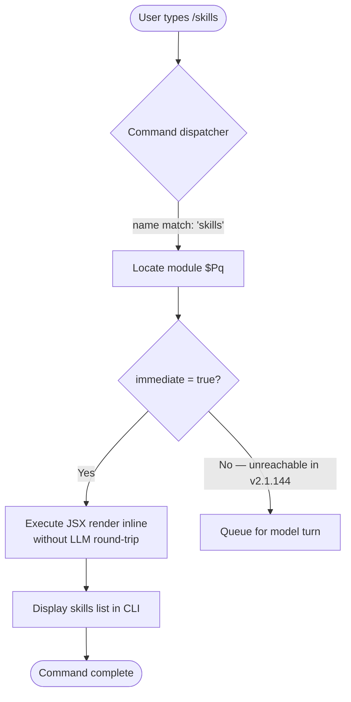

```
---
type: feature-spec
feature: "skills"
cc_version: 2.1.153
updated: "2026-05-19"
tags: ["skills", "commands", "slash-commands"]
source: "bundle-analysis"
bundle_verified: true
inherited_from: 2.1.144
analysis_basis: "CC v2.1.144 bundle.js (AST extraction + Claude interpretation)"
author: "ryujaeuk <ryujaeuk@gmail.com>"
repository: "https://github.com/MyLittleLuckyDog/cc-gnothi"
license: "AGPL-3.0-only"
---

# `/skills`

> Analysis basis: CC v2.1.144 bundle.js (AST extraction + Claude interpretation)
> Minimum version: v2.1.144

---

## Overview

The `/skills` slash command lists the skills available to the current Claude Code session. It is a local, immediate command implemented as a JSX component, meaning it renders output directly in the CLI interface without requiring a round-trip to the language model. No sub-commands, flags, or arguments were found in the extracted data.

## Registration

| Field | Value |
|---|---|
| type | `local-jsx` |
| name | `skills` |
| description | `List available skills` |
| immediate | `true` |
| module_id | `$Pq` |

Analysis basis: CC v2.1.144 bundle.js:+11305239

## Input Branching

The AST traversal of module `$Pq` returned an empty call graph and no string literals, indicating that the command's entry function was not resolved at depth ≤ 2. The branching logic below is therefore derived exclusively from the registration metadata and the structural properties of the `local-jsx` / `immediate` type pair.



Analysis basis: CC v2.1.144 bundle.js:+11305239 (registration fields `immediate: true`, `type: "local-jsx"`)

## Behavioral Spec

### Command Dispatch

Because the `immediate` flag is `true`, the dispatcher executes the command's JSX render function synchronously upon recognition of the `/skills` token, before the user submits any further input.

```
function dispatchSkillsCommand(parsedInput):
    if parsedInput.commandName == "skills":
        module = loadModule("$Pq")
        renderLocalJSX(module)          // synchronous; no model call
    return
```

Analysis basis: CC v2.1.144 bundle.js:+11305239

### JSX Render (Skills Listing)

The implementation resides in module `$Pq` and is typed `local-jsx`, meaning the result is a React/Ink JSX element rendered directly to the terminal. The specific list of skills rendered, the formatting, and any conditional display logic were not recoverable at traversal depth ≤ 2.

```
function renderSkillsList():
    skills = collectAvailableSkills()   // internals not resolved at depth ≤ 2
    element = buildJSXList(skills)
    return element                      // returned to CLI renderer for terminal output
```

<!-- TODO: not found in depth-2 traversal; needs --depth 4 -->

Analysis basis: CC v2.1.144 bundle.js:+11305239 (module `$Pq`, type `local-jsx`)

## State & Side Effects

| Item | Detail |
|---|---|
| Telemetry | None detected (`telemetry: []` in extracted data) |
| Hook registration | <!-- TODO: not found in depth-2 traversal; needs --depth 4 --> |
| appState changes | <!-- TODO: not found in depth-2 traversal; needs --depth 4 --> |
| Sound | <!-- TODO: not found in depth-2 traversal; needs --depth 4 --> |
| LLM round-trip | None — `immediate: true` prevents model invocation |
| Render target | Terminal inline (local JSX renderer) |

Analysis basis: CC v2.1.144 bundle.js:+11305239

## Version History

| Version | Change |
|---|---|
| v2.1.144 | Initial analysis — command registered as `local-jsx`, `immediate: true`, module `$Pq` |

## Common Mistakes

1. **Expecting model output**: Because `/skills` is `immediate` and `local-jsx`, it never sends a message to the language model. Callers that wait for a streamed model response after invoking `/skills` will time out — the response is rendered synchronously by the JSX layer.
2. **Assuming arguments are accepted**: No argument literals or sub-command strings were found in the extracted data. Passing arguments after `/skills` may be silently ignored or cause unexpected behavior; treat the command as taking no parameters until confirmed by a deeper traversal.
3. **Confusing "skills" with "tools"**: The command description is "List available skills", which is distinct from the tool-use system. The exact scope of what constitutes a "skill" in this context is not resolved at depth ≤ 2 and should not be assumed to be identical to the MCP tool list.
4. **Version-pinning on module ID**: The module identifier `$Pq` is a build-time artifact and will likely differ in future bundle versions. Any tooling that hard-codes `$Pq` must be re-validated on each release.

## Appendix — Identifier Mapping

> For bundle debugging only. Identifiers change across versions.

| Identifier | Role |
|---|---|
| `$Pq` | Module containing the `/skills` command implementation (local-jsx renderer) |

> No additional obfuscated function or variable identifiers were returned by the depth-2 AST traversal (`identifiers: []`). Deeper traversal is required to populate this table fully.
```