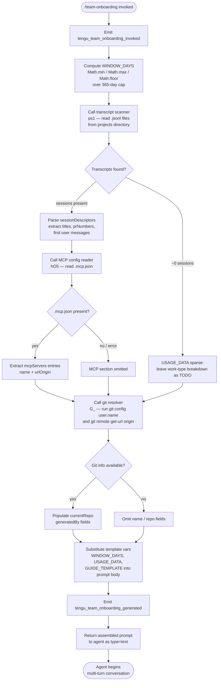

# `/team-onboarding`

> Analysis basis: CC v2.1.153 bundle.js (AST extraction + Claude interpretation)
> Minimum version: v2.1.153

---

## Overview

`/team-onboarding` is a `prompt`-type slash command that reads the invoking user's local Claude Code session transcripts from the past 365 days, derives a usage summary, and directs the agent to co-author a ready-to-share `ONBOARDING.md` guide for teammates who are new to Claude Code. The command collects transcript data, injects it into a structured prompt, and initiates a collaborative multi-turn conversation that ends with the guide written to disk.

---

## Registration

| Field | Value |
|---|---|
| type | `prompt` |
| name | `team-onboarding` |
| description | Help teammates ramp on Claude Code with a guide from your usage |
| isHidden | `false` |
| handler_method | `getPromptForCommand` |
| handler_method_start (byte) | `12648842` |
| handler_method_end (byte) | `12649552` |
| loc_byte | `12648504` |
| loc_byte_end | `12649553` |
| loc_line | `9909` |
| prompt_body.length | `4539` characters |
| prompt_body.trace | `identifier→$ (local→1 ext vars)` |
| arbor_handler.name | `getPromptForCommand` |
| arbor_handler.fqn | `claude-2.1.153::getPromptForCommand` |
| arbor_handler.kind | `Method` |
| arbor_handler.resolution_path | `direct` |
| arbor_handler.n_hits | `2` |
| `handler_method_start` | `12648842` |
| `handler_method_end` | `12649552` |

Analysis basis: CC v2.1.153 bundle.js:+12648504

---

## Input Branching

The handler performs data collection before assembling the prompt, with several distinct conditional paths based on transcript availability, MCP config presence, and git workspace state.



Analysis basis: CC v2.1.153 bundle.js:+12648842 (handler entry), +12649045 (Math.min/max/floor), +12649091 (365 literal), +12649280 (SO5 — data collection), +12649398 (reH — prompt assembly)

---

## Behavioral Spec

### 1. Invocation telemetry and window calculation

```
function handleTeamOnboarding(context):
    emit("tengu_team_onboarding_invoked")
    emit("tengu_flint_harbor_prompt")          // harbor-level prompt event

    rawDays = context.daysSinceInstall ?? DEFAULT
    windowDays = Math.floor(
        Math.max(1,
            Math.min(rawDays, 365)             // hard cap at 365 days
        )
    )
    return collectUsageData(windowDays)
```

Maximum look-back window: **365 days** (bundle.js:+12649091).
Math operations applied: `Math.min`, `Math.max`, `Math.floor` (bundle.js:+12649045–12649063).

---

### 2. Transcript scanning (`transcriptScanner` / `ps1`)

```
async function transcriptScanner(windowDays):
    cutoffMs = Date.now() - windowDays * 24 * 60 * 1000
    // time constants: 24 h * 60 min * 1000 ms (bundle.js:+12637340–12637349)

    projectsDir = resolveProjectsDirectory()   // uses "projects" path segment
    files = await fs.readdir(projectsDir)

    jsonlFiles = files.filter(f => path.extname(f) === ".jsonl")
    // extension filter: ".jsonl" (bundle.js:+12637455)

    sessions = []
    for file of jsonlFiles:
        stat = await fs.stat(join(projectsDir, file))
        if not stat.isFile(): continue

        raw = await fs.readFile(join(projectsDir, file), "utf-8")
        lines = raw.split("\n")

        // parse session-level fields from JSONL lines:
        //   - session title (via regex vO5)
        //   - prNumbers (via regex NO5)
        //   - first user message (via regex IO5)
        //   - MCP tool/call counts (weak signal when messages uninformative)
        //   - line beginning with "\"name\":\"mcp__" signals MCP tool presence

        descriptor = parseSessionDescriptor(lines, cutoffMs)
        if descriptor: sessions.push(descriptor)

    return sessions
```

The scanner reads only `.jsonl` files (bundle.js:+12637455), applies a time-based cutoff using `Date.now()` (bundle.js:+12637327), and walks up to the `projects` directory (bundle.js:+12639867 via `O_`/`_0`/`sv`). The string `"\"name\":\"mcp__"` (bundle.js:+12638034) and `"\"content\":["` (bundle.js:+12638384) are used as fast-path substring checks before applying full regex parsing. The constant `3` (bundle.js:+12638487) appears as a field-index offset in message parsing.

---

### 3. MCP configuration reader (`mcpConfigReader` / `hO5`)

```
async function mcpConfigReader(workspaceRoot):
    configPath = path.join(workspaceRoot, ".mcp.json")
    // filename literal: ".mcp.json" (bundle.js:+12639566)

    try:
        raw = await fs.readFile(configPath, "utf8")
        // encoding: "utf8" (bundle.js:+12639579)
        parsed = JSON.parse(raw)
        servers = parsed["mcpServers"] ?? {}
        // key: "mcpServers" (bundle.js:+12639622)

        return normalizeServerList(servers)   // X8 / N helpers
    catch:
        return []                             // absent or malformed → empty
```

Analysis basis: CC v2.1.153 bundle.js:+12639542–12639801

---

### 4. Git identity and repo resolver (`gitResolver` / `G_`)

```
async function gitResolver():
    userName = await runGit(["config", "user.name"])
    // args: "git", "config", "user.name" (bundle.js:+12640189–12640205)

    remoteUrl = await runGit(["remote", "get-url", "origin"])
    // args: "git", "remote", "get-url", "origin" (bundle.js:+12640261–12640280)

    repoName = path.basename(remoteUrl.trim())
    // via fk8.basename (bundle.js:+12640377)

    return { generatedBy: userName, currentRepo: repoName }
```

`runGit` is implemented via `jGH` (child-process executor), which uses `Bun.spawn` or equivalent, with `Promise.race` / timeout logic (`EVA`) and stdout/stderr capture (`oVA`, `aVA`).

Analysis basis: CC v2.1.153 bundle.js:+12640186–12640377

---

### 5. Prompt assembly and template variable substitution

```
function assemblePrompt(windowDays, usageData, guideTemplate, gitInfo):
    body = PROMPT_TEMPLATE           // 4539-char template (bundle.js:+12648504)

    body = body.replaceAll("{{WINDOW_DAYS}}", String(windowDays))
    // replaceAll call: bundle.js:+12649289; String() cast: bundle.js:+12649320

    body = body.replaceAll("{{USAGE_DATA}}", JSON.stringify(usageData))
    body = body.replaceAll("{{GUIDE_TEMPLATE}}", guideTemplate)
    // template placeholder literals (bundle.js:+12649302, +12649342, +12649377)

    emit("tengu_team_onboarding_generated")
    // bundle.js:+12649421

    return { type: "text", content: body }
    // return type literal "text" (bundle.js:+12649536)
```

Analysis basis: CC v2.1.153 bundle.js:+12649280–12649536

---

### 6. Agent-side conversation protocol (from prompt body)

The assembled prompt instructs the agent to follow a strict five-step protocol:

**Step 1 — Mandatory acknowledgment first.**
Before any reasoning, classification, or tool calls, the agent must emit a single acknowledgment line referencing the window duration. This is enforced by explicit ordering in the prompt body ("The guide creator is staring at a blank screen until you do").

**Step 2 — Work-type classification.**
The agent reads the `sessionDescriptors` array injected as `{{USAGE_DATA}}` and classifies each session into one of seven canonical task types:

| Internal key | Display label |
|---|---|
| `build_feature` | Build Feature |
| `debug_fix` | Debug Fix |
| `improve_quality` | Improve Quality |
| `analyze_data` | Analyze Data |
| `plan_design` | Plan Design |
| `prototype` | Prototype |
| `write_docs` | Write Docs |

The agent selects the top 3–5 types with rough percentages. If session first-messages are uninformative, tool and MCP call counts are used as a weak signal. New categories are invented only if no existing type fits.

**Step 3 — Repo and MCP context gathering.**
The agent starts with `currentRepo` from the injected data, then checks sibling workspace directories. For MCP servers, it uses `name` and `urlOrigin` to infer purpose and teammate access path.

**Step 4 — Write `ONBOARDING.md`.**
The agent fills the `{{GUIDE_TEMPLATE}}` scaffold with real numbers (not placeholders), renders ASCII bar charts using `█` (filled) and `░` (empty) at 20-character width, and uses `generatedBy` as the author name (omitted if missing). Team Tips and Get Started sections are left as TODO placeholders.

**Step 5 — Render, then open collaborative review.**
The agent renders the guide in a fenced code block, then appends a `---` rule and `**Review**` heading with exactly three numbered questions covering: team name confirmation, a starter task link, and team-specific tips not already in `CLAUDE.md`. After the user responds, the agent updates `ONBOARDING.md` and closes with a fixed verbatim confirmation line referencing `ONBOARDING.md`. Subsequent edits are applied to the file in place.

Analysis basis: CC v2.1.153 bundle.js:+12648842–12649552

---

## State & Side Effects

| Item | Detail |
|---|---|
| Telemetry — invocation | `tengu_team_onboarding_invoked` (bundle.js:+12649102) |
| Telemetry — prompt layer | `tengu_flint_harbor_prompt` (bundle.js:+12648879) |
| Telemetry — generation | `tengu_team_onboarding_generated` (bundle.js:+12649421) |
| Telemetry — share path | `tengu_flint_harbor_share` (bundle.js:+9504204, via `reH`) |
| Telemetry — config errors | `tengu_config_parse_error`, `tengu_config_lock_contention`, `tengu_config_stale_write`, `tengu_config_auth_loss_prevented` (reachable via config sub-path) |
| Telemetry — daemon/bg | `tengu_bg_dispatch_sigkill_escalate`, `tengu_bg_dispatch_low_mem`, `tengu_bg_spare_enable`, `tengu_bg_spare_claim`, `tengu_bg_spare_claim_fail`, `tengu_bg_low_mem_mb`, `tengu_bg_spare_spawn`, `tengu_daemon_control` (reachable via shared bg infra, not command-specific) |
| Telemetry — feature flags | `tengu_feature_ok`, `tengu_feature_bad` (reachable via feature-flag check in `reH` path) |
| File reads | Local Claude Code transcript `.jsonl` files under the `projects` directory (async, within 365-day window) |
| File reads | `.mcp.json` at workspace root (async, errors silently produce empty server list) |
| File writes | `ONBOARDING.md` written to current working directory by the agent after user confirms review questions |
| Subprocess | `git config user.name` and `git remote get-url origin` executed via child-process executor (`jGH`) |
| appState changes | None identified in depth-2 traversal |
| Sound | None identified in depth-2 traversal |
| Hook registration | `q3A.register` reachable via `H9` (watcher registration in `jq7`); not command-specific |

---

## Version History

| Version | Change |
|---|---|
| v2.1.153 | Initial analysis |

---

## Common Mistakes

1. **Expecting instant output.** The handler performs file I/O (transcript scan, `.mcp.json` read) and a subprocess (`git`) before returning the prompt. On large transcript directories the startup pause is expected — it is not a hang.
2. **Running outside a git repository.** The `git config user.name` and `git remote get-url origin` calls will fail silently; the `generatedBy` and `currentRepo` fields will be omitted from the guide rather than causing a hard error.
3. **No `.jsonl` transcripts present.** If the `projects` directory is empty or all transcripts fall outside the 365-day window, `USAGE_DATA` will be sparse and the agent will leave the work-type breakdown as a TODO placeholder rather than fabricating percentages.
4. **Editing `ONBOARDING.md` before the review questions are answered.** The agent defers Team Tips and Get Started content until after the three review questions; the initial draft is intentionally incomplete in those sections.
5. **Pasting the raw `ONBOARDING.md` into a chat instead of a new Claude Code session.** The guide is designed to be pasted into Claude Code by the *teammate*, not into a generic chat interface, to trigger an interactive walkthrough.
6. **Assuming the 365-day window is configurable at invocation.** The window cap is hardcoded (`Math.min(..., 365)` — bundle.js:+12649091); there is no argument to override it.

---

## Appendix — Identifier Mapping

> For bundle debugging only. Identifiers change across versions.

| Identifier | Role |
|---|---|
| `__handler_team-onboarding` | Synthetic BFS entry point for the command handler (not a real bundle symbol) |
| `T6` | Session/transcript processing orchestrator |
| `Dz6` | Sub-helper called from transcript orchestrator (branch A) |
| `wz6` | Sub-helper called from transcript orchestrator (branch B) |
| `wHH` | Inner helper within transcript orchestrator |
| `xH` | String conversion utility |
| `tb` | Token/session record builder |
| `qR` | Query/record constructor (calls `n_7`, `C$`, `p76`) |
| `O88` | Deduplication / seen-set check (uses `PO_`, `WzH` maps) |
| `XO_` | Session emitter / event dispatcher |
| `TEH` | Event type helper |
| `up` | Random-bytes / UUID helper (uses `BUq.randomBytes`) |
| `RH` | JSON serialization wrapper |
| `FA7` | Auxiliary formatter in event dispatch |
| `ZO_` | Secondary dispatch path in deduplication |
| `uIq` | Inner helper in secondary dispatch (`IgH`) |
| `o_` | App-state accessor (`Ap`) |
| `vUq` | Validation helper in secondary dispatch |
| `Y3H` | Feature-flag set membership check (`FrK.has`) |
| `b6` | Config / transcript file reader (calls `EzH`, `jq7`) |
| `B6` | Config directory path resolver |
| `CO_` | Config object constructor |
| `EzH` | Config file loader (reads, parses JSON, handles ENOENT) |
| `q` | Filesystem module alias (sync methods) |
| `U6` | JSON parse wrapper |
| `Pb` | Path prefix stripper (startsWith / slice) |
| `_` | Filesystem utility (readdirStringSync, statSync, etc.) |
| `J8` | Logging / debug emitter |
| `UUq` | Sibling-repo directory scanner |
| `N` | Log-level / debug formatter |
| `c` | General-purpose context/config accessor |
| `UO_` | Path join helper (joins to backups subdir) |
| `w` | Daemon / background process manager |
| `jq7` | File watcher (watchFile / unwatchFile) |
| `si` | Watcher subscriber |
| `H9` | Watcher registration (`q3A.register`) |
| `K8` | Main config reader/writer (orchestrates `pO_`, `mO_`) |
| `pO_` | Config persistence (read-modify-write with lock, backups) |
| `L` | Async lock manager |
| `M` | Lock / resource lifecycle manager |
| `r3q` | Config merge helper (`Object.assign`) |
| `x9_` | Config schema initializer |
| `Wz6` | Config schema or migration helper |
| `A` | Map / collection used for process tracking |
| `V` | String pattern / path variable |
| `P` | MCP client / provider manager |
| `mC8` | MCP method dispatcher |
| `yH` | MCP connection monitor / error logger |
| `l_` | Error stringifier |
| `E` | Slice target (array or string) |
| `c76` | Atomic file writer (temp-file + rename, fchmod, fsync) |
| `O` | `fs.Stats` accessor (isSymbolicLink, isFile) |
| `X8` | Error code normalizer |
| `H` | Polymorphic context object (process, event emitter, or string) |
| `fQH` | Config key formatter |
| `pUq` | Object.entries iterator over config |
| `$QH` | Timestamp helper (`Date.now`) |
| `mO_` | Global config writer (fallback path, `c76`) |
| `SO5` | Top-level usage-data collection orchestrator |
| `O_` | Projects directory resolver (`Fv`) |
| `Fv` | Base path utility |
| `_0` | Session path builder (`dmH.join`, `sv`, `Ez`) |
| `sv` | Path segment joiner |
| `Ez` | Path normalizer (replace, slice) |
| `A64` | Absolute-value helper (`Math.abs`, `CmH`) |
| `ps1` | Transcript file scanner (readdir, stat, readFile, parse) |
| `_9` | Error-type check helper |
| `K` | Array map + padEnd utility |
| `$` | Top-level app or session registry |
| `Ar1` | Session record factory |
| `z` | Process/daemon state store (SH, uH, Dy, wm fields) |
| `SH` | Process-stopped state handler |
| `uH` | Process-running state handler |
| `Dy` | Daemon event dispatcher (push, TEH, JO_) |
| `wm` | Process race/shutdown handler |
| `D` | Background session dispatcher (T6, wk8, wLA sub-calls) |
| `wk8` | Platform identifier helper (macos/windows) |
| `wLA` | Daemon background spare spawner (`Bun.spawn`) |
| `Wz` | General async waiter / settler |
| `hO5` | MCP config file reader (`.mcp.json` → `mcpServers`) |
| `yO5` | MCP server list post-processor |
| `G_` | Git identity/repo resolver (child-proc, `jGH`) |
| `jGH` | Child-process executor (spawn, timeout, stdout/stderr) |
| `JvA` | Process argument builder (win32 `.exe`/`cmd` handling) |
| `Hi8` | Spawn options helper A |
| `_i8` | Spawn options helper B (`F84`) |
| `qi8` | Spawn result handler (`d84`) |
| `VVA` | Finite-number validator (`Number.isFinite`, `TypeError`) |
| `n76` | Process error builder (`Error`, `Boolean`) |
| `en8` | Reflect-based method applier |
| `eVA` | Exit-event listener registrar |
| `EVA` | Timeout race wrapper (`Promise.race`, `clearTimeout`) |
| `vVA` | Process kill helper (`H.kill`) |
| `TVA` | Process state handler (bound) |
| `ZVA` | Force-kill handler (`H.kill`, bound) |
| `sVA` | Buffered-stream reader (`tn8`, `sn8`) |
| `a76` | Output aggregator (`bn8`) |
| `oVA` | Pipe connector (`A.pipe`) |
| `aVA` | Stream adder (`nVA.default`, `A.add`) |
| `yVA` | Bind wrapper for `dn8` (stdout collector) |
| `r84` | String coercion helper |
| `WGH` | Git output parser (trim, match, split, toLowerCase) |
| `V_4` | URL/host extractor (`L9`) |
| `L9` | Substring slicer (indexOf + slice) |
| `reH` | Prompt assembly / template substitution coordinator |
| `_1` | Feature-flag or traffic-class resolver (`fZA`) |
| `fZA` | Flag evaluator (`xH`) |
| `yZ` | Sharing / distribution helper (`dq`) |

---

*Note: index built via Arbor fallback; some signals (telemetry, literals) may be missing — see arbor-fallback.js.*