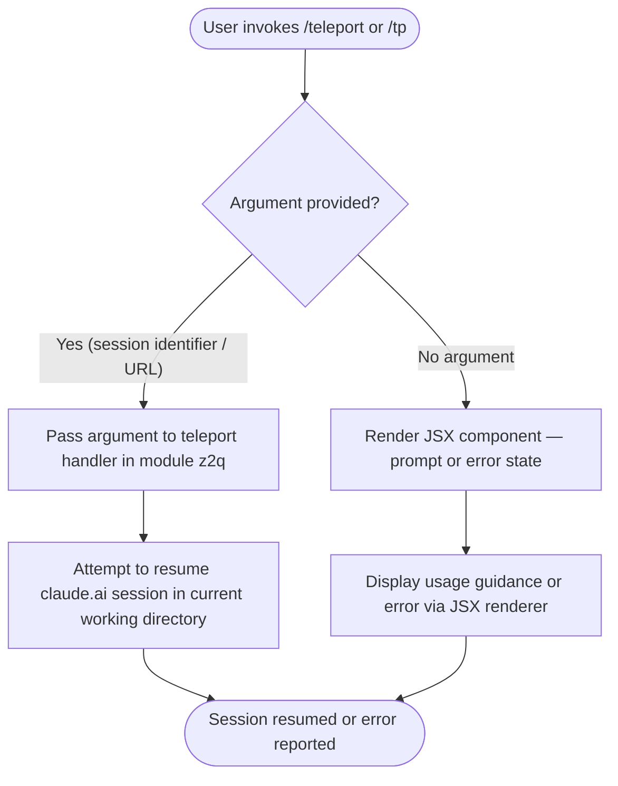

```
---
type: feature-spec
feature: "teleport"
cc_version: 2.1.153
updated: "2026-05-19"
tags: ["teleport", "commands", "slash-commands"]
source: "bundle-analysis"
bundle_verified: true
inherited_from: 2.1.144
analysis_basis: "CC v2.1.144 bundle.js (AST extraction + Claude interpretation)"
author: "ryujaeuk <ryujaeuk@gmail.com>"
repository: "https://github.com/MyLittleLuckyDog/cc-gnothi"
license: "AGPL-3.0-only"
---

# `/teleport`

> Analysis basis: CC v2.1.144 bundle.js (AST extraction + Claude interpretation)
> Minimum version: v2.1.144

---

## Overview

`/teleport` (alias: `/tp`) resumes a Claude Code session that was previously initiated or saved on
claude.ai, bridging the web interface and the local CLI environment. It is registered as a
`local-jsx` command, meaning its output is rendered as a JSX component within the CLI's terminal
UI rather than as plain text.

---

## Registration

| Field | Value |
|---|---|
| type | `local-jsx` |
| name | `teleport` |
| description | Resume a Claude Code session from claude.ai |
| aliases | `tp` |
| module_id | `z2q` |

Analysis basis: CC v2.1.144 bundle.js:+11377266

---

## Input Branching

> **Note:** The depth-2 AST traversal returned an empty call graph and no literal constants for
> module `z2q`. The flowchart below reflects only what can be confirmed from the registration
> record. Internal branching logic cannot be verified from this extraction.



<!-- TODO: not found in depth-2 traversal; needs --depth 4 -->
Exact argument parsing rules, error states, and conditional rendering paths are not confirmed by
the current extraction depth.

---

## Behavioral Spec

### Command Invocation

```
function handleTeleportCommand(rawArgs, appState):
    # Registered under names ["teleport", "tp"]
    # Render output as JSX component (type = "local-jsx")
    component = loadModule("z2q")
    return component.render(rawArgs, appState)
```

Analysis basis: CC v2.1.144 bundle.js:+11377266

### Session Resume (Inferred from Description)

```
function resumeClaudeAISession(sessionIdentifier):
    # "Resume a Claude Code session from claude.ai"
    # Exact mechanism not confirmed at depth-2; see TODO below
    if sessionIdentifier is absent or invalid:
        return renderError("No valid session identifier supplied")
    else:
        return initiateResume(sessionIdentifier)
```

<!-- TODO: not found in depth-2 traversal; needs --depth 4 -->
The internal resume handshake, authentication token handling, network calls, and state
restoration steps are not visible in the current extraction. A `--depth 4` traversal of
module `z2q` is required to document these sub-steps.

---

## State & Side Effects

| Item | Detail |
|---|---|
| Telemetry | None detected at depth-2 (`telemetry: []`) |
| Hook registration | <!-- TODO: not found in depth-2 traversal; needs --depth 4 --> |
| appState changes | <!-- TODO: not found in depth-2 traversal; needs --depth 4 --> |
| Sound | <!-- TODO: not found in depth-2 traversal; needs --depth 4 --> |
| Render type | JSX component (local-jsx); output rendered inline in CLI terminal UI |

---

## Version History

| Version | Change |
|---|---|
| v2.1.144 | Initial analysis — registration confirmed; internal implementation opaque at depth-2 |

---

## Common Mistakes

1. **Using the wrong alias**: The only confirmed short-form alias is `/tp`. Any other spelling
   (e.g., `/tele`) will not invoke this command.
2. **Expecting plain-text output**: Because the command type is `local-jsx`, its output is a
   rendered JSX component. Piping or scripting that expects raw stdout text may not capture the
   rendered result correctly.
3. **Assuming no argument is needed**: The description references resuming a session *from*
   claude.ai, implying a session identifier or URL is required. Invoking the command with no
   argument may produce an error or a usage prompt rather than silently succeeding.
4. **Conflating with a local session restore**: `/teleport` is specifically described as resuming
   a session originating on claude.ai, not an arbitrary local CC session snapshot.

---

## Appendix — Identifier Mapping

> For bundle debugging only. Identifiers change across versions.

| Identifier | Role |
|---|---|
| `z2q` | Module ID for the `/teleport` command implementation |

> No obfuscated short-form function or variable identifiers were returned by the depth-2
> traversal (`identifiers: []`). If a deeper traversal is performed, any newly discovered
> obfuscated identifiers should be appended to this table.
```